# 1. 产品介绍

## 1.1 产品安全

1\. 本产品含细小零件，请避免儿童独自接触。

2\. 请严格按照教程操作，避免产品损坏，注意用电安全。

## 1.2 产品简介

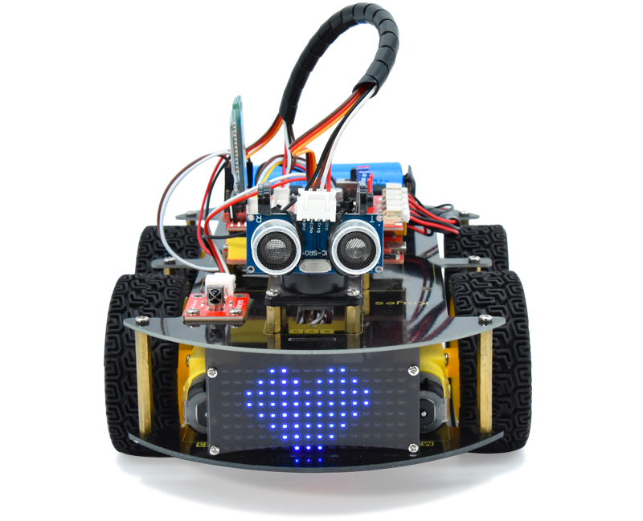

4WD蓝牙多功能智能车，是基于Arduino的开源机器人，可以让孩子们轻松学习编程，并且获得有关电子、机械、控制逻辑和计算机科学的实践知识。

它的安装和接线也十分简单，组件都通过螺钉和铜柱连接，只需要几个简单的步骤就可以组装完成。提供了十多个编程的课程项目，由简单到复杂，一步一步，学习怎么去编写智能车能”听”懂的语言。

## 1.3 产品特点 

- 1\. 功能多多：避障功能，跟随功能，红外遥控，蓝牙控制，循迹功能，显示图案等。

- 2\. 组装简单：无需焊接电路，只需几个简单的步骤即可组装该机器人。

- 3\. 结构坚固：构成车体的部分是PCB材质，电机用的 是优质的金属电机。

- 4\. 扩展性强：配置了电机驱动扩展板，可以扩展其他的传感器和模块。

- 5\. 多种控制：红外遥控器控制，手机蓝牙控制（苹果和安卓手机都可）。

- 6\. 学习基础编程：提供了Arduino IDE的C语言编程、Mixly图形化编程、Kidsblock(Scartch)图形化编程三款编程软件教程，可以接触底层代码。

## 1.4 产品参数          

- 工作电压：5v
- 输入电压：7-9V
- 最大输出电流：1A
- 最大耗散功率：25W（T=75℃）
- 电机转速：5V  63 rpm / min
- 电机驱动形式：双路H桥驱动
- 超声波感应角度：<15度
- 超声波探测距离：2cm-400cm
- 红外遥控距离：10米（实测）
- 蓝牙遥控距离：50米（实测）
- 蓝牙APP控制：支持Android和IOS系统
- 可接入外部DC 7~9V 的电压
 
## 1.5 产品清单 

当收到这个智能车套件的时候，首先看到是一个包装精美的外盒，每个配件被安全且有序的装在外盒里面的小盒子里，先来清点一下：

| 序号 | 产品名称 | 数量 | 图片 | 图片 |
| --- | --- | --- | --- | --- |
| 1 | 开发板 (只需任一款) | 1 | 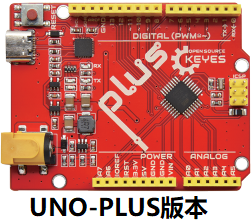 | 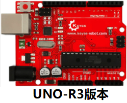 |
| 2 | 蓝牙模块 (只需任一款) | 1 |  | |
| 3 | USB线 (只需任一款) | 1 | 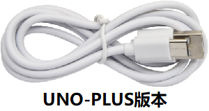 | 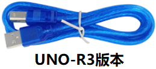 |

| 序号 | 产品名称 | 数量 | 图片 |
| --- | --- | --- | --- |
| 1 | LED屏亚克力挡板 | 1 |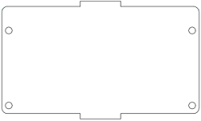 |
| 2 | brick L298P 电机驱动扩展板 | 1 | 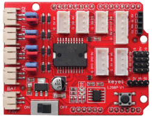 |
| 3 | HC-SR04超声波传感器 | 1 | 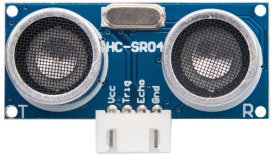 |
| 4 | 草帽LED白发红模块 | 1 | 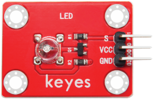 |
| 5 | 3Pin 双母头连拼杜邦线 | 1 | 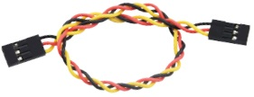 |
| 6 | 4WD 智能车 V3.0 PCB板(上板) | 1 | 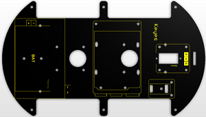|
| 7 |4WD 智能车 V3.0 PCB板(下板) | 1 | 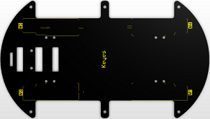|
| 8 | 三路循迹传感器 | 1 | 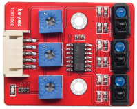 |
| 9 | 红外接收传感器 | 1 |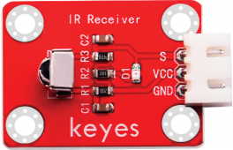 |
| 10 | 云台支架包 | 1 | 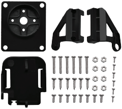 |
| 11 | SG90 9G 舵机 | 1 | 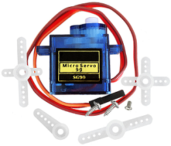 |
| 12 | 18650双节电池盒 | 1 | 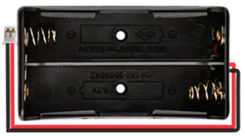 |
| 13 | 6节5号带线电池盒 | 1 |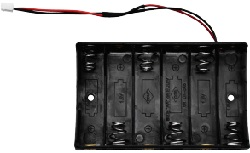|
| 14 | 8x16 LED灯板模块  | 1 | 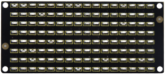 |
| 15 | 固定件 | 4 | 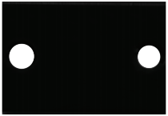|
| 16 | 车轮 | 4 | 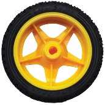 |
| 17 | M3*10MM双通六角铜柱 | 8 | 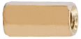|
| 18 | M3*40MM双通六角铜柱 | 6 | 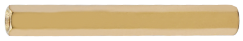 |
| 19 | M3*30MM圆头十字螺钉 | 8 | 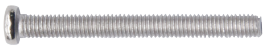 |
| 20 | M3*6MM圆头十字螺钉 | 45 | 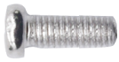 |
| 21 | M3螺母 | 20 |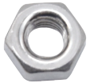 |
| 22 | 3*40MM 红黑色 十字螺丝刀 | 1 | 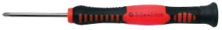 |
| 23 | M2*8MM圆头十字螺钉 | 10 | 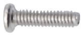 |
| 24 | M2 螺母 | 10 |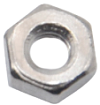 |
| 25 | M3*10MM平头螺钉 | 3 |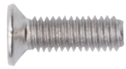 |
| 26 | 4.5V 马达电机 | 4 |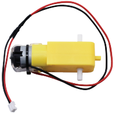 |
| 27 | XH-2.54 5P杜邦线 | 1 |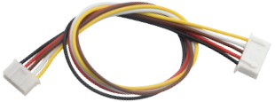 |
| 28 | HX-2.54 3P双头杜邦线 | 1 | 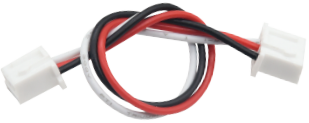|
| 29 | HX-2.54 4P双头杜邦线 | 1 | 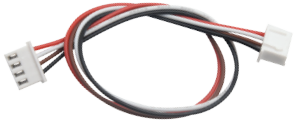 |
| 30 | HX-2.54 4P转杜邦线母单 | 1 | 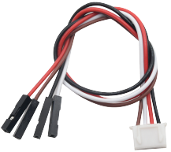 |
| 31 | 红外遥控器 | 1 | 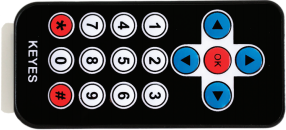 |
| 32 | 缠绕管 直径8MM  | 1 | 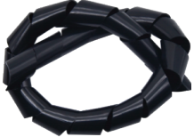 |
| 33 | 黑色 扎带  | 6 | 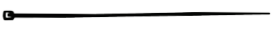 |
| 34 | 舵机控制模块  | 1 | 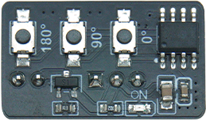 |
| 35 | 公对母杜邦线(颜色任意)  | 4 | 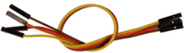 |
| 36 | 5号(AA 1.5V)电池(自己提供)  | 6 | 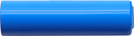 |
| 37 | 18650电池(自己提供)  | 2 | 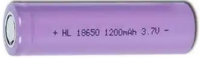 |

## 1.6 开发板

### 1.6.1 keyes UNO R3开发板

Keyes UNO R3开发板是我们最新推出的一款易用型开源控制器，硬件上与Arduino UNO相比并没有大的变动。外观上我们将蓝色换成了红色，给你们一种新的体验。硬件上，我们用ATmega16U2代替了8U2，这个更新是为USB接口芯片服务的，理论上它让UNO R3能模拟USB HID，比如MIDI/Joystick/Keyboard。

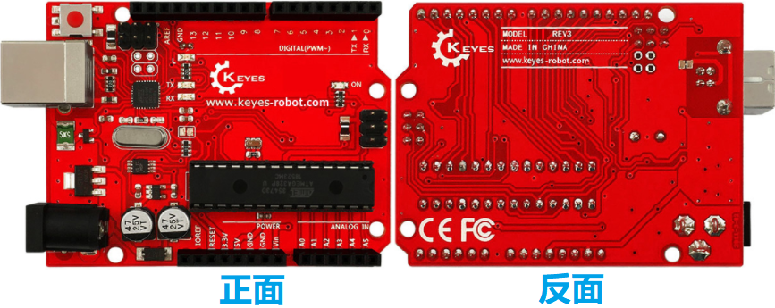

**规格参数**

- 微控制器：ATmega328P-PU
- 工作电压：DC 5V
- 外接电源：DC 7-12V（建议9V）
- 数字I/O引脚：14个 (D0-D13) (其中包含6个PWM输出口)
- PWM通道：6个 (D3、D5、D6、D9、D10、D11)
- 模拟输入通道（ADC）：6个 (A0-A5)
- 每个I/O直流输出能力：20 mA
- 3.3V端口输出能力：50 mA
- 快闪存储器：32 KB（其中引导程序使用0.5KB）
- 静态存储器M：2 KB 
- 只读存储器：1 KB 
- 时钟速度：16MHz
- 板载LED引脚：D13

**各个接口和主要元件说明**

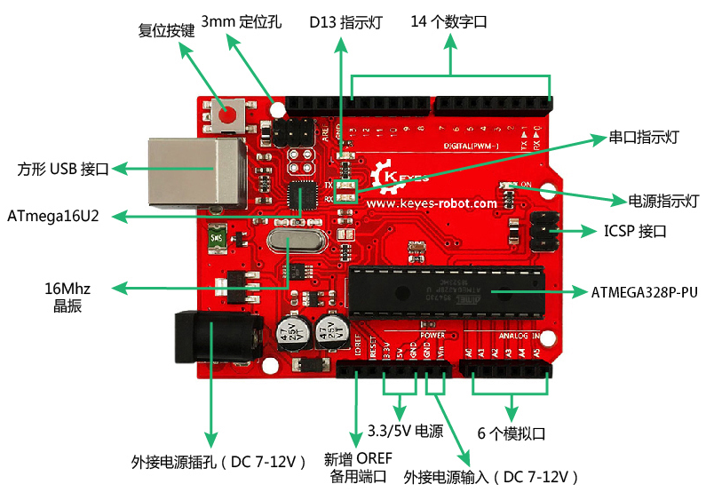

**特殊功能接口说明**

- 串口通信接口：D0为RX、D1为TX
- PWM接口（脉宽调制）：D3、D5、D6、D9、D10、D11
- 外部中断接口：D2(中断0)和D3 (中断1)
- SPI通信接口：D10为SS、D11为MOSI、D12为MISO、D13为SCK
- IIC通信端口：A4为SDA、A5为SCL

### 1.6.2 Keyes UNO PLUS开发板

在我们进行DIY电子产品实验时，我们经常会用到arduino系列单片机在Arduino IDE开发环境上编程设置。Keyes UNO Plus 开发板是一款完全兼容Arduino IDE开发环境的控制板，它包含官网的UNO开发板的所有功能，并且在UNO开发板的基础上，我们做了一些改进，使它的功能更加强大，具体改进如下图。

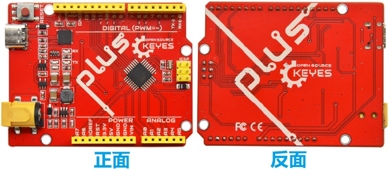

**规格参数**

- 微控制器：ATMEGA328P-AU
- USB转串口芯片：CP2102
- 工作电压：DC 5V
- 外接电源：DC 6-15V（建议9V）
- 数字I/O引脚：14个 (D0-D13) (其中包含6个PWM输出口)
- PWM引脚：6个 (D3、D5、D6、D9、D10、D11)
- 模拟输入通道（ADC）：8个 (A0-A7)
- 每个I/O直流输出能力：20 mA
- 3.3V端口输出能力：50 mA
- 快闪存储器：32 KB（其中引导程序使用0.5KB）
- 静态存储器M：2 KB 
- 只读存储器：1 KB 
- 时钟速度：16MHz

**各个接口和主要元件说明**

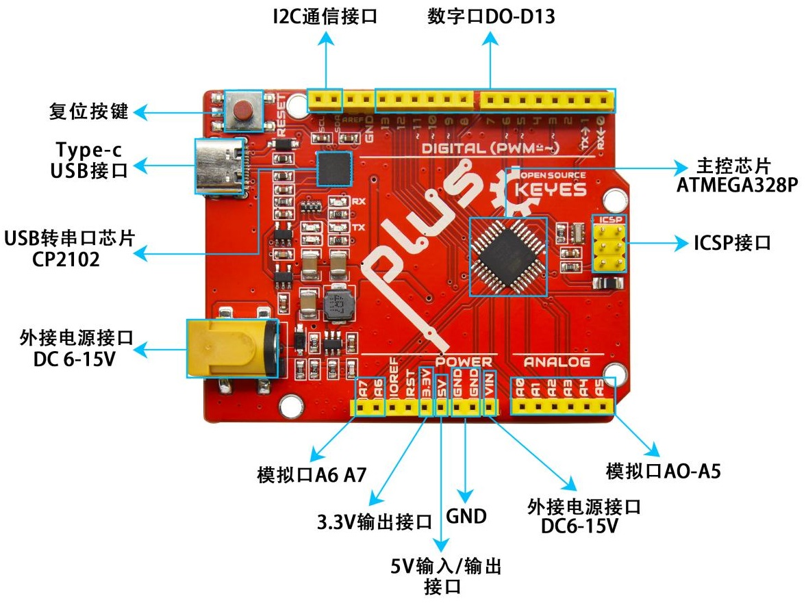

**特殊功能接口说明**

- 串口通信接口：D0为RX、D1为TX
- PWM接口（脉宽调制）：D3、D5、D6、D9、D10、D11
- 外部中断接口：D2(中断0)和D3 (中断1)
- SPI通信接口：D10为SS、D11为MOSI、D12为MISO、D13为SCK
- IIC通信端口：A4为SDA、A5为SCL

## 1.7 电机驱动扩展板

为了简化接线，我们使用了一款基于 L298P 设计的电机驱动扩展板。这块板子可以直接插接在 Arduino 开发板上（就像戴帽子一样），这种设计叫做 “Shield（盾板）” 或 “扩展板”。

扩展板上自带一个间距为2.54mm的排母接口(串口通讯接口)，这里是用于蓝牙模块；还自带有一些XH-2.54mm 3P防反接口、4P防反接口5P防反接口；扩展板还利用间距为2.54mm的排针扩展了2个数字口接口，2个模拟口接口和1个I2C通讯接口。

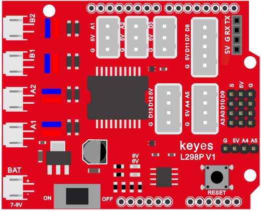

**1\. 外观与接口**

- 逻辑电源：由 Arduino 提供 5V 电压，用于芯片内部逻辑控制。

- 驱动电源：需要外接较高的电压（如 7-9V），用于给电机提供动力。

- 电机接口：板子上有 A 和 B 两组电机输出接口，分别连接左右两侧的电机。

- 6V LED指示灯：当外接电源电压低于6.2V时，LED熄灭；高于6.2V时，LED亮起。

- 8V LED指示灯：当外接电源低于8V时，LED熄灭；高于8V时，LED亮起。

**2\. 跳线帽的作用**

驱动板上自带了多个跳线帽，它们像小开关一样，可以改变电路的连接方式。

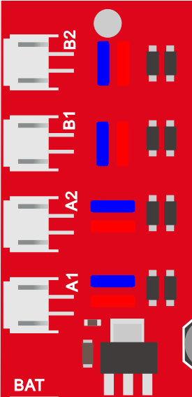

- A1和A2，B1和B2接口电机并联，运动规律相同；8个跳线帽可用于控制4个电机接口的转动方向。

- 方向控制：例如，当 A1 电机接口右侧对应的 2 个跳线帽由 “横向连接” 改为 “纵向连接”时，A1 电机的转动方向就会反转。这可以用来校准电机的初始方向，确保代码中的 “前进” 对应物理上的向前运动。

- 使能控制：部分跳线帽用于启用 PWM 调速功能，默认情况下通常已经连接好，无需改动。

**3\. 规格参数：**

- 逻辑部分输入电压：DC 5V

- 驱动部分输入电压：DC 7~9V

- 逻辑部分工作电流：<36mA

- 驱动部分工作电流：<2A

- 最大耗散功率：25W（T=75℃）

- 控制信号输入电平：高电平 (2.3V<Vin<5V) ，低电平 (0V<Vin<1.5V)

**4\. L298P电机驱动扩展板连接电机和外接电源**

