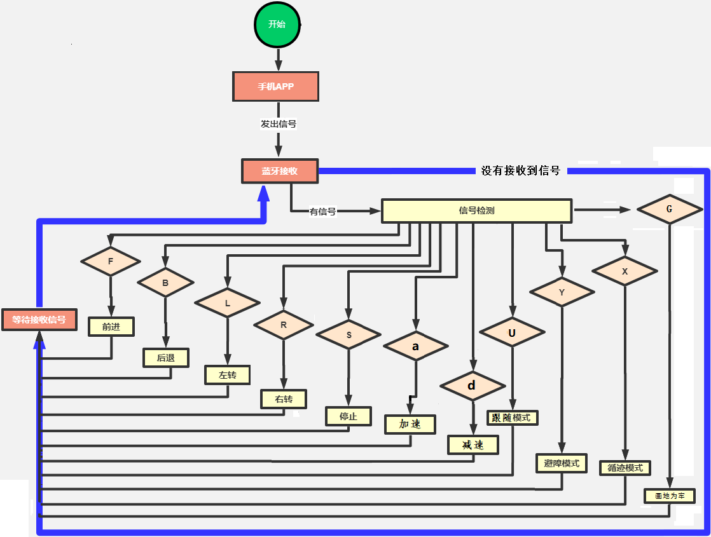
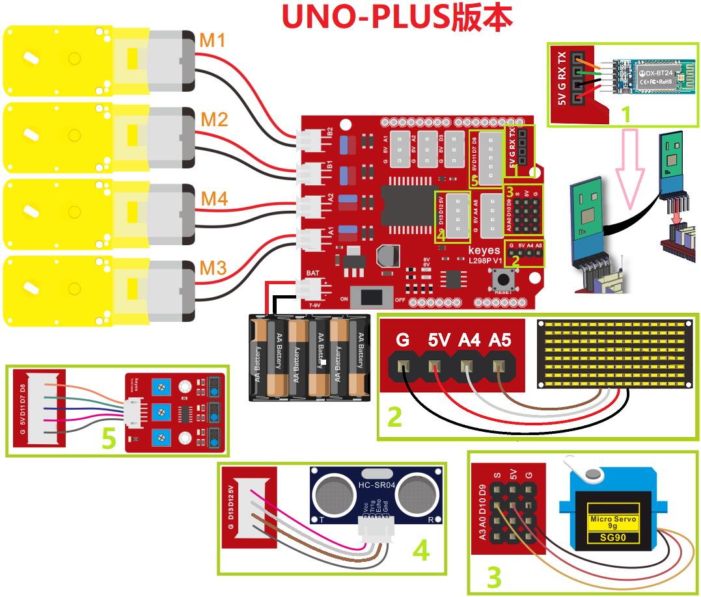
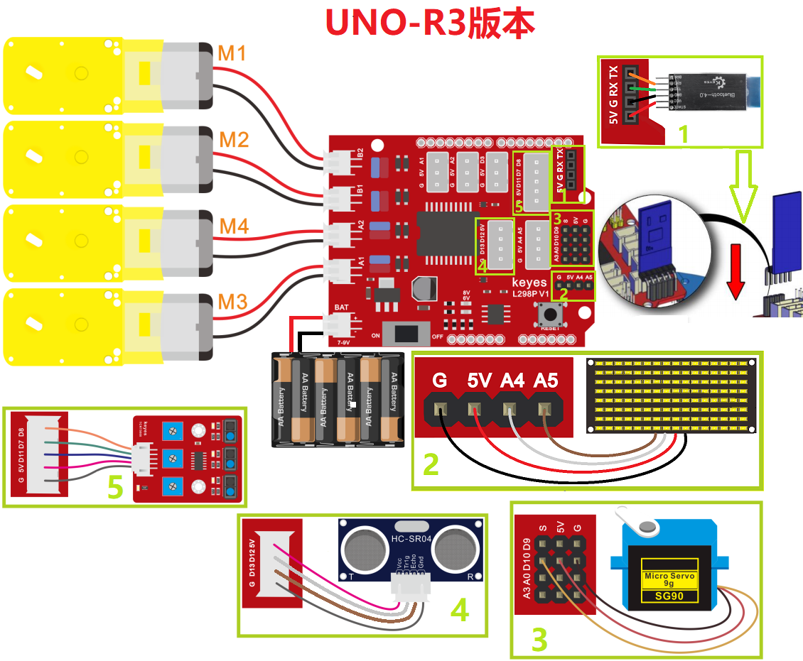
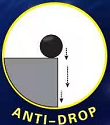

### 第01课 蓝牙多功能智能小车

#### 1.1 项目介绍：

在本课程中，我们可不可以将蓝牙模块，8x16 LED点阵模块，舵机，超声波传感器，三路循迹模块，4个电机等传感器模块相互结合在一起，让小车变得更“聪明”呢？

答案是肯定的！在这一课中，我们将编写一个综合性的代码，将之前学过的所有功能融合在一起。通过手机蓝牙 APP 上的不同按钮，我们可以随时切换小车的运行模式（如手动控制、自动避障、循迹行驶等），让小车真正成为一辆多功能的智能机器人。

#### 1.2 APP下载安装：

⚠️ **特别提醒：如果已经在手机/平板上安装好了APP，则这一步骤可以直接跳过；否则，需要参照以下步骤在手机/平板上来安装APP。**


**步骤1：** 在手机/平板浏览器的搜索框中输入官网链接：[https://www.keyesrobot.cn/zh-cn/latest](https://www.keyesrobot.cn/zh-cn/latest)


**步骤2：** 点击 “**下载中心**”，进入下载中心页面。


**步骤3：** 在 “**APP下载**” 栏向下滑找到 **keyes 4wd**，根据自己的手机/平板系统选择对应的APP下载安装。


<span style="color: rgb(255, 76, 65);">**安卓系统(Android)**</span>

a. 点击 "**点击下载**" 按钮，下载对应的 "**keyes 4wd.apk**" 文件。


b. 按照安装提示进行下载安装。


c. 下载安装后，打开 **keyes 4wd** APP，出现如下图界面，按照提示进行操作。


<span style="color: rgb(255, 76, 65);">**苹果系统(IOS)**</span>

a. 点击 "**跳转APP Store**" 按钮，页面跳转到 APP Store


b. 在 APP Store 上搜索 **keyes BT car** ，选择 **keyes BT car**，然后点击  获取，等待下载安装APP即可。


c. 下载安装后，打开 keyes BT car APP，出现如下图界面，参照提示进行相应的操作。


d. 打开手机/平板上的蓝牙。


#### 1.3 流程图：



按照前面思路设计好智能车后，我们就需要按照设计思路开始制作智能车。我们需要设计对应的接线，测试代码，然后接线上传代码，运行，确保智能车能够实现理想中的功能。

#### 1.4 项目组件：

| 组装好的智能车(<span style="color: rgb(255, 76, 65);">未插上蓝牙模块</span>) *1 |USB线 *1 | 5号(1.5V)电池 *6（电池自备） |
| --- | --- | --- | 
|  | | | 
| 蓝牙模块  *1 | 手机/平板 *1|  |
| || |

#### 1.5 接线图：

⚠️ 特别注意：4WD智能车已经组装好了，这里不需要把8x16 LED点阵模块、舵机、超声波传感器、三路循迹模块和4个电机拆下来又重新组装和接线，这里再次提供接线图，是为了方便您编写代码！

| 蓝牙模块 | 电机驱动扩展板 | 
| :--: | :--: |
| EN | - | 
| VCC | 5V |
| GND | G |
| TXD | RX | 
| RXD | TX |
| STATE | - |

| 8x16 LED点阵模块 | 电机驱动扩展板 | 
| :--: | :--: | 
| GND | G |
| VCC | 5V |
| SDA | A4 | 
| SCL | A5 |

| 舵机 | 电机驱动扩展板 | 
| :--: | :--: | 
| 棕色线 | G |
| 红色线 | 5V |
| 橙色线 | S（D10）|  

| 超声波传感器 | 电机驱动扩展板 | 
| :--: | :--: | 
| Vcc | 5V |
| Trig | D12 |
| Echo | D13 | 
| Gnd | G |

| 三路循迹模块 | 电机驱动扩展板 | 
| :--: | :--: | 
| S1右侧(R) | D8 |
| S2中间(M) | D7 |
| S3左侧(L) | D11 | 
| V | 5V |
| G | G | 

| 电机 | 电机驱动扩展板 | 
| :--: | :--: | 
| 左侧电机（M1） | B2 |
| 左侧电机（M2） | B1 |
| 右侧电机（M3） | A1 |
| 右侧电机（M4） | A2 |





⚠️ <span style="color: rgb(255, 76, 65);">**特别注意：**</span>

- <span style="color: rgb(172, 57, 255);">**上传示例代码前，蓝牙模块可以先不直插到电机驱动扩展板上！因为蓝牙模块也占用Arduino的串口通信（TX/RX），如果连接到电机驱动扩展板上，示例代码上传会失败。示例代码上传成功后，再插回蓝牙模块。**</span>

- 接线时请确保电源断开(拔掉Arduino主控板上的USB线或将电机驱动扩展板上的拨码开关拨到 “<span style="color: rgb(255, 76, 65);">**OFF**</span>” 端)，避免短路。

- 电源连接：电池盒电源接到电机驱动扩展板的 BAT 接口（注意正负极不要接反），端口正反面，请勿反插，否则会损坏端口。

- 电池正负极切勿接反，否则可能烧毁电机驱动扩展板。

#### 1.6 示例代码：

⚠️ <span style="color: rgb(255, 76, 65);">**重要提示：**</span>

<span style="color: rgb(172, 57, 255);">- **上传示例代码前，请务必拔掉蓝牙模块！ 因为蓝牙模块也占用Arduino的串口通信（TX/RX），如果不拔掉，示例代码上传会失败。示例代码上传成功后，再插回蓝牙模块。**</span>

```cpp
/*
  keyes 4WD 多功能智能车
  课程 01_1
  蓝牙控制多功能四驱机器人
  http://www.keyes-robot.com
*/
#include <Servo.h>  // 导入舵机库

#define SCL_PIN A5            // 时钟引脚
#define SDA_PIN A4            // 数据引脚
#define L_PIN 11              // 左边传感器引脚
#define M_PIN 7               // 中间传感器引脚
#define R_PIN 8               // 右边传感器引脚
#define MA 2                  // 电机M3,M4方向控制引脚
#define PWMA 6                // 电机M3,M4速度控制引脚
#define MB 4                  // 电机M1,M2方向控制引脚
#define PWMB 5                // 电机M1,M2速度控制引脚
#define TRIG_PIN 12           // 超声波TRIG引脚
#define ECHO_PIN 13           // 超声波ECHO引脚

Servo myservo;                // 舵机对象

unsigned char start01[] = {0x01, 0x02, 0x04, 0x08, 0x10, 0x20, 0x40, 0x80, 0x80, 0x40, 0x20, 0x10, 0x08, 0x04, 0x02, 0x01};
unsigned char front[] = {0x00, 0x00, 0x00, 0x00, 0x00, 0x24, 0x12, 0x09, 0x12, 0x24, 0x00, 0x00, 0x00, 0x00, 0x00, 0x00};
unsigned char back01[] = {0x00, 0x00, 0x00, 0x00, 0x00, 0x24, 0x48, 0x90, 0x48, 0x24, 0x00, 0x00, 0x00, 0x00, 0x00, 0x00};
unsigned char left[] = {0x00, 0x00, 0x00, 0x00, 0x00, 0x00, 0x44, 0x28, 0x10, 0x44, 0x28, 0x10, 0x44, 0x28, 0x10, 0x00};
unsigned char right[] = {0x00, 0x10, 0x28, 0x44, 0x10, 0x28, 0x44, 0x10, 0x28, 0x44, 0x00, 0x00, 0x00, 0x00, 0x00, 0x00};
unsigned char STOP01[] = {0x2E, 0x2A, 0x3A, 0x00, 0x02, 0x3E, 0x02, 0x00, 0x3E, 0x22, 0x3E, 0x00, 0x3E, 0x0A, 0x0E, 0x00};
unsigned char speed_a[] = {0x00, 0x40, 0x20, 0x10, 0x08, 0x04, 0x02, 0xff, 0x02, 0x04, 0x08, 0x10, 0x20, 0x40, 0x00, 0x00};
unsigned char speed_d[] = {0x00, 0x02, 0x04, 0x08, 0x10, 0x20, 0x40, 0xff, 0x40, 0x20, 0x10, 0x08, 0x04, 0x02, 0x00, 0x00};
unsigned char clear[] = {0x00, 0x00, 0x00, 0x00, 0x00, 0x00, 0x00, 0x00, 0x00, 0x00, 0x00, 0x00, 0x00, 0x00, 0x00, 0x00};

int irVal;
char blueVal;

int lVal, mVal, rVal;
int speeds = 150;            // 初始速度

int distance, distanceL, distanceR;

/* 功能：初始化设置 */
void setup() {
  Serial.begin(9600);                   // 设置串口波特率为9600
  myservo.attach(10);                   // 绑定舵机引脚10
  myservo.write(90);                   // 舵机初始角度90度
  delay(500);

  pinMode(L_PIN, INPUT);                // 左传感器输入模式
  pinMode(M_PIN, INPUT);                // 中传感器输入模式
  pinMode(R_PIN, INPUT);                // 右传感器输入模式

  pinMode(SCL_PIN, OUTPUT);             // 点阵时钟引脚输出
  pinMode(SDA_PIN, OUTPUT);             // 点阵数据引脚输出

  pinMode(TRIG_PIN, OUTPUT);            // 超声波触发引脚输出
  pinMode(ECHO_PIN, INPUT);             // 超声波回声引脚输入

  pinMode(MA, OUTPUT);                  // 电机A方向引脚输出
  pinMode(PWMA, OUTPUT);                // 电机A速度引脚输出
  pinMode(MB, OUTPUT);                  // 电机B方向引脚输出
  pinMode(PWMB, OUTPUT);                // 电机B速度引脚输出

  matrixDisplay(clear);                 // 点阵屏清屏
  matrixDisplay(start01);               // 显示启动图案
}

/* 功能：主循环，处理蓝牙和红外信号 */
void loop() {
  if (Serial.available() > 0) {        // 接收到蓝牙信号
    blueVal = Serial.read();            // 读取蓝牙数据
    Serial.println(blueVal);            // 串口打印蓝牙数据
    switch (blueVal) {
      case 'F': advance(); matrixDisplay(front); break;   // 前进
      case 'B': back(); matrixDisplay(back01); break;     // 后退
      case 'L': turnL(); matrixDisplay(left); break;      // 左转
      case 'R': turnR(); matrixDisplay(right); break;     // 右转
      case 'S': stopp(); matrixDisplay(STOP01); break;    // 停止
      case 'a': speedsA(); matrixDisplay(speed_a); break; // 加速
      case 'd': speedsD(); matrixDisplay(speed_d); break; // 减速
      case 'U': follow(); break;                            // 跟随模式
      case 'Y': avoid(); break;                             // 避障模式
      case 'G': prison(); break;                            // 画地为牢模式
      case 'X': track(); break;                             // 巡线模式
    }
  }
}

/* 功能：小车前进 */
void advance() {
  digitalWrite(MA, HIGH);             // 电机A正转
  analogWrite(PWMA, speeds);          // 电机A速度
  digitalWrite(MB, HIGH);             // 电机B正转
  analogWrite(PWMB, speeds);          // 电机B速度
}

/* 功能：小车后退 */
void back() {
  digitalWrite(MA, LOW);              // 电机A反转
  analogWrite(PWMA, speeds);          // 电机A速度
  digitalWrite(MB, LOW);              // 电机B反转
  analogWrite(PWMB, speeds);          // 电机B速度
}

/* 功能：小车左旋转 */
void turnL() {
  digitalWrite(MA, HIGH);             // 电机A正转
  analogWrite(PWMA, speeds);          // 电机A速度
  digitalWrite(MB, LOW);              // 电机B反转
  analogWrite(PWMB, speeds);          // 电机B速度
}

/* 功能：小车右旋转 */
void turnR() {
  digitalWrite(MA, LOW);              // 电机A反转
  analogWrite(PWMA, speeds);          // 电机A速度
  digitalWrite(MB, HIGH);             // 电机B正转
  analogWrite(PWMB, speeds);          // 电机B速度
}

/* 功能：小车停止 */
void stopp() {
  analogWrite(PWMA, 0);               // 电机A速度为0
  analogWrite(PWMB, 0);               // 电机B速度为0
}

/* 功能：加速函数 */
void speedsA() {
  while (true) {
    Serial.println(speeds);           // 显示当前速度
    if (speeds < 255) {               // 最大速度255
      speeds++;
      delay(10);                      // 调节加速速度
    }
    if (Serial.available() > 0) {
      blueVal = Serial.read();
      if (blueVal == 'S') break;      // 接收到‘S’停止加速
    }
  }
}

/* 功能：减速函数 */
void speedsD() {
  while (true) {
    Serial.println(speeds);           // 显示当前速度
    if (speeds > 0) {                 // 最小速度0
      speeds--;
      delay(10);                      // 调节减速速度
    }
    if (Serial.available() > 0) {
      blueVal = Serial.read();
      if (blueVal == 'S') break;      // 接收到‘S’停止减速
    }
  }
}

/* 功能：获取超声波距离，单位厘米 */
int getDistance() {
  digitalWrite(TRIG_PIN, LOW);        // 触发引脚低电平2微秒
  delayMicroseconds(2);
  digitalWrite(TRIG_PIN, HIGH);       // 触发引脚高电平10微秒
  delayMicroseconds(10);
  digitalWrite(TRIG_PIN, LOW);        // 触发引脚低电平

  int distanceCm = pulseIn(ECHO_PIN, HIGH) / 58;  // 计算距离
  Serial.println(distanceCm);          // 输出距离
  return distanceCm;
}

/* 功能：跟随模式 */
void follow() {
  int followFlag = 1;
  while (followFlag) {
    distance = getDistance();          // 获取距离
    if (distance < 8) {                // 距离小于8cm后退
      back();
    }
    else if (distance >= 8 && distance < 13) { // 距离8~13cm停止
      stopp();
    }
    else if (distance >= 13 && distance <= 35) { // 距离13~35cm前进
      advance();
    }
    else {                            // 其他情况停止
      stopp();
    }
    if (Serial.available() > 0) {
      blueVal = Serial.read();
      if (blueVal == 'S') {           // 接收到‘S’退出跟随模式
        followFlag = 0;
        stopp();
      }
    }
  }
}

/* 功能：避障模式 */
void avoid() {
  int avoidFlag = 1;
  while (avoidFlag) {
    distance = getDistance();          // 获取前方距离

    if (distance > 0 && distance < 20) { // 距离小于20cm停止避障
      stopp();
      matrixDisplay(STOP01);           // 显示停止图案
      delay(100);

      myservo.write(180);              // 舵机转到180度
      delay(500);
      distanceL = getDistance();       // 获取左侧距离
      delay(100);

      myservo.write(0);                // 舵机转到0度
      delay(500);
      distanceR = getDistance();       // 获取右侧距离
      delay(100);

      if (distanceL > distanceR) {     // 左侧距离大于右侧，左转
        turnL();
        matrixDisplay(left);            // 显示左转图案
        delay(1000);
        myservo.write(90);             // 舵机回中
        matrixDisplay(front);          // 显示前进图案
      }
      else {                          // 右侧距离大于左侧，右转
        turnR();
        matrixDisplay(right);           // 显示右转图案
        delay(1000);
        myservo.write(90);             // 舵机回中
        matrixDisplay(front);          // 显示前进图案
      }
    }
    else {                            // 距离大于等于20cm前进
      advance();
      matrixDisplay(front);            // 显示前进图案
    }

    if (Serial.available() > 0) {
      blueVal = Serial.read();
      if (blueVal == 'S') {           // 接收到‘S’退出避障模式
        avoidFlag = 0;
        stopp();
      }
    }
  }
}

/* 功能：画地为牢模式 */
void prison() {
  int prisonFlag = 1;
  while (prisonFlag) {
    lVal = digitalRead(L_PIN);        // 读取左传感器
    mVal = digitalRead(M_PIN);        // 读取中传感器
    rVal = digitalRead(R_PIN);        // 读取右传感器

    if (lVal == 0 && mVal == 0 && rVal == 0) { // 无黑线前进
      advance();
    }
    else {                            // 检测到黑线后退并左转
      back();
      delay(500);
      turnL();
      delay(800);
    }

    if (Serial.available() > 0) {
      blueVal = Serial.read();
      if (blueVal == 'S') {           // 接收到‘S’退出模式
        prisonFlag = 0;
        stopp();
      }
    }
  }
}

/* 功能：巡线模式 */
void track() {
  int trackFlag = 1;
  while (trackFlag) {
    lVal = digitalRead(L_PIN);        // 读取左传感器
    mVal = digitalRead(M_PIN);        // 读取中传感器
    rVal = digitalRead(R_PIN);        // 读取右传感器

    if (mVal == 1) {                  // 中间检测到黑线
      if (lVal == 1 && rVal == 0) {  // 左边有黑线右边无，左转
        turnL();
      }
      else if (lVal == 0 && rVal == 1) { // 右边有黑线左边无，右转
        turnR();
      }
      else {                          // 其他情况前进
        advance();
      }
    }
    else {                            // 中间无黑线
      if (lVal == 1 && rVal == 0) {  // 左边有黑线右边无，左转
        turnL();
      }
      else if (lVal == 0 && rVal == 1) { // 右边有黑线左边无，右转
        turnR();
      }
      else {                          // 其他情况停止
        stopp();
      }
    }

    if (Serial.available() > 0) {
      blueVal = Serial.read();
      if (blueVal == 'S') {           // 接收到‘S’退出巡线模式
        trackFlag = 0;
        stopp();
      }
    }
  }
}

/* 功能：点阵屏显示函数 */
void matrixDisplay(unsigned char matrixValue[]) {
  IICStart();                        // 开始条件
  IICSend(0xc0);                    // 选择地址
  for (int i = 0; i < 16; i++) {    // 发送16字节图案数据
    IICSend(matrixValue[i]);
  }
  IICEnd();                         // 结束传输

  IICStart();
  IICSend(0x8A);                   // 显示控制，脉宽4/16
  IICEnd();
}

/* 功能：IIC传输开始条件 */
void IICStart() {
  digitalWrite(SCL_PIN, HIGH);
  delayMicroseconds(3);
  digitalWrite(SDA_PIN, HIGH);
  delayMicroseconds(3);
  digitalWrite(SDA_PIN, LOW);
  delayMicroseconds(3);
}

/* 功能：IIC传输数据 */
void IICSend(unsigned char sendData) {
  for (char i = 0; i < 8; i++) {  // 每个字节8位
    digitalWrite(SCL_PIN, LOW);   // 时钟拉低，准备改变数据线信号
    delayMicroseconds(3);
    if (sendData & 0x01) {        // 判断最低位是1还是0
      digitalWrite(SDA_PIN, HIGH);
    } else {
      digitalWrite(SDA_PIN, LOW);
    }
    delayMicroseconds(3);
    digitalWrite(SCL_PIN, HIGH);  // 时钟拉高，完成数据传输
    delayMicroseconds(3);
    sendData = sendData >> 1;     // 右移一位，准备传输下一位
  }
}

/* 功能：IIC传输结束条件 */
void IICEnd() {
  digitalWrite(SCL_PIN, LOW);
  delayMicroseconds(3);
  digitalWrite(SDA_PIN, LOW);
  delayMicroseconds(3);
  digitalWrite(SCL_PIN, HIGH);
  delayMicroseconds(3);
  digitalWrite(SDA_PIN, HIGH);
  delayMicroseconds(3);
}
```

#### 1.7 项目结果：

⚠️ <span style="color: rgb(255, 76, 65);">**重要提示：**</span>

<span style="color: rgb(172, 57, 255);">- **上传示例代码前，请务必拔掉蓝牙模块！ 因为蓝牙模块也占用Arduino的串口通信（TX/RX），如果不拔掉，示例代码上传会失败。示例代码上传成功后，再插回蓝牙模块。**</span>

外接电源，将电机驱动扩展板上的拨码开关拨到 “<span style="color: rgb(255, 76, 65);">**OFF**</span>” 端。选择好正确的开发板板型（Arduino Uno）和 适当的串口端口（COMxx），然后单击  按钮上传示例代码至Arduino控制板。

- 打开电源：将电机驱动扩展板上的拨码开关拨到 “<span style="color: rgb(255, 76, 65);">**ON**</span>” 端。

- 插上蓝牙模块，确认接线无误。

- 连接好蓝牙模块，上电后，蓝牙模块上的LED闪烁。

**安卓系统(Android)**

- 打开手机/平板上的蓝牙。


- 点击手机/平板上的APP图标，进入APP界面，显示如下图：


- 点击APP界面左上角的图标 “**CONNECT**”，搜索到对应的蓝牙设备（<span style="color: rgb(255, 76, 65);">**BT24**--针对UNO-PLUS版本</span> // <span style="color: rgb(0, 209, 0);">**HMSoft**--针对UNO-R3版本</span>），上下滑动找到对应的蓝牙设备（<span style="color: rgb(255, 76, 65);">**BT24**--针对UNO-PLUS版本</span> // <span style="color: rgb(0, 209, 0);">**HMSoft**--针对UNO-R3版本</span>），显示如下图：


- 点击 “**connect**” 来连接蓝牙，蓝牙连接成功后，“**connect**” 字样会变成 “**is connected**” 字样，显示如下图。这时，蓝牙模块上的LED变为常亮。


**苹果系统(iOS)**

- 打开手机/平板上的蓝牙。


- 点击手机/平板上的APP图标，进入APP界面，显示如下图：


- 点击APP界面左上角的图标 “**CONNECT**”，搜索到对应的蓝牙设备（<span style="color: rgb(255, 76, 65);">**BT24**--针对UNO-PLUS版本</span> // <span style="color: rgb(0, 209, 0);">**HMSoft**--针对UNO-R3版本</span>），上下滑动找到对应的蓝牙设备（<span style="color: rgb(255, 76, 65);">**BT24**--针对UNO-PLUS版本</span> // <span style="color: rgb(0, 209, 0);">**HMSoft**--针对UNO-R3版本</span>），显示如下图：


- 点击 “**Connect**” 来连接蓝牙，蓝牙连接成功后，蓝色字体“**Connect**” 字样会变成 绿色字体“**Connect**” 字样，显示如下图。这时，蓝牙模块上的LED变为常亮。


- 点击 “**keyes 4wd**” 图标进入APP操作页面。


- 打开串口监视器，设置波特率为9600，按下APP界面上的各个按键，串口监视器窗口会打印对应的字符。


经过测试，我们得出了手机APP上各个按钮对应的控制字符和各个按钮对应的功能，这里我们整理了一个表格如下：

| 按钮图示 | 功能说明 | 控制字符逻辑 |
| :--: | :--: | :--: |
|  |配对连接蓝牙模块 | - |
|  | 断开蓝牙连接 | - |
|  | 前进 | 按住发送 `F`；松开发送 `S` |
|  |后退| 按住发送 `B`；松开发送 `S` |
|  | 左旋转 |按住发送 `L`；松开发送 `S` |
|  | 右旋转 | 按住发送 `R`；松开发送 `S` |
|  | 加速，最大加到255| 按住发送 `a`；松开发送 `S` |
| | 减速，最小减到0 | 按住发送 `d`；松开发送 `S` |
|  | 方向感应控制开关 | 点击切换开启/退出 |
|  | 避障功能开关 | 点击发送 `Y`，再次点击发送 `S`|
| | 循线功能开关| 点击发送 `X`，再次点击发送 `S` |
| | 跟随功能开关| 点击发送 `U`，再次点击发送 `S` |
| | 画地为牢功能开关 | 点击发送 `G`，再次点击发送 `S` |


- 操控4WD智能车：

    - 按住  键，4WD智能车向前移动，8x16 LED点阵屏显示向上箭头。
    
    - 按住  键，4WD智能车向后移动，8x16 LED点阵屏显示向下箭头。
    
    - 按住  键，4WD智能车向左转，8x16 LED点阵屏显示向左箭头。
    
    - 按住  键，4WD智能车向右转，8x16 LED点阵屏显示向右箭头。
    
    - 松开按键，4WD智能车停止，8x16 LED点阵屏显示停止 “STOP” 字样。
    
    - 按下  键，你会看到8x16 LED点阵屏显示向上加速图标，每次按下  键，速度都会增加（最大速度PWM：255），同时4WD智能车也会逐渐跑得越来越快。
    
    - 按下  键，你会看到8x16 LED点阵屏显示向下减速图标，每次按下  键，速度都会减少（最小速度PWM：0），同时4WD智能车会逐渐慢下来。
    
    - 点击  键，开启手机方向感应控制，再次点击 键，退出方向感应控制。
    
    - 点击  进入跟随模式，4WD智能车会尝试保持与前方物体的距离跟随；再次点击  键，4WD智能车会停止当前动作或退出跟随模式。
    
    - 点击  键进入避障模式，4WD智能车遇到障碍物会自动转向避开障碍物行驶；再次点击  键，4WD智能车会停止当前动作或退出避障模式。
    
    - 点击  键进入画地为牢模式，4WD智能车会在黑线围成的区域内行驶；再次点击  键，4WD智能车会停止当前动作或退出画地为牢模式。
    
    - 点击  键进入巡线模式，4WD智能车会沿着黑线行驶；再次点击  键，4WD智能车会停止当前动作或退出巡线模式。
    
    - 点击对应模式，可随时停止当前动作或退出自动模式。
    


#### 1.8 注意事项：

1\. 电源充足：高速运转时电机消耗电流较大，请确保电池电量充足，否则4WD智能车可能会因为电压不足而行动迟缓或重启。
    
2\. 上传代码问题：由于蓝牙模块占用了 Arduino 的 D0 (RX) 和 D1 (TX) 引脚，在上传代码前，务必拔掉蓝牙模块的 TX 和 RX 连线，否则会出现“上传错误”。上传完成后再插回。
    
3\. 速度范围：PWM 值必须在 0-255 之间。如果代码逻辑错误导致数值溢出，电机可能无法正常工作。
   
4\.  地面摩擦：在不同的地面（如地毯、瓷砖）上，4WD智能车的实际速度感会有所不同，这是正常现象。