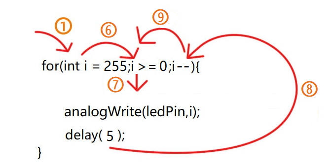

### 第03课 LED 亮度的调节

#### 3.1 项目介绍：

在之前的课程中，我们学习了如何通过代码控制 LED 的“亮”与“灭”，实现了简单的闪烁效果。但在现实生活中，灯光的变化往往是柔和渐变的，比如呼吸灯或者台灯调光。这节课，我们将学习一种叫做 PWM（脉冲宽度调制） 的技术，用它来控制 LED 的亮度，模拟出像呼吸一样忽明忽暗的效果。

**什么是 PWM？** 

Arduino 的数字引脚通常只能输出两种电压：0V（低电平/LOW）和 5V（高电平/HIGH）。如果我们想让 LED 半亮（相当于 2.5V），直接连接是做不到的。这时候就需要用到 PWM。

PWM 的原理就像放电影。电影其实是由一张张静止的图片快速播放组成的，因为速度太快，我们的眼睛看不出停顿，感觉画面是连续的。PWM 也是同样的道理：它让引脚在极短的时间内快速地切换“开”和“关”。

- 如果“开”的时间长，“关”的时间短，平均电压就高，灯就亮。

- 如果“开”的时间短，“关”的时间长，平均电压就低，灯就暗。

通过控制这个“开关比例”（占空比），我们就可以用数字信号模拟出不同的电压值，从而调节 LED 的亮度。


通过下面五个方波来更形象的了解一下PWM。


#### 3.2 项目组件：

| 组装好的智能车(<span style="color: rgb(255, 76, 65);">未插上蓝牙模块</span>) *1 | 草帽LED白发红模块 *1 | 3Pin 双母头杜邦线 *1  |
| --- | --- | --- | 
|  | | |
| USB线 *1 | 5号(1.5V)电池 *6（电池自备） |  |
| |  |  |

#### 3.3 接线图：

⚠️ <span style="color: rgb(255, 76, 65);">**特别提醒：请按照以下步骤进行接线。务必确保电源关闭状态下进行接线操作。**</span>


| LED 模块 | 电机驱动扩展板 | 
| :--: | :--: | 
| GND | G |
| VCC | 5V |
| S | S(D9) | 

⚠️ <span style="color: rgb(255, 76, 65);">**特别注意：**</span>

- 接线时请确保电源断开(拔掉Arduino主控板上的USB线或将电机驱动扩展板上的拨码开关拨到 “<span style="color: rgb(255, 76, 65);">**OFF**</span>” 端)，避免短路。

- 电源连接：电池盒电源接到电机驱动扩展板的 BAT 接口（注意正负极不要接反），端口正反面，请勿反插，否则会损坏端口。

- 电池正负极切勿接反，否则可能烧毁电机驱动扩展板。

- 电机驱动扩展板上的拨码开关拨到 “<span style="color: rgb(255, 76, 65);">**ON**</span>” 端。

#### 3.4 示例代码1：

⚠️ <span style="color: rgb(255, 76, 65);">**重要提示：**</span>

- <span style="color: rgb(172, 57, 255);">**上传示例代码前，请务必拔掉蓝牙模块！ 因为蓝牙模块也占用Arduino的串口通信（TX/RX），如果不拔掉，示例代码上传会失败。**</span>

```cpp
/*
  keyes 4WD 多功能智能车
  课程 03.1
  PWM 控制
  http://www.keyes-robot.com
*/
const int ledPin = 9;  // 定义LED引脚D9

void setup() {
  pinMode(ledPin, OUTPUT); //设置LED引脚为输出模式。
}

void loop() {
  for (int i = 0; i <= 255; i++) { //使LED逐渐亮
    analogWrite(ledPin, i); //输出PWM
    delay(5);  // 延时 5 毫秒 
  }
  for (int i = 255; i >= 0; i--) {  //使LED逐渐熄灭
    analogWrite(ledPin, i); //输出PWM
    delay(5);
  }
}
```

#### 3.5 项目结果1：

⚠️ <span style="color: rgb(255, 76, 65);">**重要提示：**</span>

- <span style="color: rgb(172, 57, 255);">**上传示例代码前，请务必拔掉蓝牙模块！ 因为蓝牙模块也占用Arduino的串口通信（TX/RX），如果不拔掉，示例代码上传会失败。**</span>

外接电源，将电机驱动扩展板上的拨码开关拨到 “<span style="color: rgb(255, 76, 65);">**ON**</span>” 端，上电后。选择好正确的开发板板型（Arduino Uno）和 适当的串口端口（COMxx），然后单击  按钮上传示例代码1至Arduino控制板。

代码上传成功后，我们可以看到LED会有个逐渐由亮到灭的一个缓慢过程，而不是直接的亮灭，如同呼吸一般，均匀变化。


#### 3.6 代码说明:

当我们需要重复执行某句话时，我们可以使用for语句。

```c
for (int i = 0; i <= 255; i++) {
    ...
}
```

- `for` → 创建计数循环。官方介绍：[for | Arduino Documentation](https://docs.arduino.cc/language-reference/en/structure/control-structure/for/)

- `int i = 0` → 从0开始计数。

- `i <= 255` → 循环条件（i <= 255时执行）。官方介绍：[<(less than) | Arduino Documentation](https://docs.arduino.cc/language-reference/en/structure/comparison-operators/lessThan/)

- `i++` → 每次循环i增加1。官方介绍：[++ (increment) | Arduino Documentation](https://docs.arduino.cc/language-reference/en/structure/compound-operators/increment/)


①：设置循环初始值，只是执行一遍，执行后进入②。

②：判断是否瞒住循环条件，如图中`i <= 255`则是i小于等于255就能进入循环代码③中。

③：循环代码，将需要循环的代码放到这里。循环输出 PWM 值，数值从 0 逐步增加到 255，循环体内把循环变量i直接当作 PWM 赋值给引脚即可，然后进入④。

④：i++ 是 i 在原来的值上再加1的操作，等效于 i = i + 1 ，执行完后进入⑤。

⑤：i 的值 加1 后接着判断 i 的值是否小于等于255，如果是则继续进入循环代码③，如果不是则退出for循环。



⑥：判断是否瞒住循环条件，如图中`i >= 0`则是i大于等于0就能进入循环代码⑦中。

⑦：循环代码，将需要循环的代码放到这里。循环输出 PWM 值，数值从 255 逐步减少到 0，循环体内把循环变量i直接当作 PWM 赋值给引脚即可，然后进入⑧。

⑧：i-- 是 i 在原来的值上再减1的操作，等效于 i = i - 1 ，执行完后进入⑨。

⑨：i 的值 减1 后接着判断 i 的值是否大于等于0，如果是则继续进入循环代码⑦，如果不是则退出for循环。

---------------------

```c
analogWrite(ledPin, i);   //输出 PWM
```

- `analogWrite()` → Arduino PWM输出函数

- `ledPin` → 支持PWM的引脚（带~符号）

- `i` → 占空比值（0-255）

官方介绍：[analogWrite() | Arduino Documentation](https://docs.arduino.cc/language-reference/en/functions/analog-io/analogWrite/)

#### 3.7 示例代码2：

我们不改变灯的脚位，只是改变程序里面delay()的值，看看它如何改变渐变效果。

⚠️ <span style="color: rgb(255, 76, 65);">**重要提示：**</span>

- <span style="color: rgb(172, 57, 255);">**上传示例代码前，请务必拔掉蓝牙模块！ 因为蓝牙模块也占用Arduino的串口通信（TX/RX），如果不拔掉，示例代码上传会失败。**</span>

```cpp
/*
  keyes 4WD 多功能智能车
  课程 03.2
  PWM 控制
  http://www.keyes-robot.com
*/
const int ledPin = 9;  // 定义LED引脚D9

void setup() {
  pinMode(ledPin, OUTPUT); //设置LED引脚为输出模式。
}

void loop() {
  for (int i = 0; i <= 255; i++) { //使LED逐渐亮
    analogWrite(ledPin, i); //输出PWM
    delay(10);  // 延时 10 毫秒 
  }
  for (int i = 255; i >= 0; i--) {  //使LED逐渐熄灭
    analogWrite(ledPin, i); //输出PWM
    delay(10);
  }
}
```

#### 3.8 项目结果2：

⚠️ <span style="color: rgb(255, 76, 65);">**重要提示：**</span>

- <span style="color: rgb(172, 57, 255);">**上传示例代码前，请务必拔掉蓝牙模块！ 因为蓝牙模块也占用Arduino的串口通信（TX/RX），如果不拔掉，示例代码上传会失败。**</span>

外接电源，将电机驱动扩展板上的拨码开关拨到 “<span style="color: rgb(255, 76, 65);">**ON**</span>” 端，上电后。选择好正确的开发板板型（Arduino Uno）和 适当的串口端口（COMxx），然后单击  按钮上传代码2至Arduino控制板。

代码上传成功后，看看LED渐变的效果是不是慢了一些。

