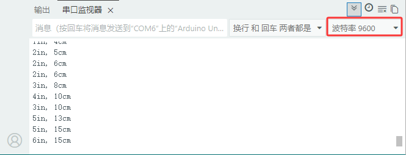

### 第06课 超声波模块

#### 6.1 项目介绍：

想象一下，蝙蝠在黑暗中飞行时为什么不会撞到墙壁？因为它们会发出人耳听不到的超声波，并通过接收回声来判断障碍物的位置。这就是“回声定位”。

在本课中，我们将使用 HC-SR04 超声波传感器，它就像电子蝙蝠的“眼睛”。它可以非接触地测量物体与传感器之间的距离，并且读数非常稳定。我们将学习如何利用 Arduino 开发板读取这些数据，并在电脑上显示出来，甚至用它来控制 LED 灯的亮灭，实现简单的避障或报警功能。

#### 6.2 元件知识：


**超声波传感器:** 可以检测前方是否存在障碍物，并且检测出传感器与障碍物的详细距离。传感器主要用到CS100A芯片，它同时兼营3.3V与5V工作电压。最大测试距离为3米（实际受各种环境因素的影响，一般很难达到3米的）；盲区小于4CM。

它的测距原理和蝙蝠飞行的原理一样，就是超声波模块发送出一种频率很高，人体无法听到的超声波信号。这些超声波的信号若是碰到障碍物，就会立刻反射回来，在接收到返回的信息之后，通过判断发射信号和接收信号的时间差，计算出传感器和障碍物的距离。

**超声波参数：**

- 工作电压: DC 5V

- 静态电流: <2mA

- 工作电流: 50mA~100mA，正常为65mA

- 最大功率：0.5W

- 最大探测距离：3m

- 盲区：小于4cm

- 感应角度：不大于15度

-  触发输入信号：10us TTL脉冲

**工作原理：**

最常用的超声测距的方法是回声探测法。当有脉冲电压触发时（单片机给Trig引脚发送高电平），超声波发射器探头里的晶片就会振动，继而产生超声波。在超声波发射时刻的同时计数器开始计时，超声波在空气中传播，途中碰到障碍物面阻挡就立即反射回来（Echo引脚发送高电平信号给单片机），超声波接收器收到反射回的超声波就立即停止计时。

超声波是一种声波，其声速V与温度有关。一般情况下超声波在空气中的传播速度为340m/s，根据计时器记录的时间t，就可以计算出超声波探头发射点距障碍物面的距离s，即：s=340t/2 。


HC-SR04超声波测距模块可提供范围为2厘米至3米的非接触式距离感测功能，测距精度可达高到3mm。超声波传感器包括超声波发射器、超声波接收器与控制电路。其基本工作原理：

(1) 采用IO口Trig触发测距，给至少10us的高电平信号;

(2) 模块自动发送8个40khz的方波，自动检测是否有信号返回；

(3) 有信号返回，通过IO口Echo输出一个高电平，高电平持续的时间就是超声波从发射到返回的时间；

(4) 距离 =（高电平时间 x 声速（340M/S）） / 2


⚠️ <span style="color: rgb(255, 76, 65);">**注意:**</span>

此模块不应在通电时连接，如有必要，先连接模块的 GND。否则，会影响模块的工作。

被测物体的面积应至少为 0.5 平方米，并尽可能平坦。否则，它会影响结果。

#### 6.3 项目组件：

| 组装好的智能车(<span style="color: rgb(255, 76, 65);">未插上蓝牙模块</span>) *1 | 草帽LED白发红模块 *1 | 3Pin 双母头杜邦线 *1  |
| --- | --- | --- | --- |
|  | | |
| USB线 *1 | 5号(1.5V)电池 *6（电池自备） |  |
| |  |  |

#### 6.4 接线图：

⚠️ 特别注意：4WD智能车已经组装好了，这里不需要把超声波传感器拆下来又重新组装和接线，这里再次提供接线图，是为了方便您编写代码！

| 超声波传感器 | 电机驱动扩展板 | 
| :--: | :--: | 
| Vcc | 5V |
| Trig | D12 |
| Echo | D13 | 
| Gnd | G |


⚠️ <span style="color: rgb(255, 76, 65);">**特别注意：**</span>

- 接线时请确保电源断开(拔掉Arduino主控板上的USB线或将电机驱动扩展板上的拨码开关拨到 “<span style="color: rgb(255, 76, 65);">**OFF**</span>” 端)，避免短路。

- 电源连接：电池盒电源接到电机驱动扩展板的 BAT 接口（注意正负极不要接反），端口正反面，请勿反插，否则会损坏端口。

- 电池正负极切勿接反，否则可能烧毁电机驱动扩展板。

- 电机驱动扩展板上的拨码开关拨到 “<span style="color: rgb(255, 76, 65);">**ON**</span>” 端。

#### 6.5 示例代码 1：基础测距

编写代码读取距离并在串口监视器中显示。

⚠️ <span style="color: rgb(255, 76, 65);">**重要提示：**</span>

- <span style="color: rgb(172, 57, 255);">**上传示例代码前，请务必拔掉蓝牙模块！ 因为蓝牙模块也占用Arduino的串口通信（TX/RX），如果不拔掉，示例代码上传会失败。**</span>

```cpp
/*
  keyes 4WD 多功能智能车
  课程 06.1
  超声波传感器
  http://www.keyes-robot.com
*/

#define TRIG_PIN 12  // 触发引脚
#define ECHO_PIN 13  // 回声引脚

long duration, cm, inches;

/* 功能：初始化串口和引脚模式 */
void setup() {
  Serial.begin(9600);  // 初始化串口，波特率 9600
  pinMode(TRIG_PIN, OUTPUT);  // 设置触发引脚为输出
  pinMode(ECHO_PIN, INPUT);   // 设置回声引脚为输入
}

/* 功能：主循环，测量距离并输出 */
void loop() {
  digitalWrite(TRIG_PIN, LOW);  // 发送低电平脉冲，确保干净的高电平脉冲
  delayMicroseconds(2);
  digitalWrite(TRIG_PIN, HIGH);  // 发送高电平脉冲，触发超声波
  delayMicroseconds(10);
  digitalWrite(TRIG_PIN, LOW);  // 结束触发脉冲

  duration = pulseIn(ECHO_PIN, HIGH);  // 读取回声脉冲持续时间（微秒）

  cm = (duration / 2) / 29.1;  // 计算距离（厘米）
  inches = (duration / 2) / 74;  // 计算距离（英寸）

  Serial.print(inches);
  Serial.print("in, ");
  Serial.print(cm);
  Serial.print("cm");
  Serial.println();

  delay(200);  // 延时 200 毫秒
}
```


#### 6.6 项目结果1：

⚠️ <span style="color: rgb(255, 76, 65);">**重要提示：**</span>

- <span style="color: rgb(172, 57, 255);">**上传示例代码前，请务必拔掉蓝牙模块！ 因为蓝牙模块也占用Arduino的串口通信（TX/RX），如果不拔掉，示例代码上传会失败。**</span>

外接电源，将电机驱动扩展板上的拨码开关拨到 “<span style="color: rgb(255, 76, 65);">**ON**</span>” 端，上电后。选择好正确的开发板板型（Arduino Uno）和 适当的串口端口（COMxx），然后单击  按钮上传示例代码1至Arduino控制板。

代码上传成功后，打开串口监视器，设置波特率为9600，我们可以看到超声波模块显示的距离，单位是厘米和英寸。用手阻挡超声波模块，我们看到显示距离的数值变小了。



#### 6.7 代码说明:

```C
#define TRIG_PIN 12
```
定义常量，让代码更易读。这里指定引脚 12 用于发送触发信号。

```C
pinMode(TRIG_PIN, OUTPUT)
```
因为我们要向 Trig 引脚发送电信号，所以设为输出。

```C
pinMode(ECHO_PIN, INPUT)
```
因为我们要读取 Echo 引脚返回的信号，所以设为输入。

```C
pulseIn(ECHO_PIN, HIGH)
```
这是一个非常有用的函数。它会等待引脚变为高电平，开始计时，当引脚变回低电平时停止计时，并返回中间的时长（微秒）。

```C
cm = (duration / 2) / 29.1
```
这是距离计算公式。为什么要除以 2？因为`duration`是声波往返的时间，我们只需要单程的距离。

为什么除以 29.1？这是根据声速推导出的常数。声速约 34300 cm/s，即每微秒走 0.0343 cm。$1 / 0.0343 \approx 29.1$。


#### 6.8 示例代码2：距离报警

我们刚刚测出了超声波显示的距离，那我们动动脑筋，能不能用测出的距离来做一些控制呢？当然是可以的，那么接下来使用测出的距离来控制一个LED灯的亮和灭。

**硬件连接：**

⚠️ 特别注意：4WD智能车已经组装好了，这里不需要把超声波传感器拆下来又重新组装和接线，这里再次提供接线图，是为了方便您编写代码！但是，LED模块是需要你自己接线的。

| 超声波传感器 | 电机驱动扩展板 | 
| :--: | :--: | 
| Vcc | 5V |
| Trig | D12 |
| Echo | D13 | 
| Gnd | G |

| LED 模块 | 电机驱动扩展板 | 
| :--: | :--: | 
| GND | G |
| VCC | 5V |
| S | S(D9) |


⚠️ <span style="color: rgb(255, 76, 65);">**特别注意：**</span>

- 接线时请确保电源断开(拔掉Arduino主控板上的USB线或将电机驱动扩展板上的拨码开关拨到 “<span style="color: rgb(255, 76, 65);">**OFF**</span>” 端)，避免短路。

- 电源连接：电池盒电源接到电机驱动扩展板的 BAT 接口（注意正负极不要接反），端口正反面，请勿反插，否则会损坏端口。

- 电池正负极切勿接反，否则可能烧毁电机驱动扩展板。

- 电机驱动扩展板上的拨码开关拨到 “<span style="color: rgb(255, 76, 65);">**ON**</span>” 端。


⚠️ <span style="color: rgb(255, 76, 65);">**重要提示：**</span>

- <span style="color: rgb(172, 57, 255);">**上传示例代码前，请务必拔掉蓝牙模块！ 因为蓝牙模块也占用Arduino的串口通信（TX/RX），如果不拔掉，示例代码上传会失败。**</span>

```cpp
/*
  keyes 4WD 多功能智能车
  课程 06.2
  超声波传感器
  http://www.keyes-robot.com
*/

#define TRIG_PIN 12    // 触发引脚
#define ECHO_PIN 13    // 回声引脚
#define LED_PIN 9      // 指示灯引脚

long duration, cm, inches;

/* 功能：初始化串口及引脚模式 */
void setup() {
  Serial.begin(9600);           // 初始化串口通信
  pinMode(TRIG_PIN, OUTPUT);    // 设置触发引脚为输出
  pinMode(ECHO_PIN, INPUT);     // 设置回声引脚为输入
  pinMode(LED_PIN, OUTPUT);     // 设置指示灯引脚为输出
}

/* 功能：主循环，测距并控制指示灯 */
void loop() {
  digitalWrite(TRIG_PIN, LOW);           // 发送前先拉低触发引脚
  delayMicroseconds(2);                   // 延时确保干净的高电平脉冲
  digitalWrite(TRIG_PIN, HIGH);          // 发送高电平脉冲触发超声波
  delayMicroseconds(10);                  // 持续10微秒
  digitalWrite(TRIG_PIN, LOW);           

  duration = pulseIn(ECHO_PIN, HIGH);    // 读取回声引脚高电平持续时间（微秒）

  cm = (duration / 2) / 29.1;            // 计算距离（厘米）
  inches = (duration / 2) / 74;          // 计算距离（英寸）

  Serial.print(inches);
  Serial.print("in, ");
  Serial.print(cm);
  Serial.print("cm");
  Serial.println();

  delay(50);                             // 延时50毫秒

  if (cm >= 2 && cm <= 10) {
    digitalWrite(LED_PIN, HIGH);        // 距离在2-10厘米范围内，点亮指示灯
  } else {
    digitalWrite(LED_PIN, LOW);         // 否则关闭指示灯
  }
}
```

#### 6.9 项目结果2：

⚠️ <span style="color: rgb(255, 76, 65);">**重要提示：**</span>

- <span style="color: rgb(172, 57, 255);">**上传示例代码前，请务必拔掉蓝牙模块！ 因为蓝牙模块也占用Arduino的串口通信（TX/RX），如果不拔掉，示例代码上传会失败。**</span>

外接电源，将电机驱动扩展板上的拨码开关拨到 “<span style="color: rgb(255, 76, 65);">**ON**</span>” 端，上电后。选择好正确的开发板板型（Arduino Uno）和 适当的串口端口（COMxx），然后单击  按钮上传示例代码2至Arduino控制板。

当你的手或物体靠近传感器（距离小于等于 10 厘米且大于等于 2 厘米）时，连接在引脚 9 的 LED 灯会亮起；当你移开物体，距离变远时，LED 灯会自动熄灭。这就模拟了一个简单的倒车雷达或避障警报系统！


