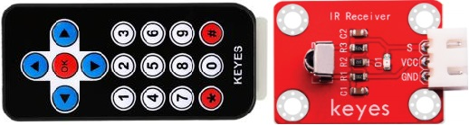
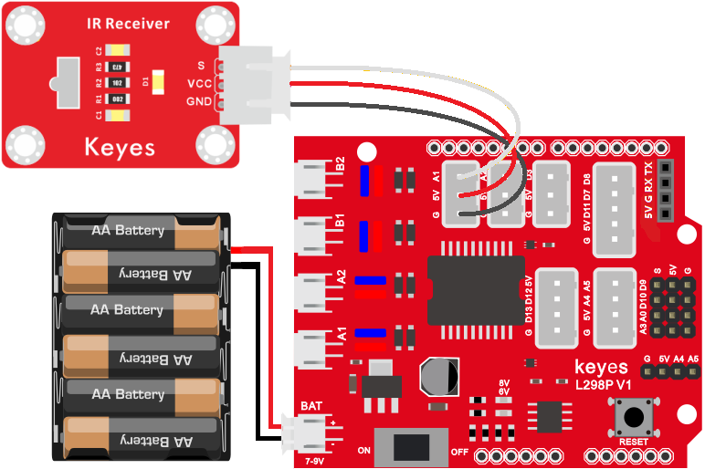
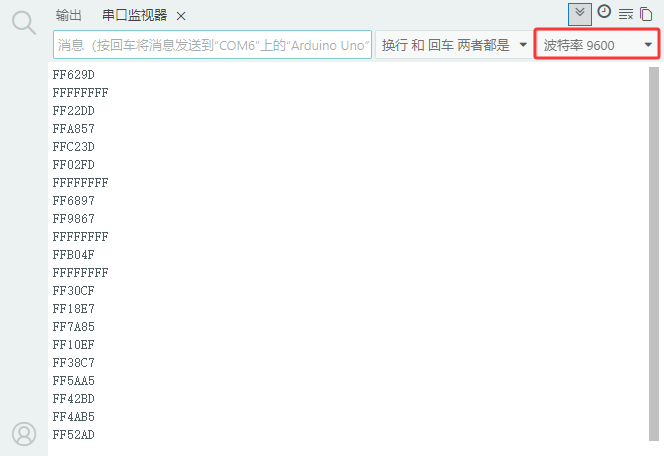
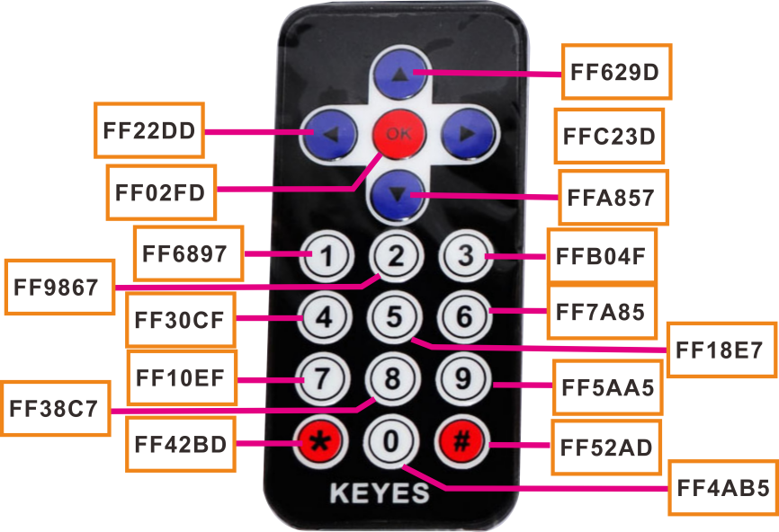
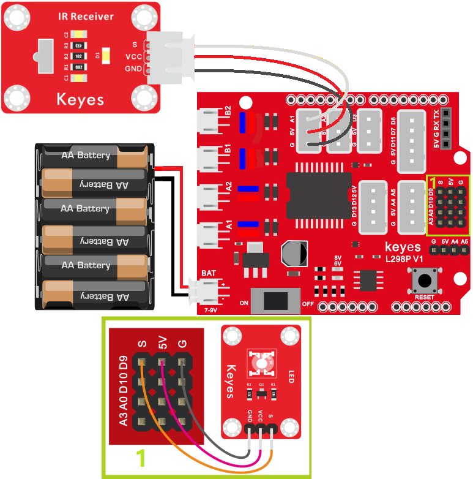
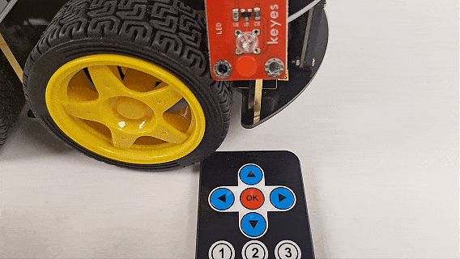

### 第07课 红外接收原理及应用


#### 7.1 项目介绍：

本教程将为您详细介绍红外接收模块与红外遥控器的使用方法和应用技巧。红外遥控在我们的日常生活中非常常见，比如家里的电视、空调、音响等设备，大多都使用红外遥控器来控制。那么，它是如何工作的呢？

#### 7.2 元件知识： 

红外遥控系统主要由两部分组成：红外发射端（也就是我们手中的遥控器）和红外接收端（安装在4WD智能车上的红外接收模块）。 



当你按下遥控器上的按键时，遥控器内部的芯片会将这个按键信息编码成一串特殊的信号。这串信号通过红外线发射管发射出去。这种红外信号是一种频率为 38KHz 的载波信号，它由“引导码”、“用户码”、“数据码”和“数据反码”组成。简单来说，就是利用脉冲时间的长短来表示数字“0”和“1”。


在本课中，我们将使用一个红外接收模块。这个模块内部集成了接收、放大和解调功能。它能把接收到的微弱红外光信号转换成单片机（如 Arduino）能识别的数字电信号（TTL电平）。这个模块只有三个引脚：信号输出（S）、电源正极（VCC）和电源负极（GND），连接非常方便。

当 Arduino 接收到这些数字信号后，通过程序进行解码，就能知道我们按下了遥控器上的哪个键，从而执行相应的操作。

**红外接收模块的参数：**

- 工作电压：3.3V - 5V（直流电）

- 接口类型：3PIN 接口（S, V, G）

- 输出信号：数字信号

- 接收角度：约 90 度

- 载波频率：38kHz

- 有效距离：约 10 米（视环境光线而定）

#### 7.3 项目组件：

| 组装好的智能车(<span style="color: rgb(255, 76, 65);">未插上蓝牙模块</span>) *1 | 草帽LED白发红模块 *1 | 3Pin 双母头杜邦线 *1  |
| --- | --- | --- | 
|  | | |
| USB线 *1 | 5号(1.5V)电池 *6（电池自备） | 红外遥控器 |
| |  |  |

#### 7.4 接线图：

⚠️ 特别注意：4WD智能车已经组装好了，这里不需要把红外接收模块拆下来又重新组装和接线，这里再次提供接线图，是为了方便您编写代码！

| 红外接收模块 | 电机驱动扩展板 | 
| :--: | :--: | 
| GND | G |
| VCC | 5V |
| S | A1 | 



⚠️ <span style="color: rgb(255, 76, 65);">**特别注意：**</span>

- 接线时请确保电源断开(拔掉Arduino主控板上的USB线或将电机驱动扩展板上的拨码开关拨到 “<span style="color: rgb(255, 76, 65);">**OFF**</span>” 端)，避免短路。

- 电源连接：电池盒电源接到电机驱动扩展板的 BAT 接口（注意正负极不要接反），端口正反面，请勿反插，否则会损坏端口。

- 电池正负极切勿接反，否则可能烧毁电机驱动扩展板。

- 电机驱动扩展板上的拨码开关拨到 “<span style="color: rgb(255, 76, 65);">**ON**</span>” 端。

#### 7.5 实例代码1：读取遥控器按键的值

⚠️ <span style="color: rgb(255, 76, 65);">**重要提示：**</span>

- 1\. 你需要安装 `<IRremote.h>` 库才能编译此代码，如果已经安装过，直接跳过。

- 2\. <span style="color: rgb(172, 57, 255);">**上传示例代码前，请务必拔掉蓝牙模块！ 因为蓝牙模块也占用Arduino的串口通信（TX/RX），如果不拔掉，示例代码上传会失败。**</span>
   
```cpp
/*
  keyes 4WD 多功能智能车
  课程 07.1
  红外遥控
  http://www.keyes-robot.com
*/
#include <IRremote.h>  // 红外遥控库声明

const int RECV_PIN = A1;  // 红外接收器引脚

IRrecv irrecv(RECV_PIN);
decode_results results;

/* 功能：初始化串口和红外接收器 */
void setup() {
  Serial.begin(9600);
  irrecv.enableIRIn();  // 启动红外接收器
}

/* 功能：循环检测红外信号并输出 */
void loop() {
  if (irrecv.decode(&results)) {  // 解码成功，收到红外信号
    Serial.println(results.value, HEX);  // 以16进制格式输出接收代码
    irrecv.resume();  // 准备接收下一个信号
  }
  delay(100);  // 延时100毫秒
}
```


#### 7.6 项目结果1：

⚠️ <span style="color: rgb(255, 76, 65);">**重要提示：**</span>

- <span style="color: rgb(172, 57, 255);">**上传示例代码前，请务必拔掉蓝牙模块！ 因为蓝牙模块也占用Arduino的串口通信（TX/RX），如果不拔掉，示例代码上传会失败。**</span>

外接电源，将电机驱动扩展板上的拨码开关拨到 “<span style="color: rgb(255, 76, 65);">**ON**</span>” 端，上电后。选择好正确的开发板板型（Arduino Uno）和 适当的串口端口（COMxx），然后单击  按钮上传示例代码1至Arduino控制板。

代码上传成功后，打开串口监视器，设置波特率为9600，拿起红外遥控器，对准红外接收模块，按下任意按键。

<span style="color: rgb(255, 76, 65);">**特别提醒：**</span> 使用红外遥控器之前，需要将红外遥控器上的透明塑料卡片抽掉。


此时，你会在串口监视器中看到一串十六进制的代码。这就是该按键对应的“键值”。



<span style="color: rgb(255, 76, 65);">**注意：如果长时间按住按键不放，可能会收到重复的代码或乱码（通常是FFFFFFFF），这是正常的。请短促按压按键进行测试。**</span>

为了方便后续使用，我们将常用按键的键值记录下来，形成如下对照表：



#### 7.7 代码说明：

```C
#include <IRremote.h>
```
这是必须的头文件，它包含了处理红外信号所需的所有函数

```C
irrecv.enableIRIn()
```
在 `setup()`中调用，用于初始化并启动红外接收功能。之后，程序会在后台自动监听红外信号。
**decode()-**接着就可以利用decode()函数持续检查，看看有没有解码成功。

```C
irrecv.decode(&results)
```

在 `loop()` 中不断检查是否有新的红外信号被接收并解码成功。如果成功，它返回 `true`，并将解码后的数据存入 `results` 变量中。

```C
results.value
```
存储了按键的具体键值，我们使用 `HEX` 参数将其以十六进制形式显示，这样更简洁易读。

```C
irrecv.resume()
```
在处理完当前信号后，必须调用此函数，告诉接收器“我已经处理完了，请准备接收下一个信号”。如果不加这句，遥控器只能控制一次。

#### 7.8 示例代码2：红外控制LED

既然我们已经知道了每个按键对应的数值，我们就可以用这些数值来控制其他设备了。比如，我们用遥控器的“OK”键来控制一个 LED 灯的亮和灭。

**硬件连接：**

⚠️ 特别注意：4WD智能车已经组装好了，这里不需要把红外接收模块拆下来又重新组装和接线，这里再次提供接线图，是为了方便您编写代码！但是，LED模块是需要你自己接线的。

| 红外接收模块 | 电机驱动扩展板 | 
| :--: | :--: | 
| GND | G |
| VCC | 5V |
| S | A1 | 

| LED 模块 | 电机驱动扩展板 | 
| :--: | :--: | 
| GND | G |
| VCC | 5V |
| S | S(D9) |



⚠️ <span style="color: rgb(255, 76, 65);">**特别注意：**</span>

- 接线时请确保电源断开(拔掉Arduino主控板上的USB线或将电机驱动扩展板上的拨码开关拨到 “<span style="color: rgb(255, 76, 65);">**OFF**</span>” 端)，避免短路。

- 电源连接：电池盒电源接到电机驱动扩展板的 BAT 接口（注意正负极不要接反），端口正反面，请勿反插，否则会损坏端口。

- 电池正负极切勿接反，否则可能烧毁电机驱动扩展板。

- 电机驱动扩展板上的拨码开关拨到 “<span style="color: rgb(255, 76, 65);">**ON**</span>” 端。

⚠️ <span style="color: rgb(255, 76, 65);">**重要提示：**</span>

- <span style="color: rgb(172, 57, 255);">**上传示例代码前，请务必拔掉蓝牙模块！ 因为蓝牙模块也占用Arduino的串口通信（TX/RX），如果不拔掉，示例代码上传会失败。**</span>

```cpp
/*
  keyes 4WD 多功能智能车
  课程 07.2
  红外遥控
  http://www.keyes-robot.com
*/
#include <IRremote.h>

#define RECV_PIN A1    // 红外接收器引脚
#define LED_PIN 9      // 发光LED引脚

int ledState = 0;     // LED 状态变量，0 关闭，1 打开

IRrecv irrecv(RECV_PIN);
decode_results results;

/* 功能：初始化串口、红外接收器和LED引脚 */
void setup() {
  Serial.begin(9600);
  irrecv.enableIRIn();           // 初始化红外接收器
  pinMode(LED_PIN, OUTPUT);      // 设置LED引脚为输出模式
}

/* 功能：检测红外信号，控制LED开关 */
void loop() {
  if (irrecv.decode(&results)) {
    Serial.println(results.value, HEX);  // 输出接收到的红外码（十六进制）
    if (results.value == 0xFF02FD && ledState == 0) {  // 按下OK键且LED关闭
      digitalWrite(LED_PIN, HIGH);       // 点亮LED
      ledState = 1;                      // 更新状态为打开
    } else if (results.value == 0xFF02FD && ledState == 1) {  // 再次按下OK键且LED打开
      digitalWrite(LED_PIN, LOW);        // 熄灭LED
      ledState = 0;                      // 更新状态为关闭
    }
    irrecv.resume();                     // 准备接收下一个信号
  }
}
```

#### 7.9 项目结果2：

⚠️ <span style="color: rgb(255, 76, 65);">**重要提示：**</span>

- <span style="color: rgb(172, 57, 255);">**上传示例代码前，请务必拔掉蓝牙模块！ 因为蓝牙模块也占用Arduino的串口通信（TX/RX），如果不拔掉，示例代码上传会失败。**</span>

外接电源，将电机驱动扩展板上的拨码开关拨到 “<span style="color: rgb(255, 76, 65);">**ON**</span>” 端，上电后。选择好正确的开发板板型（Arduino Uno）和 适当的串口端口（COMxx），然后单击  按钮上传示例代码2至Arduino控制板。

代码上传成功后，打开串口监视器，设置波特率为9600，尝试按下遥控器上的 **OK** 键，你会发现 LED 灯会随着你的按键在亮和灭之间切换。同时，串口监视器也会显示对应的键值。


