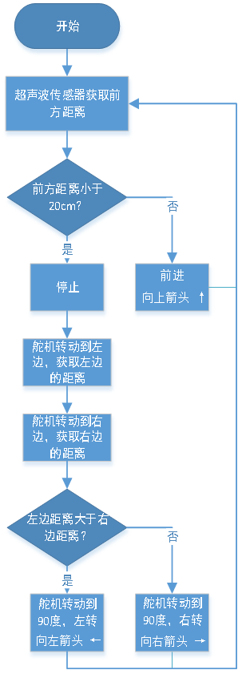
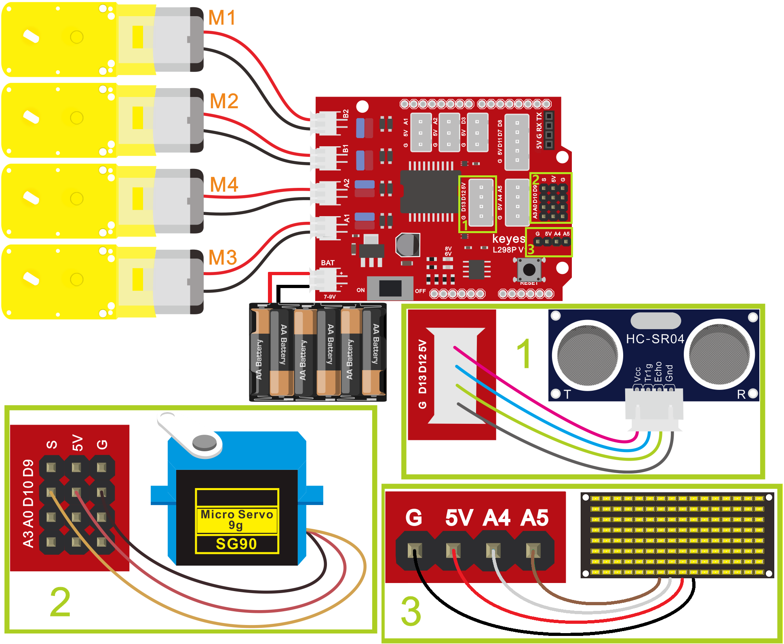

### 第14课 自动避障智能车

#### 14.1 项目介绍：

在上一节课中，我们制作了一辆能够跟随物体的智能小车。其实，利用同样的硬件和接线方式，我们只需要修改程序逻辑，就能让这辆小车从“跟随者”变身为“探险家”——也就是自动避障智能车。

避障智能车就像长了眼睛一样，它能通过超声波传感器探测前方的障碍物。当发现前方有障碍时，它会停下来，“左顾右盼”（转动舵机带动超声波探头），比较左边和右边哪个方向更宽敞，然后选择空间更大的一侧转弯绕过障碍，继续前进。同时，为了让互动更有趣，小车前方的 8x16 LED点阵屏 还会实时显示当前运动状态的图标（如箭头或文字）。

#### 14.2 工作原理与逻辑

为了让小车聪明地避开障碍，我们需要设计一套清晰的判断逻辑。我们可以把小车的思考过程整理成下面的表格：

| 检测情况 | 中间距离 (distance) | 左侧距离 (distance_l) vs 右侧距离 (distance_r) | 小车动作 |点阵屏显示内容 |
| :--: | :--: | :--: |:--: | :--: |
| 发现障碍 | 	0 < distance < 20 cm | 左侧距离 > 右侧距离 | 向左转 (左边更宽敞) |向左箭头 ← |
| 发现障碍 | 	0 < distance < 20 cm | 左侧距离 ≤ 右侧距离 | 向右转 (右边更宽敞或一样) |向右箭头 → |
| 发现障碍 | 	distance ≥ 20 cm |无需比较 | 直行 |向上箭头 ↑ |



**核心步骤：**

- 1\. 测距：超声波模块一直测量正前方的距离。

- 2\. 判断：如果前方距离小于20厘米，说明有障碍，立即停车。

- 3\. 侦察：控制舵机先转向左边测一次距离，再转向右边测一次距离。

- 4\. 决策：比较左右两边的距离，哪边远就往哪边转。

- 5\. 复位：转弯后，将舵机转回正前方，继续直行。


#### 14.3 项目组件：

| 组装好的智能车(<span style="color: rgb(255, 76, 65);">未插上蓝牙模块</span>) *1 |USB线 *1 | 5号(1.5V)电池 *6（电池自备） |
| --- | --- | --- | --- |
|  | |  |

#### 14.4 接线图：

⚠️ 特别注意：4WD智能车已经组装好了，这里不需要把超声波传感器、舵机、8x16 LED点阵模块和4个电机拆下来又重新组装和接线，这里再次提供接线图，是为了方便您编写代码！

| 超声波传感器 | 电机驱动扩展板 | 
| :--: | :--: | 
| Vcc | 5V |
| Trig | D12 |
| Echo | D13 | 
| Gnd | G |

| 舵机 | 电机驱动扩展板 | 
| :--: | :--: | 
| 棕色线 | G |
| 红色线 | 5V |
| 橙色线 | S（D10）|  

| 8x16 LED点阵模块 | 电机驱动扩展板 | 
| :--: | :--: | 
| GND | G |
| VCC | 5V |
| SDA | A4 | 
| SCL | A5 |

| 电机 | 电机驱动扩展板 | 
| :--: | :--: | 
| 左侧电机（M1） | B2 |
| 左侧电机（M2） | B1 |
| 右侧电机（M3） | A1 |
| 右侧电机（M4） | A2 |



⚠️ <span style="color: rgb(255, 76, 65);">**特别注意：**</span>

- 接线时请确保电源断开(拔掉Arduino主控板上的USB线或将电机驱动扩展板上的拨码开关拨到 “<span style="color: rgb(255, 76, 65);">**OFF**</span>” 端)，避免短路。

- 电源连接：电池盒电源接到电机驱动扩展板的 BAT 接口（注意正负极不要接反），端口正反面，请勿反插，否则会损坏端口。

- 电池正负极切勿接反，否则可能烧毁电机驱动扩展板。

#### 14.5 示例代码：

⚠️ <span style="color: rgb(255, 76, 65);">**重要提示：**</span>

- <span style="color: rgb(172, 57, 255);">**上传示例代码前，请务必拔掉蓝牙模块！ 因为蓝牙模块也占用Arduino的串口通信（TX/RX），如果不拔掉，示例代码上传会失败。**</span>

```cpp
/*
  keyes 4WD 多功能智能车
  课程 14
  超声波避障机器人
  http://www.keyes-robot.com
*/
#include <Servo.h>

Servo myservo;                      // 舵机对象

// 数组，用于存储点阵图案数据，可自行计算或使用取模工具获得
unsigned char FRONT[] = {0x00, 0x00, 0x00, 0x00, 0x00, 0x24, 0x12, 0x09, 0x12, 0x24, 0x00, 0x00, 0x00, 0x00, 0x00, 0x00};
unsigned char LEFT[] = {0x00, 0x00, 0x00, 0x00, 0x00, 0x00, 0x44, 0x28, 0x10, 0x44, 0x28, 0x10, 0x44, 0x28, 0x10, 0x00};
unsigned char RIGHT[] = {0x00, 0x10, 0x28, 0x44, 0x10, 0x28, 0x44, 0x10, 0x28, 0x44, 0x00, 0x00, 0x00, 0x00, 0x00, 0x00};
unsigned char STOP01[] = {0x2E, 0x2A, 0x3A, 0x00, 0x02, 0x3E, 0x02, 0x00, 0x3E, 0x22, 0x3E, 0x00, 0x3E, 0x0A, 0x0E, 0x00};
unsigned char CLEAR[] = {0x00, 0x00, 0x00, 0x00, 0x00, 0x00, 0x00, 0x00, 0x00, 0x00, 0x00, 0x00, 0x00, 0x00, 0x00, 0x00};

#define SCL_PIN    A5    // 时钟引脚 A5
#define SDA_PIN    A4    // 数据引脚 A4
#define TRIG_PIN   12    // 超声波触发引脚 D12
#define ECHO_PIN   13    // 超声波回声引脚 D13
#define MA_PIN     2     // 电机M3,M4方向控制引脚 D2
#define PWMA_PIN   6     // 电机M3,M4速度控制引脚 D6
#define MB_PIN     4     // 电机M1,M2方向控制引脚 D4
#define PWMB_PIN   5     // 电机M1,M2速度控制引脚 D5

int distance = 0;
int distanceL = 0;
int distanceR = 0;

/* 功能：初始化设置 */
void setup() {
  Serial.begin(9600);               // 初始化串口，波特率9600
  myservo.attach(10);               // 绑定舵机引脚10
  pinMode(ECHO_PIN, INPUT);         // 设置回声引脚为输入
  pinMode(TRIG_PIN, OUTPUT);        // 设置触发引脚为输出
  pinMode(MA_PIN, OUTPUT);          // 设置电机方向引脚为输出
  pinMode(PWMA_PIN, OUTPUT);        // 设置电机速度引脚为输出
  pinMode(MB_PIN, OUTPUT);          // 设置电机方向引脚为输出
  pinMode(PWMB_PIN, OUTPUT);        // 设置电机速度引脚为输出
  pinMode(SCL_PIN, OUTPUT);         // 设置时钟引脚为输出
  pinMode(SDA_PIN, OUTPUT);         // 设置数据引脚为输出
  matrixDisplay(CLEAR);             // 点阵屏清屏
  myservo.write(90);                // 舵机初始角度90度
  delay(500);
}

/* 功能：主循环 */
void loop() {
  distance = getDistance();         // 获取前方距离

  if (distance > 0 && distance < 20) { // 距离小于20且大于0时避障
    stopCar();                      // 停车
    matrixDisplay(STOP01);          // 显示停止图案
    delay(100);
    myservo.write(180);             // 舵机转到180度检测左侧距离
    delay(500);
    distanceL = getDistance();      // 获取左侧距离
    delay(100);
    myservo.write(0);               // 舵机转到0度检测右侧距离
    delay(500);
    distanceR = getDistance();      // 获取右侧距离
    delay(100);
    if (distanceL > distanceR) {    // 左侧距离大于右侧，左转
      turnLeft();
      matrixDisplay(LEFT);           // 显示左转图案
      delay(1000);
      myservo.write(90);             // 舵机回中
      matrixDisplay(FRONT);          // 显示前进图案
    }
    else {                         // 右侧距离大于左侧，右转
      turnRight();
      matrixDisplay(RIGHT);          // 显示右转图案
      delay(1000);
      myservo.write(90);             // 舵机回中
      matrixDisplay(FRONT);          // 显示前进图案
    }
  }
  else {                           // 距离大于等于20，继续前进
    advance();
    matrixDisplay(FRONT);           // 显示前进图案
  }
}

/* 功能：获取超声波距离（单位：厘米） */
int getDistance() {
  int dist = 0;
  digitalWrite(TRIG_PIN, LOW);     // 触发引脚低电平2微秒
  delayMicroseconds(2);
  digitalWrite(TRIG_PIN, HIGH);    // 触发引脚高电平10微秒
  delayMicroseconds(10);
  digitalWrite(TRIG_PIN, LOW);     // 触发引脚低电平
  dist = pulseIn(ECHO_PIN, HIGH) / 58; // 计算距离
  Serial.println(dist);             // 输出距离值
  return dist;
}

/* 功能：小车前进 */
void advance() {
  digitalWrite(MA_PIN, HIGH);      // 电机A正转
  analogWrite(PWMA_PIN, 180);      // 电机A速度180
  digitalWrite(MB_PIN, HIGH);      // 电机B正转
  analogWrite(PWMB_PIN, 180);      // 电机B速度180
}

/* 功能：小车后退 */
void back() {
  digitalWrite(MA_PIN, LOW);       // 电机A反转
  analogWrite(PWMA_PIN, 180);      // 电机A速度180
  digitalWrite(MB_PIN, LOW);       // 电机B反转
  analogWrite(PWMB_PIN, 180);      // 电机B速度180
}

/* 功能：小车左转 */
void turnLeft() {
  digitalWrite(MA_PIN, HIGH);      // 电机A正转
  analogWrite(PWMA_PIN, 180);      // 电机A速度180
  digitalWrite(MB_PIN, LOW);       // 电机B反转
  analogWrite(PWMB_PIN, 180);      // 电机B速度180
}

/* 功能：小车右转 */
void turnRight() {
  digitalWrite(MA_PIN, LOW);       // 电机A反转
  analogWrite(PWMA_PIN, 180);      // 电机A速度180
  digitalWrite(MB_PIN, HIGH);      // 电机B正转
  analogWrite(PWMB_PIN, 180);      // 电机B速度180
}

/* 功能：小车停止 */
void stopCar() {
  analogWrite(PWMA_PIN, 0);        // 电机A速度0
  analogWrite(PWMB_PIN, 0);        // 电机B速度0
}

/* 功能：点阵屏显示图案 */
void matrixDisplay(unsigned char matrixValue[]) {
  IICStart();                      // 开始传输
  IICSend(0xc0);                  // 选择点阵地址
  for (int i = 0; i < 16; i++) {  // 发送16字节图案数据
    IICSend(matrixValue[i]);
  }
  IICEnd();                       // 结束传输
  IICStart();
  IICSend(0x8A);                 // 显示控制，脉宽4/16
  IICEnd();
}

/* 功能：IIC开始信号 */
void IICStart() {
  digitalWrite(SCL_PIN, HIGH);
  delayMicroseconds(3);
  digitalWrite(SDA_PIN, HIGH);
  delayMicroseconds(3);
  digitalWrite(SDA_PIN, LOW);
  delayMicroseconds(3);
}

/* 功能：IIC发送一个字节 */
void IICSend(unsigned char sendData) {
  for (char i = 0; i < 8; i++) {  // 发送8位数据
    digitalWrite(SCL_PIN, LOW);   // 时钟拉低，准备改变数据线状态
    delayMicroseconds(3);
    if (sendData & 0x01) {        // 判断最低位
      digitalWrite(SDA_PIN, HIGH);
    }
    else {
      digitalWrite(SDA_PIN, LOW);
    }
    delayMicroseconds(3);
    digitalWrite(SCL_PIN, HIGH);  // 时钟拉高，数据有效
    delayMicroseconds(3);
    sendData = sendData >> 1;     // 右移一位，准备发送下一位
  }
}

/* 功能：IIC结束信号 */
void IICEnd() {
  digitalWrite(SCL_PIN, LOW);
  delayMicroseconds(3);
  digitalWrite(SDA_PIN, LOW);
  delayMicroseconds(3);
  digitalWrite(SCL_PIN, HIGH);
  delayMicroseconds(3);
  digitalWrite(SDA_PIN, HIGH);
  delayMicroseconds(3);
}
```

#### 14.6 项目结果：

⚠️ <span style="color: rgb(255, 76, 65);">**重要提示：**</span>

- <span style="color: rgb(172, 57, 255);">**上传示例代码前，请务必拔掉蓝牙模块！ 因为蓝牙模块也占用Arduino的串口通信（TX/RX），如果不拔掉，示例代码上传会失败。**</span>

外接电源，将电机驱动扩展板上的拨码开关拨到 “<span style="color: rgb(255, 76, 65);">**OFF**</span>” 端。选择好正确的开发板板型（Arduino Uno）和 适当的串口端口（COMxx），然后单击  按钮上传示例代码至Arduino控制板。

- 打开电源：将电机驱动扩展板上的拨码开关拨到 “<span style="color: rgb(255, 76, 65);">**ON**</span>” 端。

- 4WD智能车会先直行，同时8x16 LED点阵屏显示向前箭头。

- 当你用手或书本挡在4WD智能车前方约20厘米以内处时，4WD智能车会停下，同时8x16 LED点阵屏显示停止符号。

- 随后，你会看到车顶的超声波模块先向左转，再向右转（像在摇头观察）。

- 根据哪一边空间大，4WD智能车会向那边转弯，同时8x16 LED点阵屏显示对应的箭头；然后恢复直行，同时8x16 LED点阵屏显示向前箭头。
 


#### 14.7 代码解释：

1\. 变量定义：我们定义了`distance`（前方距离）、`distanceL`（左侧距离）和`distanceR（右侧距离）三个变量来存储超声波测量的结果。

```C
int distance = 0;
int distanceL = 0;
int distanceR = 0;
```

2\. loop()主逻辑：

```C
void loop() {
  distance = getDistance();         // 获取前方距离

  if (distance > 0 && distance < 20) { // 距离小于20且大于0时避障
    stopCar();                      // 停车
    matrixDisplay(STOP01);          // 显示停止图案
    delay(100);
    myservo.write(180);             // 舵机转到180度检测左侧距离
    delay(500);
    distanceL = getDistance();      // 获取左侧距离
    delay(100);
    myservo.write(0);               // 舵机转到0度检测右侧距离
    delay(500);
    distanceR = getDistance();      // 获取右侧距离
    delay(100);
    if (distanceL > distanceR) {    // 左侧距离大于右侧，左转
      turnLeft();
      matrixDisplay(LEFT);           // 显示左转图案
      delay(1000);
      myservo.write(90);             // 舵机回中
      matrixDisplay(FRONT);          // 显示前进图案
    }
    else {                         // 右侧距离大于左侧，右转
      turnRight();
      matrixDisplay(RIGHT);          // 显示右转图案
      delay(1000);
      myservo.write(90);             // 舵机回中
      matrixDisplay(FRONT);          // 显示前进图案
    }
  }
  else {                           // 距离大于等于20，继续前进
    advance();
    matrixDisplay(FRONT);           // 显示前进图案
  }
}
``` 

- 首先调用`getDistance()`测量前方距离。

- if 判断：如果距离小于20cm，进入避障流程。
        
- 避障流程：
   
   - 1\. `stopCar()`停车。
   - 2\. `myservo.write(180)`让舵机带超声波探头转向左边，延时等待稳定后测距。
   - 3\. `myservo.write(0)`让探头转向右边，延时等待稳定后测距。
   - 4\. 比较 `distanceL` 和 `distanceR`，决定调用 `turnLeft()` 还是 `turnRight()`。
   
- else 分支：如果前方距离足够（>=20cm），则调用 `advance()` 直行。
    
3\. `getDistance()`函数：这是超声波测距的核心。它通过 Trig 引脚发送一个短暂的高电平脉冲，然后通过 `pulseIn()` 函数读取 Echo 引脚高电平持续的时间，最后除以58转换为厘米。
    
4\. 电机控制函数：`advance`,`turnLeft`,`turnRight`,`stopCar`分别控制两组电机的方向和速度，从而实现小车的基本运动。


#### 14.8 注意事项:

1\. 电源充足：避障过程中电机频繁启停和转向，耗电较大，请确保电池电量充足，否则小车可能动力不足或重启。

2\. 舵机延时：代码中`delay(500)`非常重要。因为舵机转动需要时间，如果不延时直接测距，测到的可能是转动过程中的错误距离，导致判断失误。

3\.  环境光线：虽然超声波不受光线影响，但如果在非常狭窄或杂乱的环境中，超声波可能会产生反射干扰，建议在开阔平坦的地面测试。
    
4\. 盲区问题：超声波传感器有一定的检测盲区（通常2-3cm以内），如果障碍物贴得太近，可能无法准确检测。


