### 第17课 蓝牙调速智能车

#### 17.1 项目介绍：

在之前的课程中，我们已经学会了如何通过手机蓝牙控制智能车的前进、后退和转向。但是，你是否觉得小车的速度总是固定的，不够灵活呢？

在这一课中，我们将给智能车增加一个“油门”功能！通过编写代码，我们可以定义一个变量`speeds`来存储当前的速度值。当你按下手机APP上的加速或减速按钮时，这个变量的值就会发生变化，从而让小车跑得更快或更慢。让我们一起来看看如何实现吧！

#### 17.2 工作原理:

要控制直流电机的速度，我们需要使用 PWM（脉冲宽度调制） 技术。简单来说，就是通过快速开关电源，改变通电时间的比例，从而控制电机的平均电压，进而调节转速。

在 Arduino 中，`analogWrite()`函数可以产生 PWM 信号。它的数值范围是 0 到 255：

- 0：代表停止（0% 动力）
- 255：代表全速（100% 动力）
- 中间值：代表不同的速度等级

我们将创建一个名为 `speeds` 的变量，初始值设为 150。

- 当接收到加速指令 'a' 时，`speeds`的值增加。

- 当接收到减速指令'd'时，`speeds`的值减小。
    
- 电机驱动函数将使用这个 `speeds` 变量作为速度参数。


#### 17.3 流程图：

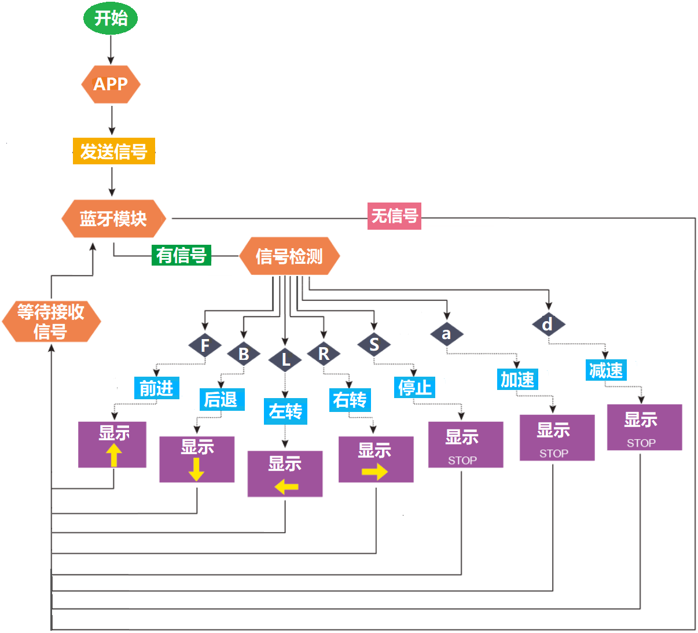

#### 17.4 项目组件：

| 组装好的智能车(<span style="color: rgb(255, 76, 65);">未插上蓝牙模块</span>) *1 |USB线 *1 | 5号(1.5V)电池 *6（电池自备） |
| --- | --- | --- | 
|  | | | 
| 蓝牙模块  *1 | 手机/平板 *1|  |
| 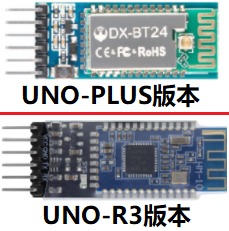|| |

#### 17.5 接线图：

⚠️ 特别注意：4WD智能车已经组装好了，这里不需要把舵机、8x16 LED点阵模块和4个电机拆下来又重新组装和接线，这里再次提供接线图，是为了方便您编写代码！

| 蓝牙模块 | 电机驱动扩展板 | 
| :--: | :--: |
| EN | - | 
| VCC | 5V |
| GND | G |
| TXD | RX | 
| RXD | TX |
| STATE | - |

| 8x16 LED点阵模块 | 电机驱动扩展板 | 
| :--: | :--: | 
| GND | G |
| VCC | 5V |
| SDA | A4 | 
| SCL | A5 |

| 舵机 | 电机驱动扩展板 | 
| :--: | :--: | 
| 棕色线 | G |
| 红色线 | 5V |
| 橙色线 | S（D10）|  

| 电机 | 电机驱动扩展板 | 
| :--: | :--: | 
| 左侧电机（M1） | B2 |
| 左侧电机（M2） | B1 |
| 右侧电机（M3） | A1 |
| 右侧电机（M4） | A2 |

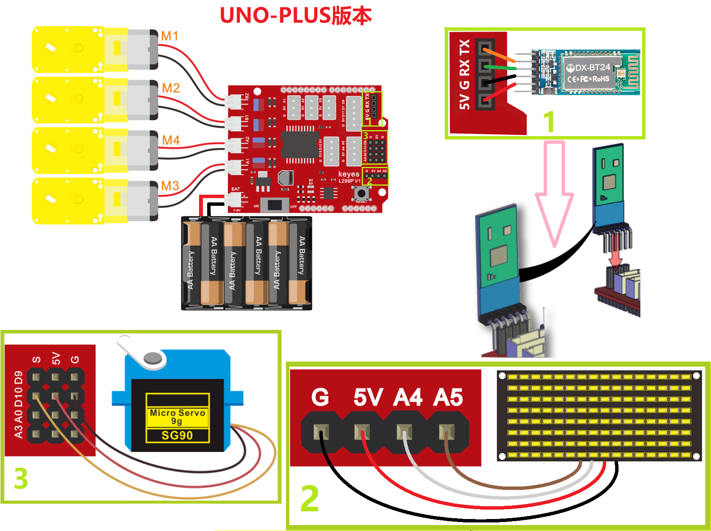

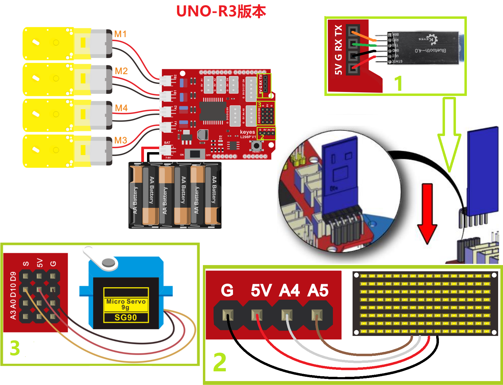

⚠️ <span style="color: rgb(255, 76, 65);">**特别注意：**</span>

- <span style="color: rgb(172, 57, 255);">**上传示例代码前，蓝牙模块可以先不直插到电机驱动扩展板上！因为蓝牙模块也占用Arduino的串口通信（TX/RX），如果连接到电机驱动扩展板上，示例代码上传会失败。示例代码上传成功后，再插回蓝牙模块。**</span>

- 接线时请确保电源断开(拔掉Arduino主控板上的USB线或将电机驱动扩展板上的拨码开关拨到 “<span style="color: rgb(255, 76, 65);">**OFF**</span>” 端)，避免短路。

- 电源连接：电池盒电源接到电机驱动扩展板的 BAT 接口（注意正负极不要接反），端口正反面，请勿反插，否则会损坏端口。

- 电池正负极切勿接反，否则可能烧毁电机驱动扩展板。

#### 17.6 示例代码：

⚠️ <span style="color: rgb(255, 76, 65);">**重要提示：**</span>

<span style="color: rgb(172, 57, 255);">- **上传示例代码前，请务必拔掉蓝牙模块！ 因为蓝牙模块也占用Arduino的串口通信（TX/RX），如果不拔掉，示例代码上传会失败。示例代码上传成功后，再插回蓝牙模块。**</span>

```cpp
/*
  keyes 4WD 多功能智能车
  课程17
  蓝牙控制速度
  http://www.keyes-robot.com
*/
// 数组，用于存储图案的数据，可以自己计算也可以从取模工具中获得
unsigned char START_01[] = {0x01, 0x02, 0x04, 0x08, 0x10, 0x20, 0x40, 0x80, 0x80, 0x40, 0x20, 0x10, 0x08, 0x04, 0x02, 0x01};
unsigned char FRONT[] = {0x00, 0x00, 0x00, 0x00, 0x00, 0x24, 0x12, 0x09, 0x12, 0x24, 0x00, 0x00, 0x00, 0x00, 0x00, 0x00};
unsigned char BACK_01[] = {0x00, 0x00, 0x00, 0x00, 0x00, 0x24, 0x48, 0x90, 0x48, 0x24, 0x00, 0x00, 0x00, 0x00, 0x00, 0x00};
unsigned char LEFT[] = {0x00, 0x00, 0x00, 0x00, 0x00, 0x00, 0x44, 0x28, 0x10, 0x44, 0x28, 0x10, 0x44, 0x28, 0x10, 0x00};
unsigned char RIGHT[] = {0x00, 0x10, 0x28, 0x44, 0x10, 0x28, 0x44, 0x10, 0x28, 0x44, 0x00, 0x00, 0x00, 0x00, 0x00, 0x00};
unsigned char STOP_01[] = {0x2E, 0x2A, 0x3A, 0x00, 0x02, 0x3E, 0x02, 0x00, 0x3E, 0x22, 0x3E, 0x00, 0x3E, 0x0A, 0x0E, 0x00};
unsigned char SPEED_A[] = {0x00, 0x40, 0x20, 0x10, 0x08, 0x04, 0x02, 0xff, 0x02, 0x04, 0x08, 0x10, 0x20, 0x40, 0x00, 0x00};
unsigned char SPEED_D[] = {0x00, 0x02, 0x04, 0x08, 0x10, 0x20, 0x40, 0xff, 0x40, 0x20, 0x10, 0x08, 0x04, 0x02, 0x00, 0x00};
unsigned char CLEAR[] = {0x00, 0x00, 0x00, 0x00, 0x00, 0x00, 0x00, 0x00, 0x00, 0x00, 0x00, 0x00, 0x00, 0x00, 0x00, 0x00};

#define SCL_PIN  A5  // 设置时钟引脚为 A5
#define SDA_PIN  A4  // 设置数据引脚为 A4

#define MA_PIN  2    // 电机M3,M4方向控制引脚为D2
#define PWMA_PIN  6  // 电机M3,M4速度控制引脚为D6
#define MB_PIN  4    // 电机M1,M2方向控制引脚为D4
#define PWMB_PIN  5  // 电机M1,M2速度控制引脚为D5

int speeds = 150;   // 初始化速度为150
char blueVal;

/* 功能：初始化设置 */
void setup() {
  Serial.begin(9600);               // 设置波特率为9600
  pinMode(MA_PIN, OUTPUT);          // 配置电机引脚为输出模式
  pinMode(PWMA_PIN, OUTPUT);
  pinMode(MB_PIN, OUTPUT);
  pinMode(PWMB_PIN, OUTPUT);
  pinMode(SCL_PIN, OUTPUT);         // 设置IIC时钟引脚为输出
  pinMode(SDA_PIN, OUTPUT);         // 设置IIC数据引脚为输出
  matrixDisplay(CLEAR);             // 清屏
  matrixDisplay(START_01);          // 显示启动图案
}

/* 功能：主循环，接收蓝牙指令并执行 */
void loop() {
  if (Serial.available() > 0) {    // 接收到蓝牙信号
    blueVal = Serial.read();       // 读取蓝牙信号
    Serial.println(blueVal);       // 串口监视器显示蓝牙信号
    switch (blueVal) {
      case 'F': 
        advance(); 
        matrixDisplay(FRONT); 
        break;                     // 前进
      case 'B': 
        back(); 
        matrixDisplay(BACK_01); 
        break;                     // 后退
      case 'L': 
        turnLeft(); 
        matrixDisplay(LEFT); 
        break;                     // 左旋转
      case 'R': 
        turnRight(); 
        matrixDisplay(RIGHT); 
        break;                     // 右旋转
      case 'S': 
        stopCar(); 
        matrixDisplay(STOP_01); 
        break;                     // 停止
      case 'a': 
        speedUp(); 
        matrixDisplay(SPEED_A); 
        break;                     // 加速
      case 'd': 
        speedDown(); 
        matrixDisplay(SPEED_D); 
        break;                     // 减速
    }
  }
}

/* 功能：小车前进 */
void advance() {
  digitalWrite(MA_PIN, HIGH);       // 电机A正转
  analogWrite(PWMA_PIN, speeds);    // 电机A速度为speeds
  digitalWrite(MB_PIN, HIGH);       // 电机B正转
  analogWrite(PWMB_PIN, speeds);    // 电机B速度为speeds
}

/* 功能：小车后退 */
void back() {
  digitalWrite(MA_PIN, LOW);        // 电机A反转
  analogWrite(PWMA_PIN, speeds);    // 电机A速度为speeds
  digitalWrite(MB_PIN, LOW);        // 电机B反转
  analogWrite(PWMB_PIN, speeds);    // 电机B速度为speeds
}

/* 功能：小车左旋转 */
void turnLeft() {
  digitalWrite(MA_PIN, HIGH);       // 电机A正转
  analogWrite(PWMA_PIN, speeds);    // 电机A速度为speeds
  digitalWrite(MB_PIN, LOW);        // 电机B反转
  analogWrite(PWMB_PIN, speeds);    // 电机B速度为speeds
}

/* 功能：小车右旋转 */
void turnRight() {
  digitalWrite(MA_PIN, LOW);        // 电机A反转
  analogWrite(PWMA_PIN, speeds);    // 电机A速度为speeds
  digitalWrite(MB_PIN, HIGH);       // 电机B正转
  analogWrite(PWMB_PIN, speeds);    // 电机B速度为speeds
}

/* 功能：小车停止 */
void stopCar() {
  analogWrite(PWMA_PIN, 0);         // 电机A速度为0
  analogWrite(PWMB_PIN, 0);         // 电机B速度为0
}

/* 功能：加速函数 */
void speedUp() {
  while (1) {
    Serial.println(speeds);         // 显示当前速度
    if (speeds < 255) {             // 最大速度255
      speeds++;
      delay(10);                    // 调节加速速度
    }
    if (Serial.available() > 0) {
      blueVal = Serial.read();
      if (blueVal == 'S') break;    // 接收到‘S’停止加速
    }
  }
}

/* 功能：减速函数 */
void speedDown() {
  while (1) {
    Serial.println(speeds);         // 显示当前速度
    if (speeds > 0) {               // 最小速度0
      speeds--;
      delay(10);                    // 调节减速速度
    }
    if (Serial.available() > 0) {
      blueVal = Serial.read();
      if (blueVal == 'S') break;    // 接收到‘S’停止减速
    }
  }
}

/* 功能：点阵屏显示 */
void matrixDisplay(unsigned char matrixValue[]) {
  IICStart();                      // 调用数据传输开始条件函数
  IICSend(0xc0);                  // 选择地址
  for (int i = 0; i < 16; i++) {  // 图案数据16个字节
    IICSend(matrixValue[i]);      // 传输图案数据
  }
  IICEnd();                       // 结束数据传输
  IICStart();
  IICSend(0x8A);                  // 显示控制，选择脉宽为4/16
  IICEnd();
}

/* 功能：IIC传输开始条件 */
void IICStart() {
  digitalWrite(SCL_PIN, HIGH);
  delayMicroseconds(3);
  digitalWrite(SDA_PIN, HIGH);
  delayMicroseconds(3);
  digitalWrite(SDA_PIN, LOW);
  delayMicroseconds(3);
}

/* 功能：IIC传输数据 */
void IICSend(unsigned char sendData) {
  for (char i = 0; i < 8; i++) {  // 每个字节8位
    digitalWrite(SCL_PIN, LOW);   // 时钟拉低，准备改变数据线信号
    delayMicroseconds(3);
    if (sendData & 0x01) {        // 判断最低位是1还是0
      digitalWrite(SDA_PIN, HIGH);
    } else {
      digitalWrite(SDA_PIN, LOW);
    }
    delayMicroseconds(3);
    digitalWrite(SCL_PIN, HIGH);  // 时钟拉高，完成数据传输
    delayMicroseconds(3);
    sendData = sendData >> 1;     // 右移一位，准备传输下一位
  }
}

/* 功能：IIC传输结束条件 */
void IICEnd() {
  digitalWrite(SCL_PIN, LOW);
  delayMicroseconds(3);
  digitalWrite(SDA_PIN, LOW);
  delayMicroseconds(3);
  digitalWrite(SCL_PIN, HIGH);
  delayMicroseconds(3);
  digitalWrite(SDA_PIN, HIGH);
  delayMicroseconds(3);
}
```
#### 17.7 项目结果：

⚠️ <span style="color: rgb(255, 76, 65);">**重要提示：**</span>

<span style="color: rgb(172, 57, 255);">- **上传示例代码前，请务必拔掉蓝牙模块！ 因为蓝牙模块也占用Arduino的串口通信（TX/RX），如果不拔掉，示例代码上传会失败。示例代码上传成功后，再插回蓝牙模块。**</span>


外接电源，将电机驱动扩展板上的拨码开关拨到 “<span style="color: rgb(255, 76, 65);">**OFF**</span>” 端。选择好正确的开发板板型（Arduino Uno）和 适当的串口端口（COMxx），然后单击  按钮上传示例代码至Arduino控制板。

- 打开电源：将电机驱动扩展板上的拨码开关拨到 “<span style="color: rgb(255, 76, 65);">**ON**</span>” 端。

- 插上蓝牙模块，确认接线无误。

- 连接好蓝牙模块，上电后，蓝牙模块上的LED闪烁。

⚠️ <span style="color: rgb(255, 76, 65);">**特别提醒：这里是以安卓系统(Android)手机/平板操作为例，苹果系统(IOS)在这里就不多讲，自己可以参照。**</span>

- 打开手机/平板上的蓝牙。

  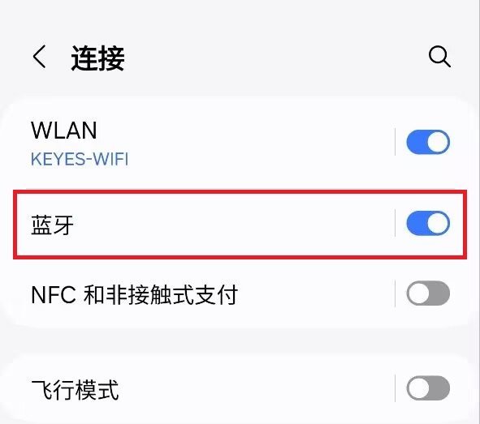

- 点击手机/平板上的APP图标，进入APP界面，显示如下图：

  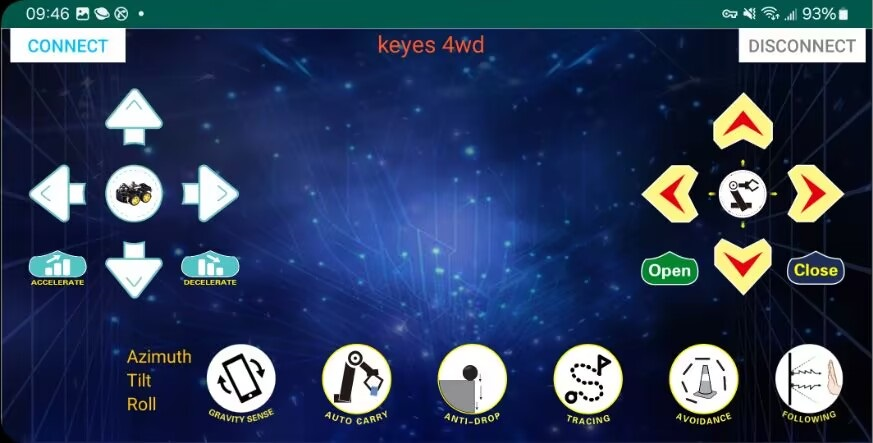

- 点击APP界面左上角的图标 “**CONNECT**”，搜索到对应的蓝牙设备（<span style="color: rgb(255, 76, 65);">**BT24**--针对UNO-PLUS版本</span> // <span style="color: rgb(0, 209, 0);">**HMSoft**--针对UNO-R3版本</span>），上下滑动找到对应的蓝牙设备（<span style="color: rgb(255, 76, 65);">**BT24**--针对UNO-PLUS版本</span> // <span style="color: rgb(0, 209, 0);">**HMSoft**--针对UNO-R3版本</span>），显示如下图：

  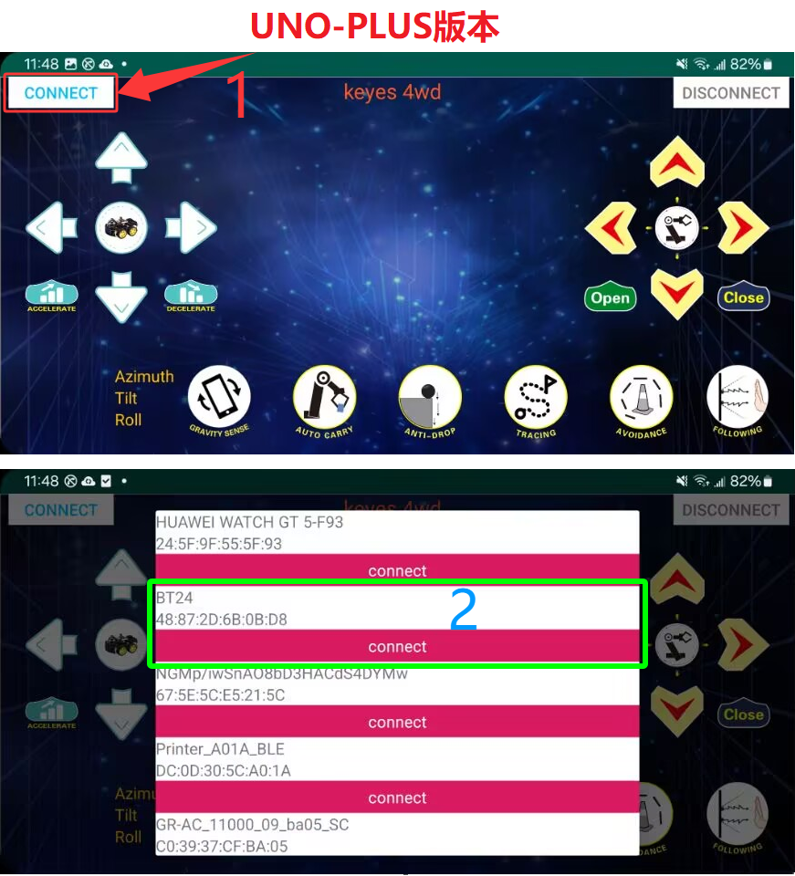

  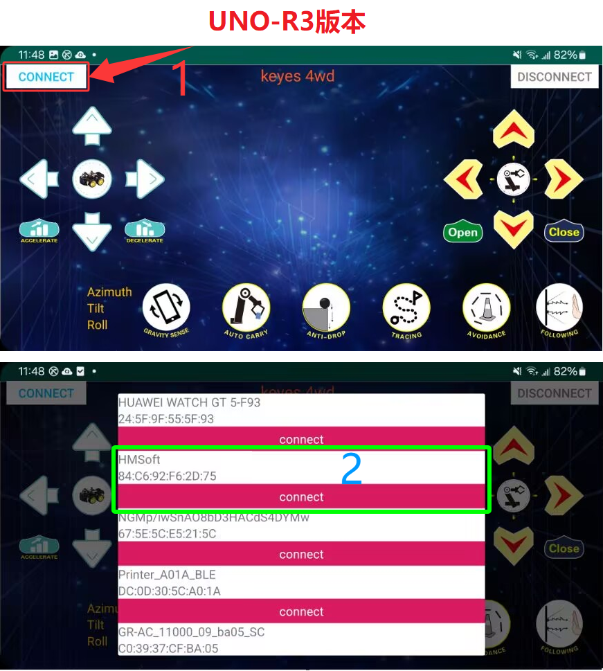

- 点击 “**connect**” 来连接蓝牙，蓝牙连接成功后，“**connect**” 字样会变成 “**is connected**” 字样，显示如下图。这时，蓝牙模块上的LED变为常亮。

  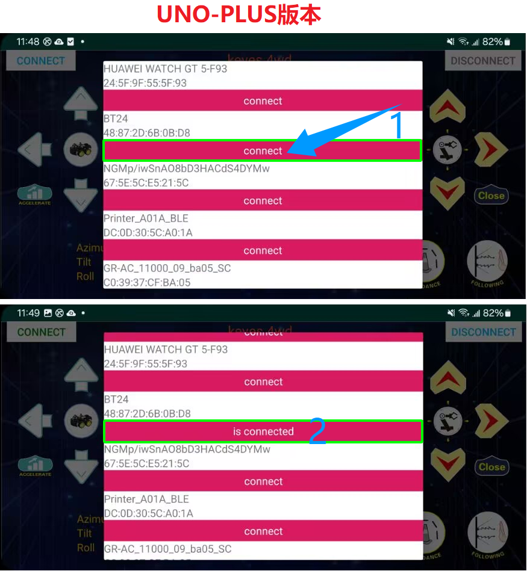

  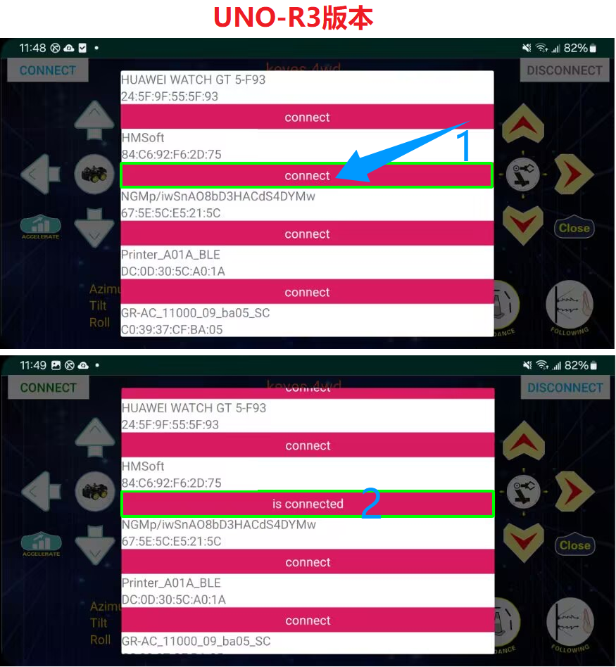

- 操控4WD智能车：

    - 按住  键，4WD智能车以中等速度前进，8x16 LED点阵屏显示向上箭头。
    
    - 按下  键（通常对应字符'a'），你会看到8x16 LED点阵屏显示向上加速图标，每次按下 键，速度都会增加（最大速度PWM：255），同时4WD智能车也会逐渐跑得越来越快。
    
    - 按下  键（通常对应字符'd'），你会看到8x16 LED点阵屏显示向下减速图标，每次按下 键，速度都会减少（最小速度PWM：0），同时4WD智能车会逐渐慢下来。
    
    - 在任何时候松开按键，小车都会立即停下，并退出加速/减速状态。

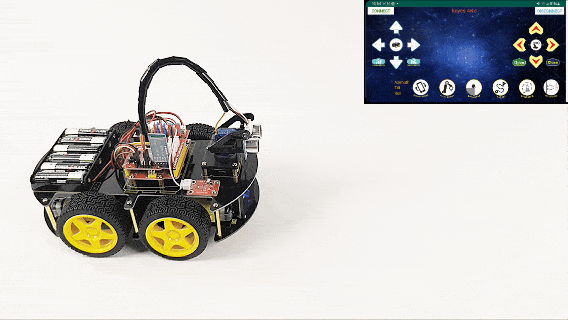  

#### 17.8 代码解析：

1\. 速度变量 `speeds`： 我们定义了一个全局变量 `int speeds = 150;`。这意味着小车启动时的默认速度是中速。所有的运动函数（前进、后退、转弯）都使用 `analogWrite(PWMA_PIN, speeds)` 来设置电机功率，而不是固定的数字。

2\. 加速与减速逻辑 (`speedUp`和`speedDown`)：这两个函数使用了 `while(1)` 无限循环。这意味着一旦进入加速或减速模式，程序会一直停留在这里，不断改变`speeds`的值。
        
- 边界保护：`if (speeds < 255)` 确保速度不会超过最大值；`if (speeds > 0)` 确保速度不会变成负数。
        
- 退出机制：在循环内部，我们不断检查 `Serial.available()`。如果用户松开对应按键（字符'S'），`break` 语句会立即跳出循环，回到主循环`loop()`，等待下一个指令。

3\. LED点阵屏反馈： 当按下加速或减速键时，8x16 LED点阵屏会显示相应的箭头图标，给用户直观的视觉反馈。

#### 17.9 注意事项：

1\. 电源充足：高速运转时电机消耗电流较大，请确保电池电量充足，否则4WD智能车可能会因为电压不足而行动迟缓或重启。
    
2\. 上传代码问题：由于蓝牙模块占用了 Arduino 的 D0 (RX) 和 D1 (TX) 引脚，在上传代码前，务必拔掉蓝牙模块的 TX 和 RX 连线，否则会出现“上传错误”。上传完成后再插回。
    
3\. 速度范围：PWM 值必须在 0-255 之间。如果代码逻辑错误导致数值溢出，电机可能无法正常工作。
   
4\.  地面摩擦：在不同的地面（如地毯、瓷砖）上，4WD智能车的实际速度感会有所不同，这是正常现象。


