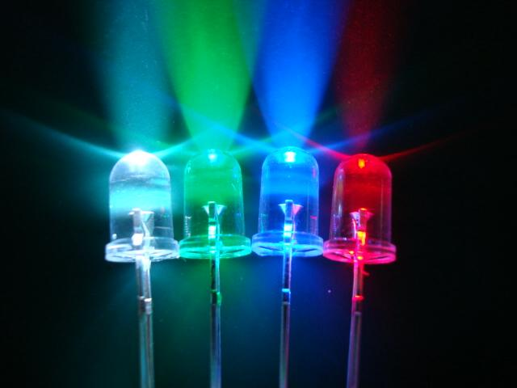
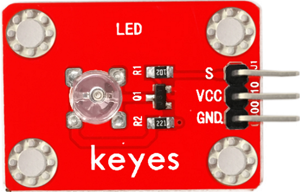
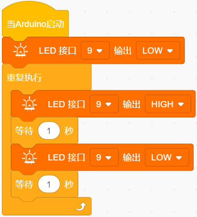
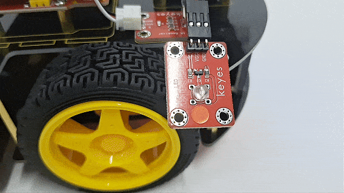
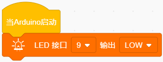
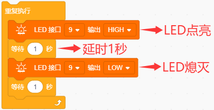
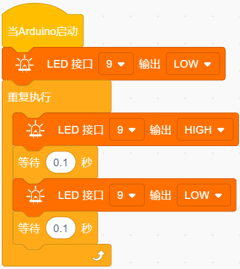

### 第02课 LED灯

#### 2.1 项目介绍：

欢迎来到 Arduino 的世界！在开始复杂的智能车控制之前，我们需要从最基础的项目入手。本课我们将完成经典的 “Arduino 点亮 LED”（也称为 Blink 项目）。

这是所有电子爱好者入门的“第一课”。通过这个项目，你将学会如何让硬件“听话”，控制它亮起和熄灭。就像学习写字要先学握笔一样，掌握 LED 的控制是后续学习传感器、电机驱动的基础。

#### 2.2 元件知识：

**什么是 LED？** 

LED 是“发光二极管”（Light Emitting Diode）的简称。它是一种能将电能转化为光能的电子元件。当电流通过它时，内部的电子与空穴复合，就会发出可见光。在生活中，LED 随处可见，比如电视屏幕、路灯、指示灯等。

**为什么使用模块？** 

为了方便实验，我们将 LED 做成了一个标准的模块。你不需要担心电阻匹配或正负极接反烧坏元件的问题，只需连接三根线即可使用。

**LED模块工作原理：**

- S (Signal/信号端)：连接到 Arduino 的数字引脚。
    
    - 当 S 端接收到 高电平 (HIGH) 时，LED 亮起。
    
    - 当 S 端接收到 低电平 (LOW) 时，LED 熄灭。

- VCC (电源正极)：连接到 5V 或 3.3V 电源。

- GND (电源负极)：连接到地线。

**LED模块参数：**

- 控制接口: 数字口 (Digital) 

- 工作电压: DC 3.3-5V

- 排针间距: 2.54mm                       

- LED显示颜色：红色

#### 2.3 项目组件：

| 组装好的智能车(未插上蓝牙模块) *1 | 草帽LED白发红模块 *1 | 3Pin 双母头杜邦线 *1  |
| --- | --- | --- | 
|  | | |
| USB线 *1 | 5号(1.5V)电池 *6（电池自备） |  |
| |  |  |

#### 2.4 接线图：

⚠️ **特别提醒：请按照以下步骤进行接线。务必确保电源关闭状态下进行接线操作。**

| LED 模块 | 电机驱动扩展板 | 
| :--: | :--: | 
| GND | G |
| VCC | 5V |
| S | S(D9) | 

⚠️ **特别注意：**

- 接线时请确保电源断开(拔掉Arduino主控板上的USB线或将电机驱动扩展板上的拨码开关拨到 “**OFF**” 端)，避免短路。

- 电源连接：电池盒电源接到电机驱动扩展板的 BAT 接口（注意正负极不要接反），端口正反面，请勿反插，否则会损坏端口。

- 电池正负极切勿接反，否则可能烧毁电机驱动扩展板。

- 电机驱动扩展板上的拨码开关拨到 “**ON**” 端。

#### 2.5 示例代码1：mixly_test1_1

⚠️ **重要提示：**

- **上传示例代码前，请务必拔掉蓝牙模块！ 因为蓝牙模块也占用Arduino的串口通信（TX/RX），如果不拔掉，示例代码上传会失败。**

#### 2.6 项目结果1：

⚠️ **重要提示：**

- **上传示例代码前，请务必拔掉蓝牙模块！ 因为蓝牙模块也占用Arduino的串口通信（TX/RX），如果不拔掉，示例代码上传会失败。**

外接电源，将电机驱动扩展板上的拨码开关拨到 “**ON**” 端，上电后。选择好正确的设备（Keyes 4WD Robot）和 对应的端口（COMxx），然后单击  按钮上传示例代码至Arduino控制板。

代码上传成功后，你应该可以看到LED闪烁起来，而且间隔的时间是1秒钟。

#### 2.7 代码说明:

**1.   初始化设置(仅执行一次)**

- 定义LED灯的引脚为D9，LED灯初始状态为熄灭。

**4.  主循环**

- 向 D9引脚 输出高电平，点亮 LED 灯。

- 向 D9引脚 输出低电平，熄灭 LED 灯。

- 让程序暂停 1 秒钟，LED 灯保持点亮或熄灭状态。

#### 2.8 示例代码2：

前面我们控制了LED模块亮1秒钟，灭一秒钟 。现在我们来拓展一下思路，通过改变delay的时间来改变LED 灯闪烁的频率。

⚠️ **重要提示：**

- **上传示例代码前，请务必拔掉蓝牙模块！ 因为蓝牙模块也占用Arduino的串口通信（TX/RX），如果不拔掉，示例代码上传会失败。**

#### 2.9 项目结果2：

⚠️ **重要提示：**

- **上传示例代码前，请务必拔掉蓝牙模块！ 因为蓝牙模块也占用Arduino的串口通信（TX/RX），如果不拔掉，示例代码上传会失败。**

外接电源，将电机驱动扩展板上的拨码开关拨到 “**ON**” 端，上电后。选择好正确的设备（Keyes 4WD Robot）和 对应的端口（COMxx），然后单击  按钮上传示例代码至Arduino控制板。

代码上传成功后，看看这个LED灯闪烁的频率是不是比之前快了？

怎么样是不是很好理解，就是通过改变 `delay()` 这个代码的时间，来改变LED亮和灭的频率。

