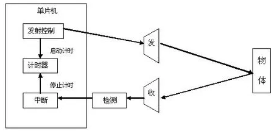
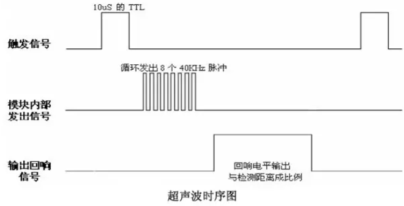
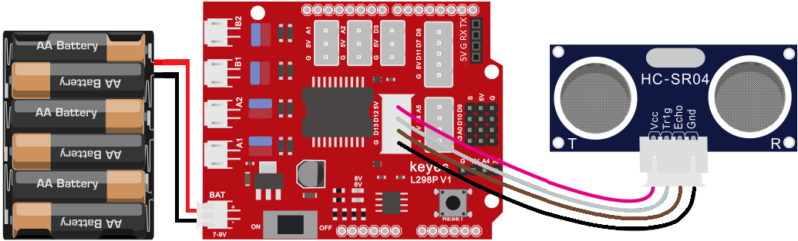
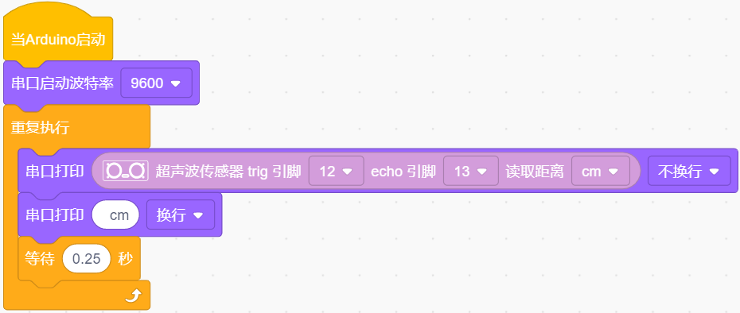
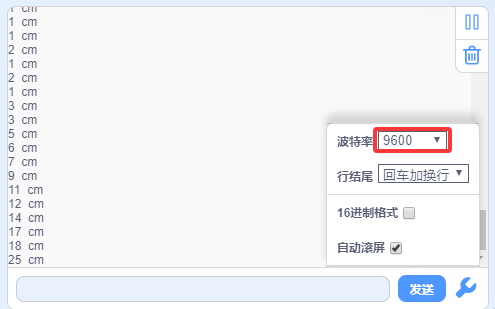
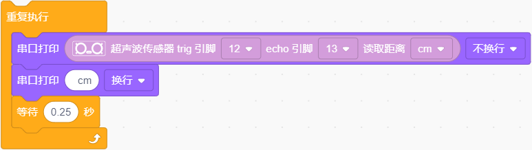
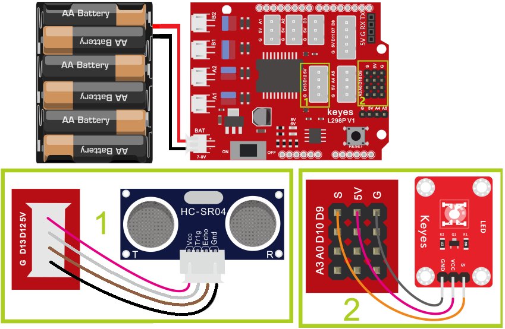
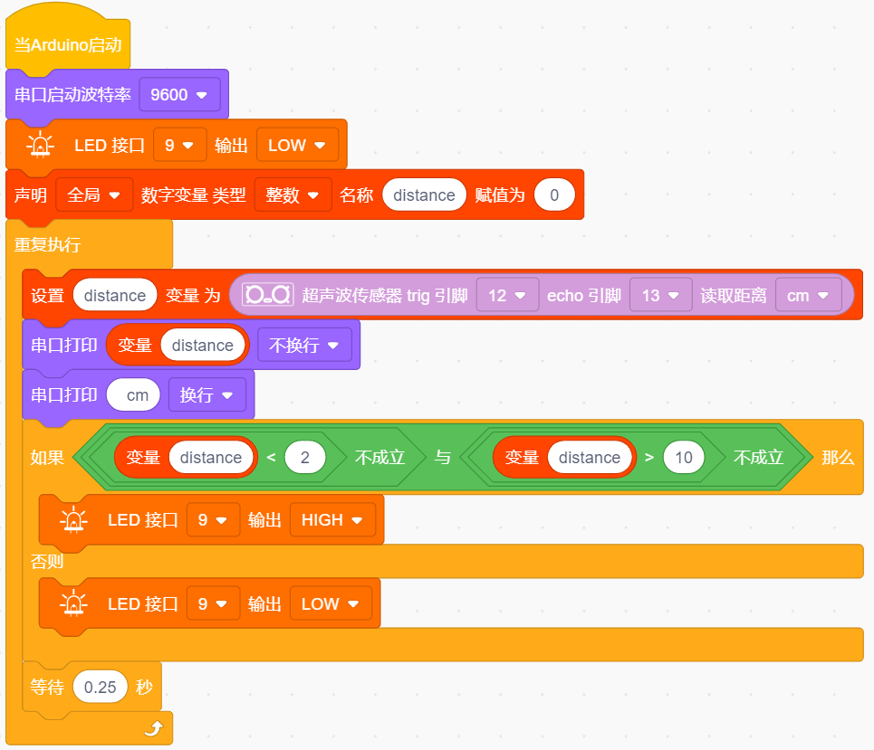
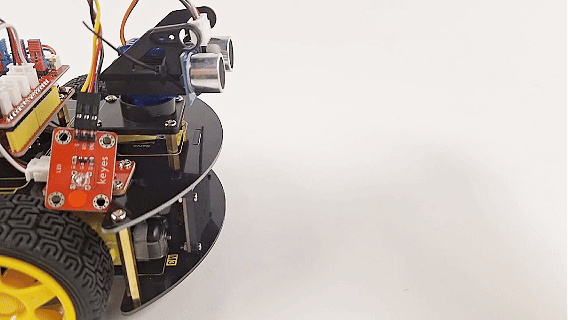

### 第06课 超声波模块

#### 6.1 项目介绍：

想象一下，蝙蝠在黑暗中飞行时为什么不会撞到墙壁？因为它们会发出人耳听不到的超声波，并通过接收回声来判断障碍物的位置。这就是“回声定位”。

在本课中，我们将使用 HC-SR04 超声波传感器，它就像电子蝙蝠的“眼睛”。它可以非接触地测量物体与传感器之间的距离，并且读数非常稳定。我们将学习如何利用 Arduino 开发板读取这些数据，并在电脑上显示出来，甚至用它来控制 LED 灯的亮灭，实现简单的避障或报警功能。

#### 6.2 元件知识：

**超声波传感器:** 可以检测前方是否存在障碍物，并且检测出传感器与障碍物的详细距离。传感器主要用到CS100A芯片，它同时兼营3.3V与5V工作电压。最大测试距离为3米（实际受各种环境因素的影响，一般很难达到3米的）；盲区小于4CM。

它的测距原理和蝙蝠飞行的原理一样，就是超声波模块发送出一种频率很高，人体无法听到的超声波信号。这些超声波的信号若是碰到障碍物，就会立刻反射回来，在接收到返回的信息之后，通过判断发射信号和接收信号的时间差，计算出传感器和障碍物的距离。

**超声波参数：**

- 工作电压: DC 5V

- 静态电流: <2mA

- 工作电流: 50mA~100mA，正常为65mA

- 最大功率：0.5W

- 最大探测距离：3m

- 盲区：小于4cm

- 感应角度：不大于15度

-  触发输入信号：10us TTL脉冲

**工作原理：**

最常用的超声测距的方法是回声探测法。当有脉冲电压触发时（单片机给Trig引脚发送高电平），超声波发射器探头里的晶片就会振动，继而产生超声波。在超声波发射时刻的同时计数器开始计时，超声波在空气中传播，途中碰到障碍物面阻挡就立即反射回来（Echo引脚发送高电平信号给单片机），超声波接收器收到反射回的超声波就立即停止计时。

超声波是一种声波，其声速V与温度有关。一般情况下超声波在空气中的传播速度为340m/s，根据计时器记录的时间t，就可以计算出超声波探头发射点距障碍物面的距离s，即：s=340t/2 。

HC-SR04超声波测距模块可提供范围为2厘米至3米的非接触式距离感测功能，测距精度可达高到3mm。超声波传感器包括超声波发射器、超声波接收器与控制电路。其基本工作原理：

(1) 采用IO口Trig触发测距，给至少10us的高电平信号;

(2) 模块自动发送8个40khz的方波，自动检测是否有信号返回；

(3) 有信号返回，通过IO口Echo输出一个高电平，高电平持续的时间就是超声波从发射到返回的时间；

(4) 距离 =（高电平时间 x 声速（340M/S）） / 2

⚠️ **注意:**

此模块不应在通电时连接，如有必要，先连接模块的 GND。否则，会影响模块的工作。

被测物体的面积应至少为 0.5 平方米，并尽可能平坦。否则，它会影响结果。

#### 6.3 项目组件：

| 组装好的智能车(未插上蓝牙模块) *1 | 草帽LED白发红模块 *1 | 3Pin 双母头杜邦线 *1  |
| --- | --- | --- | 
|  | | |
| USB线 *1 | 5号(1.5V)电池 *6（电池自备） |  |
| |  |  |

#### 6.4 接线图：

⚠️ 特别注意：4WD智能车已经组装好了，这里不需要把超声波传感器拆下来又重新组装和接线，这里再次提供接线图，是为了方便您编写代码！

| 超声波传感器 | 电机驱动扩展板 | 
| :--: | :--: | 
| Vcc | 5V |
| Trig | D12 |
| Echo | D13 | 
| Gnd | G |

⚠️ **特别注意：**

- 接线时请确保电源断开(拔掉Arduino主控板上的USB线或将电机驱动扩展板上的拨码开关拨到 “**OFF**” 端)，避免短路。

- 电源连接：电池盒电源接到电机驱动扩展板的 BAT 接口（注意正负极不要接反），端口正反面，请勿反插，否则会损坏端口。

- 电池正负极切勿接反，否则可能烧毁电机驱动扩展板。

- 电机驱动扩展板上的拨码开关拨到 “**ON**” 端。

#### 6.5 示例代码 1：基础测距

编写代码读取距离并在串口监视器中显示。

⚠️ **重要提示：**

- **上传示例代码前，请务必拔掉蓝牙模块！ 因为蓝牙模块也占用Arduino的串口通信（TX/RX），如果不拔掉，示例代码上传会失败。**

#### 6.6 项目结果1：

⚠️ **重要提示：**

- **上传示例代码前，请务必拔掉蓝牙模块！ 因为蓝牙模块也占用Arduino的串口通信（TX/RX），如果不拔掉，示例代码上传会失败。**

外接电源，将电机驱动扩展板上的拨码开关拨到 “**ON**” 端，上电后。选择好正确的设备（Keyes 4WD Robot）和 对应的端口（COMxx），然后单击  按钮上传示例代码至Arduino控制板。

代码上传成功后，单击Mixly IDE左上角的，出现串口监视器窗口，设置串口波特率为 9600。，我们可以看到超声波模块显示的距离，单位是厘米。用手阻挡超声波模块，我们看到显示距离的数值变小了。

#### 6.7 代码说明:

- **作用**：初始化串口通信。

- **解释**：就像打电话前要拨号一样，这行代码告诉 Arduino 以 9600 的速率（波特率）与电脑进行“对话”。只有两边速率一致，才能正确传输数据。

- **作用**：读取距离值，将超声波传感器读取的距离值串口打印在串口监视器，距离单位：厘米。

#### 6.8 示例代码2：距离报警

我们刚刚测出了超声波显示的距离，那我们动动脑筋，能不能用测出的距离来做一些控制呢？当然是可以的，那么接下来使用测出的距离来控制一个LED灯的亮和灭。

**硬件连接：**

⚠️ 特别注意：4WD智能车已经组装好了，这里不需要把超声波传感器拆下来又重新组装和接线，这里再次提供接线图，是为了方便您编写代码！但是，LED模块是需要你自己接线的。

| 超声波传感器 | 电机驱动扩展板 | 
| :--: | :--: | 
| Vcc | 5V |
| Trig | D12 |
| Echo | D13 | 
| Gnd | G |

| LED 模块 | 电机驱动扩展板 | 
| :--: | :--: | 
| GND | G |
| VCC | 5V |
| S | S(D9) |

⚠️ **特别注意：**

- 接线时请确保电源断开(拔掉Arduino主控板上的USB线或将电机驱动扩展板上的拨码开关拨到 “**OFF**” 端)，避免短路。

- 电源连接：电池盒电源接到电机驱动扩展板的 BAT 接口（注意正负极不要接反），端口正反面，请勿反插，否则会损坏端口。

- 电池正负极切勿接反，否则可能烧毁电机驱动扩展板。

- 电机驱动扩展板上的拨码开关拨到 “**ON**” 端。

⚠️ **重要提示：**

- **上传示例代码前，请务必拔掉蓝牙模块！ 因为蓝牙模块也占用Arduino的串口通信（TX/RX），如果不拔掉，示例代码上传会失败。**

#### 6.9 项目结果2：

⚠️ **重要提示：**

- **上传示例代码前，请务必拔掉蓝牙模块！ 因为蓝牙模块也占用Arduino的串口通信（TX/RX），如果不拔掉，示例代码上传会失败。**

外接电源，将电机驱动扩展板上的拨码开关拨到 “**ON**” 端，上电后。选择好正确的设备（Keyes 4WD Robot）和 对应的端口（COMxx），然后单击  按钮上传示例代码至Arduino控制板。

当你的手或物体靠近传感器（距离小于等于 10 厘米且大于等于 2 厘米）时，连接在引脚 9 的 LED 灯会亮起；当你移开物体，距离变远时，LED 灯会自动熄灭。这就模拟了一个简单的倒车雷达或避障警报系统！

