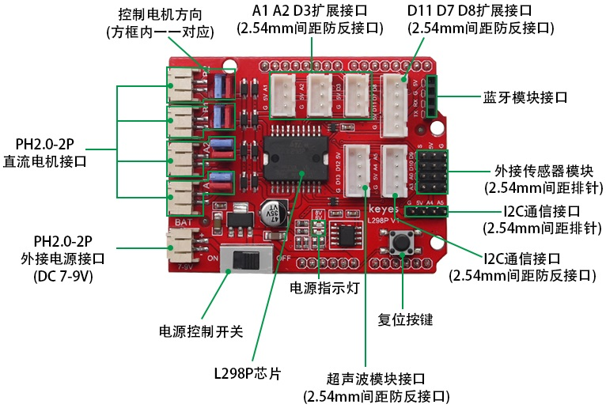
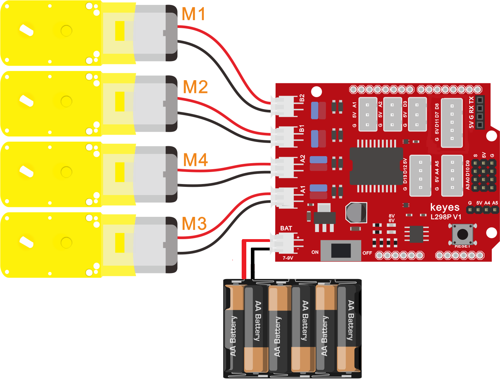
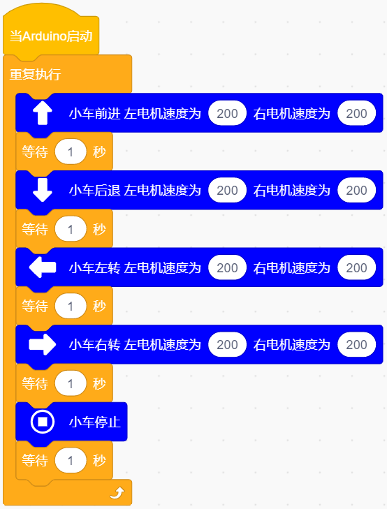
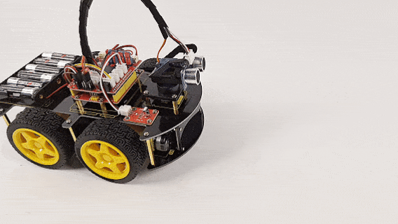
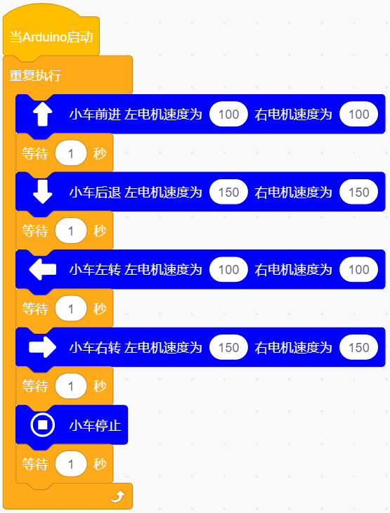

### 第09课 电机的驱动和调速

#### 9.1 项目介绍：

想要让智能小车跑起来，光有电机是不够的，我们还需要一个“大力士”来帮Arduino控制电机。这个“大力士”就是电机驱动模块。

在本课中，我们将学习如何使用 L298P 电机驱动扩展板。L298P 是一款非常经典且强大的电机驱动芯片，它可以同时驱动两个直流电机，最大电流可达 2A。通过它，我们可以轻松控制小车的前进、后退、转弯以及速度。

#### 9.2 元件知识：

为了简化接线，我们使用了一款基于 L298P 设计的电机驱动扩展板。这块板子可以直接插接在 Arduino 开发板上（就像戴帽子一样），这种设计叫做 “Shield（盾板）” 或 “扩展板”。

#### 9.3 驱动原理与控制逻辑：

**1\. 引脚定义**

根据扩展板的电路设计，Arduino 与电机的连接关系如下：

| 电机通道 | 方向控制引脚 (Digital) | 速度控制引脚 (PWM)|对应物理电机 |
| :--: | :--: | :--: | :--: |
| 电机 A | D2 | D6 | M3, M4 (右侧电机) |
| 电机 B | D4 | D5 | M1, M2 (左侧电机) |

**注意：** 不同批次的小车电机编号可能不同，请以实际接线为准。通常 A 组(A1/A2)控制一侧的两个电机并联，B 组(B1/B2)控制另一侧的两个电机并联。

**2\. 运动逻辑表**

通过组合方向引脚的高低电平和速度引脚的 PWM 值，我们可以实现各种动作。PWM 值的范围是 0-255，数值越大，电机转速越快。

| 动作 | D2(方向A) | D6 (速度A) | 电机A状态 | D4 (方向B) | D5(速度B) | 电机B状态 |
| --- | --- | --- | --- | --- | --- | --- |
| 前进 | HIGH | 200 | 正转 | HIGH | 200 | 正转 |
| 后退 | LOW | 200 | 反转 | LOW | 200 | 反转 |
| 左旋转 | HIGH | 200 | 正转 | LOW | 200 | 反转 |
| 右旋转 | LOW | 200 | 反转 | HIGH | 200 | 正转 |
| 停止 | / | 0 | 停止 | / | 0 | 停止 |

- 右旋转原理：左侧电机正转，右侧电机反转，车身向右原地旋转。

- 左旋转原理：左侧电机反转，右侧电机正转，车身向左原地旋转。

#### 9.4 项目组件：

| 组装好的智能车(未插上蓝牙模块) *1 |USB线 *1 | 5号(1.5V)电池 *6（电池自备） |
| --- | --- | --- | --- |
|  | |  |

#### 9.5 接线图：

⚠️ 特别注意：4WD智能车已经组装好了，这里不需要把4个电机拆下来又重新组装和接线，这里再次提供接线图，是为了方便您编写代码！

| 电机 | 电机驱动扩展板 | 
| :--: | :--: | 
| 左侧电机（M1） | B2 |
| 左侧电机（M2） | B1 |
| 右侧电机（M3） | A1 |
| 右侧电机（M4） | A2 | 

⚠️ **特别注意：**

- 接线时请确保电源断开(拔掉Arduino主控板上的USB线或将电机驱动扩展板上的拨码开关拨到 “**OFF**” 端)，避免短路。

- 电源连接：电池盒电源接到电机驱动扩展板的 BAT 接口（注意正负极不要接反），端口正反面，请勿反插，否则会损坏端口。

- 电池正负极切勿接反，否则可能烧毁电机驱动扩展板。

- 电机驱动扩展板上的拨码开关拨到 “**ON**” 端。

- 电机线如果接反导致方向不对，可以通过交换电机两根线的位置，或者修改代码中的高低电平来修正。

#### 9.6 示例代码1：基础运动控制

**基础运动：以固定速度（PWM 200）测试前进、后退、左转、右转。**

⚠️ **重要提示：**

- **上传示例代码前，请务必拔掉蓝牙模块！ 因为蓝牙模块也占用Arduino的串口通信（TX/RX），如果不拔掉，示例代码上传会失败。**

#### 9.7 项目结果1：

⚠️ **重要提示：**

- **上传示例代码前，请务必拔掉蓝牙模块！ 因为蓝牙模块也占用Arduino的串口通信（TX/RX），如果不拔掉，示例代码上传会失败。**

外接电源，将电机驱动扩展板上的拨码开关拨到 “**ON**” 端，上电后。选择好正确的设备（Keyes 4WD Robot）和 对应的端口（COMxx），然后单击  按钮上传示例代码至Arduino控制板。

代码上传成功后，小车将按照 “前进 -> 后退 -> 左转 -> 右转 -> 停止” 的顺序循环动作，每个动作持续 1 秒，速度较快且均匀。

#### 9.8 代码说明：

电机的旋转方向取决于电流的方向。L298P 芯片通过改变内部开关的状态来改变电流方向。我们只需要向方向引脚（D2, D4）发送高电平（HIGH）或低电平（LOW）即可控制正反转。

Arduino 的数字引脚只能输出 0V 或 5V，无法直接输出中间电压。但是，通过 PWM（脉冲宽度调制） 技术，我们可以快速地在 0V 和 5V 之间切换。

- PWM 值范围：0 ~ 255。

- 0：相当于始终为 0V，电机停止。

- 255：相当于始终为 5V（逻辑电平，实际驱动电压取决于外部电源），电机全速运转。

- 中间值：数值越大，高电平占比越高，电机平均电压越高，转速越快。

**注意：** 只有标有波浪号 "~" 的引脚（如: D3、D5、D6、D9、D10、D11）才支持 PWM 功能。本课使用的 D5 和 D6 正好具备此功能。

#### 9.9 示例代码2：变速运动控制

在这个代码中，我们降低了 PWM 值，并让转弯时的速度与直行不同，体验速度控制的效果。同时，电机的接线不变。

⚠️ **重要提示：**

- **上传示例代码前，请务必拔掉蓝牙模块！ 因为蓝牙模块也占用Arduino的串口通信（TX/RX），如果不拔掉，示例代码上传会失败。**

#### 9.10 项目结果2：

⚠️ **重要提示：**

- **上传示例代码前，请务必拔掉蓝牙模块！ 因为蓝牙模块也占用Arduino的串口通信（TX/RX），如果不拔掉，示例代码上传会失败。**

外接电源，将电机驱动扩展板上的拨码开关拨到 “**ON**” 端，上电后。选择好正确的设备（Keyes 4WD Robot）和 对应的端口（COMxx），然后单击  按钮上传示例代码至Arduino控制板。

代码上传成功后，小车将按照 “前进 -> 后退 -> 左转 -> 右转 -> 停止” 的顺序循环动作，每个动作持续 1 秒，你会发现小车的整体速度变慢了。

这是因为我们将 PWM 值从 200 降低到了 100 和 150。PWM 值越小，电机获得的平均电压越低，转速也就越慢。

#### 9.11 注意事项与常见问题：

**1\. 电机不动？**

- 检查电池是否有电，电压是否在 7-9V 之间。

- 检查电机驱动扩展板是否牢固地插在 Arduino 上。

- 检查电机接线是否接触良好。
    
    
**2\. 小车走不直？**
        
由于电机个体差异，即使给相同的 PWM 值，两边转速也可能不同。后续课程我们将学习如何通过软件调整左右电机的 PWM 差值来校正直线行驶。
    
**3\. 发热问题**
        
L298P芯片在大电流工作时会产生热量，这是正常现象。如果长时间堵转（车轮被卡住），芯片会过热保护甚至损坏，请避免长时间堵转。
