### 第10课 LED表情灯板

#### 10.1 项目介绍：

如果在我们的机器人上加一块表情面板，会非常有趣。8x16 LED点阵可以满足需求，能自己创建面部表情、动画等。微处理器（Arduino）通过两线总线接口与AiP1640通讯，控制点阵上128个LED的亮灭来显示图案。

#### 10.2 元件知识：

**1\. 如何控制每一个 LED？**

8x16 点阵共有 128 个 LED。为了简化控制，我们将这 128 个灯分为 16 列，每列有 8 个灯。 在计算机中，一个字节（Byte）由 8 位（Bit）组成，每一位可以是 0 或 1。

- 1 代表 LED 亮

- 0 代表 LED 灭

因此，1 个字节的数据正好可以控制 1 列（8个）LED 的状态。要控制整个 8x16 点阵，我们需要发送 16 个字节的数据，分别对应 16 列。

**接口说明及通讯协议**

微处理器（Arduino）通过两线总线接口与AiP1640通讯。通讯协议图中，(SCLK)为SCL，(DIN)为SDA：

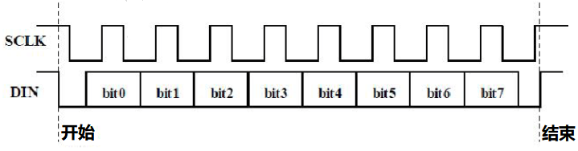

- ①数据输入开始条件：SCL为高电平，SDA由高变低。

- ②数据命令设置：示例程序中选择 “地址自动加1” 方式，二进制为0100 0000，对应十六进制0x40。

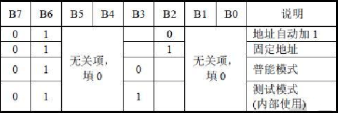

- ③地址命令设置：示例程序中选择第一个00H，二进制为1100 0000，对应十六进制0xc0。

- ④数据输入：SCL为高电平时SDA信号保持不变，低电平时可改变，数据输入低位在前、高位在后传输。

- ⑤数据传输结束条件：SCL为低时SDA为低，SCL变高时SDA变高。

- ⑥显示控制：示例中选择脉宽为4/16，十六进制为0x8A。

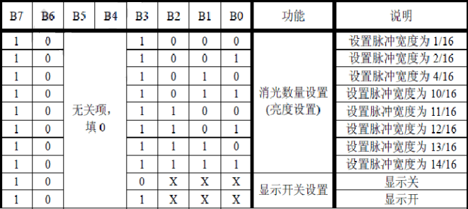

**取模工具的使用说明**

设置时，我们需要把一个图案转换成1组16个的16位数据，这里就需要用到一个取模软件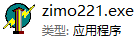，这个软件已放入资料文件夹中。使用时打开图标，显示如下图。

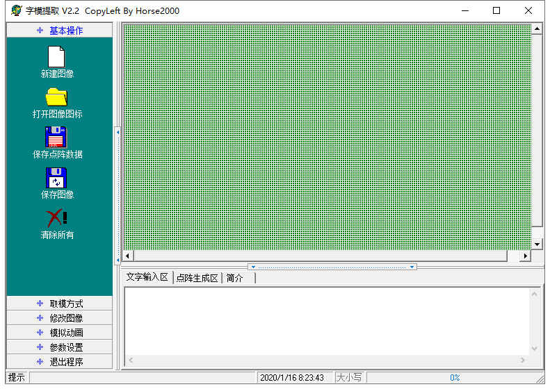

点击 “**新建图案**” ，根据显示屏规格，设置宽度为16，高度为8，如下图。

初始时发现格点不大，不方便设置，我们可以通过点击 “**模拟动画**” 设置格点大小，点击“放大格点” 来放大格点。如下图。

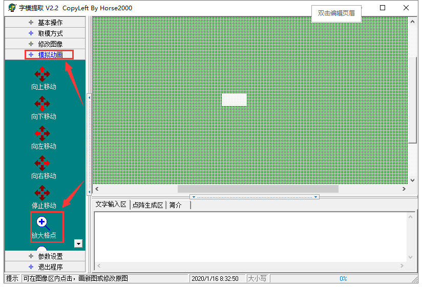

一直鼠标左键点击，就可以一直放大格点了。放大后，我们就可以通过用鼠标点击白色区域，设置显示图案了。

设置时，鼠标点击（左右键都可以）白色格点，变为黑色；再点击黑色格点，变为白色。黑色代表该格点显示亮起，白色代表格点不显示。显示屏最多能设置16*8个点显示。设置笑脸显示如下图。

点击 “**参数设置**”，选择 “**其他选项**”，设置如下图。设置完成点击 “**确定**” 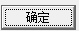。

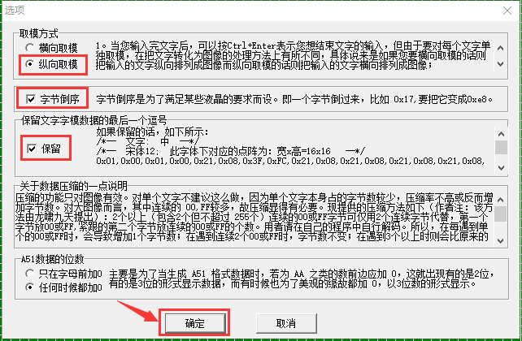

点击 “**取模方式**”，选择 “**C51格式**”。如下图：

设置成功后，在以下区域就可以看到对应的16个数据了，只需要将数据复制粘贴在数组中，就可以用直接调用了。（0x00,0x00,0x1C,0x02,0x02,0x02,0x5C,0x40,0x40,0x5C,0x02,0x02,0x02,0x1C,0x00,0x00）

**规格参数：**

- 工作电压: DC 3.3-5V

- 功率损耗：400mW

- 震荡频率：450KHz

- 驱动电流：200mA

- 通信方式：I2C通信

#### 10.3 项目组件：

| 组装好的智能车(未插上蓝牙模块) *1 |USB线 *1 | 5号(1.5V)电池 *6（电池自备） |
| --- | --- | --- | --- |
| 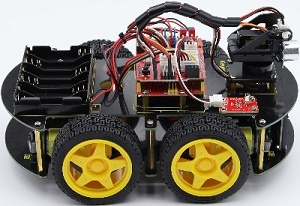 | 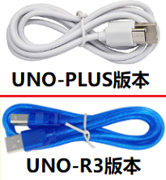|  |

#### 10.4 接线图：

⚠️ 特别注意：4WD智能车已经组装好了，这里不需要把8x16 LED点阵模块拆下来又重新组装和接线，这里再次提供接线图，是为了方便您编写代码！

| 8x16 LED点阵模块 | 电机驱动扩展板 | 
| :--: | :--: | 
| GND | G |
| VCC | 5V |
| SDA | A4 | 
| SCL | A5 |

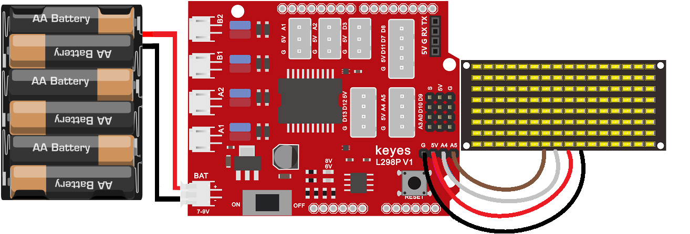

⚠️ **特别注意：**

- 接线时请确保电源断开(拔掉Arduino主控板上的USB线或将电机驱动扩展板上的拨码开关拨到 “**OFF**” 端)，避免短路。

- 电源连接：电池盒电源接到电机驱动扩展板的 BAT 接口（注意正负极不要接反），端口正反面，请勿反插，否则会损坏端口。

- 电池正负极切勿接反，否则可能烧毁电机驱动扩展板。

- 电机驱动扩展板上的拨码开关拨到 “**ON**” 端。

#### 10.5 示例代码1：显示静态笑脸

这段代码将在点阵上显示一个固定的笑脸图案。

⚠️ **重要提示：**

- **上传示例代码前，请务必拔掉蓝牙模块！ 因为蓝牙模块也占用Arduino的串口通信（TX/RX），如果不拔掉，示例代码上传会失败。**

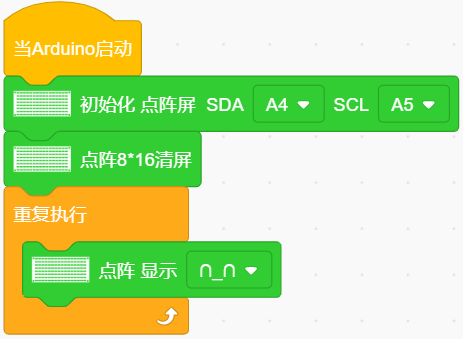

#### 10.6 项目结果1：

⚠️ **重要提示：**

- **上传示例代码前，请务必拔掉蓝牙模块！ 因为蓝牙模块也占用Arduino的串口通信（TX/RX），如果不拔掉，示例代码上传会失败。**

外接电源，将电机驱动扩展板上的拨码开关拨到 “**ON**” 端，上电后。选择好正确的设备（Keyes 4WD Robot）和 对应的端口（COMxx），然后单击  按钮上传示例代码至Arduino控制板。

代码上传成功后，你将看到 8x16 LED 点阵上显示出一个清晰的笑脸图案。

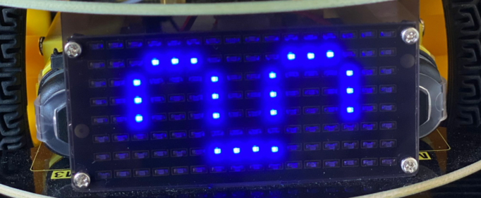

#### 10.7 示例代码2：动态表情动画

既然我们可以显示静态图案，那么快速切换不同的图案就能形成动画效果。让我们尝试让点阵依次显示：“前进”、“后退”、“停止” 图案，然后 “清屏”，每个状态停留 2 秒。 

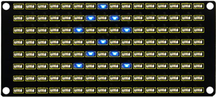

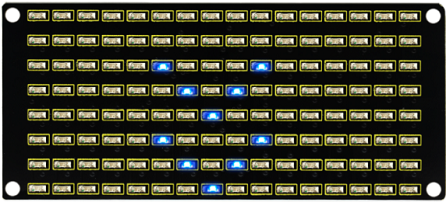

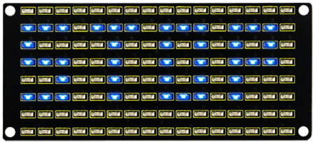

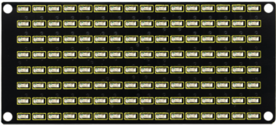

利用取模工具得到要显示的图形代码:

- 爱心 (Heart):

- 前进 (Front): 

- 后退 (Back): 

- 左转 (Left): 

- 右转 (Right): 

- 停止 (Stop): 

- 清屏 (Clear): 

**接线图保持不变：**

⚠️ **重要提示：**

- **上传示例代码前，请务必拔掉蓝牙模块！ 因为蓝牙模块也占用Arduino的串口通信（TX/RX），如果不拔掉，示例代码上传会失败。**

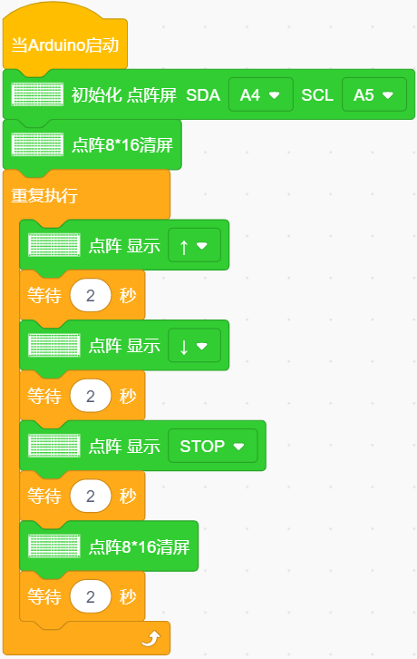

#### 10.8 项目结果2：

⚠️ **重要提示：**

- **上传示例代码前，请务必拔掉蓝牙模块！ 因为蓝牙模块也占用Arduino的串口通信（TX/RX），如果不拔掉，示例代码上传会失败。**

外接电源，将电机驱动扩展板上的拨码开关拨到 “**ON**” 端，上电后。选择好正确的设备（Keyes 4WD Robot）和 对应的端口（COMxx），然后单击  按钮上传示例代码至Arduino控制板。

代码上传成功后，8x16 LED 点阵上显示 “前进”、“后退”、“停止” 图案，然后清屏，循环进行。

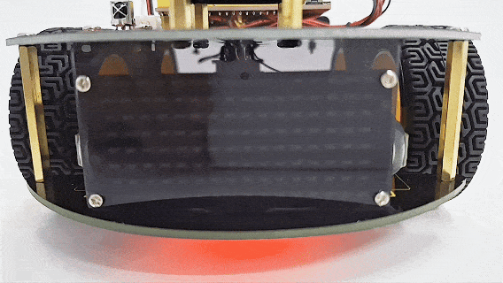

#### 10.9 代码解释：

- 初始化8x16 LED 点阵的引脚。

- 清屏。

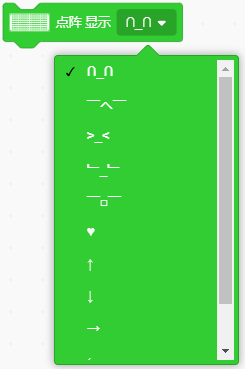

- 有很多选项，可以选择任意一种。
