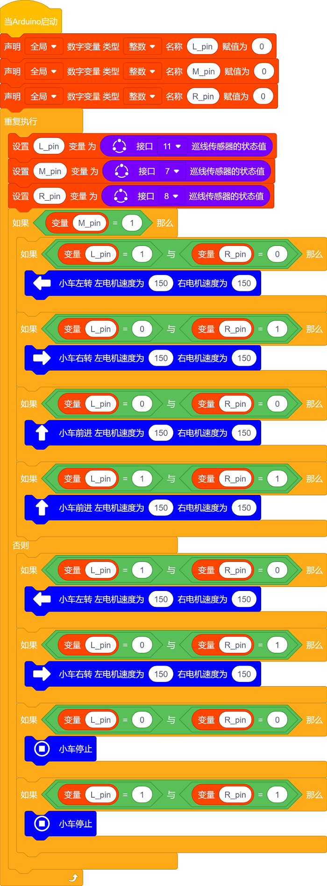
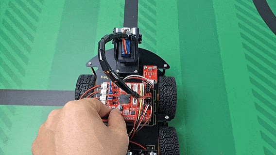

## 第12课 循线智能车

### 12.1 项目介绍：

在前面的课程中，我们学习了如何制作“画地为牢”智能车。今天，我们将结合之前的知识，挑战一个更有趣的项目——循迹智能车。
想象一下，如果地面上有一条黑色的轨道，小车能不能像火车一样，自动沿着轨道行驶而不偏离呢？这就是我们要实现的目标！

### 12.2 工作原理：

智能车底部安装了三个“眼睛”（循迹传感器），分别位于左侧、中间和右侧。

- 黑线会吸收光线，传感器接收到的反射光很少，输出高电平（1）。
- 白色地面会反射光线，传感器接收到的反射光很多，输出低电平（0）。

Arduino 主控板会根据这三个传感器的状态，判断小车相对于黑线的位置，并指挥左右两组电机做出相应的动作（前进、左转、右转或停止），从而让小车稳稳地走在黑线上。

### 12.3 逻辑分析

为了让小车走直线，我们需要根据传感器的反馈制定一套“交通规则”。以下是具体的判断逻辑：

| 中间传感器 | 左边传感器 | 右边传感器 | 小车状态分析 | 执行动作 |
| :--: | :--: | :--: | :--: | :--: |
|检测到黑线 (1) | 白线 (0) |白线 (0) | 小车正对黑线中心 | 前进 |
|检测到黑线 (1) |黑线 (1)| 白线 (0) | 小车偏右，需要向左修正 | 左转 |
|检测到黑线 (1) | 白线 (0) |黑线 (1)| 小车偏左，需要向右修正 | 右转 |
|检测到黑线 (1) |黑线 (1)| 黑线 (1)| 遇到十字路口或T型路口 | 前进 |
|未检测到黑线 (0) | 黑线 (1) |白线 (0)|严重偏离，车身在右侧 | 左转找回路线|
|未检测到黑线 (0)| 白线 (0) | 黑线 (1) | 严重偏离，车身在左侧 |右转找回路线 |
|未检测到黑线 (0) | 白线 (0) | 白线 (0) |完全脱离轨道 | 停止 |
|未检测到黑线 (0) | 黑线 (1) |黑线 (1) | 到达终点或特殊标记 | 停止|

**注意：** 不同品牌的循迹模块对黑/白的电平定义可能相反。本教程基于检测到黑线输出高电平（1），检测到白线输出低电平（0）的模块进行编写。如果你的模块相反，请调整代码中的判断条件。

### 12.4 项目组件：

| 组装好的智能车(未插上蓝牙模块) *1 |USB线 *1 | 5号(1.5V)电池 *6（电池自备） |
| --- | --- | --- | --- |
|  | |  |

### 12.5 接线图：

⚠️ 特别注意：4WD智能车已经组装好了，这里不需要把三路循迹模块和4个电机拆下来又重新组装和接线，这里再次提供接线图，是为了方便您编写代码！

| 三路循迹模块 | 电机驱动扩展板 | 
| :--: | :--: | 
| S1右侧(R) | D8 |
| S2中间(M) | D7 |
| S3左侧(L) | D11 | 
| V | 5V |
| G | G |

| 电机 | 电机驱动扩展板 | 
| :--: | :--: | 
| 左侧电机（M1） | B2 |
| 左侧电机（M2） | B1 |
| 右侧电机（M3） | A1 |
| 右侧电机（M4） | A2 | 

⚠️ **特别注意：**

- 接线时请确保电源断开(拔掉Arduino主控板上的USB线或将电机驱动扩展板上的拨码开关拨到 “**OFF**” 端)，避免短路。

- 电源连接：电池盒电源接到电机驱动扩展板的 BAT 接口（注意正负极不要接反），端口正反面，请勿反插，否则会损坏端口。

- 电池正负极切勿接反，否则可能烧毁电机驱动扩展板。
 

### 12.6 示例代码：

⚠️ **重要提示：**

- **上传示例代码前，请务必拔掉蓝牙模块！ 因为蓝牙模块也占用Arduino的串口通信（TX/RX），如果不拔掉，示例代码上传会失败。**

### 12.7 项目结果：

⚠️ **重要提示：**

- **上传示例代码前，请务必拔掉蓝牙模块！ 因为蓝牙模块也占用Arduino的串口通信（TX/RX），如果不拔掉，示例代码上传会失败。**

外接电源，将电机驱动扩展板上的拨码开关拨到 “**OFF**” 端。选择好正确的设备（Keyes 4WD Robot）和 对应的端口（COMxx），然后单击  按钮上传示例代码至Arduino控制板。

1\. 铺设轨道：使用黑色电工胶带在白地板或白纸上贴出一条平滑的黑色轨道。建议先贴直线，再尝试贴弯道。
    
2\. 放置小车：将4WD智能车放在起跑线上，确保三路循迹传感器模块上的中间传感器正对着黑线。
    
3\. 上电运行：将电机驱动扩展板上的拨码开关拨到 “**ON**” 端。上电后，观察4WD智能车是否沿着黑线平稳行驶。
    

### 12.8 常见问题排查：
        
- 4WD智能车不走：检查电池是否有电，驱动板开关是否打开，电机接线是否牢固。

- 4WD智能车反向跑：检查电机接线是否接反，或者代码中 `HIGH/LOW` 的逻辑是否与你的电机驱动板匹配。

- 总是冲出轨道：
   
   - 可能是速度太快，尝试将代码中的 `150` 改小（如 `100`）。
   
   - 可能是传感器灵敏度问题，调节循迹模块上的蓝色电位器，直到指示灯在黑线上亮、白线上灭。

- 左右颠倒：如果4WD智能车该左转时却右转，交换代码中`turnLeft`和`turnRight`函数里的电机控制逻辑，或者交换左右电机的接线。

### 12.9 代码解释：

1\ 引脚定义：我们使用了 `const int` 来定义引脚号，这样如果以后接线变了，只需要修改顶部的定义，不用去代码里到处找数字。

2\. 函数封装：我们将4WD智能车的动作（前进`advance`、后退`back`、左转`turnLeft`、右转`turnRight`、停止`stopCar`）写成了独立的函数。这样做可以让主程序 `loop()` 看起来非常清晰，就像在读故事一样：“如果左边偏了，就调用左转函数”。