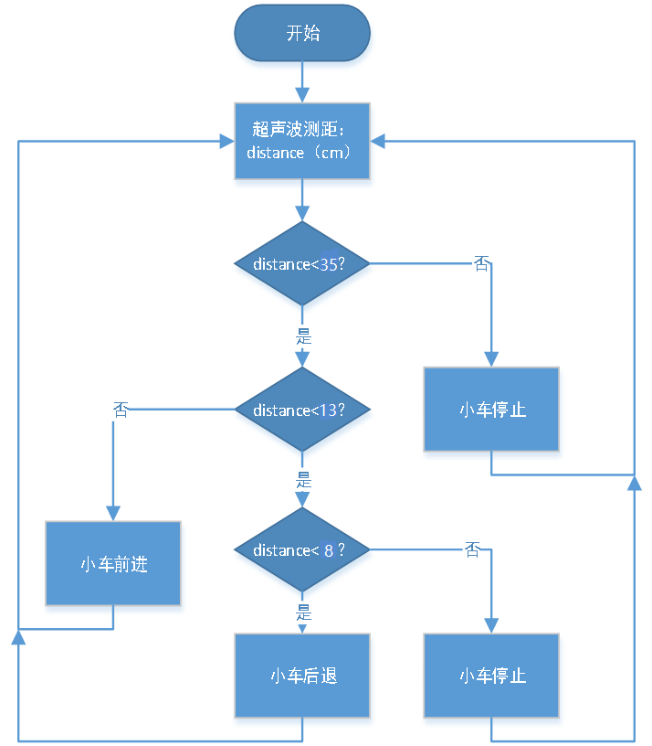
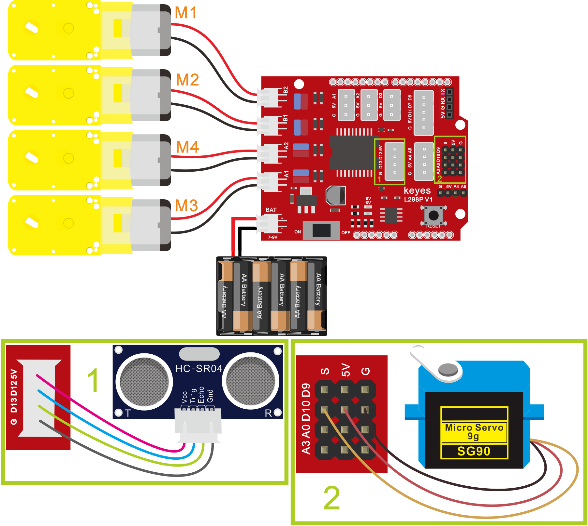
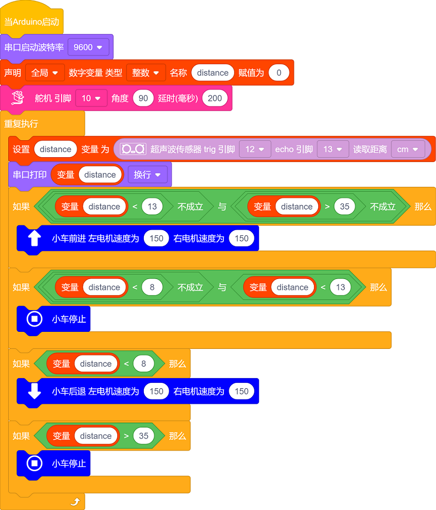
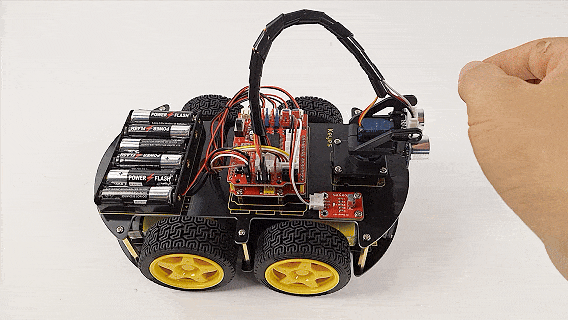

## 第13课 超声波跟随智能车

### 13.1 项目介绍：

在这一课中，我们将结合之前学到的硬件知识——包括传感器、电机驱动模块等，来制作一辆神奇的“超声波跟随智能车”！

想象一下，如果有一辆小车能像宠物一样紧紧跟在你身后，那该多酷？这个实验就是利用超声波传感器来检测前方障碍物的距离。智能车会根据检测到的距离数据，自动控制两组电机的转动方向和速度，从而实现“你走它也走，你停它也停，太近它会退”的跟随效果。

### 13.2 工作原理与逻辑：

为了让智能车聪明地跟随，我们需要制定一套规则（逻辑）。我们可以把前方的空间分成几个区域，根据超声波测得的距离 `distance`（单位：cm），决定小车的动作：

| 检测条件 (距离 distance) | 小车状态 | 动作说明 |
| :--: | :--: | :--: |
| distance < 8 | 后退 |离得太近了，危险！小车向后退，保持安全距离。PWM速度设为100。 |
| 8 ≤ distance < 13 |停止| 距离刚好，不用动。小车原地待命。 |
| 13 ≤ distance ≤ 35 | 前进 | 目标在合适范围内，小车向前跟随。PWM速度设为100。 |
| distance > 35 | 停止 | 目标太远或消失，小车停止等待，防止乱跑。 |

### 13.3 项目组件：

| 组装好的智能车(未插上蓝牙模块) *1 |USB线 *1 | 5号(1.5V)电池 *6（电池自备） |
| --- | --- | --- | --- |
|  | |  |

### 13.4 接线图：

⚠️ 特别注意：4WD智能车已经组装好了，这里不需要把超声波传感器、舵机和4个电机拆下来又重新组装和接线，这里再次提供接线图，是为了方便您编写代码！

| 超声波传感器 | 电机驱动扩展板 | 
| :--: | :--: | 
| Vcc | 5V |
| Trig | D12 |
| Echo | D13 | 
| Gnd | G |

| 舵机 | 电机驱动扩展板 | 
| :--: | :--: | 
| 棕色线 | G |
| 红色线 | 5V |
| 橙色线 | S（D10）| 

| 电机 | 电机驱动扩展板 | 
| :--: | :--: | 
| 左侧电机（M1） | B2 |
| 左侧电机（M2） | B1 |
| 右侧电机（M3） | A1 |
| 右侧电机（M4） | A2 | 

⚠️ **特别注意：**

- 接线时请确保电源断开(拔掉Arduino主控板上的USB线或将电机驱动扩展板上的拨码开关拨到 “**OFF**” 端)，避免短路。

- 电源连接：电池盒电源接到电机驱动扩展板的 BAT 接口（注意正负极不要接反），端口正反面，请勿反插，否则会损坏端口。

- 电池正负极切勿接反，否则可能烧毁电机驱动扩展板。

### 13.5 示例代码：

⚠️ **重要提示：**

- **上传示例代码前，请务必拔掉蓝牙模块！ 因为蓝牙模块也占用Arduino的串口通信（TX/RX），如果不拔掉，示例代码上传会失败。**

### 13.6 项目结果：

⚠️ **重要提示：**

- **上传示例代码前，请务必拔掉蓝牙模块！ 因为蓝牙模块也占用Arduino的串口通信（TX/RX），如果不拔掉，示例代码上传会失败。**

外接电源，将电机驱动扩展板上的拨码开关拨到 “**OFF**” 端。选择好正确的设备（Keyes 4WD Robot）和 对应的端口（COMxx），然后单击  按钮上传示例代码至Arduino控制板。

- 打开电源：将电机驱动扩展板上的拨码开关拨到 “**ON**” 端

- 用手或书本在超声波传感器前方移动：

  - 当物体继续靠近至 8cm以内 时，4WD智能车应向后退；
  
  - 当物体保持在 8-13cm 时，4WD智能车应停止；
 
  - 当物体靠近到 13-35cm 时，4WD智能车应向前行驶；
 
  - 当物体移开超过 35cm 时，4WD智能车应停止。

