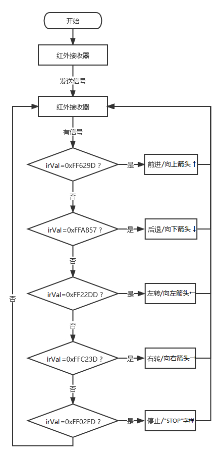
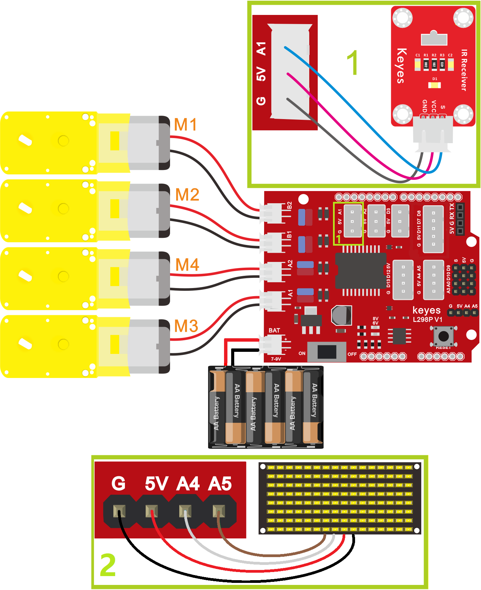
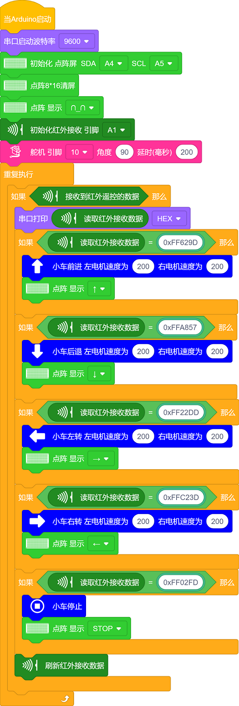
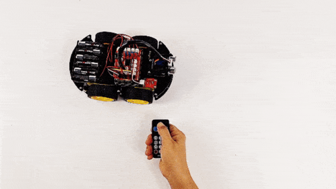

### 第15课 红外遥控智能车

#### 15.1 项目介绍：

在之前的课程中，我们已经学习了智能车上各个传感器、模块以及扩展板的使用方法。今天，我们将把这些知识结合起来，制作一个红外遥控智能车。

还记得在“传感器项目第六课”中，我们测试出了红外遥控器上每个按键对应的唯一“身份证号”（也就是键值）吗？在本节课中，我们将编写程序，让Arduino读取这些键值。当你按下遥控器上的不同按键时，智能车就会执行前进、后退、左转、右转或停止的动作。同时，为了让互动更有趣，小车前方的 8x16 LED点阵屏 还会实时显示当前运动状态的图标（如箭头或文字）。

#### 15.2 控制逻辑：

我们需要建立按键与小车动作之间的对应关系。具体逻辑如下表所示：

| 按键图示 | 键值 (十六进制) | 小车状态 |点阵屏显示内容 |
| :--: | :--: | :--: | :--: |
| | FF629D | 前进 | 向上箭头 ↑ |
| | FFA857 | 后退 | 向下箭头 ↓ |
| | FF22DD | 左转 | 向左箭头 ← |
| | FFC23D | 右转 | 向右箭头 → |
| | FF02FD | 停止 | "STOP" 字样 |

#### 15.3 项目组件：

| 组装好的智能车(未插上蓝牙模块) *1 |USB线 *1 | 5号(1.5V)电池 *6（电池自备） |红外遥控器 *1|
| --- | --- | --- | --- |
|  | |  | |

#### 15.4 接线图：

⚠️ 特别注意：4WD智能车已经组装好了，这里不需要把红外接收模块、8x16 LED点阵模块和4个电机拆下来又重新组装和接线，这里再次提供接线图，是为了方便您编写代码！

| 红外接收模块 | 电机驱动扩展板 | 
| :--: | :--: | 
| GND | G |
| VCC | 5V |
| S | A1 |
  
| 8x16 LED点阵模块 | 电机驱动扩展板 | 
| :--: | :--: | 
| GND | G |
| VCC | 5V |
| SDA | A4 | 
| SCL | A5 |

| 电机 | 电机驱动扩展板 | 
| :--: | :--: | 
| 左侧电机（M1） | B2 |
| 左侧电机（M2） | B1 |
| 右侧电机（M3） | A1 |
| 右侧电机（M4） | A2 |

⚠️ **特别注意：**

- 接线时请确保电源断开(拔掉Arduino主控板上的USB线或将电机驱动扩展板上的拨码开关拨到 “**OFF**” 端)，避免短路。

- 电源连接：电池盒电源接到电机驱动扩展板的 BAT 接口（注意正负极不要接反），端口正反面，请勿反插，否则会损坏端口。

- 电池正负极切勿接反，否则可能烧毁电机驱动扩展板。

#### 15.5 示例代码：

⚠️ **重要提示：**

- **上传示例代码前，请务必拔掉蓝牙模块！ 因为蓝牙模块也占用Arduino的串口通信（TX/RX），如果不拔掉，示例代码上传会失败。**

#### 15.6 项目结果：

⚠️ **重要提示：**

- **上传示例代码前，请务必拔掉蓝牙模块！ 因为蓝牙模块也占用Arduino的串口通信（TX/RX），如果不拔掉，示例代码上传会失败。**

外接电源，将电机驱动扩展板上的拨码开关拨到 “**OFF**” 端。选择好正确的设备（Keyes 4WD Robot）和 对应的端口（COMxx），然后单击  按钮上传示例代码至Arduino控制板。

- 打开电源：将电机驱动扩展板上的拨码开关拨到 “**ON**” 端。 

- 打开红外遥控器，对准4WD智能车上的红外接收头，按下相应的按键。

  - 按下  键，4WD智能车前进，8x16 LED点阵屏显示向上箭头。
  
  - 按下  键，4WD智能车后退，8x16 LED点阵屏显示向下箭头。
  
  - 按下  键，4WD智能车向左转，8x16 LED点阵屏显示向左箭头。
  
  - 按下  键，4WD智能车向右转，8x16 LED点阵屏显示向右箭头。
  
  - 按下  键，4WD智能车停止，8x16 LED点阵屏显示 “STOP” 字样。

#### 15.7 常见问题排查：

- 4WD智能车不动？ 

   - 检查电池是否有电，拨码开关是否打开，电机接线是否牢固。
    
- 遥控没反应？ 

   - 检查红外接收头接线是否正确（G/V/S），确保红外遥控器电池有电，且对准了接收头。可以通过串口监视器查看是否有键值打印出来。

