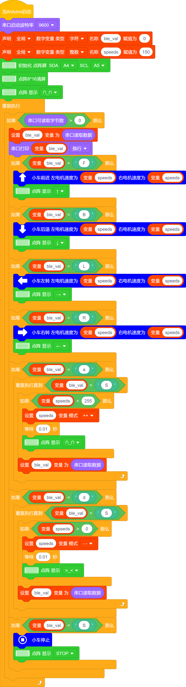

### 第17课 蓝牙调速智能车

#### 17.1 项目介绍：

在之前的课程中，我们已经学会了如何通过手机蓝牙控制智能车的前进、后退和转向。但是，你是否觉得小车的速度总是固定的，不够灵活呢？

在这一课中，我们将给智能车增加一个“油门”功能！通过编写代码，我们可以定义一个变量`speeds`来存储当前的速度值。当你按下手机APP上的加速或减速按钮时，这个变量的值就会发生变化，从而让小车跑得更快或更慢。让我们一起来看看如何实现吧！

#### 17.2 工作原理:

要控制直流电机的速度，我们需要使用 PWM（脉冲宽度调制） 技术。简单来说，就是通过快速开关电源，改变通电时间的比例，从而控制电机的平均电压，进而调节转速。

在 Arduino 中，`analogWrite()`函数可以产生 PWM 信号。它的数值范围是 0 到 255：

- 0：代表停止（0% 动力）
- 255：代表全速（100% 动力）
- 中间值：代表不同的速度等级

我们将创建一个名为 `speeds` 的变量，初始值设为 150。

- 当接收到加速指令 'a' 时，`speeds`的值增加。

- 当接收到减速指令'd'时，`speeds`的值减小。
    
- 电机驱动函数将使用这个 `speeds` 变量作为速度参数。

#### 17.3 流程图：

#### 17.4 项目组件：

| 组装好的智能车(未插上蓝牙模块) *1 |USB线 *1 | 5号(1.5V)电池 *6（电池自备） |
| --- | --- | --- | 
|  | | | 
| 蓝牙模块  *1 | 手机/平板 *1|  |
| || |

#### 17.5 接线图：

⚠️ 特别注意：4WD智能车已经组装好了，这里不需要把舵机、8x16 LED点阵模块和4个电机拆下来又重新组装和接线，这里再次提供接线图，是为了方便您编写代码！

| 蓝牙模块 | 电机驱动扩展板 | 
| :--: | :--: |
| EN | - | 
| VCC | 5V |
| GND | G |
| TXD | RX | 
| RXD | TX |
| STATE | - |

| 8x16 LED点阵模块 | 电机驱动扩展板 | 
| :--: | :--: | 
| GND | G |
| VCC | 5V |
| SDA | A4 | 
| SCL | A5 |

| 舵机 | 电机驱动扩展板 | 
| :--: | :--: | 
| 棕色线 | G |
| 红色线 | 5V |
| 橙色线 | S（D10）|  

| 电机 | 电机驱动扩展板 | 
| :--: | :--: | 
| 左侧电机（M1） | B2 |
| 左侧电机（M2） | B1 |
| 右侧电机（M3） | A1 |
| 右侧电机（M4） | A2 |

⚠️ **特别注意：**

- **上传示例代码前，蓝牙模块可以先不直插到电机驱动扩展板上！因为蓝牙模块也占用Arduino的串口通信（TX/RX），如果连接到电机驱动扩展板上，示例代码上传会失败。示例代码上传成功后，再插回蓝牙模块。**

- 接线时请确保电源断开(拔掉Arduino主控板上的USB线或将电机驱动扩展板上的拨码开关拨到 “**OFF**” 端)，避免短路。

- 电源连接：电池盒电源接到电机驱动扩展板的 BAT 接口（注意正负极不要接反），端口正反面，请勿反插，否则会损坏端口。

- 电池正负极切勿接反，否则可能烧毁电机驱动扩展板。

#### 17.6 示例代码：

⚠️ **重要提示：**

- **上传示例代码前，请务必拔掉蓝牙模块！ 因为蓝牙模块也占用Arduino的串口通信（TX/RX），如果不拔掉，示例代码上传会失败。示例代码上传成功后，再插回蓝牙模块。**

#### 17.7 项目结果：

⚠️ **重要提示：**

- **上传示例代码前，请务必拔掉蓝牙模块！ 因为蓝牙模块也占用Arduino的串口通信（TX/RX），如果不拔掉，示例代码上传会失败。示例代码上传成功后，再插回蓝牙模块。**

外接电源，将电机驱动扩展板上的拨码开关拨到 “**OFF**” 端。选择好正确的设备（Keyes 4WD Robot）和 对应的端口（COMxx），然后单击  按钮上传示例代码至Arduino控制板。

- 打开电源：将电机驱动扩展板上的拨码开关拨到 “**ON**” 端。

- 插上蓝牙模块，确认接线无误。

- 连接好蓝牙模块，上电后，蓝牙模块上的LED闪烁。

⚠️ **特别提醒：这里是以安卓系统(Android)手机/平板操作为例，苹果系统(IOS)在这里就不多讲，自己可以参照。**

- 打开手机/平板上的蓝牙。

  

- 点击手机/平板上的APP图标，进入APP界面，显示如下图：

  

- 点击APP界面左上角的图标 “**CONNECT**”，搜索到对应的蓝牙设备（**BT24**--针对UNO-PLUS版本 // **HMSoft**--针对UNO-R3版本），上下滑动找到对应的蓝牙设备（**BT24**--针对UNO-PLUS版本 // **HMSoft**--针对UNO-R3版本），显示如下图：

  

  

- 点击 “**connect**” 来连接蓝牙，蓝牙连接成功后，“**connect**” 字样会变成 “**is connected**” 字样，显示如下图。这时，蓝牙模块上的LED变为常亮。

  

  

- 操控4WD智能车：

    - 按住  键，4WD智能车以中等速度前进，8x16 LED点阵屏显示向上箭头。
    
    - 按下  键（通常对应字符'a'），你会看到8x16 LED点阵屏显示向上加速图标，每次按下 键，速度都会增加（最大速度PWM：255），同时4WD智能车也会逐渐跑得越来越快。
    
    - 按下  键（通常对应字符'd'），你会看到8x16 LED点阵屏显示向下减速图标，每次按下 键，速度都会减少（最小速度PWM：0），同时4WD智能车会逐渐慢下来。
    
    - 在任何时候松开按键，小车都会立即停下，并退出加速/减速状态。

 

#### 17.8 注意事项：

1\. 电源充足：高速运转时电机消耗电流较大，请确保电池电量充足，否则4WD智能车可能会因为电压不足而行动迟缓或重启。
    
2\. 上传代码问题：由于蓝牙模块占用了 Arduino 的 D0 (RX) 和 D1 (TX) 引脚，在上传代码前，务必拔掉蓝牙模块的 TX 和 RX 连线，否则会出现“上传错误”。上传完成后再插回。
    
3\. 速度范围：PWM 值必须在 0-255 之间。如果代码逻辑错误导致数值溢出，电机可能无法正常工作。
   
4\.  地面摩擦：在不同的地面（如地毯、瓷砖）上，4WD智能车的实际速度感会有所不同，这是正常现象。

