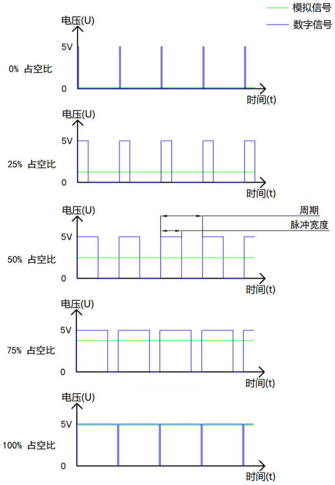
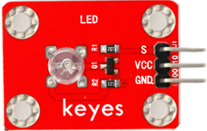
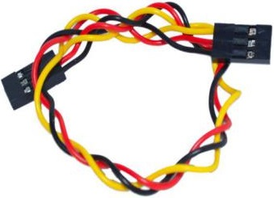
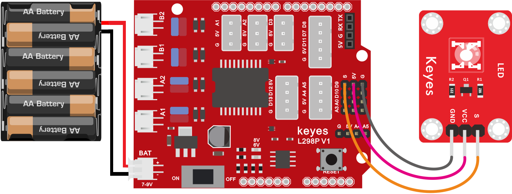
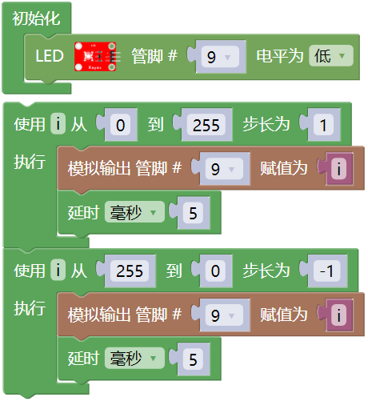
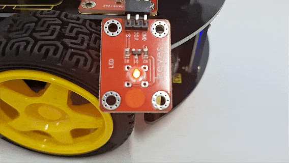
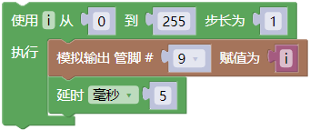
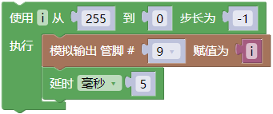
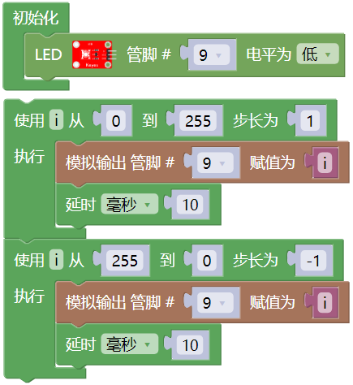

### 第03课 LED 亮度的调节

#### 3.1 项目介绍：

在之前的课程中，我们学习了如何通过代码控制 LED 的“亮”与“灭”，实现了简单的闪烁效果。但在现实生活中，灯光的变化往往是柔和渐变的，比如呼吸灯或者台灯调光。这节课，我们将学习一种叫做 PWM（脉冲宽度调制） 的技术，用它来控制 LED 的亮度，模拟出像呼吸一样忽明忽暗的效果。

**什么是 PWM？** 

Arduino 的数字引脚通常只能输出两种电压：0V（低电平/LOW）和 5V（高电平/HIGH）。如果我们想让 LED 半亮（相当于 2.5V），直接连接是做不到的。这时候就需要用到 PWM。

PWM 的原理就像放电影。电影其实是由一张张静止的图片快速播放组成的，因为速度太快，我们的眼睛看不出停顿，感觉画面是连续的。PWM 也是同样的道理：它让引脚在极短的时间内快速地切换“开”和“关”。

- 如果“开”的时间长，“关”的时间短，平均电压就高，灯就亮。

- 如果“开”的时间短，“关”的时间长，平均电压就低，灯就暗。

通过控制这个“开关比例”（占空比），我们就可以用数字信号模拟出不同的电压值，从而调节 LED 的亮度。

通过下面五个方波来更形象的了解一下PWM。

#### 3.2 项目组件：

| 组装好的智能车(未插上蓝牙模块) *1 | 草帽LED白发红模块 *1 | 3Pin 双母头杜邦线 *1  |
| --- | --- | --- | 
|  | | |
| USB线 *1 | 5号(1.5V)电池 *6（电池自备） |  |
| |  |  |

#### 3.3 接线图：

⚠️ **特别提醒：请按照以下步骤进行接线。务必确保电源关闭状态下进行接线操作。**

| LED 模块 | 电机驱动扩展板 | 
| :--: | :--: | 
| GND | G |
| VCC | 5V |
| S | S(D9) | 

⚠️ **特别注意：**

- 接线时请确保电源断开(拔掉Arduino主控板上的USB线或将电机驱动扩展板上的拨码开关拨到 “**OFF**” 端)，避免短路。

- 电源连接：电池盒电源接到电机驱动扩展板的 BAT 接口（注意正负极不要接反），端口正反面，请勿反插，否则会损坏端口。

- 电池正负极切勿接反，否则可能烧毁电机驱动扩展板。

- 电机驱动扩展板上的拨码开关拨到 “**ON**” 端。

#### 3.4 示例代码1：

⚠️ **重要提示：**

- **上传示例代码前，请务必拔掉蓝牙模块！ 因为蓝牙模块也占用Arduino的串口通信（TX/RX），如果不拔掉，示例代码上传会失败。**

#### 3.5 项目结果1：

⚠️ **重要提示：**

- **上传示例代码前，请务必拔掉蓝牙模块！ 因为蓝牙模块也占用Arduino的串口通信（TX/RX），如果不拔掉，示例代码上传会失败。**

外接电源，将电机驱动扩展板上的拨码开关拨到 “**ON**” 端，上电后。选择好正确的开发板板型（Arduino/Genuino Uno）和 适当的串口端口（COMxx），然后单击  按钮上传示例代码1至Arduino控制板。

代码上传成功后，我们可以看到LED会有个逐渐由亮到灭的一个缓慢过程，而不是直接的亮灭，如同呼吸一般，均匀变化。

#### 3.6 代码说明:

- 设置一个变量i，i从0逐渐增加到255，每一次都加1，总共加了255次， 每次以5毫秒的频率增加1，LED逐渐变亮。

- 设置一个变量i，i从255逐渐减少到0，每一次都减1，总共减了255次， 每次以5毫秒的频率减1，LED逐渐变暗。

我们知道数字口只有0和1两个状态，那如何发送一个模拟值到一个数字引脚呢？就要用到该指令方块。观察一下Arduino板，查看数字引脚，你会发现其中6个引脚旁标有 “**~**”，这些引脚不同于其他引脚，它们可以输出PWM信号。具有PWM功能的数字引脚，也就是3、5、6、9、10、11引脚。

#### 3.7 示例代码2：

我们不改变灯的脚位，只是改变程序里面delay()的值，看看它如何改变渐变效果。

⚠️ **重要提示：**

- **上传示例代码前，请务必拔掉蓝牙模块！ 因为蓝牙模块也占用Arduino的串口通信（TX/RX），如果不拔掉，示例代码上传会失败。**

#### 3.8 项目结果2：

⚠️ **重要提示：**

- **上传示例代码前，请务必拔掉蓝牙模块！ 因为蓝牙模块也占用Arduino的串口通信（TX/RX），如果不拔掉，示例代码上传会失败。**

外接电源，将电机驱动扩展板上的拨码开关拨到 “**ON**” 端，上电后。选择好正确的开发板板型（Arduino/Genuino Uno）和 适当的串口端口（COMxx），然后单击  按钮上传代码2至Arduino控制板。

代码上传成功后，看看LED渐变的效果是不是慢了一些。

