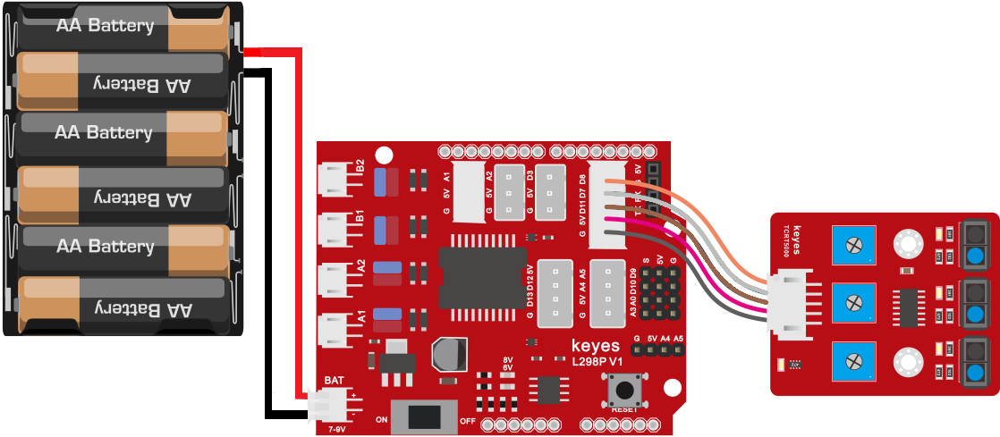
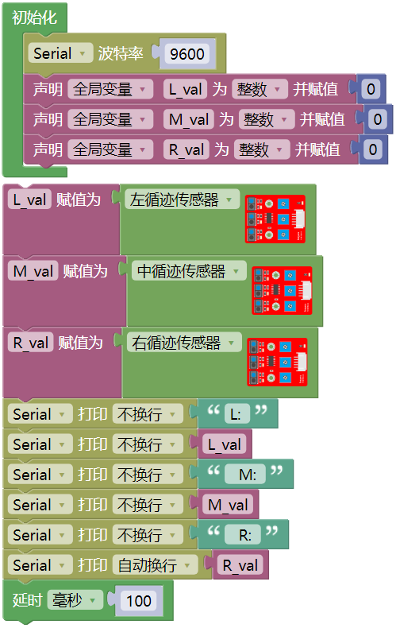
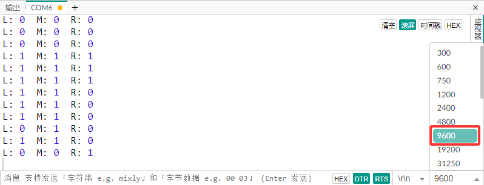
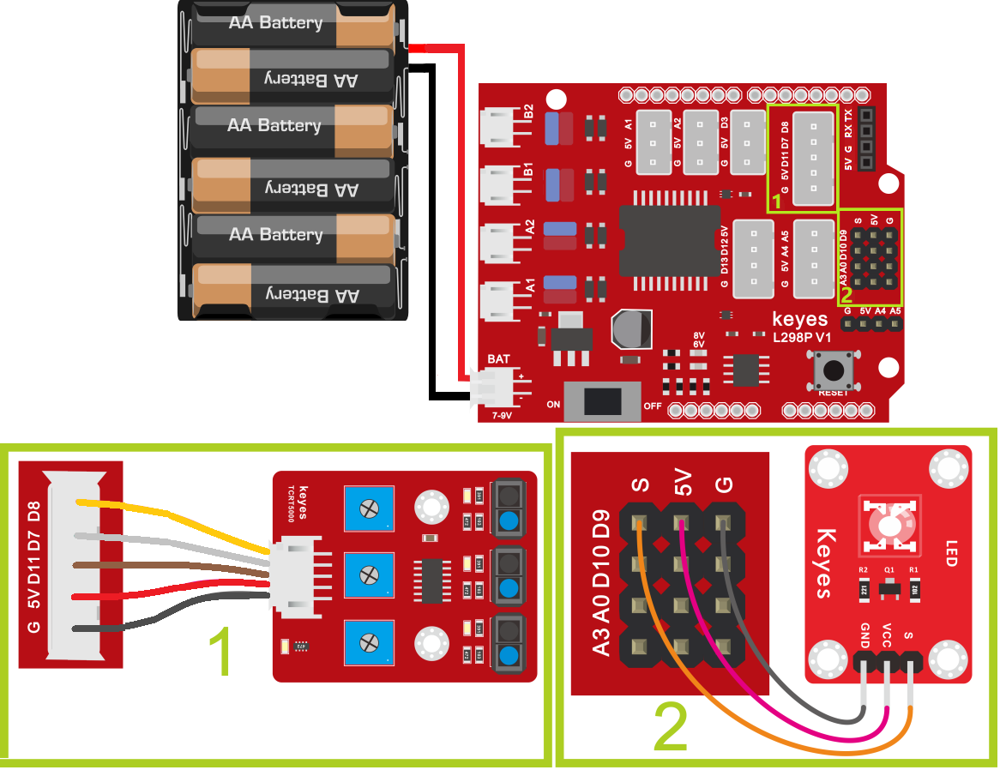
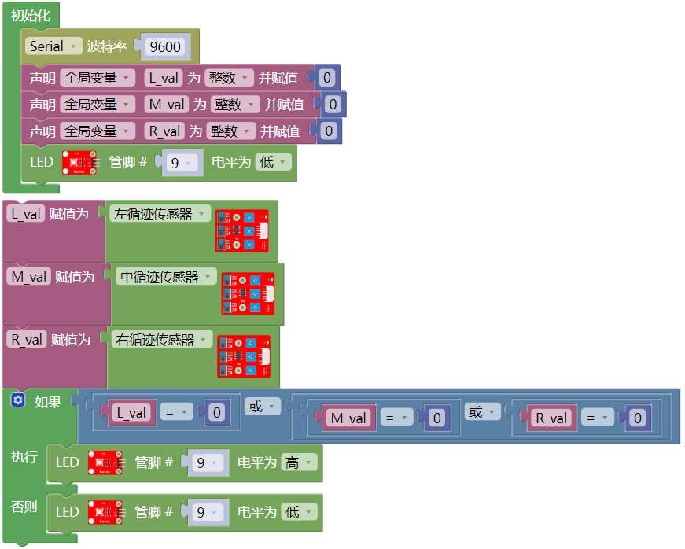
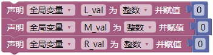
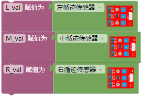
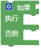

## 第04课 巡线传感器

### 4.1 项目介绍：

循迹传感器（也叫巡线传感器）的核心部件其实是红外传感器。本课使用的模块集成了TCRT5000 红外发射管和接收管。

### 4.2 元件知识：

循迹传感器的工作原理：利用不同颜色的物体对红外光的反射率不同，然后将反射信号的强度转换为电流信号。

**白色表面：** 反射能力强，红外光被反射回接收管，传感器输出低电平（LOW / 0）。

**黑色表面**：吸收红外光，反射很少，接收管接收不到信号，传感器输出高电平（HIGH / 1）。

(**注：具体电平逻辑可能因模块设计而异，本教程基于 KEYES 模块特性：检测到黑线/无反射时为高电平，检测到白纸/强反射时为低电平。但在实际代码逻辑中，我们通常通过串口监视器来确认当前状态。根据下文实验现象描述：“白纸遮挡...状态都是0”，“没有接收到信号...数值是1”，我们可以推断：白色=0 (LOW)，黑色/悬空=1 (HIGH)。**)

三路循迹模块在一块电路板上集成了三个这样的红外探头，分别对应左、中、右三个位置，让接线和控制变得更加方便。通过旋转传感器上的蓝色小旋钮（电位器），可以调节传感器的检测灵敏度和距离。有效检测高度通常在 0-3 厘米之间。

**参数：**

- 工作电压：3.3V - 5V (直流电)

- 接口类型：5PIN (5针接口)

- 输出信号：数字信号 (Digital)

- 检测距离：0 - 3 厘米

💡 **特别提示： 在使用前，请务必调节传感器上的电位器。最佳灵敏度的调节方法是：将传感器对准黑白交界处或特定距离的目标，旋转旋钮直到指示灯在亮与灭之间临界切换，此时灵敏度最高**

### 4.3 项目组件：

| 组装好的智能车(未插上蓝牙模块) *1 | 草帽LED白发红模块 *1 | 3Pin 双母头杜邦线 *1  |
| --- | --- | --- | --- |
|  | | |
| USB线 *1 | 5号(1.5V)电池 *6（电池自备） |  |
| |  |  |

### 4.4 接线图:

⚠️ 特别注意：4WD智能车已经组装好了，这里不需要把三路循迹模块拆下来又重新组装和接线，这里再次提供接线图，是为了方便您编写代码！

| 三路循迹模块 | 电机驱动扩展板 | 
| :--: | :--: | 
| S1右侧(R) | D8 |
| S2中间(M) | D7 |
| S3左侧(L) | D11 | 
| V | 5V |
| G | G | 

⚠️ **特别注意：**

- 接线时请确保电源断开(拔掉Arduino主控板上的USB线或将电机驱动扩展板上的拨码开关拨到 “**OFF**” 端)，避免短路。

- 电源连接：电池盒电源接到电机驱动扩展板的 BAT 接口（注意正负极不要接反），端口正反面，请勿反插，否则会损坏端口。

- 电池正负极切勿接反，否则可能烧毁电机驱动扩展板。

- 电机驱动扩展板上的拨码开关拨到 “**ON**” 端。

### 4.5 示例代码 1：读取传感器状态

这段示例代码用于测试传感器是否正常工作，读取传感器的数据，并通过电脑屏幕显示数据。

⚠️ **重要提示：**

- **上传示例代码前，请务必拔掉蓝牙模块！ 因为蓝牙模块也占用Arduino的串口通信（TX/RX），如果不拔掉，示例代码上传会失败。**
   

### 4.6 项目结果1：

⚠️ **重要提示：**

- **上传示例代码前，请务必拔掉蓝牙模块！ 因为蓝牙模块也占用Arduino的串口通信（TX/RX），如果不拔掉，示例代码上传会失败。**

**实验步骤：**

1\. 外接电源，将电机驱动扩展板上的拨码开关拨到 “**ON**” 端，上电后。选择好正确的开发板板型（Arduino/Genuino Uno）和 适当的串口端口（COMxx），然后单击  按钮上传示例代码1至Arduino控制板。

2\. 单击Mixly IDE左上角的，出现串口监视器窗口，设置串口波特率为 9600。

3\. 观察串口监视器窗口的数据变化。

**现象观察：**

- 当你用白纸靠近或遮挡传感器下方时，对应的传感器数值会变为 0 (LOW)。这是因为白色强烈反射红外光。

- 当传感器下方没有物体或者对着黑色物体时，数值显示为 1 (HIGH)。

- 你可以尝试用手或不同颜色的纸在左、中、右三个传感器下方移动，观察对应的数值变化。 

### 4.7 示例代码 2：传感器控制 LED 灯

上面我们了解了循迹传感器的工作原理，接下来我们在第9脚接上一个LED 灯，然后通过读取循迹传感器的状态，来控制LED的亮和灭。如下图接线：

**硬件连接：**

⚠️ 特别注意：4WD智能车已经组装好了，这里不需要把三路循迹模块拆下来又重新组装和接线，这里再次提供接线图，是为了方便您编写代码！但是，LED模块是需要你自己接线的。

| 三路循迹模块 | 电机驱动扩展板 | 
| :--: | :--: | 
| S1右侧(R) | D8 |
| S2中间(M) | D7 |
| S3左侧(L) | D11 | 
| V | 5V |
| G | G |

| LED 模块 | 电机驱动扩展板 | 
| :--: | :--: | 
| GND | G |
| VCC | 5V |
| S | S(D9) | 

⚠️ **特别注意：**

- 接线时请确保电源断开(拔掉Arduino主控板上的USB线或将电机驱动扩展板上的拨码开关拨到 “**OFF**” 端)，避免短路。

- 电源连接：电池盒电源接到电机驱动扩展板的 BAT 接口（注意正负极不要接反），端口正反面，请勿反插，否则会损坏端口。

- 电池正负极切勿接反，否则可能烧毁电机驱动扩展板。

- 电机驱动扩展板上的拨码开关拨到 “**ON**” 端。

⚠️ **重要提示：**

- **上传示例代码前，请务必拔掉蓝牙模块！ 因为蓝牙模块也占用Arduino的串口通信（TX/RX），如果不拔掉，示例代码上传会失败。**

### 4.8 项目结果2：

⚠️ **重要提示：**

- **上传示例代码前，请务必拔掉蓝牙模块！ 因为蓝牙模块也占用Arduino的串口通信（TX/RX），如果不拔掉，示例代码上传会失败。**

外接电源，将电机驱动扩展板上的拨码开关拨到 “**ON**” 端，上电后。选择好正确的开发板板型（Arduino/Genuino Uno）和 适当的串口端口（COMxx），然后单击  按钮上传示例代码2至Arduino控制板。

代码上传成功后，当模块上任一传感器检测到白色（即：低电平）时，LED 灯点亮；反之，检测到黑色或悬空时，LED 熄灭。

### 4.9 代码说明：

为了帮助你更好地理解代码，这里解释几个关键指令：

- **作用**：初始化串口通信。

- **解释**：就像打电话前要拨号一样，这行代码告诉 Arduino 以 9600 的速率（波特率）与电脑进行“对话”。只有两边速率一致，才能正确传输数据。

- **作用**：定义变量L_val, M_val, R_val，分别用于储存三路循迹模块上左、中、右循迹传感器检测到的数字信号(1/0)。

- **作用**：读取数字引脚的电平状态。将三路循迹模块上左、中、右循迹传感器读取的电平状态(即：数字信号(1/0))储存到对应的变量中

- **解释**：它会返回两个值之一：`HIGH` (高电平，通常代表 1) 或 `LOW` (低电平，通常代表 0)。

 

- **作用**：条件判断。实际上就是Arduino C语言中的 if()...else...

-  **解释**：`if (条件) { 执行A } else { 执行B }`。如果括号里的条件成立，就执行 A；否则，执行 B。在本课中，我们用   (或运算符) 来判断三个传感器中是否有**任意一个**检测到了信号。