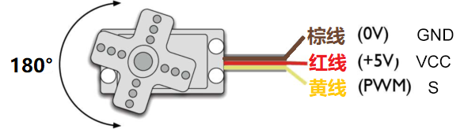
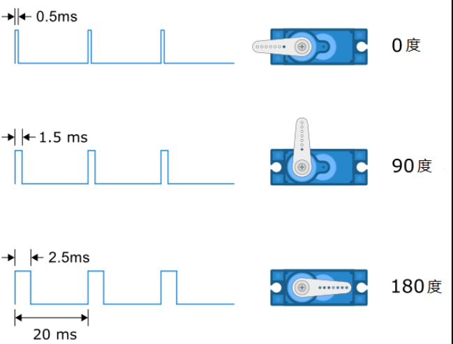
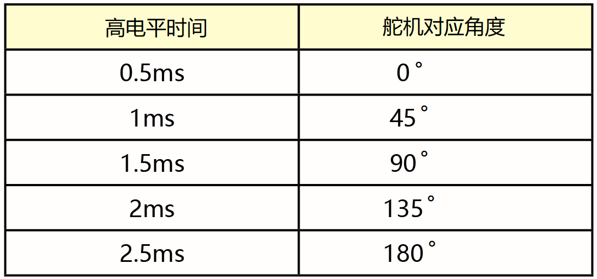
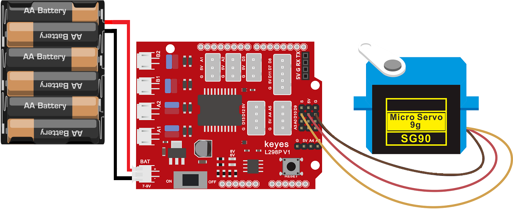
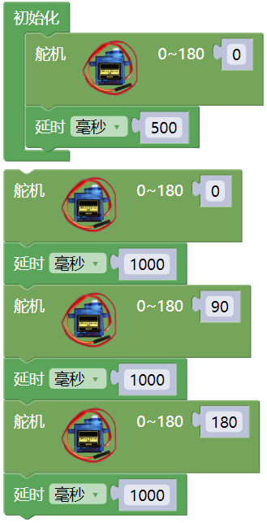
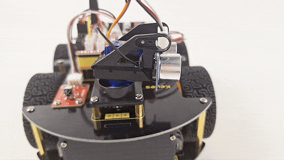

## 第05课 舵机控制

### 5.1 项目介绍：

本教程将为您详细介绍舵机模块的使用方法和应用技巧。舵机是一种能够精确控制角度的电机，广泛应用于机器人、遥控模型和自动化设备中。教程内容包括舵机的工作原理、引脚功能、电路连接方法以及如何通过微控制器控制舵机的转动角度。

### 5.2 元件知识：

**什么是舵机？** 

舵机（Servo）是一种可以精确控制旋转角度的电机。它就像一个听话的机械手臂关节，你可以命令它转到特定的角度（比如 0°、90° 或 180°），并且它能稳稳地停在那里。

**舵机的内部构造：** 舵机主要由外壳、电路板、无核心马达、齿轮组和位置检测器组成。

**它的工作原理是：** 单片机（如 Arduino）发出信号给舵机，舵机内部的电路会将接收到的信号与当前位置进行比较，驱动马达转动，直到到达指定的角度为止。

**舵机的接线：** 虽然不同品牌的舵机颜色可能略有差异，但大多数标准舵机都有三根线，功能如下：

- 棕色线：接地线（GND），连接电源负极。

- 红色线：电源线（VCC），连接电源正极。

- 橙色线（或黄色）：信号线（Signal），连接单片机的数字引脚，用于接收控制指令。

**舵机是如何转动的？** 

舵机的转动角度是通过调节 PWM（脉冲宽度调制） 信号的占空比来实现的。

例如（这里以180°舵机为例）：

- 标准信号周期：固定为 20ms（即频率为 50Hz）。

- 脉宽与角度的关系：
   
   - 脉宽 0.5ms ~ 2.5ms 对应舵机转角 0° ~ 180°。
   
   - 通常，1.5ms 的脉宽对应 90°（中间位置）。

具体的对应关系可以参考下表：

**舵机参数：**

- 工作电压：DC 4.8V〜6V

- 可操作角度范围：大约 0 - 180°(在 500→2500 μsec)

- 脉波宽度范围：500 → 2500 μsec

- 空载转速：0.12±0.01 sec/60（DC 4.8V）， 0.1±0.01 sec/60（DC 6V）

- 空载电流：200±20mA（DC 4.8V）， 220±20mA（DC 6V）

- 停止扭力：1.3±0.01kg·cm（DC 4.8V），1.5±0.1kg·cm（DC 6V）

- 停止电流：≦850mA（DC 4.8V）， ≦1000mA（DC 6V）

- 待机电流：3±1mA（DC 4.8V）， 4±1mA（DC 6V）

### 5.3 项目组件

| 组装好的智能车(未插上蓝牙模块) *1 | USB线 *1 | 5号(1.5V)电池 *6（电池自备） |
| --- | --- | --- | --- |
|  | |  |

### 5.4 接线图：

⚠️ 特别注意：4WD智能车已经组装好了，这里不需要把舵机拆下来又重新组装和接线，这里再次提供接线图，是为了方便您编写代码！

| 舵机 | 电机驱动扩展板 | 
| :--: | :--: | 
| 棕色线 | G |
| 红色线 | 5V |
| 橙色线 | S（D10）| 

⚠️ **特别注意：**

- 接线时请确保电源断开(拔掉Arduino主控板上的USB线或将电机驱动扩展板上的拨码开关拨到 “**OFF**” 端)，避免短路。

- 舵机在转动瞬间需要的电流较大（峰值可能接近 1A），而 Arduino 开发板提供的电流较小。如果直接用开发板供电，可能会导致开发板重启或损坏。因此，强烈建议使用外接电源。

- 电源连接：电池盒电源接到电机驱动扩展板的 BAT 接口（注意正负极不要接反），端口正反面，请勿反插，否则会损坏端口。

- 电池正负极切勿接反，否则可能烧毁电机驱动扩展板。

- 电机驱动扩展板上的拨码开关拨到 “**ON**” 端。

### 5.5 示例代码：

⚠️ **重要提示：**

- **上传示例代码前，请务必拔掉蓝牙模块！ 因为蓝牙模块也占用Arduino的串口通信（TX/RX），如果不拔掉，示例代码上传会失败。**

### 5.6 项目结果：

⚠️ **重要提示：**

- **上传示例代码前，请务必拔掉蓝牙模块！ 因为蓝牙模块也占用Arduino的串口通信（TX/RX），如果不拔掉，示例代码上传会失败。**

外接电源，将电机驱动扩展板上的拨码开关拨到 “**ON**” 端，上电后。选择好正确的开发板板型（Arduino/Genuino Uno）和 适当的串口端口（COMxx），然后单击  按钮上传示例代码至Arduino控制板。

代码上传成功后，可以看到舵机在0°到180°角度范围来回摆动。

### 5.7 代码说明:

- 这是最简单的指令，直接写入角度值（0-180），库文件会自动处理复杂的 PWM 信号生成。

### 5.8 注意事项与常见问题

1\. 供电不足：如果发现舵机抖动、无力或 Arduino 频繁重启，请检查外接电池是否有电，以及接线是否牢固。切勿仅依靠 USB 供电驱动大扭矩舵机。

2\. 角度限制：大多数普通舵机（如 SG90）的物理旋转范围略小于 180°（通常在 0-180° 之间，但两端可能有几度的死区）。如果写入 0° 或 180° 时听到舵机发出“咯咯”的挣扎声，请尝试改为 5° 和 175°。

