## 第08课 蓝牙遥控的原理及应用

### 8.1 项目介绍：

蓝牙是一种流行的无线通信方式，能让设备之间不用电线就能传递信息。蓝牙模块充当中间人，手机通过蓝牙发送指令，蓝牙模块将指令传给Arduino开发板，开发板根据指令执行相应操作，例如控制LED灯的亮灭或小车的运动等。

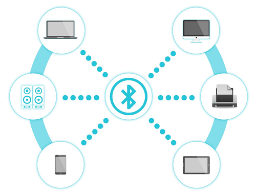

### 8.2 蓝牙工作原理

⚠️ **特别提醒：这是针对于 UNO-PLUS版本 的蓝牙模块。**

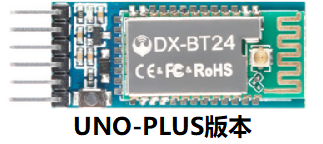

BT24是一款面向嵌入式开发的‌低功耗串口透传蓝牙模块‌，主打简化蓝牙通信开发，广泛应用于物联网原型开发和小型智能设备项目中，以下是详细介绍：

**蓝牙参数：**

- 蓝牙协议: Bluetooth Specification V5.1 BLE

- 工作频率: 2.4GHz ISM band

- 通信接口: UART

- 工作电压: DC 5V

- 通信距离: 40m

- 蓝牙名称: BT24

- 串口参数: 9600、8数据位、1停止位、无校验、无流控

- 兼容性‌：支持Android/iOS蓝牙4.0及以上设备，AT指令可灵活修改模块名称、波特率等参数。

DX-BT24模块同时支持BT5.1 BLE协议，能够与具备BLE蓝牙功能的iOS设备直接连接，支持后台程序常驻运行。主要用于短距离的数据无线传输领域。避免繁琐的线缆连接，能直接替代串口线。BT24模块成功应用领域包括：

- 蓝牙无线数据传输

- 手机、电脑周边设备

- 手持POS设备

- 医疗设备无线数据传输

- 智能家居控制

- 蓝牙打印机

- 蓝牙遥控玩具

- 共享单车

⚠️ **特别提醒：这是针对于 UNO-R3版本 的蓝牙模块。**

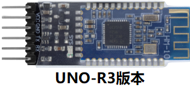

HM-10是一款经典的蓝牙4.0 BLE低功耗串口透传模块‌，广泛应用于物联网DIY项目和智能硬件开发，以下是核心信息：

**蓝牙参数：**

- 工作电压：5V DC

- 蓝牙协议：蓝牙V4.0 BLE串口收发无字节限制

- 工作距离：空旷环境最大100米，实际场景约20-30米，可通过发射功率调整

- 工作频率：2.4GHz ISM频段

- 调制方式：GFSK（高斯频移键控）

- 传输功率：支持-23dBm至6dBm调节，通过AT指令配置。

- 灵敏度：0.1％BER时≤-84dBm

- 安全功能：身份验证和加密

- 支持服务：中央和外围UUID FFE0，FFE1

- 功耗：自动休眠模式，待机电流400uA〜800uA，传输期间为8.5mA。

- 兼容性‌：支持Android/iOS蓝牙4.0及以上设备，AT指令可灵活修改模块名称、波特率等参数。

### 8.3 APP下载安装：

⚠️ **特别提醒：如果已经在手机/平板上安装好了APP，则这一步骤可以直接跳过；否则，需要参照以下步骤在手机/平板上来安装APP。**

**步骤1：** 在手机/平板浏览器的搜索框中输入官网链接：[https://www.keyesrobot.cn/zh-cn/latest](https://www.keyesrobot.cn/zh-cn/latest)

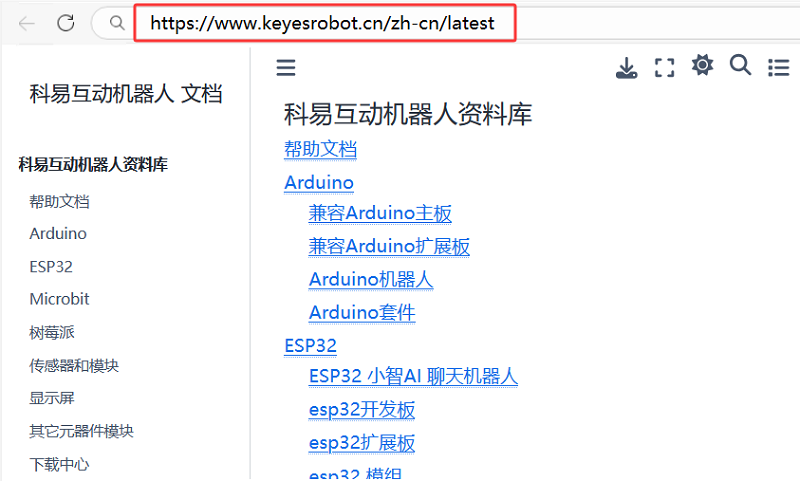

**步骤2：** 点击 “**下载中心**”，进入下载中心页面。

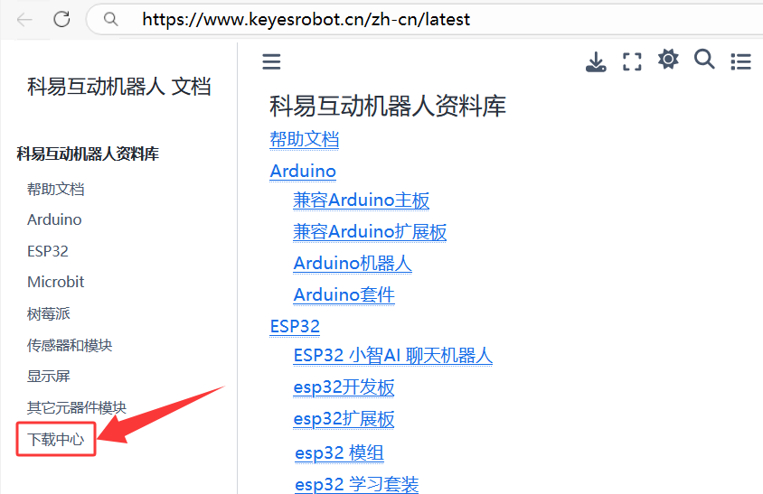

**步骤3：** 在 “**APP下载**” 栏向下滑找到 **keyes 4wd**，根据自己的手机/平板系统选择对应的APP下载安装。

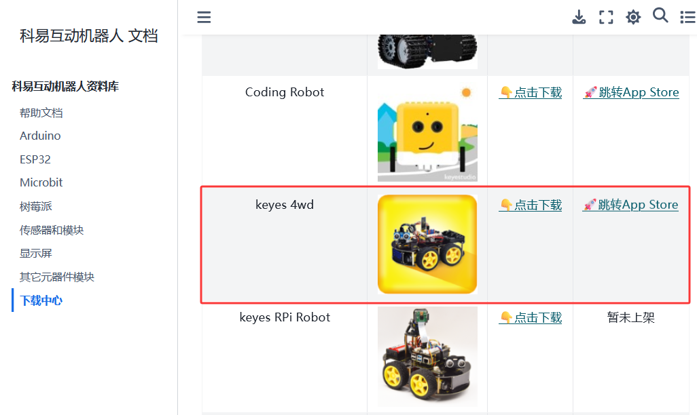

**安卓系统(Android)**

a. 点击 "**点击下载**" 按钮，下载对应的 "**keyes 4wd.apk**" 文件。

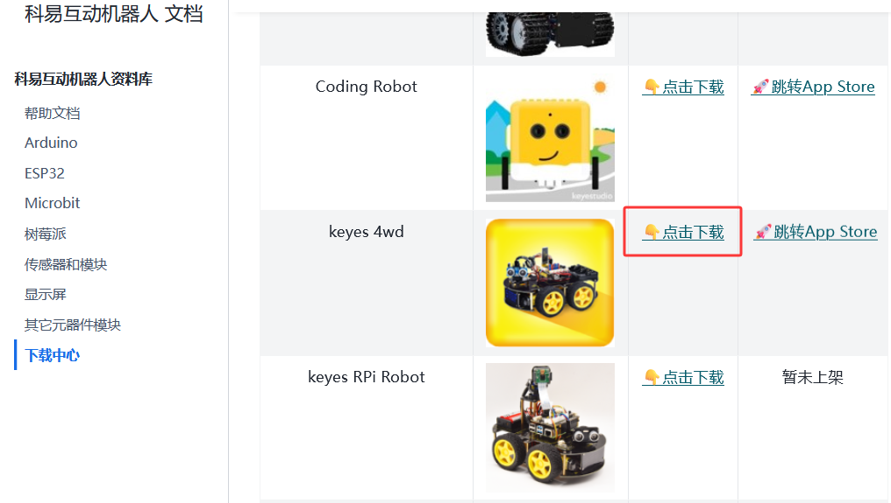

b. 按照安装提示进行下载安装。

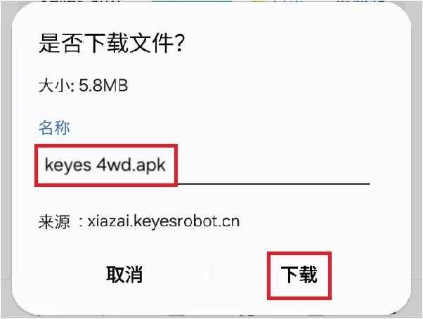

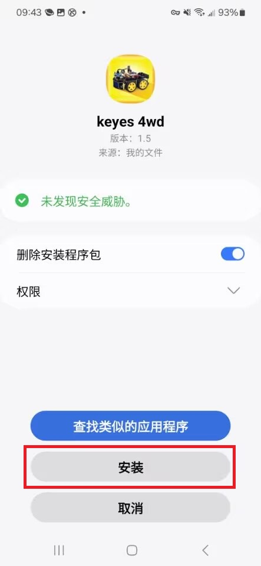

c. 下载安装后，打开 **keyes 4wd** APP，出现如下图界面，按照提示进行操作。

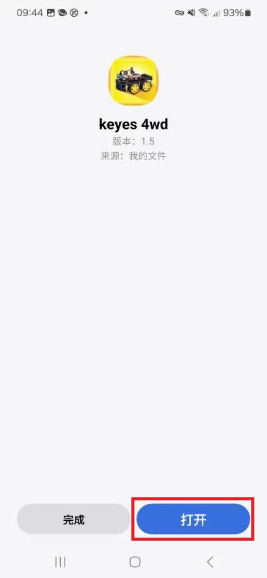

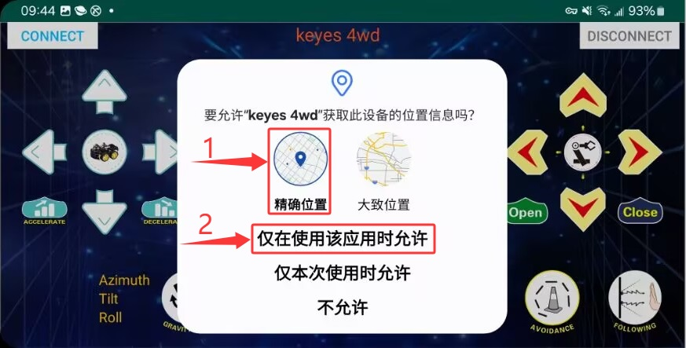

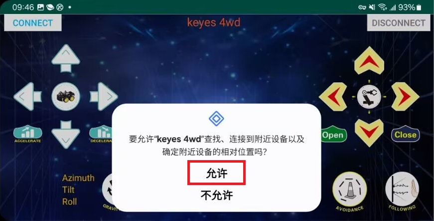

**苹果系统(IOS)**

a. 点击 "**跳转APP Store**" 按钮，页面跳转到 APP Store

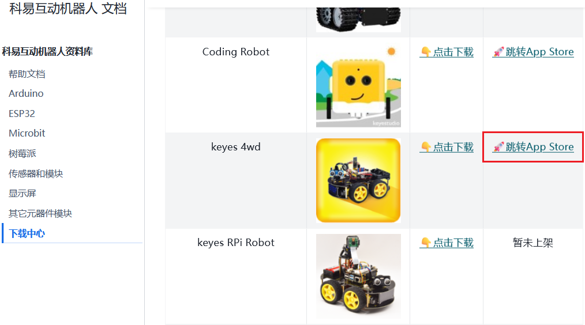

b. 在 APP Store 上搜索 **keyes BT car** ，选择 **keyes BT car**，然后点击  获取，等待下载安装APP即可。

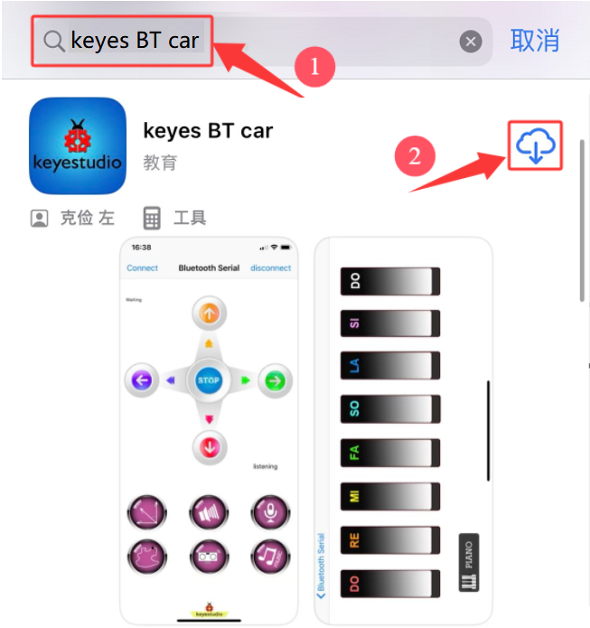

c. 下载安装后，打开 keyes BT car APP，出现如下图界面，参照提示进行相应的操作。

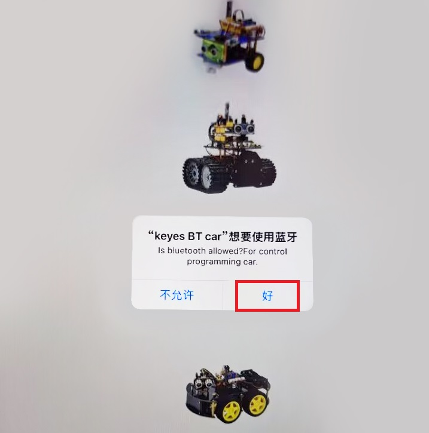

d. 打开手机/平板上的蓝牙。

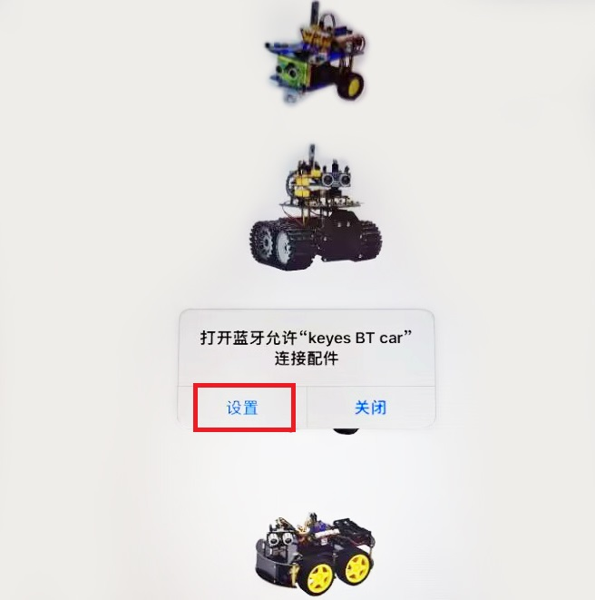

### 8.4 项目组件：

| 组装好的智能车(未插上蓝牙模块) *1 | 草帽LED白发红模块 *1 | 3Pin 双母头杜邦线 *1  |
| --- | --- | --- | --- |
|  | | |
| USB线 *1 | 5号(1.5V)电池 *6（电池自备） | 蓝牙模块 |
| |  |  |

### 8.5 示例代码1：APP测试

⚠️ **重要提示：**

- **上传示例代码前，请务必拔掉蓝牙模块！ 因为蓝牙模块也占用Arduino的串口通信（TX/RX），如果不拔掉，示例代码上传会失败。示例代码上传成功后，再插回蓝牙模块。**

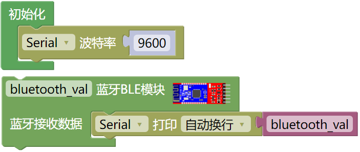

### 8.6 项目结果1：

⚠️ **重要提示：**

- **上传示例代码前，请务必拔掉蓝牙模块！ 因为蓝牙模块也占用Arduino的串口通信（TX/RX），如果不拔掉，示例代码上传会失败。示例代码上传成功后，再插回蓝牙模块。**

外接电源，将电机驱动扩展板上的拨码开关拨到 “**OFF**” 端，上电后。选择好正确的开发板板型（Arduino/Genuino Uno）和 适当的串口端口（COMxx），然后单击  按钮上传示例代码1至Arduino控制板。

- 打开电源：将电机驱动扩展板上的拨码开关拨到 “**ON**” 端。

- 将蓝牙模块直接插在电机驱动扩展板上，注意一下蓝牙方向，确认接线无误。

| 蓝牙模块 | 电机驱动扩展板 | 
| :--: | :--: |
| EN | - | 
| VCC | 5V |
| GND | G |
| TXD | RX | 
| RXD | TX |
| STATE | - |

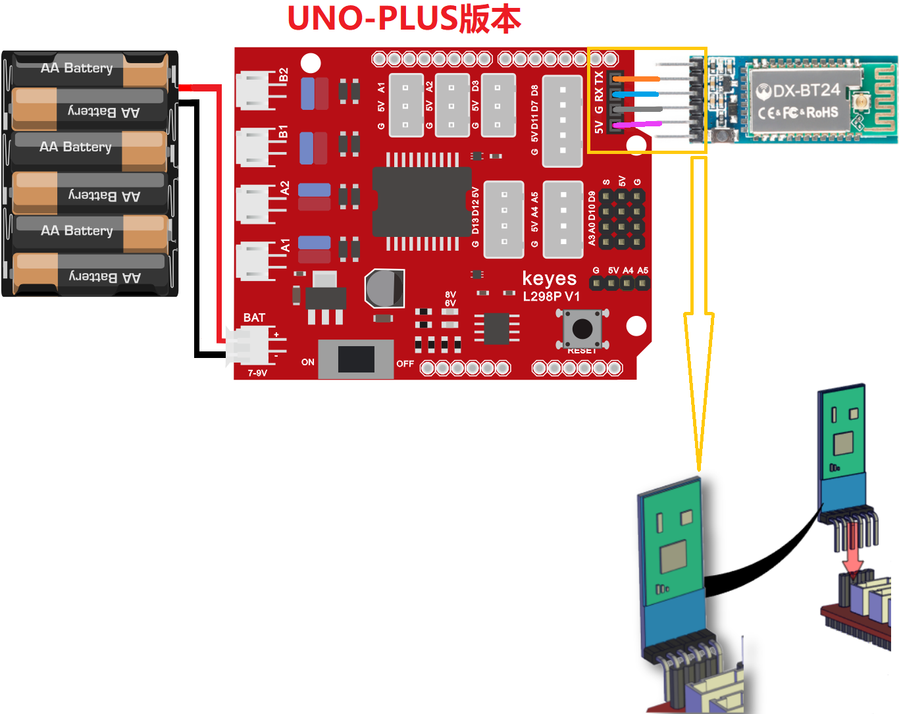

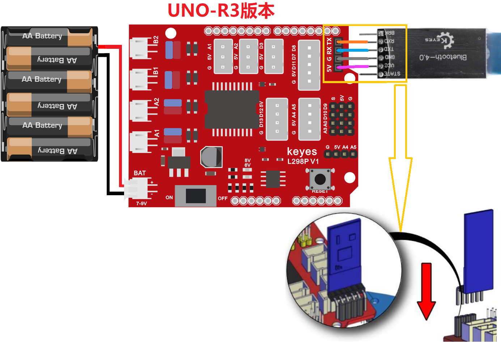

- ⚠️ **特别注意：**

  - 接线时请确保电源断开(拔掉Arduino主控板上的USB线或将电机驱动扩展板上的拨码开关拨到 “**OFF**” 端)，避免短路。

  - 电源连接：电池盒电源接到电机驱动扩展板的 BAT 接口（注意正负极不要接反），端口正反面，请勿反插，否则会损坏端口。

  - 电池正负极切勿接反，否则可能烧毁电机驱动扩展板。

- 连接好蓝牙模块，蓝牙模块上的LED闪烁。

**安卓系统(Android)**

- 打开手机/平板上的蓝牙。

- 点击手机/平板上的APP图标，进入APP界面，显示如下图：

- 点击APP界面左上角的图标 “**CONNECT**”，搜索到对应的蓝牙设备（**BT24**--针对UNO-PLUS版本 // **HMSoft**--针对UNO-R3版本），上下滑动找到对应的蓝牙设备（**BT24**--针对UNO-PLUS版本 // **HMSoft**--针对UNO-R3版本），显示如下图：

- 点击 “**connect**” 来连接蓝牙，蓝牙连接成功后，“**connect**” 字样会变成 “**is connected**” 字样，显示如下图。这时，蓝牙模块上的LED变为常亮。

- 打开串口监视器，设置波特率为9600，按下APP界面上的各个按键，串口监视器窗口会打印对应的字符。

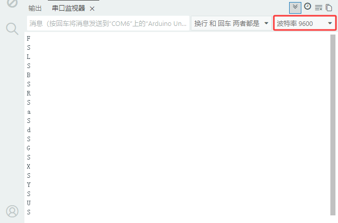

**苹果系统(iOS)**

- 打开手机/平板上的蓝牙。

- 点击手机/平板上的APP图标，进入APP界面，显示如下图：

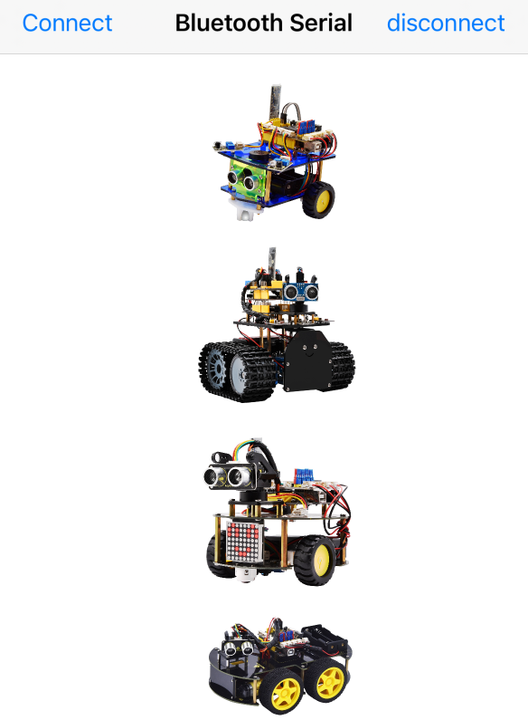

- 点击APP界面左上角的图标 “**CONNECT**”，搜索到对应的蓝牙设备（**BT24**--针对KE0165套件 // **HMSoft**--针对KE0165套件），上下滑动找到对应的蓝牙设备（**BT24**--针对KE0165套件 // **HMSoft**--针对KE0165套件），显示如下图：

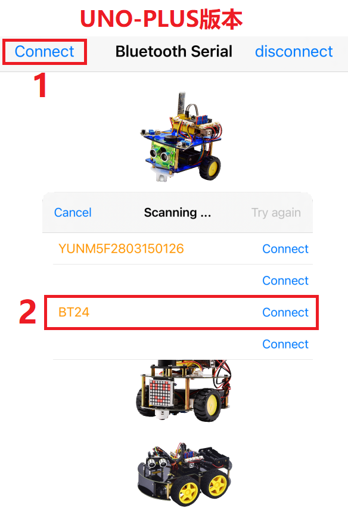

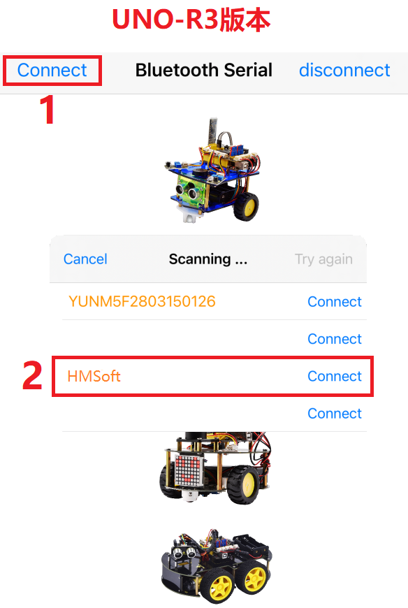

- 点击 “**Connect**” 来连接蓝牙，蓝牙连接成功后，蓝色字体“**Connect**” 字样会变成 绿色字体“**Connect**” 字样，显示如下图。这时，蓝牙模块上的LED变为常亮。

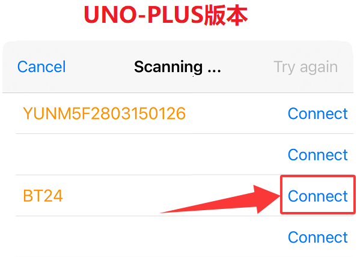

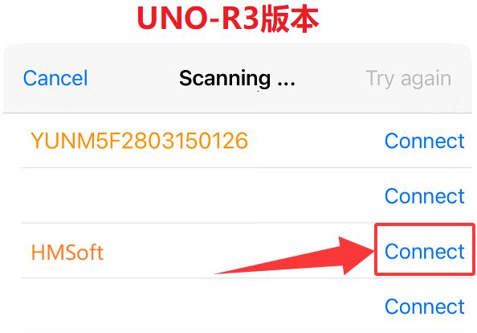

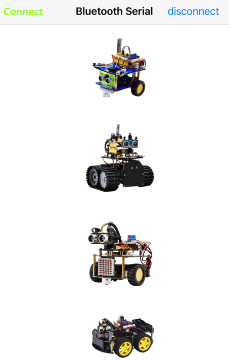

- 点击 “**keyes 4wd**” 图标进入APP操作页面。

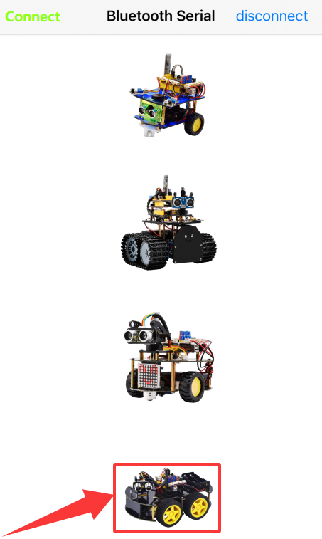

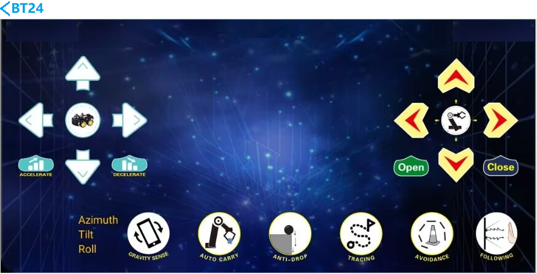

- 单击Mixly IDE左上角的，出现串口监视器窗口，设置串口波特率为 9600。按下APP界面上的各个按键，串口监视器窗口会打印对应的字符。

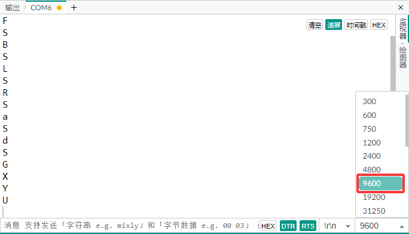

### 8.7 示例代码2：蓝牙控制LED：

上面的项目，我们讲解了蓝牙接收到手机/平板发送的信号并且在开发板的串口显示出来，接下来，利用手机/平板上APP上的 键发送的命令去打开或者关闭一个LED灯。

⚠️ **重要提示：**

- **上传示例代码前，请务必拔掉蓝牙模块！ 因为蓝牙模块也占用Arduino的串口通信（TX/RX），如果不拔掉，示例代码上传会失败。示例代码上传成功后，再插回蓝牙模块。**

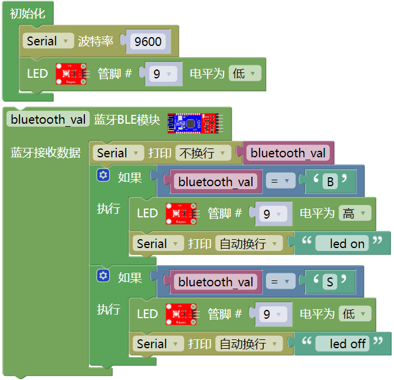

### 8.8 项目结果2：

⚠️ **重要提示：**

- **上传示例代码前，请务必拔掉蓝牙模块！ 因为蓝牙模块也占用Arduino的串口通信（TX/RX），如果不拔掉，示例代码上传会失败。示例代码上传成功后，再插回蓝牙模块。**

外接电源，将电机驱动扩展板上的拨码开关拨到 “**ON**” 端，上电后。选择好正确的开发板板型（Arduino/Genuino Uno）和 适当的串口端口（COMxx），然后单击  按钮上传示例代码2至Arduino控制板。

- 打开电源：将电机驱动扩展板上的拨码开关拨到 “**ON**” 端。

- 将蓝牙模块直接插在电机驱动扩展板上，注意一下蓝牙方向，确认接线无误；LED模块也连接到电机驱动扩展板对应位置上。

| 蓝牙模块 | 电机驱动扩展板 | 
| :--: | :--: |
| EN | - | 
| VCC | 5V |
| GND | G |
| TXD | RX | 
| RXD | TX |
| STATE | - |

| LED 模块 | 电机驱动扩展板 | 
| :--: | :--: | 
| GND | G |
| VCC | 5V |
| S | S(D9) | 

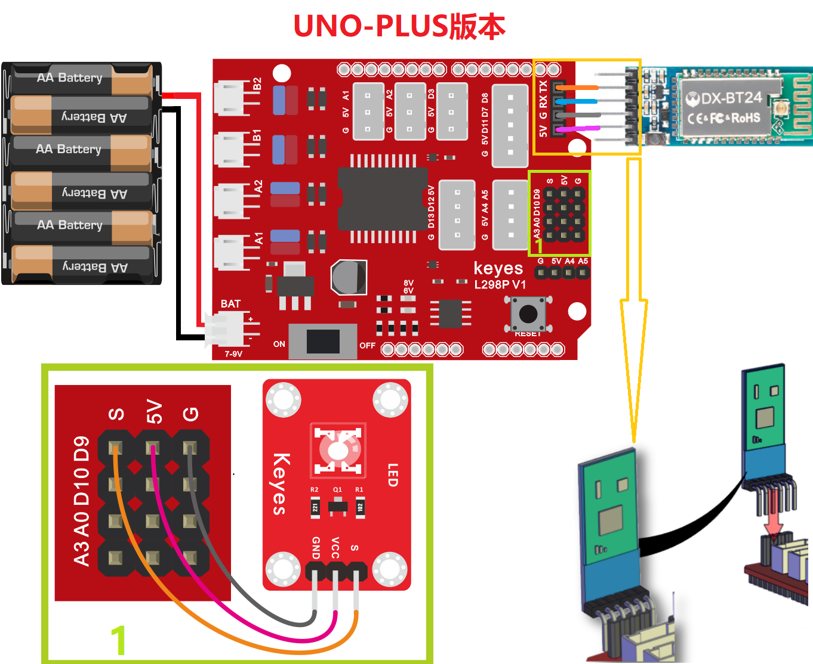

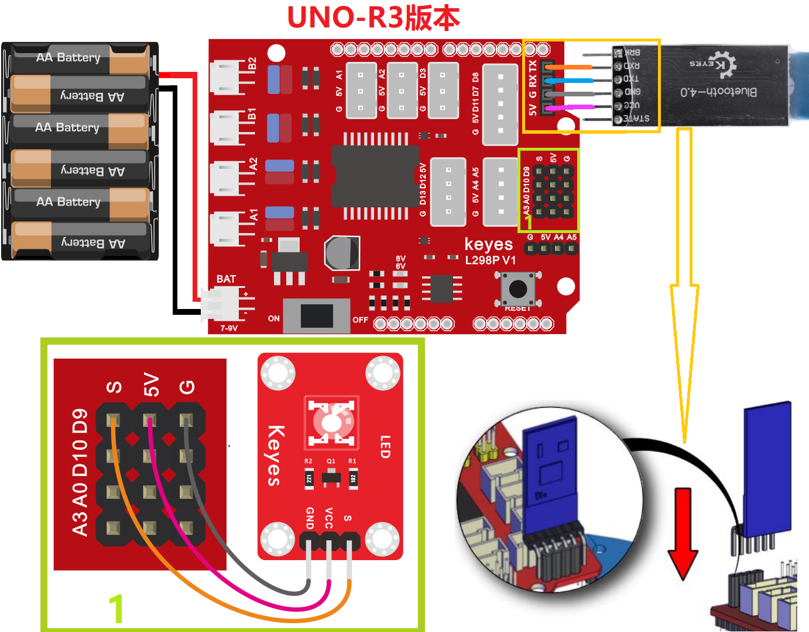

- ⚠️ **特别注意：**

  - 接线时请确保电源断开(拔掉Arduino主控板上的USB线或将电机驱动扩展板上的拨码开关拨到 “**OFF**” 端)，避免短路。

  - 电源连接：电池盒电源接到电机驱动扩展板的 BAT 接口（注意正负极不要接反），端口正反面，请勿反插，否则会损坏端口。

  - 电池正负极切勿接反，否则可能烧毁电机驱动扩展板。

- 连接好蓝牙模块，蓝牙模块上的LED闪烁。

⚠️ **特别提醒：这里是以安卓系统(Android)手机/平板操作为例，苹果系统(IOS)在这里就不多讲，自己可以参照。**

- 打开手机/平板上的蓝牙。

  

- 点击手机/平板上的APP图标，进入APP界面，显示如下图：

  

- 点击APP界面左上角的图标 “**CONNECT**”，搜索到对应的蓝牙设备（**BT24**--针对KE0165套件 // **HMSoft**--针对KE0165套件），上下滑动找到对应的蓝牙设备（**BT24**--针对KE0165套件 // **HMSoft**--针对KE0165套件），显示如下图：

  

- 点击 “**connect**” 来连接蓝牙，蓝牙连接成功后，“**connect**” 字样会变成 “**is connected**” 字样，显示如下图。这时，蓝牙模块上的LED变为常亮。

  

- 点击手机/平板APP上的  键来控制LED。

  - 当你按住  键时，串口监视器窗口接收到字符 'B'，同时LED将打开；
  
  - 当你松开  键时，串口监视器窗口接收到字符 'S'，同时LED将关闭。
  
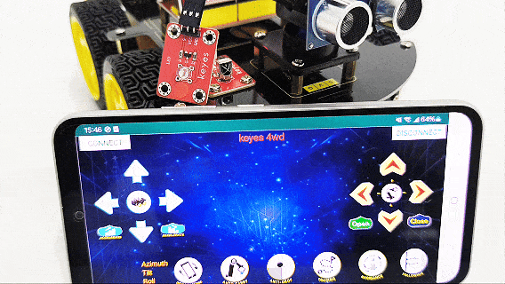

  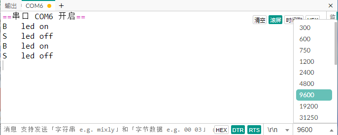

### 8.9 代码说明：

初始化串口通信，设置波特率为9600，使Arduino能与电脑或蓝牙模块正常通信。

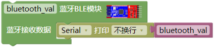

检查串口缓存区是否有数据，若有则大于0。读取串口缓存区里的一个数据，存到 `bluetooth_val` 变量并打印出来。

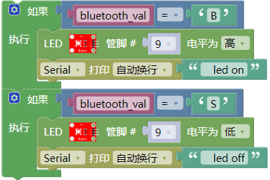

若收到字符 'B' 时，让LED点亮; 若收到字符 'S' 时，让LED熄灭。

### 8.10 注意事项：

1\. 上传代码前不要插蓝牙模块，否则会导致代码上传不成功。

2\. 使用电池时注意安全，避免短路。

3\. 蓝牙连接时，手机/平板与蓝牙模块需在有效距离内。
