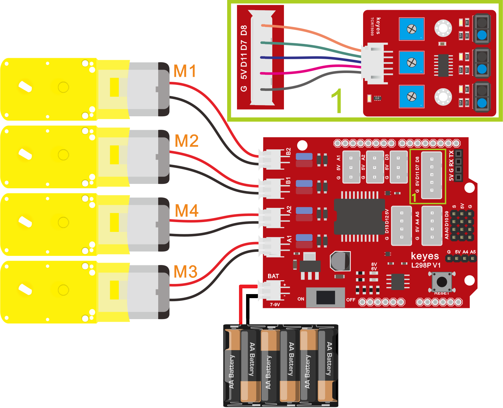
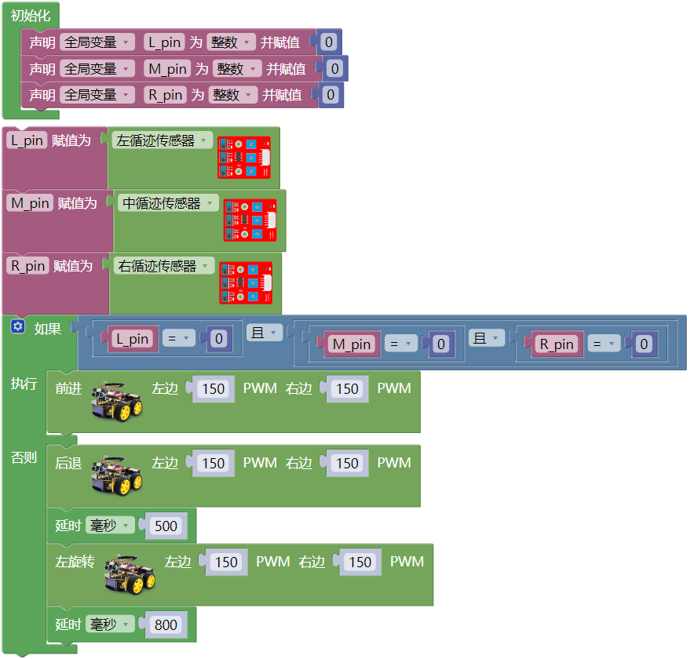

## 第11课 画地为牢智能车

### 11.1 项目介绍：

在前面的课程中，我们已经学习了智能车上各个传感器、模块和扩展板的使用方法。今天，我们将把这些知识结合起来，制作一个有趣的“画地为牢”智能车。
什么是“画地为牢”？ 在这个实验中，我们会在地面上用黑色胶带贴出一个封闭的圆圈或方框（就像画了一个牢笼）。智能车的任务是：只要它在白色地面上行驶，就继续前进；一旦它的传感器检测到黑色的边界线，它就会立刻意识到“我碰到墙了”，然后后退并转弯，从而始终被困在这个黑线圈里面，无法逃脱。

### 11.2 工作原理：

智能车底部安装了三个循迹传感器（左、中、右）。循迹传感器利用红外线的反射原理工作：

- 遇到白色地面：光线反射强，传感器输出低电平（0）。
- 遇到黑色线条：光线被吸收，反射弱，传感器输出高电平（1）。

**控制逻辑如下：**

| 左传感器 | 中传感器 | 右传感器 | 状态判断 | 小车动作|
| :--: | :--: | :--: | :--: | :--: |
| 0 (白) | 0 (白) | 0 (白) |都在白地上，没碰到线| 前进 (PWM 200) |
| 1 (黑) | 任意 | 任意 |左边碰到线 |后退 然后 左转 | 
| 任意 |1 (黑)| 任意|中间碰到线| 后退 然后 左转 | 
| 任意 | 任意 | 1 (黑) |右边碰到线| 后退 然后 左转 | 

### 11.3 项目组件：

| 组装好的智能车(未插上蓝牙模块) *1 |USB线 *1 | 5号(1.5V)电池 *6（电池自备） |
| --- | --- | --- | --- |
|  | |  |

### 11.4 接线图：

⚠️ 特别注意：4WD智能车已经组装好了，这里不需要把三路循迹模块和4个电机拆下来又重新组装和接线，这里再次提供接线图，是为了方便您编写代码！

| 三路循迹模块 | 电机驱动扩展板 | 
| :--: | :--: | 
| S1右侧(R) | D8 |
| S2中间(M) | D7 |
| S3左侧(L) | D11 | 
| V | 5V |
| G | G |

| 电机 | 电机驱动扩展板 | 
| :--: | :--: | 
| 左侧电机（M1） | B2 |
| 左侧电机（M2） | B1 |
| 右侧电机（M3） | A1 |
| 右侧电机（M4） | A2 | 

⚠️ **特别注意：**

- 接线时请确保电源断开(拔掉Arduino主控板上的USB线或将电机驱动扩展板上的拨码开关拨到 “**OFF**” 端)，避免短路。

- 电源连接：电池盒电源接到电机驱动扩展板的 BAT 接口（注意正负极不要接反），端口正反面，请勿反插，否则会损坏端口。

- 电池正负极切勿接反，否则可能烧毁电机驱动扩展板。

### 11.5 示例代码：

⚠️ **重要提示：**

- **上传示例代码前，请务必拔掉蓝牙模块！ 因为蓝牙模块也占用Arduino的串口通信（TX/RX），如果不拔掉，示例代码上传会失败。**

### 11.6 项目结果：

⚠️ **重要提示：**

- **上传示例代码前，请务必拔掉蓝牙模块！ 因为蓝牙模块也占用Arduino的串口通信（TX/RX），如果不拔掉，示例代码上传会失败。**

外接电源，将电机驱动扩展板上的拨码开关拨到 “**OFF**” 端。选择好正确的开发板板型（Arduino/Genuino Uno）和 适当的串口端口（COMxx），然后单击  按钮上传示例代码至Arduino控制板。

- 在地面上用黑色胶带贴一个大的封闭圆圈或方形。

- 将4WD智能车放在圆圈内部的白色区域。

- 开启电源，将电机驱动扩展板上的拨码开关拨到 “**ON**” 端。上电后，4WD智能车开始向前行驶。

- 当4WD智能车接近黑色边界时，它会立即停止前进，向后倒退一小段距离，然后向左转弯。转弯后，4WD智能车继续前进，从而始终在黑色边界围成的区域内运动，不会跑出去。

### 11.7 注意事项:

1\. 环境光线：三路循迹传感器受环境光影响较大。如果在阳光直射或非常昏暗的地方，可能检测不准确。建议在室内均匀光线下测试。

2\. 黑色胶带质量：请使用哑光黑色电工胶带，反光率越低越好。如果胶带反光太强，传感器可能无法识别为“黑线”。

3\. 延时调整：代码中的 `延时0.5秒 ` 和 `延时0.8秒` 是经验值。如果你的4WD智能车后退太多或转弯角度不够，可以适当调整这两个数值。

- 如果4WD智能车总是冲出边界：增加后退时间或左转时间。

- 如果4WD智能车在边界处抖动厉害：减少后退时间。

4\. 电池电量：电量不足会导致电机转速变慢，影响转弯效果，请确保电池电量充足。
