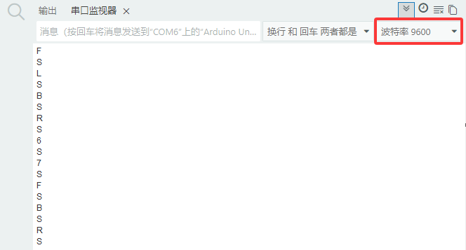
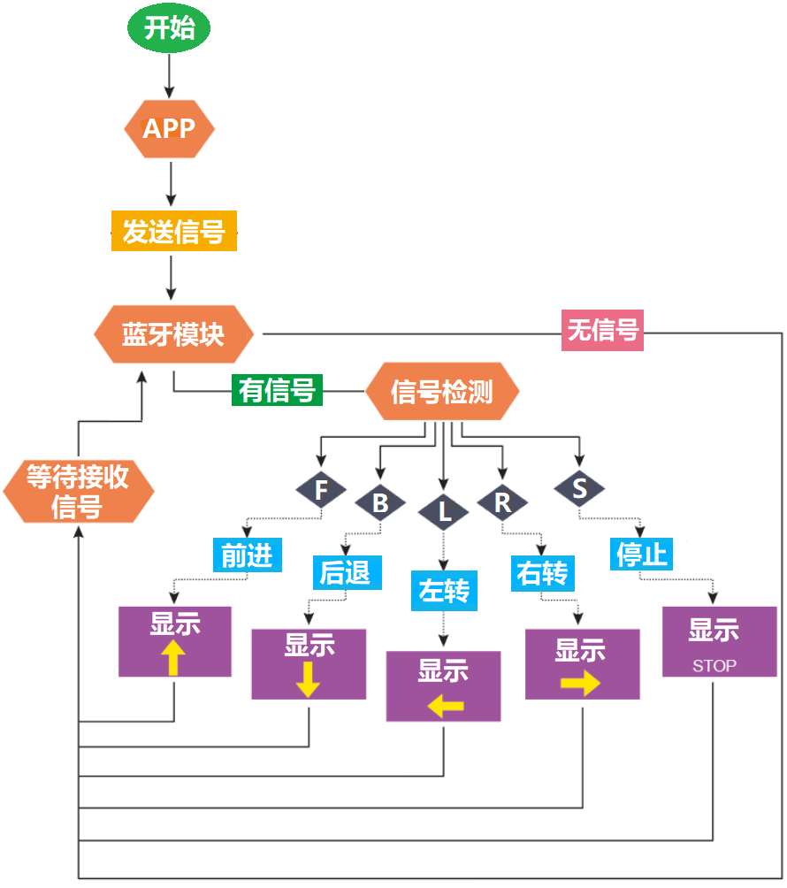
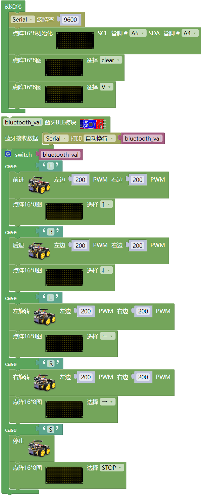
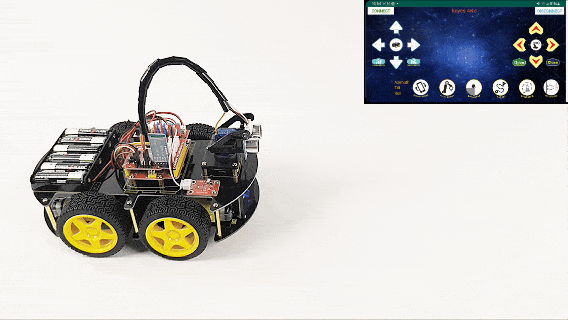

## 第16课 蓝牙遥控智能车

### 16.1 项目介绍：

在之前的课程中，我们学习了如何使用红外线遥控器来控制智能车。虽然红外遥控很方便，但它有一个缺点：必须对准接收头，且距离有限。

在这节课中，我们将升级我们的智能车，使用**蓝牙（Bluetooth）**技术进行控制。蓝牙是一种无线通信技术，可以让手机和智能车在没有物理连接的情况下“对话”。

**在这个项目中：**

- 控制端（主机）：你的智能手机。我们需要在手机上安装一个专用的蓝牙APP。
- 被控制端（从机）：装有蓝牙模块的智能车。

通过手机APP上的按钮，我们可以发送指令给智能车，让它前进、后退、转弯，甚至可以在车头的8x16 LED点阵屏上显示相应的箭头图案，非常酷！

### 16.2 工作原理与流程图：

**通信流程**

- 1\. 配对连接：手机蓝牙搜索并连接到智能车上的蓝牙模块。

- 2\. 发送指令：当你按下手机APP上的按钮时，APP会向蓝牙模块发送一个特定的字符（例如按下“前进”发送字符 `F`）。

- 3\. 接收处理：智能车上的Arduino通过串口（Serial）接收到这个字符。

- 4\. 执行动作：程序判断收到的字符是什么，然后控制电机驱动板让车轮转动，同时控制LED点阵屏显示对应的图案。

**调试步骤**

在编写正式代码前，我们需要知道手机APP发出的每个按钮对应什么字符。

- 1\. 先取下蓝牙模块（防止上传代码时干扰串口）。

- 2\. 将测试代码上传到Arduino。

- 3\. 连接蓝牙模块，打开串口监视器，设置波特率为 9600。

- 4\. 用手机APP连接蓝牙，按下不同按钮，观察串口监视器收到的字符。

**按钮功能对照表**

经过测试，我们整理了手机APP按钮、发送字符与小车功能的对应关系：

经过测试，我们得出了手机APP上各个按钮对应的控制字符和各个按钮对应的功能，这里我们整理了一个表格如下：

| 按钮图示 | 功能说明 | 控制字符逻辑 |
| :--: | :--: | :--: |
|  |配对连接蓝牙模块 | - |
|  | 断开蓝牙连接 | - |
|  | 前进 | 按住发送 `F`；松开发送 `S` |
|  |后退| 按住发送 `B`；松开发送 `S` |
|  | 左旋转 |按住发送 `L`；松开发送 `S` |
|  | 右旋转 | 按住发送 `R`；松开发送 `S` |
|  | 加速，最大加到255| 按住发送 `a`；松开发送 `S` |
| | 减速，最小减到0 | 按住发送 `d`；松开发送 `S` |
|  | 方向感应控制开关 | 点击切换开启/退出 |
|  | 避障功能开关 | 点击发送 `Y`，再次点击发送 `S`|
| | 循线功能开关| 点击发送 `X`，再次点击发送 `S` |
| | 跟随功能开关| 点击发送 `U`，再次点击发送 `S` |
| | 画地为牢功能开关 | 点击发送 `G`，再次点击发送 `S` |

**特别提醒：** 本节课主要实现基础的蓝牙遥控运动（前进、后退、左转、右转、停止），对应的核心字符为`F`，`B`，`L`，`R`，`S`。

**流程图**

### 16.3 项目组件：

| 组装好的智能车(未插上蓝牙模块) *1 |USB线 *1 | 5号(1.5V)电池 *6（电池自备） |
| --- | --- | --- | 
|  | | | 
| 蓝牙模块  *1 | 手机/平板 *1|  |
| || |

### 16.4 接线图：

⚠️ 特别注意：4WD智能车已经组装好了，这里不需要把舵机、8x16 LED点阵模块和4个电机拆下来又重新组装和接线，这里再次提供接线图，是为了方便您编写代码！

| 蓝牙模块 | 电机驱动扩展板 | 
| :--: | :--: |
| EN | - | 
| VCC | 5V |
| GND | G |
| TXD | RX | 
| RXD | TX |
| STATE | - |

| 8x16 LED点阵模块 | 电机驱动扩展板 | 
| :--: | :--: | 
| GND | G |
| VCC | 5V |
| SDA | A4 | 
| SCL | A5 |

| 舵机 | 电机驱动扩展板 | 
| :--: | :--: | 
| 棕色线 | G |
| 红色线 | 5V |
| 橙色线 | S（D10）|  

| 电机 | 电机驱动扩展板 | 
| :--: | :--: | 
| 左侧电机（M1） | B2 |
| 左侧电机（M2） | B1 |
| 右侧电机（M3） | A1 |
| 右侧电机（M4） | A2 |

⚠️ **特别注意：**

- **上传示例代码前，蓝牙模块可以先不直插到电机驱动扩展板上！因为蓝牙模块也占用Arduino的串口通信（TX/RX），如果连接到电机驱动扩展板上，示例代码上传会失败。示例代码上传成功后，再插回蓝牙模块。**

- 接线时请确保电源断开(拔掉Arduino主控板上的USB线或将电机驱动扩展板上的拨码开关拨到 “**OFF**” 端)，避免短路。

- 电源连接：电池盒电源接到电机驱动扩展板的 BAT 接口（注意正负极不要接反），端口正反面，请勿反插，否则会损坏端口。

- 电池正负极切勿接反，否则可能烧毁电机驱动扩展板。

### 16.5 示例代码：

⚠️ **重要提示：**

- **上传示例代码前，请务必拔掉蓝牙模块！ 因为蓝牙模块也占用Arduino的串口通信（TX/RX），如果不拔掉，示例代码上传会失败。示例代码上传成功后，再插回蓝牙模块。**

### 16.6 项目结果：

⚠️ **重要提示：**

- **上传示例代码前，请务必拔掉蓝牙模块！ 因为蓝牙模块也占用Arduino的串口通信（TX/RX），如果不拔掉，示例代码上传会失败。示例代码上传成功后，再插回蓝牙模块。**

外接电源，将电机驱动扩展板上的拨码开关拨到 “**OFF**” 端。选择好正确的开发板板型（Arduino/Genuino Uno）和 适当的串口端口（COMxx），然后单击  按钮上传示例代码至Arduino控制板。

- 打开电源：将电机驱动扩展板上的拨码开关拨到 “**ON**” 端。

- 插上蓝牙模块，确认接线无误。

- 连接好蓝牙模块，上电后，蓝牙模块上的LED闪烁。

⚠️ **特别提醒：这里是以安卓系统(Android)手机/平板操作为例，苹果系统(IOS)在这里就不多讲，自己可以参照。**

- 打开手机/平板上的蓝牙。

  

- 点击手机/平板上的APP图标，进入APP界面，显示如下图：

  

- 点击APP界面左上角的图标 “**CONNECT**”，搜索到对应的蓝牙设备（**BT24**--针对UNO-PLUS版本 // **HMSoft**--针对UNO-R3版本），上下滑动找到对应的蓝牙设备（**BT24**--针对UNO-PLUS版本 // **HMSoft**--针对UNO-R3版本），显示如下图：

  

  

- 点击 “**connect**” 来连接蓝牙，蓝牙连接成功后，“**connect**” 字样会变成 “**is connected**” 字样，显示如下图。这时，蓝牙模块上的LED变为常亮。

  

  

- 操控4WD智能车：

    - 按住  键，小车向前移动，8x16 LED点阵屏显示向上箭头。
    
    - 按住  键，小车向后移动，8x16 LED点阵屏显示向下箭头。
    
    - 按住  键，小车左转，8x16 LED点阵屏显示向左箭头。
    
    - 按住  键，小车右转，8x16 LED点阵屏显示向右箭头。
    
    - 松开按键，小车停止，屏幕显示停止标志。
    
    - 点击  键，开启手机方向感应控制，再次点击  键，退出方向感应控制。
    

### 16.7 注意事项：

1\. 电源充足：高速运转时电机消耗电流较大，请确保电池电量充足，否则4WD智能车可能会因为电压不足而行动迟缓或重启。
    
2\. 上传代码问题：由于蓝牙模块占用了 Arduino 的 D0 (RX) 和 D1 (TX) 引脚，在上传代码前，务必拔掉蓝牙模块的 TX 和 RX 连线，否则会出现“上传错误”。上传完成后再插回。
    
3\. 速度范围：PWM 值必须在 0-255 之间。如果代码逻辑错误导致数值溢出，电机可能无法正常工作。
   
4\.  地面摩擦：在不同的地面（如地毯、瓷砖）上，4WD智能车的实际速度感会有所不同，这是正常现象。

