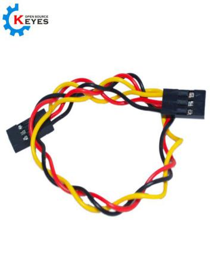
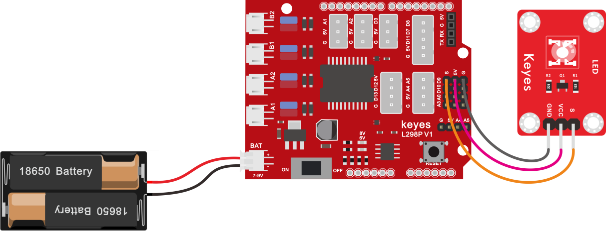
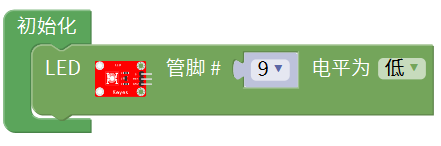
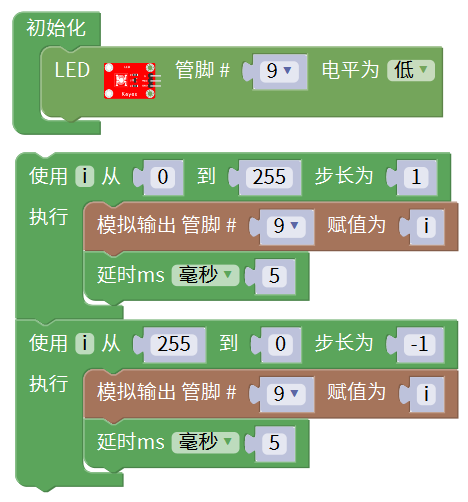
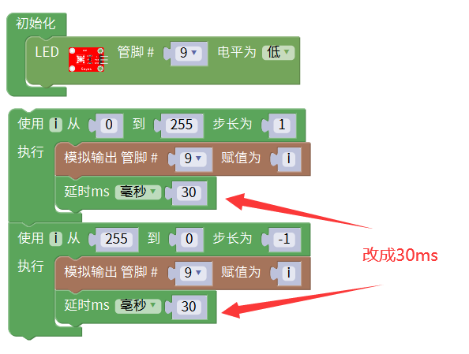

## 第2课 LED 亮度的调节

### （1）项目介绍：

前面课程中，我们详细的介绍了通过代码控制LED亮灭，实现闪烁的效果。这节课我们使用PWM来控制LED亮度不断地变化，模拟我们呼吸的效果。

PWM是使用数字手段来控制模拟输出的一种手段。使用数字控制产生占空比不同的方波（一个不停在高电平与低电平之间切换的信号)来控制模拟输出。一般来说端口的输入电压只有两个0V与5V。如果想要改变灯的亮度怎么办呢个？有同学说串联电阻，对，这个方法是正确的。但是，如果想要得到不同的亮度，且在不同亮度之间来回变动怎么办呢？不可能不停地切换电阻吧。这种情况下就需要使用PWM了，那它是怎么控制的呢？

对于Arduino的数字端口电压输出只有LOW与HIGH两个，对应的就是0V与5V的电压输出，可以把LOW定义为0，HIGH定义为1，1秒内让Arduino输出500个0或者1的信号。如果这500个全部为1，那就是完整的5V，如果全部为0，那就是0V。如果010101010101这样输出，刚好一半，端口输出的平均电压就为2.5V了。这个和放映电影是一个道理，咱们所看的电影并不是完全连续的，它其实是每秒输出25张图片。在这种情况下，人的肉眼是分辨不出来的，看上去就是连续的了。PWM也是同样的道理，如果想要不同的电压，就控制0与1的输出比例控制就可以了。当然这和真实的连续输出还是有差别的，单位时间内输出的0,1信号越多，控制的就越精确。

### （2）项目组件：

| keyes PLUS 开发板*1 | Keyes brick L298P 电机驱动扩展板 V1*1 | keyes 草帽LED白发红模块*1 | keyes 草帽LED白发红模块*1 |
| --- | --- | --- | --- |
|  |  |  |  |
| USB线*1 | 3Pin 双母头杜邦线*1 | 18650双节电池盒*1 | 18650电池*2 （电池自配） |
|  |  |  |  |

### （3）接线图：

Arduino的PWM引脚在3，5，6，9，10，11,我们将LED接在D9脚上。

### （4）项目代码：

①初始化D9引脚上的LED为低电平

③从**控制**栏目里面拖出以下模块，设置i从0到255，步长为1，就执行方块中的命令（代码）

④从**输入/输出**栏目里面拖出模拟输出管脚,设置为10，赋值为变量i

⑤拖出一个**延时**模块，时间设置为5毫秒

⑥从**控制**栏目里面拖出以下模块，设置i从255到0，步长为-1，就执行方块中的命令（代码）

⑦再拖出一个模拟输出管脚模块，设置为10，并且赋值为变量i

⑧再拖出一个**延时**模块，时间设置为5毫秒

**（5）项目结果：**

上传代码到开发板代，完成后，我们可以看到LED会有个逐渐由亮到灭的一个缓慢过程，而不是直接的亮灭，如同呼吸一般，均匀变化。

### （6）项目拓展：

我们不改变灯的脚位，只是改变程序里面delay的值，看看它如何改变渐变效果。

上传代码到开发板，看LED渐变的效果是不是慢了一些。