4WD蓝牙多功能智能车

# 1、4WD蓝牙多功能智能车简介           
4WD蓝牙多功能智能车,是基于ARDUINO的开源机器人，可以让孩子们轻松学习编程,并且获得有关电子，机械，控制逻辑和计算机科学的实践知识。
他的安装和接线也十分简单，组件都通过螺钉和铜柱连接，只需要几个简单的步骤就可以组装完成。他提供了十多个编程的课程项目，由简单到复杂，一步一步，学习怎么去编写机器人能”听”懂的语言。

# 2、4WD蓝牙多功能智能车特点          
1.功能多多：避障功能，跟随功能，红外遥控，蓝牙控制，循迹功能，显示图案等。
2.组装简单：无需焊接电路，只需几个简单的步骤即可组装该机器人。
3.结构坚固：构成车体的部分是PCB材质，电机用是优质的金属电机。
4.扩展性强：配置了电机驱动扩展板，可以扩展其他的传感器和模块。
5.多种控制：红外遥控器控制，手机遥控控制（苹果和安卓手机都可）。
6.学习基础编程：提供了Arduino IDE的C语言编程、Mixly图形化编程、Scartch图形化编程三款编程软件教程，可以接触底层代码。

# 3、4WD蓝牙多功能智能车参数          
工作电压：5v
输入电压：7-12V
最大输出电流：1A
最大耗散功率：25W（T=75℃）
电机转速：5V  63 rpm / min
电机驱动形式：双路H桥驱动
超声波感应角度：<15度
超声波探测距离：2cm-400cm
红外遥控距离：10米（实测）
蓝牙遥控距离：50米（实测）
蓝牙APP控制：支持Android和IOS系统
7.可接入外部DC 7~12V的电压。
# 4、4WD蓝牙多功能智能车清单          
当收到这个智能车套件的时候，首先看到是一个包装精美的外盒，每个配件被安全且有序的装在外盒里面的小盒子里，先来清点一下：
| 序号 | 产品名称 | 数量 | 图片 |
| --- | --- | --- | --- |
| 1 | Keyes Uno Plus 开发板 红色环保 | 1 |  |
| 2 | 4WD车前面LED屏亚克力挡板 73*44MM 黑色半透明 T=3MM 环保 | 1 | 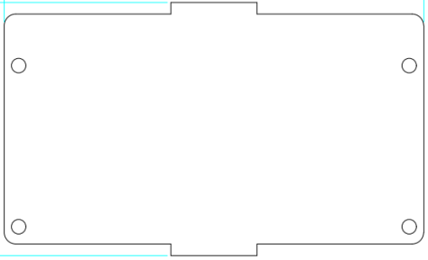 |
| 3 | Keyes brick L298P 电机驱动扩展板 V1 | 1 |  |
| 4 | DX-BT24W-A/S/M/T 无线串口高速通信透传BLE5.1低功耗蓝牙模块 | 1 | 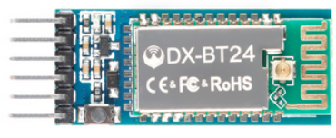 |
| 5 | HC-SR04超声波传感器 | 1 | 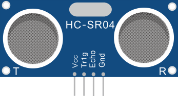 |
| 6 | keyes 草帽LED白发红模块 | 1 |  |
| 7 | 3Pin 双母头杜邦线 长20CM 2.54mm | 2 | 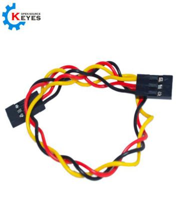 |
| 8 | Keyestudio 4WD 智能车 V3.0 PCB板(上板) | 1 | 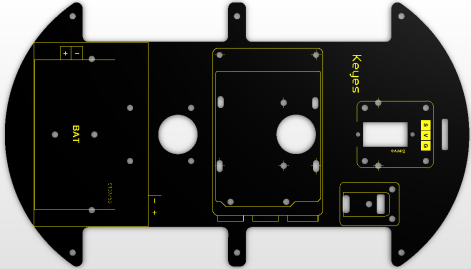 |
| 9 | Keyestudio 4WD 智能车 V3.0 PCB板(下板) | 1 | 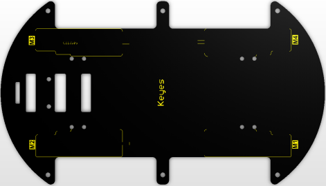 |
| 10 | Keyes connectors 循迹传感器 | 1 |  |
| 11 | keyes brick 红外接收传感器 | 1 | 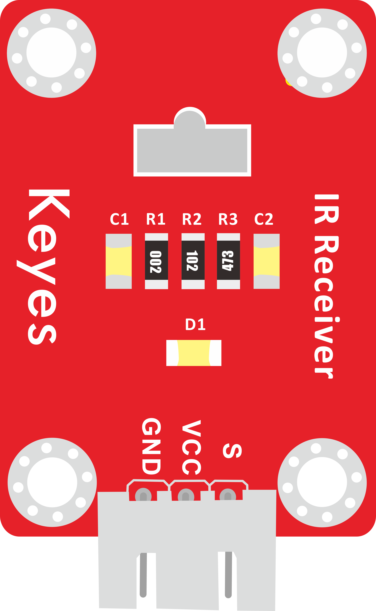 |
| 12 | 云台支架（黑色）配套 固定孔3MM | 1 | 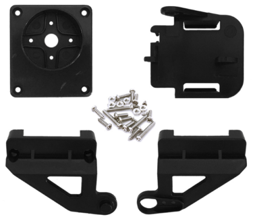 |
| 13 | SG90 9G 23*12.2*29mm 蓝色 辉盛 180度 环保 | 1 |  |
| 14 | 18650双节15CM露线适用DIY小车+双头PH2.0MM-2P 红黑线(总线长115MM) | 1 | 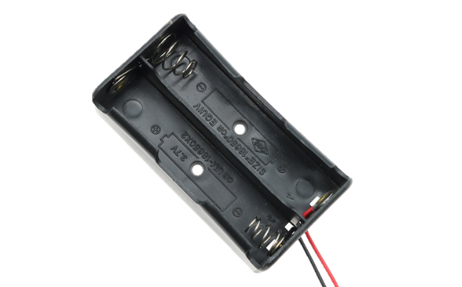 |
| 15 | 4节5号带线15CM 4排小孔+双头JST-PH2.0MM-2P 红黑线(总线长115MM) | 1 | 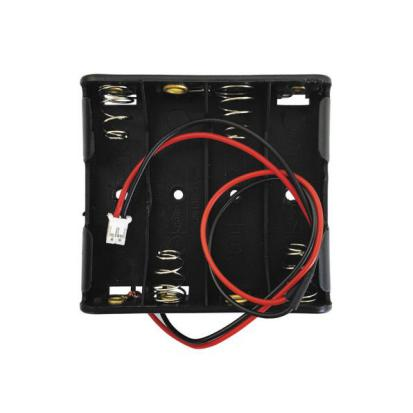 |
| 16 | keyestudio 8x16 LED灯板 黑色 环保 | 1 | 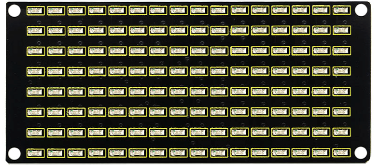 |
| 17 | 23*15*5MM 间距9MM 铝 氧化黑色 | 1 |  |
| 18 | 直径：43mm 宽度：19mm 孔径：3mm D型孔 ABS塑料+橡胶 黄色 | 4 | 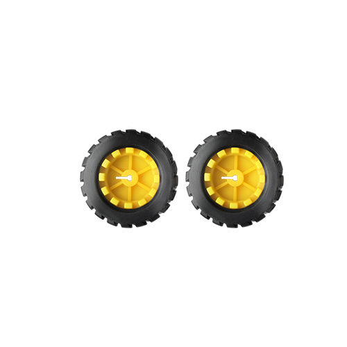 |
| 19 | 双通M3*10MM | 8 | 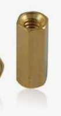 |
| 20 | 双通M3*40MM | 6 | 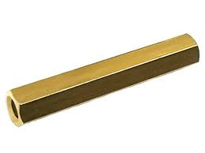 |
| 21 | M3*30MM 圆头 十字 | 8 |  |
| 22 | M3*6MM 圆头 十字 | 45 |  |
| 23 | M3 镀镍 | 20 | 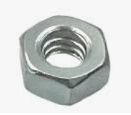 |
| 24 | 3*40MM 红黑色 十字螺丝刀 | 1 |  |
| 25 | M2*8MM 圆头 十字 | 10 |  |
| 26 | M2 镀镍 | 10 | 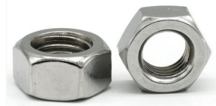 |
| 27 | M3*10MM 平头 | 3 |  |
| 28 | 4.5V 200转/分 单轴减速箱+双头轴马达+250MM PH2.0mm-2P线材 环保 | 4 |  |
| 29 | 5P XH2.54转PH2.0 26AWG 线长200MM 反向 环保 | 1 | 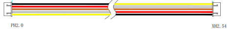 |
| 30 | HX-2.54 3P 双头 26AWG 黑红白 100mm | 1 |  |
| 31 | HX-2.54 4P 双头 26AWG 黑棕白红 200mm 反向 | 1 |  |
| 32 | HX-2.54 4P 转杜邦线母单 26AWG 黑红白棕 200mm | 1 | 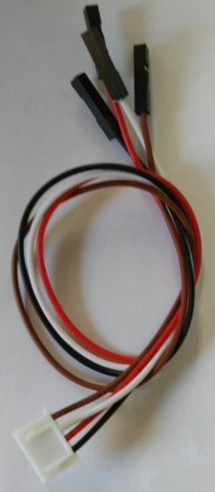 |
| 33 | JMP-1 17键86*40*6.5MM | 1 |  |
| 34 | USB2.0对TYPE C 白色 L:1M OD：4.0MM | 1 |  |
| 35 | 缠绕管 直径8MM 黑色 | 0.1 | 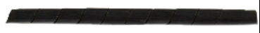 |
| 36 | 黑色 扎带 3*100MM | 10 | 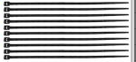 |

# 4WD蓝牙多功能智能车全部资料目录：
1、4WD蓝牙多功能智能车简介
2、4WD蓝牙多功能智能车特点
3、4WD蓝牙多功能智能车参数
4、4WD蓝牙多功能智能车清单
5、4WD蓝牙多功能智能车安装
6、PLUS开发板和Arduino IDE
7. 4WD蓝牙多功能智能车教程
第1课 LED灯项目
第2课 LED 亮度的调节
第3课 巡线传感器
第4课 舵机控制
第5课 超声波模块项目
第6课 红外接收原理及应用
第7课 蓝牙遥控的原理及应用
第8课 电机的驱动和调速
第9课 LED表情灯板
第10课 画地为牢智能车
第11课 循线智能车
第12课 超声波跟随智能车
第13课 自动避障智能车
第14课 红外遥控智能车
第15课 蓝牙遥控智能车
第16课 蓝牙调速智能车
第17课 多功能智能小车
8、常见问题解答
