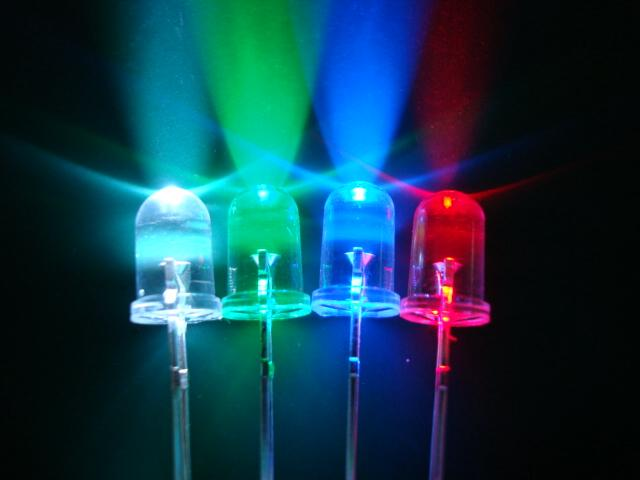
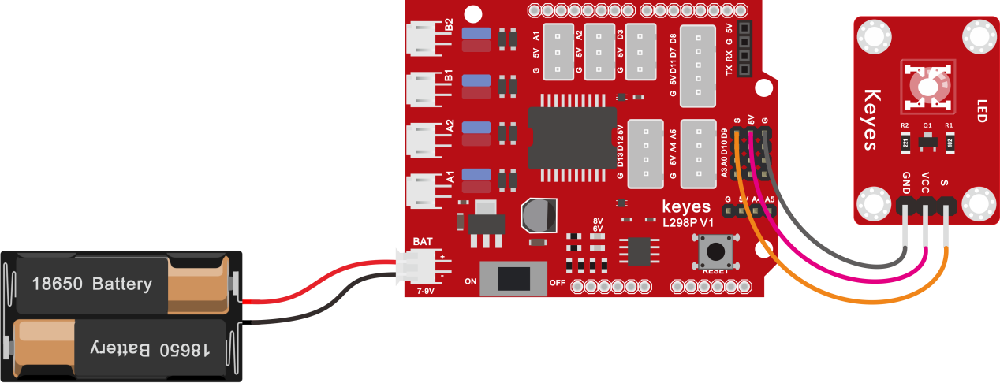
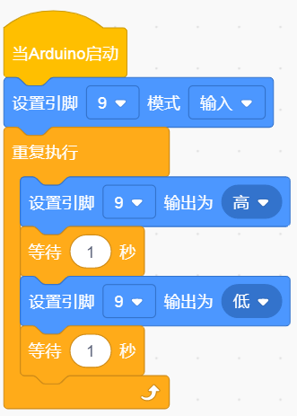
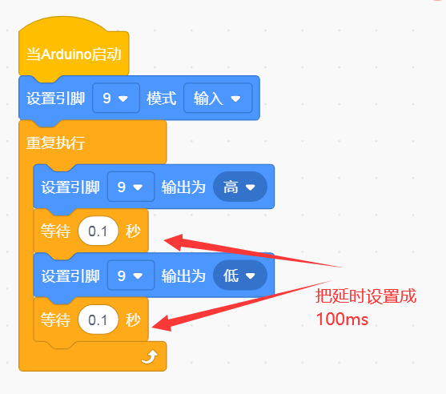

## 第1课 LED灯项目

### （1）项目介绍：

前面我们安装了keyes PLUS开发板的驱动。接下来的项目我们就要由简单到复杂，一步一步来学习编程了。首先我们要来完成经典的点亮LED项目。点亮LED项目对于学习Arduino编程的爱好者而言，是最基础的项目，是新手必须经历的一个练习。

LED ，发光二极管的简称。由含镓（Ga）、砷（As）、磷（P）、氮（N）等的化合物制成。当电子与空穴复合时能辐射出可见光，因而可以用来制成发光二极管。在电路及仪器中作为指示灯，或者组成文字或数字显示。

为了实验的方便，我们将LED发光二极管做成了一个模块，在第一个项目中，我们用一个最基本的测试代码来控制LED，亮一秒钟，灭一秒钟，来实现闪烁的效果。你可以改变代码中LED灯亮灭的时间，实现不同的闪烁效果。LED模块信号端S为高电平时LED亮起，S为低电平时LED熄灭。

### （2）LED模块参数：

控制接口: 数字口 

工作电压: DC 3.3-5V

排针间距: 2.54mm                       

LED显示颜色：红色

### （3）项目组件：

| keyes PLUS 开发板*1 | Keyes brick L298P 电机驱动扩展板 V1*1 | keyes 草帽LED白发红模块*1 | keyes 草帽LED白发红模块*1 |
| --- | --- | --- | --- |
|  |  |  |  |
| USB线*1 | 3Pin 双母头杜邦线*1 | 18650双节电池盒*1 | 18650电池*2 （电池自配） |
|  |  |  |  |

### （4）接线图：

由上图我们可以看到，扩展板是堆叠在开发板上的，LED模块的-接到了扩展板的G,LED模块的+接到了扩展板的5V，LED模块的S已经接到了扩展板上的D9接口，接好线之后我们开始编写代码：

### （5）项目代码：

①在事件栏里拉出“Arduino启动”模块。

②在引脚栏拖出设置引脚输入/输出模块

③在控制栏拖出无限循环模块

④在引脚栏拖出设置引脚高低电平模块，设置管脚为2，电平为高，点亮LED。

⑤在控制栏目里拖出延时模块，设置为1秒

⑥在引脚栏拖出设置引脚高低电平模块，设置管脚为2，电平为低，熄灭LED。

⑦再来一个延时1秒

### （6）项目结果：

点击上传程序到开发板，成功之后，D9脚接着的LED打开和关闭，而且间隔的时间是一秒钟。

### （7）项目拓展：

前面我们控制了LED 的闪烁，我们来拓展一下思路，我们要改变LED 灯的脚位，还要改变LED 灯闪烁的频率。调整一下接线图，代码如下：

怎么样是不是很好理解，就是通过改变delay 这个代码的时间，来改变9脚LED亮和灭的频率，不多说，我们上传代码。看看这个LED灯闪烁的频率是不是比之前快了？