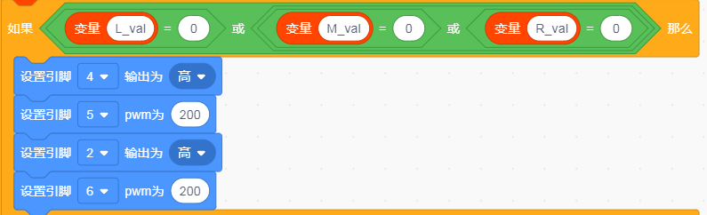
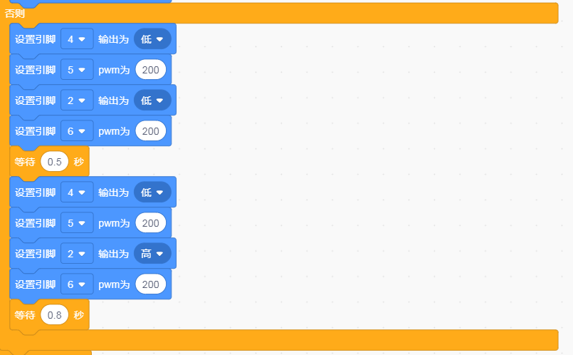
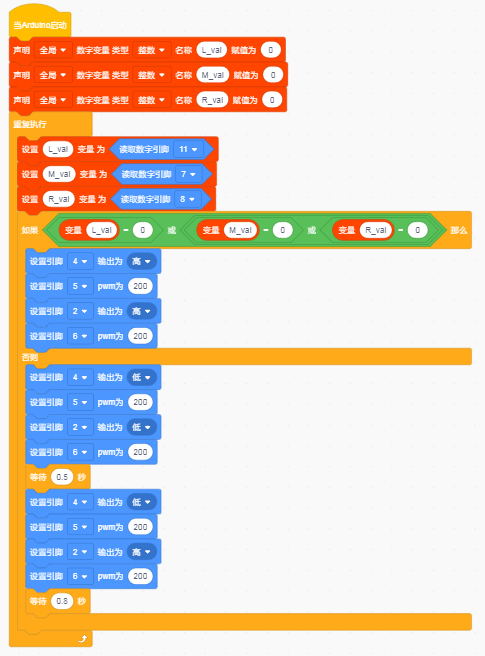

## 画地为牢智能车

### 项目介绍：

前面我们详细的介绍了智能车上各个传感器、模块、扩展板的使用方法。在这里我们可以结合前面课程中知识制作一个画地为牢智能车。实验中，我们通过循迹传感器检测智能车底部是否存在黑线，然后根据检测结果控制两个电机的转动，从而把智能车关在黑线圈中即画地为牢。

### 流程图：

画地为牢智能车具体逻辑如下表格。

| 检测 | 中循迹传感器 | 检测到黑线：高电平 | 检测到黑线：高电平 |
| --- | --- | --- | --- |
| 检测 | 中循迹传感器 | 检测到白线：低电平 | 检测到白线：低电平 |
| 检测 | 左循迹传感器 | 检测到黑线：高电平 | 检测到黑线：高电平 |
| 检测 | 左循迹传感器 | 检测到白线：低电平 | 检测到白线：低电平 |
| 检测 | 右循迹传感器 | 检测到黑线：高电平 | 检测到黑线：高电平 |
| 检测 | 右循迹传感器 | 检测到白线：低电平 | 检测到白线：低电平 |
| 条件 | 条件 | 条件 | 状态 |
| 左循迹传感器没检测到黑线 且中循迹传感器没检测到黑线且右循迹传感器没检测到黑线 | 左循迹传感器没检测到黑线 且中循迹传感器没检测到黑线且右循迹传感器没检测到黑线 | 左循迹传感器没检测到黑线 且中循迹传感器没检测到黑线且右循迹传感器没检测到黑线 | 前进（PWM设为200） |
| 左循迹传感器检测到黑线 或者中循迹传感器检测到黑线 或者右循迹传感器检测到黑线 | 左循迹传感器检测到黑线 或者中循迹传感器检测到黑线 或者右循迹传感器检测到黑线 | 左循迹传感器检测到黑线 或者中循迹传感器检测到黑线 或者右循迹传感器检测到黑线 | 后退（PWM设为200） 然后左旋转（PWM设为200） |

按照前面思路设计好智能车后，我们就需要按照设计思路开始制作智能车。我们需要设计对应的接线，测试代码，然后接线上传代码，运行，确保智能车能够实现理想中的功能。

### 接线图：循迹模块+电机

### 测试代码：

在事件栏拖出Arduino启动

在变量类型栏拖出设置变量模块，分别设置L_val、M_val、R_val三个变量

在控制栏拖出重复执行模块

设置三个变量L_val、M_val、R_val分别赋值11、7、8脚读取的值

设置条件L_val == 0或 M_val == 0 或 R_val == 0时执行前进代码

否则执行后退代码500ms；在执行左转代码800ms

**（在上传程序代码前，需要把蓝牙模块取下，否则代码会上传失败。）**

**完整代码：**

### 测试结果：

当小车行驶过程中检测到黑线立即后退500毫秒，然后左转800毫秒继续行驶。