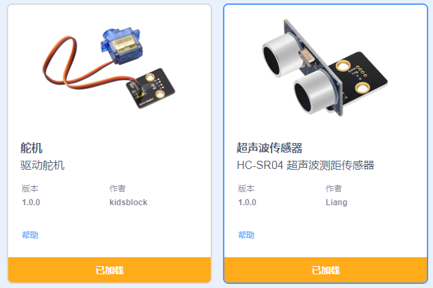
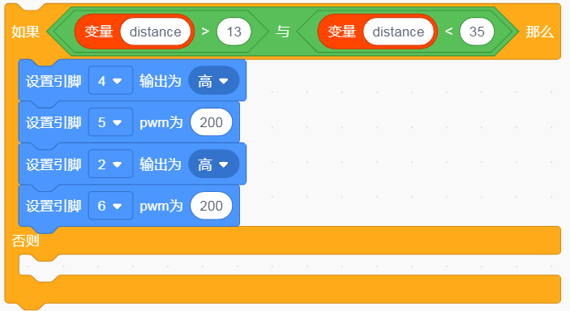
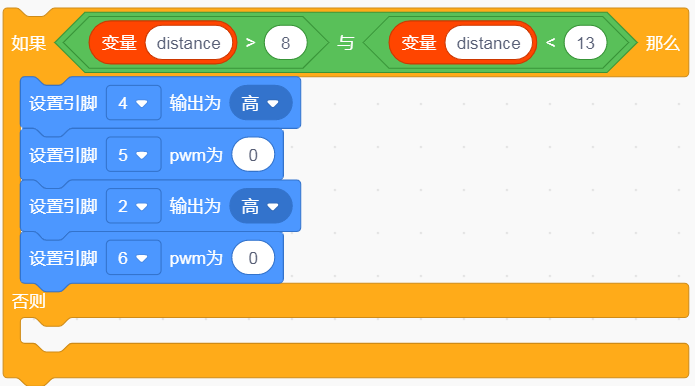
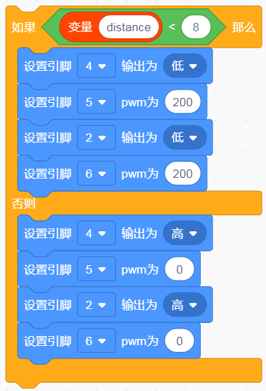
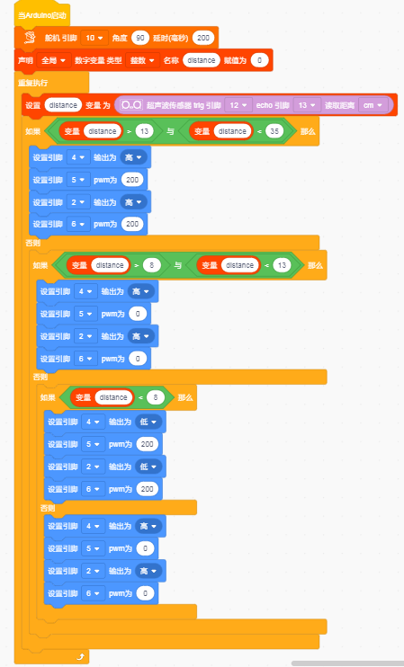

## 超声波跟随智能车

### （1）项目介绍：

我们结合硬件知识-各种传感器，模块，电机驱动器，来制造超声波跟随机器人车！

实验中，我们通过避障传感器检测智能车左右两方是否存在障碍物，检测智能车和前方障碍物的距离，然后根据这三个数据控制两个电机的转动，从而控制智能车的运动状态。

### （2）流程图：

跟随智能车具体逻辑如下表格。

| 检测 | 超声波测试前方物体距离 | distance（单位：cm） |
| --- | --- | --- |
| 条件 | distance<8 | distance<8 |
| 状态 | 后退（PWM设为100） | 后退（PWM设为100） |
| 条件 | 8＜distance≤13 | 8＜distance≤13 |
| 状态 | 停止 | 停止 |
| 条件 | 13≤distance≤35并且l_val=1并且r_val=1 | 13≤distance≤35并且l_val=1并且r_val=1 |
| 状态 | 前进（PWM设为100） | 前进（PWM设为100） |
| 条件 | distance＞35 | distance＞35 |
| 状态 | 停止 | 停止 |

### 

按照前面思路设计好智能车后，我们就需要按照设计思路开始制作智能车。我们需要设计对应的接线，测试代码，然后接线上传代码，运行，确保智能车能够实现理想中的功能。

### （3）接线图：超声波模块+电机+红外避障传感器

接线注意：A、B两电机分别对应的连接电机驱动扩展板上的接口A和接口B；超声波传感器模块的V引脚至V，T（Trig）引脚至数字12(S)，E（Echo）引脚至数字13(S)，G引脚至G；电源接到BAT接口。

### （4）测试代码：

添加超声波传感器的代码块和舵机的代码块

在事件栏拖出Arduino启动模块

**
**在舵机栏拖出设置舵机模块，并设置引脚为10，角度为90度，延时为200ms

声明一个全局变量，整形，变量名为distance，赋值为0

在控制栏拖出重复执行语句

将超声波感应的距离赋值给变量distance，超声波trig脚为12，echo为13

使用如果否则模块，单端distance是否大于13且小于35，如果是则执行前进代码

使用如果否则模块，单端distance是否大于8且小于13，如果是则执行停止代码

使用如果否则模块，单端distance小于8，如果是则执行后退代码，如果不是则执行停止代码

**完整代码：**

### （5）测试结果：

将驱动扩展板堆叠在UNO Plus板上，上传好代码，按照接线图接线，将拨码开关拨至ON端后，智能车能够随着前方障碍物的移动而移动。