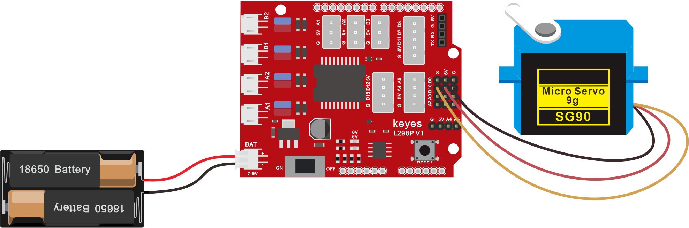
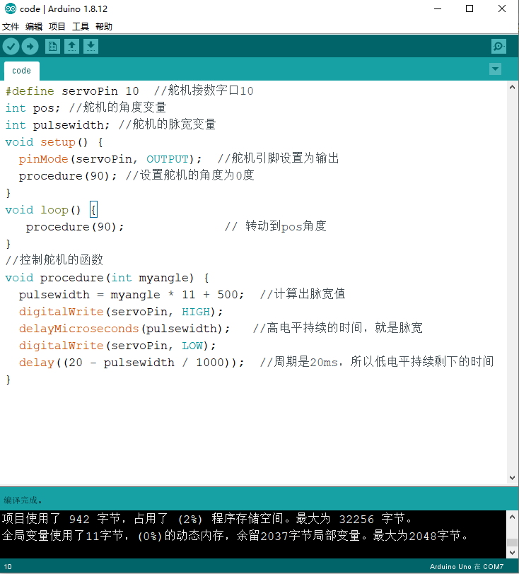
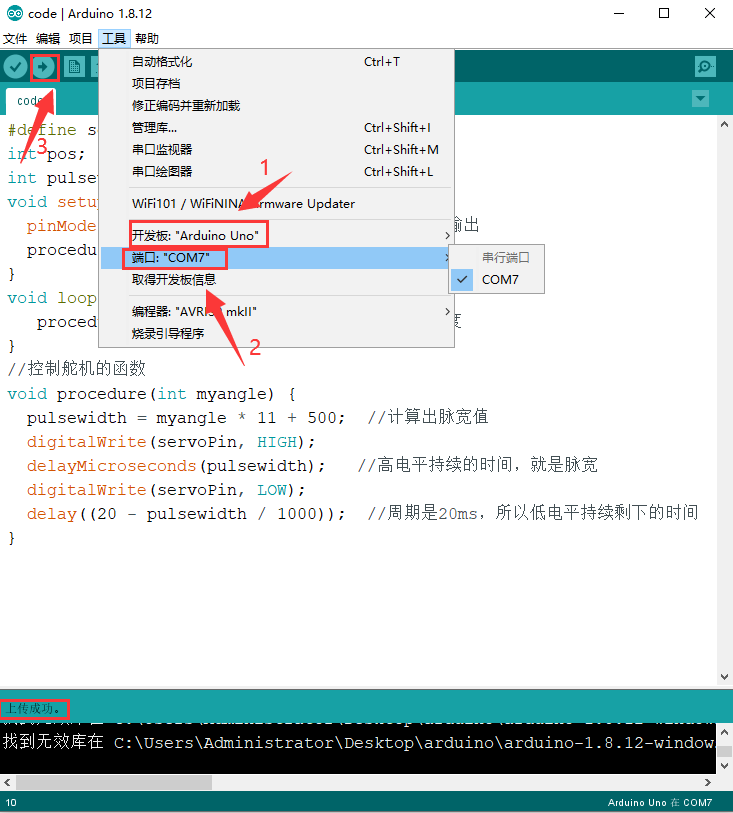

## 接线

把舵机接到驱动板的10号引脚后叠加到PULS控制板上如下图



## 上传程序

(1)复制下面的程序或者打开资料下的**舵机复位程序**

```
#define servoPin 10  //舵机接数字口10

int pos; //舵机的角度变量

int pulsewidth; //舵机的脉宽变量

void setup() {

  pinMode(servoPin, OUTPUT);  //舵机引脚设置为输出

  procedure(90); //设置舵机的角度为0度

}

void loop() {

   procedure(90);              // 转动到pos角度

}

//控制舵机的函数

void procedure(int myangle) {

  pulsewidth = myangle * 11 + 500;  //计算出脉宽值

  digitalWrite(servoPin, HIGH);

  delayMicroseconds(pulsewidth);   //高电平持续的时间，就是脉宽

  digitalWrite(servoPin, LOW);

  delay((20 - pulsewidth / 1000));  //周期是20ms，所以低电平持续剩下的时间

}
```



(2)开发板连接好电脑，选择好开发板和串口，点击上传程序，程序上传成功后舵机自动转到90度的位置


