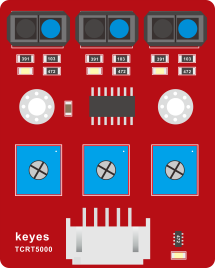
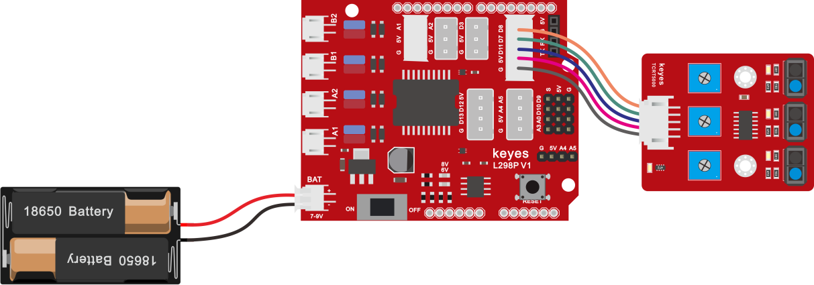
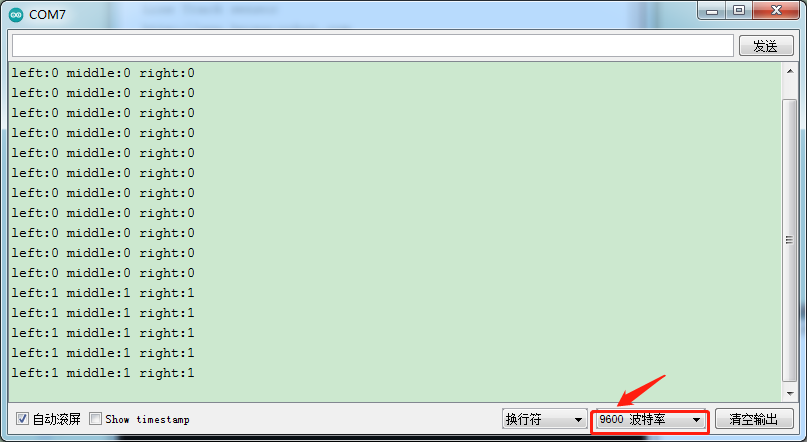
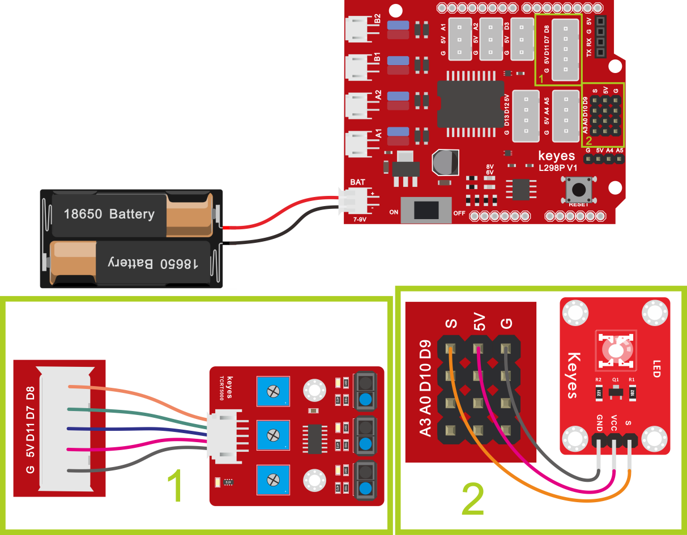

## 巡线传感器

### （1）项目介绍：



循迹传感器实际上是红外传感器。 此处使用的组件是TCRT5000红外管。

其工作原理是利用红外光对颜色的不同反射率，然后将反射信号的强度转换为电流信号。

在检测过程中，黑色在高电平时处于活动状态，而白色在低电平时处于活动状态。 检测高度为0-3厘米。

KEYES三路循迹模块在一块板上集成了三个TCRT5000红外管，接线和控制更加方便。

通过旋转传感器上的可调电位器，可以调节传感器的检测灵敏度。

### （2）参数：

工作电压：3.3-5V（DC）

接口：5PIN

输出信号：数字信号

检测高度：0-3厘米

特别说明：在测试之前，请旋转传感器上的电位器以调整检测灵敏度。 当将LED调整在ON和OFF之间的阈值时，灵敏度是最好的。


### （3） 项目组件：

| Keyes Uno Plus 开发板 红色环保*1 | Keyes brick L298P 电机驱动扩展板 V1*1 | keyes 草帽LED白发红模块*1 | Keyes connectors 循迹传感器*1 | Keyes connectors 循迹传感器*1 |
| --- | --- | --- | --- | --- |
|  |  |  |  |  |
| XH2.54转PH2.0 5P 连接线*1 | 3Pin 双母头杜邦线*1 | USB线*1 | 18650双节电池盒*1 | 18650电池*2 （电池自配） |
|  |  |  |  |  |

### （4）接线图:



循迹传感器接扩展板的D11、D7、D8引脚（左11，中7，右8）。

### （5）项目代码：

```cpp
/*

4WD 蓝牙多功能车 

lesson 3.1

Line Track sensor

http://www.keyes-robot.com

*/

int L_pin = 11;  //定义左边循迹传感器的引脚

int M_pin = 7;  //定义中间循迹传感器的引脚

int R_pin = 8;  //定义右边循迹传感器的引脚

int val_L, val_R, val_M; // 定义三个传感器的变量值

void setup()

{

  Serial.begin(9600); // 设置波特率为9600

  pinMode(L_pin, INPUT); //将L_pin设置为输入模式

  pinMode(M_pin, INPUT); //将m_pin设置为输入模式

  pinMode(R_pin, INPUT); //将R_pin设置为输入模式

}

void loop()

{ 

  val_L = digitalRead(L_pin);//读取L_pin的值:

  val_R = digitalRead(R_pin);//读取M_pin的值

  val_M = digitalRead(M_pin);//读取R_pin的值

  Serial.print("left:");//串口打印left

  Serial.print(val_L);//串口打印L_pin的值

  Serial.print(" middle:");//串口打印middle

  Serial.print(val_M);//串口打印M_pin的值

  Serial.print(" right:");//串口打印right

  Serial.println(val_R);//串口打印R_pin的值

  delay(500);//延时0.5秒

}

//****************************************************************************
```


### （6）项目结果：

上传代码带开发板，打开串口监视，可以看到左中右三个循迹传感器的状态，如果我们用白纸去遮挡传感器，传感器的状态都是0。在没有接收到信号的时候，三个传感器都是高电平状态，显示的数值是1。



### （7）代码说明：

**Serial.begin(9600)**-初始化串口,串口通信波特率为9600  ，

**pinMode-**定义单片机PIN脚模式是输入还是输出，input是输入，output是输出，

**digitalRead-**读取引脚电平状态，一般有两种状态，HIGH或者LOW。

### （8）项目拓展：

上面我们了解了循迹传感器的工作原理，接下来我们在第9脚接上一个LED 灯，然后通过读取循迹传感器的状态，来控制LED的亮和灭。如下图接线：



我们开始来编写代码：

```cpp
/*

4WD 蓝牙多功能车  

lesson 3.2

Line Track sensor

http://www.keyes-robot.com

*/

int L_pin = 11;  //定义左边循迹传感器的引脚

int M_pin = 7;  //定义中间循迹传感器的引脚

int R_pin = 8;  //定义右边循迹传感器的引脚

int val_L, val_R, val_M; // 定义三个传感器的变量值

void setup()

{

  Serial.begin(9600); // 设置波特率为9600

  pinMode(L_pin, INPUT); //将L_pin设置为输入模式

  pinMode(M_pin, INPUT); //将m_pin设置为输入模式

  pinMode(R_pin, INPUT); //将R_pin设置为输入模式

  pinMode(9, OUTPUT);//将第9脚上接的LED灯设置为输入

}

void loop()

{ 

  val_L = digitalRead(L_pin);//读取L_pin的值:

  val_R = digitalRead(R_pin);//读取M_pin的值

  val_M = digitalRead(M_pin);//读取R_pin的值

  Serial.print("left:");//串口打印left

  Serial.print(val_L);//串口打印L_pin的值

  Serial.print(" middle:");//串口打印middle

  Serial.print(val_M);//串口打印M_pin的值

  Serial.print(" right:");//串口打印right

  Serial.println(val_R);//串口打印R_pin的值

  delay(500);//延时0.5秒

 if (val_L == LOW||val_M ==LOW||val_R == LOW)//if line tracking sensor 检测到信号

  {

    digitalWrite(9, HIGH);//LED 灯灭

  }

  else//如果left line tracking sensor 没有检测到信号

  {

    digitalWrite(9, LOW);//LED 灯亮

  }

}

上传代码到开发板，用我们的手去一个个的靠近传感器，我们看看LED灯的状态发生了改变没有？当我们用手去遮挡循迹传感器的时候，我们可以看到LED灯亮起来了。

**示例代码 1（KE0165_3.1.ino）：**
```

```cpp
/*
  keyes 4WD 多功能智能车
  课程 3.1
  线路跟踪传感器
  http://www.keyes-robot.com
*/

#define L_PIN 11  // 左侧线路跟踪传感器引脚
#define M_PIN 7   // 中间线路跟踪传感器引脚
#define R_PIN 8   // 右侧线路跟踪传感器引脚

int valL, valM, valR;  // 三个传感器的变量值

/* 功能：初始化串口和传感器引脚 */
void setup() {
  Serial.begin(9600);  // 初始化串口通信，波特率 9600
  pinMode(L_PIN, INPUT);  // 设置左传感器引脚为输入
  pinMode(M_PIN, INPUT);  // 设置中传感器引脚为输入
  pinMode(R_PIN, INPUT);  // 设置右传感器引脚为输入
}

/* 功能：读取传感器值并通过串口输出 */
void loop() {
  valL = digitalRead(L_PIN);  // 读取左传感器值
  valM = digitalRead(M_PIN);  // 读取中传感器值
  valR = digitalRead(R_PIN);  // 读取右传感器值

  Serial.print("left: "); Serial.print(valL);  // 输出左传感器值
  Serial.print(" middle: "); Serial.print(valM);  // 输出中传感器值
  Serial.print(" right: "); Serial.println(valR);  // 输出右传感器值并换行

  delay(500);  // 延时 500 毫秒，保证读取稳定
}
```


**示例代码 2（KE0165_3.2.ino）：**

```cpp
/*
  keyes 4WD 多功能智能车
  课程 3.2
  线路跟踪传感器
  http://www.keyes-robot.com
*/

#define L_PIN 11      // 左侧线路跟踪传感器引脚
#define M_PIN 7       // 中间线路跟踪传感器引脚
#define R_PIN 8       // 右侧线路跟踪传感器引脚
#define LED_PIN 9     // LED 灯引脚

int valL, valM, valR;  // 三个传感器的变量值

/* 功能：初始化串口和引脚模式 */
void setup() {
  Serial.begin(9600);           // 初始化串口通信，波特率 9600
  pinMode(L_PIN, INPUT);        // 设置左传感器引脚为输入
  pinMode(M_PIN, INPUT);        // 设置中间传感器引脚为输入
  pinMode(R_PIN, INPUT);        // 设置右传感器引脚为输入
  pinMode(LED_PIN, OUTPUT);     // 设置 LED 引脚为输出
}

/* 功能：读取传感器值，输出串口信息，并控制 LED 灯 */
void loop() {
  valL = digitalRead(L_PIN);    // 读取左传感器值
  valM = digitalRead(M_PIN);    // 读取中间传感器值
  valR = digitalRead(R_PIN);    // 读取右传感器值

  Serial.print("left: ");       // 输出左传感器值
  Serial.print(valL);
  Serial.print(" middle: ");    // 输出中间传感器值
  Serial.print(valM);
  Serial.print(" right: ");     // 输出右传感器值
  Serial.println(valR);

  if (valL == LOW || valM == LOW || valR == LOW) {  // 任一传感器检测到信号
    digitalWrite(LED_PIN, HIGH);  // LED 灯灭
  } else {
    digitalWrite(LED_PIN, LOW);   // LED 灯亮
  }
}
```
