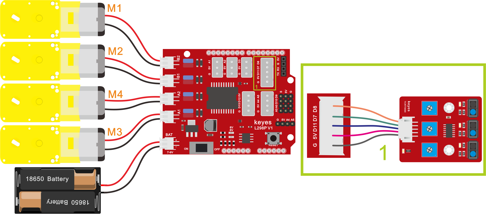

## 画地为牢智能车

### 项目介绍：

前面我们详细的介绍了智能车上各个传感器、模块、扩展板的使用方法。在这里我们可以结合前面课程中知识制作一个画地为牢智能车。实验中，我们通过循迹传感器检测智能车底部是否存在黑线，然后根据检测结果控制两个电机的转动，从而把智能车关在黑线圈中即画地为牢。

### 流程图：

画地为牢智能车具体逻辑如下表格。

| 检测 | 中循迹传感器 | 检测到黑线：高电平 | 检测到黑线：高电平 |
| --- | --- | --- | --- |
| 检测 | 中循迹传感器 | 检测到白线：低电平 | 检测到白线：低电平 |
| 检测 | 左循迹传感器 | 检测到黑线：高电平 | 检测到黑线：高电平 |
| 检测 | 左循迹传感器 | 检测到白线：低电平 | 检测到白线：低电平 |
| 检测 | 右循迹传感器 | 检测到黑线：高电平 | 检测到黑线：高电平 |
| 检测 | 右循迹传感器 | 检测到白线：低电平 | 检测到白线：低电平 |
| 条件 | 条件 | 条件 | 状态 |
| 左循迹传感器没检测到黑线 且中循迹传感器没检测到黑线且右循迹传感器没检测到黑线 | 左循迹传感器没检测到黑线 且中循迹传感器没检测到黑线且右循迹传感器没检测到黑线 | 左循迹传感器没检测到黑线 且中循迹传感器没检测到黑线且右循迹传感器没检测到黑线 | 前进（PWM设为200） |
| 左循迹传感器检测到黑线 或者中循迹传感器检测到黑线 或者右循迹传感器检测到黑线 | 左循迹传感器检测到黑线 或者中循迹传感器检测到黑线 或者右循迹传感器检测到黑线 | 左循迹传感器检测到黑线 或者中循迹传感器检测到黑线 或者右循迹传感器检测到黑线 | 后退（PWM设为200） 然后左旋转（PWM设为200） |

按照前面思路设计好智能车后，我们就需要按照设计思路开始制作智能车。我们需要设计对应的接线，测试代码，然后接线上传代码，运行，确保智能车能够实现理想中的功能。

### 接线图：循迹模块+电机



### 测试代码：

```cpp
/*

  keyes 4WD Multifunctional Smart Car

  lesson 10

  Line Tracking Robot

  http://www.keyes-robot.com

*/

int L_pin = 11; //定义左边传感器引脚为D11

int M_pin = 7; //定义中间传感器引脚为D7

int R_pin = 8; //定义右边传感器引脚为D8

int MA = 2; //定义电机M3,M4方向控制引脚为D2

int PWMA = 6; //定义电机M3,M4速度控制引脚为D6

int MB = 4; //定义电机M1,M2方向控制引脚为D4

int PWMB = 5; //定义电机M1,M2速度控制引脚为D5

int L_val, M_val, R_val;

void advance() { //小车前进

  digitalWrite(MA, HIGH); //电机A正转

  analogWrite(PWMA, 200); //电机A速度为200

  digitalWrite(MB, HIGH); //电机B正转

  analogWrite(PWMB, 200); //电机B速度为200

}

void back() { //小车后退

  digitalWrite(MA, LOW); //电机A反转

  analogWrite(PWMA, 200); //电机A速度为200

  digitalWrite(MB, LOW); //电机B反转

  analogWrite(PWMB, 200); //电机B速度为200

}

void turnL() { //小车左转

  digitalWrite(MA, HIGH); //电机A正转

  analogWrite(PWMA, 200); //电机A速度为200

  digitalWrite(MB, LOW); //电机B反转

  analogWrite(PWMB, 200); //电机B速度为200

}

void turnR() { //小车右转

  digitalWrite(MA, LOW); //电机A反转

  analogWrite(PWMA, 200); //电机A速度为200

  digitalWrite(MB, HIGH); //电机B正转

  analogWrite(PWMB, 200); //电机B速度为200

}

void stopp() { //小车停止

  analogWrite(PWMA, 0); //电机A速度为0

  analogWrite(PWMB, 0); //电机B速度为0

}

void setup() {

  Serial.begin(9600); //设置波特率为9600

  pinMode(L_pin, INPUT); //循迹传感器引脚都配置为输入模式

  pinMode(M_pin, INPUT);

  pinMode(R_pin, INPUT);

  pinMode(MA, OUTPUT); //配置电机引脚为输出模式

  pinMode(PWMA, OUTPUT);

  pinMode(MB, OUTPUT);

  pinMode(PWMB, OUTPUT);

}

void loop() {

  L_val = digitalRead(L_pin); //读取左边传感器的值

  M_val = digitalRead(M_pin); //读中间传感器的值

  R_val = digitalRead(R_pin); //读取右边传感器的值

  if ( L_val == 0 && M_val == 0 && R_val == 0 ) { //当都没有检测到黑线时前进

    advance();

  }

  else { //否则任一巡线传感器检测到黑线就后退再左转

    back();

    delay(500);

    turnL();

    delay(800);

  }

}
```

### 测试结果：

当小车行驶过程中检测到黑线立即撤退，然后左转继续行驶。

**示例代码 1（KE0165_10.ino）：**

```cpp
/*
  keyes 4WD 多功能智能车
  课程 10
  线路跟踪机器人
  http://www.keyes-robot.com
*/
#define L_PIN 11      // 左边传感器引脚
#define M_PIN 7       // 中间传感器引脚
#define R_PIN 8       // 右边传感器引脚
#define MA 2          // 电机M3,M4方向控制引脚
#define PWMA 6        // 电机M3,M4速度控制引脚
#define MB 4          // 电机M1,M2方向控制引脚
#define PWMB 5        // 电机M1,M2速度控制引脚

int lVal, mVal, rVal;

/* 功能：小车前进 */
void advance() {
  digitalWrite(MA, HIGH);          // 电机A正转
  analogWrite(PWMA, 200);          // 电机A速度为200
  digitalWrite(MB, HIGH);          // 电机B正转
  analogWrite(PWMB, 200);          // 电机B速度为200
}

/* 功能：小车后退 */
void back() {
  digitalWrite(MA, LOW);           // 电机A反转
  analogWrite(PWMA, 200);          // 电机A速度为200
  digitalWrite(MB, LOW);           // 电机B反转
  analogWrite(PWMB, 200);          // 电机B速度为200
}

/* 功能：小车左转 */
void turnLeft() {
  digitalWrite(MA, HIGH);          // 电机A正转
  analogWrite(PWMA, 200);          // 电机A速度为200
  digitalWrite(MB, LOW);           // 电机B反转
  analogWrite(PWMB, 200);          // 电机B速度为200
}

/* 功能：小车右转 */
void turnRight() {
  digitalWrite(MA, LOW);           // 电机A反转
  analogWrite(PWMA, 200);          // 电机A速度为200
  digitalWrite(MB, HIGH);          // 电机B正转
  analogWrite(PWMB, 200);          // 电机B速度为200
}

/* 功能：小车停止 */
void stopCar() {
  analogWrite(PWMA, 0);            // 电机A速度为0
  analogWrite(PWMB, 0);            // 电机B速度为0
}

/* 功能：初始化设置 */
void setup() {
  Serial.begin(9600);              // 设置波特率为9600
  pinMode(L_PIN, INPUT);           // 循迹传感器引脚配置为输入模式
  pinMode(M_PIN, INPUT);           // 循迹传感器引脚配置为输入模式
  pinMode(R_PIN, INPUT);           // 循迹传感器引脚配置为输入模式
  pinMode(MA, OUTPUT);             // 电机方向控制引脚配置为输出模式
  pinMode(PWMA, OUTPUT);           // 电机速度控制引脚配置为输出模式
  pinMode(MB, OUTPUT);             // 电机方向控制引脚配置为输出模式
  pinMode(PWMB, OUTPUT);           // 电机速度控制引脚配置为输出模式
}

/* 功能：主循环，读取传感器并控制小车动作 */
void loop() {
  lVal = digitalRead(L_PIN);       // 读取左边传感器的值
  mVal = digitalRead(M_PIN);       // 读取中间传感器的值
  rVal = digitalRead(R_PIN);       // 读取右边传感器的值

  if (lVal == 0 && mVal == 0 && rVal == 0) {  // 当都没有检测到黑线时前进
    advance();
  } else {                                    // 任一传感器检测到黑线则后退再左转
    back();
    delay(500);                               // 后退延时
    turnLeft();
    delay(800);                               // 左转延时
  }
}
```
