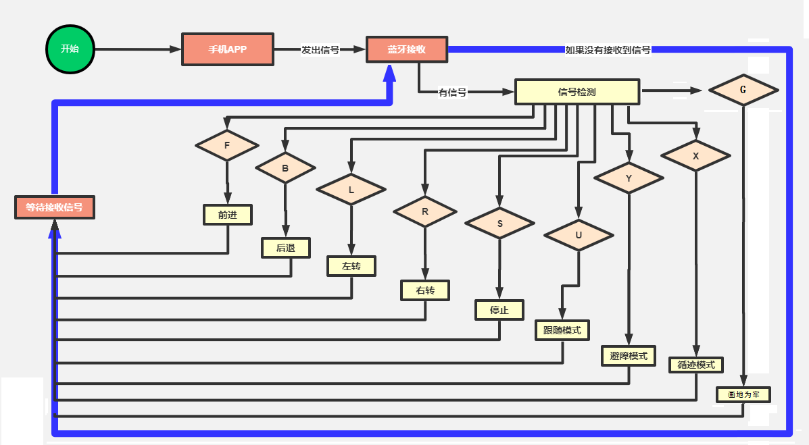
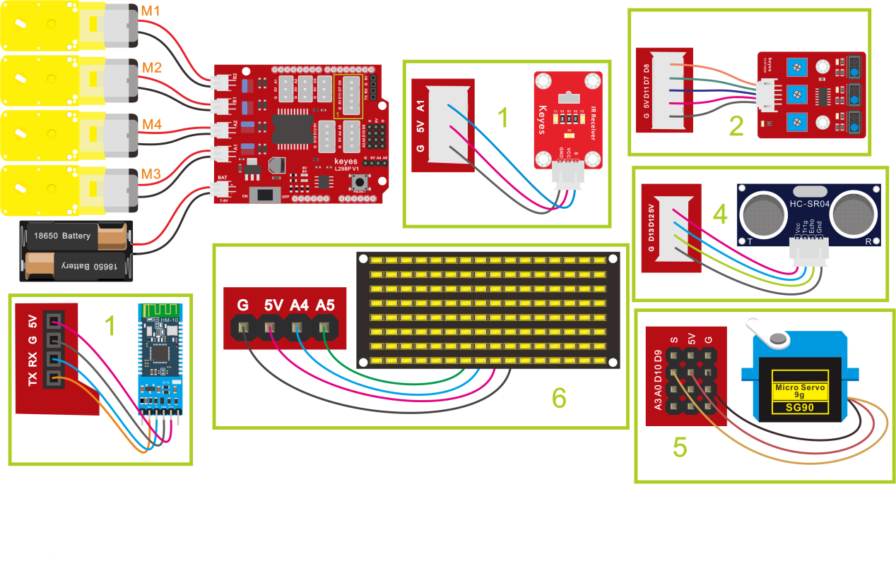

## 多功能智能小车

### （1）项目介绍：

在前面课程中，我们只是让智能车实现单个功能，那我们能不能把所有功能合在一起呢？能，在这一课程中，我们利用一个代码测试智能车，智能车包含前面课程中讲到的所有功能，我们利用手机蓝牙APP上按钮自动切换各种功能,简单方便。

### （2）流程图：



按照前面思路设计好智能车后，我们就需要按照设计思路开始制作智能车。我们需要设计对应的接线，测试代码，然后接线上传代码，运行，确保智能车能够实现理想中的功能。

### （3）接线图：

接线注意：

循迹模块连接到电机驱动扩展板上P1接口的G、V、D11、D7、D8；

超声波传感器模块的VCC引脚连接至连接到电机驱动扩展板上，V引脚至V，T（Trig）引脚至数字12(S)，E（Echo）引脚至数字13(S)，G引脚至G；

红外接收传感器模块用导线连接到电机驱动扩展板上的G、V、A1；（M1、M2），（M3、M4）两组电机分别对应的连接到电机驱动扩展板上的接口B和接口A；

舵机接数字口10；

LED点阵屏接A4、A5管脚（不一定要接IIC引脚）；

蓝牙模块的RXD、TXD、GND、VCC分别对应的接到电机驱动扩展板上的TX、RX、-（GND）、+（VCC），而蓝牙模块的STATE和BRK两引脚不需要接，电源接到BAT接口。



### （4）测试代码：

```cpp
/*

  keyes 4WD Multifunctional Smart Car

  lesson 17

  Bluetooth control multifunctional 4WD robot

  http://www.keyes-robot.com

*/

#include <IRremote.h>  //导入红外的库

int RECV_PIN = A1; //定义IO口A1

IRrecv irrecv(RECV_PIN);

decode_results results;//声明一个IRremote库函数独有的变量类型

#include <Servo.h>

Servo myservo;  // create servo object to control a servo

//数组，用于储存图案的数据，可以自己算也可以从取摸工具中得到

unsigned char start01[] = {0x01, 0x02, 0x04, 0x08, 0x10, 0x20, 0x40, 0x80, 0x80, 0x40, 0x20, 0x10, 0x08, 0x04, 0x02, 0x01};

unsigned char front[] = {0x00, 0x00, 0x00, 0x00, 0x00, 0x24, 0x12, 0x09, 0x12, 0x24, 0x00, 0x00, 0x00, 0x00, 0x00, 0x00};

unsigned char back01[] = {0x00, 0x00, 0x00, 0x00, 0x00, 0x24, 0x48, 0x90, 0x48, 0x24, 0x00, 0x00, 0x00, 0x00, 0x00, 0x00};

unsigned char left[] = {0x00, 0x00, 0x00, 0x00, 0x00, 0x00, 0x44, 0x28, 0x10, 0x44, 0x28, 0x10, 0x44, 0x28, 0x10, 0x00};

unsigned char right[] = {0x00, 0x10, 0x28, 0x44, 0x10, 0x28, 0x44, 0x10, 0x28, 0x44, 0x00, 0x00, 0x00, 0x00, 0x00, 0x00};

unsigned char STOP01[] = {0x2E, 0x2A, 0x3A, 0x00, 0x02, 0x3E, 0x02, 0x00, 0x3E, 0x22, 0x3E, 0x00, 0x3E, 0x0A, 0x0E, 0x00};

unsigned char speed_a[] = {0x00, 0x40, 0x20, 0x10, 0x08, 0x04, 0x02, 0xff, 0x02, 0x04, 0x08, 0x10, 0x20, 0x40, 0x00, 0x00};

unsigned char speed_d[] = {0x00, 0x02, 0x04, 0x08, 0x10, 0x20, 0x40, 0xff, 0x40, 0x20, 0x10, 0x08, 0x04, 0x02, 0x00, 0x00};

unsigned char clear[] = {0x00, 0x00, 0x00, 0x00, 0x00, 0x00, 0x00, 0x00, 0x00, 0x00, 0x00, 0x00, 0x00, 0x00, 0x00, 0x00};

#define SCL_Pin  A5  //设置时钟引脚为 A5

#define SDA_Pin  A4  //设置数据引脚为 A4

int IR_val;

char blue_val;

int L_pin = 11; //定义左边传感器引脚为D11

int M_pin = 7; //定义中间传感器引脚为D7

int R_pin = 8; //定义右边传感器引脚为D8

int L_val, M_val, R_val;

int MA = 2; //定义电机A方向控制引脚为D2

int PWMA = 6; //定义电机A速度控制引脚为D6

int MB = 4; //定义电机A方向控制引脚为D4

int PWMB = 5; //定义电机A速度控制引脚为D5

int speeds = 150; //初始化速度为150

int trigPin = 12; //TRIG引脚接D12

int echoPin = 13; //ECHO引脚接D13

int distance, distance_l, distance_r;

void setup() {

  Serial.begin(9600); //设置波特率为9600

  myservo.attach(10);  // attaches the servo on pin 10 to the servo object

  myservo.write(90);  //舵机角度为90

  delay(500);

  pinMode(L_pin, INPUT); //循迹传感器引脚都配置为输入模式

  pinMode(M_pin, INPUT);

  pinMode(R_pin, INPUT);

  //设置引脚为输出

  pinMode(SCL_Pin, OUTPUT);

  pinMode(SDA_Pin, OUTPUT);

  pinMode(trigPin, OUTPUT); //定义TRIG为输出模式

  pinMode(echoPin, INPUT); //定义ECHO为输入模式

  pinMode(MA, OUTPUT); //配置电机引脚为输出模式

  pinMode(PWMA, OUTPUT);

  pinMode(MB, OUTPUT);

  pinMode(PWMB, OUTPUT);

  irrecv.enableIRIn();// 使能红外接收

  //清屏

  matrix_display(clear);

  matrix_display(start01);

}

void loop() {

  if (Serial.available() > 0) { //接收到蓝牙信号

    blue_val = Serial.read(); //接收到的信号赋给blue_val

    Serial.println(blue_val);  //串口监视器显示蓝牙信号

    switch (blue_val) {

      case  'F':  advance();  matrix_display(front);   break;  //接收到‘F’前进

      case  'B':  back();     matrix_display(back01);  break;  //接收到‘B’后退

      case  'L':  turnL();    matrix_display(left);    break;  //接收到‘L’左旋

      case  'R':  turnR();    matrix_display(right);   break;  //接收到‘R’右旋

      case  'S':  stopp();    matrix_display(STOP01);  break;  //接收到‘S’电机停止转动，功放停止

      case  'a':  speeds_a(); matrix_display(speed_a); break;  //接收到‘a’加速

      case  'd':  speeds_d(); matrix_display(speed_d); break; //接收到‘d’减速

      case  'U':  follow();  break; //接收到‘U’，进入跟随模式

      case  'Y':  avoid();   break;  //接收到‘Y’，进入避障模式

      case  'G':  prison();  break;  //接收到‘G’，画地为牢模式

      case  'X':  track();   break;  //接收到‘X’，巡黑线模式

    }

  }

  if (irrecv.decode(&results)) { //是否接收到红外遥控信号

    IR_val = results.value;

    Serial.println(IR_val, HEX); //串口打印数据

    switch (IR_val) {

      case 0xFF629D:  advance();  matrix_display(front);  break;  //前进

      case 0xFFA857:  back();     matrix_display(back01); break;  //后退

      case 0xFF22DD:  turnL();    matrix_display(left);   break;  //左转

      case 0xFFC23D:  turnR();    matrix_display(right);  break;  //右转

      case 0xFF02FD:  stopp();    matrix_display(STOP01); break;  //停止

    }

    irrecv.resume();// 接收下个数据

  }

}

void advance() { //小车前进

  digitalWrite(MA, LOW); //电机A正转

  analogWrite(PWMA, speeds); //电机A速度为speeds

  digitalWrite(MB, HIGH); //电机B正转

  analogWrite(PWMB, speeds); //电机B速度为speeds

}

void back() { //小车后退

  digitalWrite(MA, HIGH); //电机A反转

  analogWrite(PWMA, speeds); //电机A速度为speeds

  digitalWrite(MB, LOW); //电机B反转

  analogWrite(PWMB, speeds); //电机B速度为speeds

}

void turnL() { //小车左旋转

  digitalWrite(MA, HIGH); //电机A反转

  analogWrite(PWMA, speeds); //电机A速度为speeds

  digitalWrite(MB, HIGH); //电机B正转

  analogWrite(PWMB, speeds); //电机B速度为speeds

}

void turnR() { //小车右旋转

  digitalWrite(MA, LOW); //电机A正转

  analogWrite(PWMA, speeds); //电机A速度为speeds

  digitalWrite(MB, LOW); //电机B反转

  analogWrite(PWMB, speeds); //电机B速度为speeds

}

void stopp() { //小车停止

  analogWrite(PWMA, 0); //电机A速度为0

  analogWrite(PWMB, 0); //电机B速度为0

}

void speeds_a() { //增速函数

  while (1) {

    Serial.println(speeds);  //显示速度

    if (speeds < 255) { //最大增到255

      speeds++;

      delay(10);  //调节增速的速度

    }

    blue_val = Serial.read();

    if (blue_val == 'S')break; //接收到‘S’停止加速

  }

}

void speeds_d() { //减速函数

  while (1) {

    Serial.println(speeds);  //显示速度

    if (speeds > 0) { //最小减到0

      speeds--;

      delay(10);    //调节减速的速度

    }

    blue_val = Serial.read();

    if (blue_val == 'S')break; //接收到‘S’停止减速

  }

}

int get_distance() {

  int distance = 0;

  digitalWrite(trigPin, LOW);     // 通过Trig/Pin 发送脉冲，触发 HC-SR04 测距，使发出发出超声波信号接口低电平2μs

  delayMicroseconds(2);

  digitalWrite(trigPin, HIGH);    // 使发出发出超声波信号接口高电平10μs，这里是至少10μs

  delayMicroseconds(10);

  digitalWrite(trigPin, LOW);     // 保持发出超声波信号接口低电平

  distance = pulseIn(echoPin, HIGH) / 58; // 读出脉冲时间,将脉冲时间转化为距离（单位：厘米）

  Serial.println(distance);        //输出距离值

  return distance;

}

void follow() {

  int follow_flag = 1;

  while (follow_flag) {

    distance = get_distance(); //调用测距函数

    if (distance < 8 ) {//如果距离小于8

      back();//后退

    }

    else if (distance >= 8 && distance < 13) { //如果距离大于等于8，小于13

      stopp();//停止

    }

    else if (distance >= 13 && distance <= 35 ) { //如果距离大于等于13，小于35

      advance();//跟随

    }

    else {//如果以上都不是

      stopp();//停止

    }

    blue_val = Serial.read();

    if (blue_val == 'S') { //接收到‘S’退出循环，小车停止

      follow_flag = 0;

      stopp();

    }

  }

}

void avoid() {

  int avoid_flag = 1;

  while (avoid_flag) {

    distance = get_distance(); //调用测距函数

    if (distance > 0 && distance < 20) { //如果距离小于20且大于0

      stopp();//停止

      matrix_display(STOP01);   //点阵显示停止图案

      delay(100);

      myservo.write(180); //舵机转到180度

      delay(500);

      distance_l = get_distance(); //获取左边的距离

      delay(100);

      myservo.write(0); //舵机转到0度

      delay(500);

      distance_r = get_distance(); //获取右边的距离

      delay(100);

      if (distance_l > distance_r) { //比较距离，如果左边大于右边

        turnL();  //向左转

        matrix_display(left);   //点阵显示向左图案

        delay(1000);

        myservo.write(90);//舵机回到90度

        matrix_display(front);   //点阵显示前进图案

      }

      else { //否则如果右边大于左边

        turnR();//向右转

        matrix_display(right);   //显示右转图案

        delay(1000);

        myservo.write(90);//舵机回到90度

        matrix_display(front);   //显示前进图案

      }

    }

    else { //前方距离小于等于10cm时

      advance();//前进

      matrix_display(front);   //显示前进图案

    }

    blue_val = Serial.read();

    if (blue_val == 'S') { //接收到‘S’退出循环，小车停止

      avoid_flag = 0;

      stopp();

    }

  }

}

void prison() {

  int prison_flag = 1;

  while (prison_flag) {

    L_val = digitalRead(L_pin); //读取左边传感器的值

    M_val = digitalRead(M_pin); //读中间传感器的值

    R_val = digitalRead(R_pin); //读取右边传感器的值

    if ( L_val == 0 && M_val == 0 && R_val == 0 ) { //当没有检测到黑线时前进

      advance();

    }

    else { //否则任一巡线传感器检测到黑线就后退再左转

      back();

      delay(500);

      turnL();

      delay(800);

    }

    blue_val = Serial.read();

    if (blue_val == 'S') { //接收到‘S’退出循环，小车停止

      prison_flag = 0;

      stopp();

    }

  }

}

void track() {

  int track_flag = 1;

  while (track_flag) {

    L_val = digitalRead(L_pin); //读取左边传感器的值

    M_val = digitalRead(M_pin); //读中间传感器的值

    R_val = digitalRead(R_pin); //读取右边传感器的值

    if (M_val == 1) { //中间检测到黑线

      if (L_val == 1 && R_val == 0) { //如果左边检测到黑线，右边没有，左转

        turnL();

      }

      else if (L_val == 0 && R_val == 1) { //否则如果右边检测到黑线，左边没有，右转

        turnR();

      }

      else { //否则前进

        advance();

      }

    }

    else { //中间没检测到黑线

      if (L_val == 1 && R_val == 0) { //如果左边检测到黑线，右边没有，左转

        turnL();

      }

      else if (L_val == 0 && R_val == 1) { //否则如果右边检测到黑线，左边没有，右转

        turnR();

      }

      else { //否则停止

        stopp();

      }

    }

    blue_val = Serial.read();

    if (blue_val == 'S') { //接收到‘S’退出循环，小车停止

      track_flag = 0;

      stopp();

    }

  }

}

//这个函数用于点阵屏显示

void matrix_display(unsigned char matrix_value[])

{

  IIC_start();  //调用数据传输开始条件的函数

  IIC_send(0xc0);  //选择地址

  for (int i = 0; i < 16; i++) //图案数据有16个字节

  {

    IIC_send(matrix_value[i]); //传输图案的数据

  }

  IIC_end();   //结束图案数据传输

  IIC_start();

  IIC_send(0x8A);  //显示控制，选择脉宽为4/16

  IIC_end();

}

//传输数据开始的条件

void IIC_start()

{

  digitalWrite(SCL_Pin, HIGH);

  delayMicroseconds(3);

  digitalWrite(SDA_Pin, HIGH);

  delayMicroseconds(3);

  digitalWrite(SDA_Pin, LOW);

  delayMicroseconds(3);

}

//传输数据

void IIC_send(unsigned char send_data)

{

  for (char i = 0; i < 8; i++) //每个字节有8位

  {

    digitalWrite(SCL_Pin, LOW); //将时钟引脚SCL_Pin拉低，才可以改变SDA的信号

    delayMicroseconds(3);

    if (send_data & 0x01) //根据字节的每一位是1还是0来设置SDA_Pin的高低电平

    {

      digitalWrite(SDA_Pin, HIGH);

    }

    else

    {

      digitalWrite(SDA_Pin, LOW);

    }

    delayMicroseconds(3);

    digitalWrite(SCL_Pin, HIGH); //将时钟引脚SCL_Pin拉高，停止数据的传输

    delayMicroseconds(3);

    send_data = send_data >> 1;  //一位一位的检测，所以将数据右移一位

  }

}

//数据传输结束的标志

void IIC_end()

{

  digitalWrite(SCL_Pin, LOW);

  delayMicroseconds(3);

  digitalWrite(SDA_Pin, LOW);

  delayMicroseconds(3);

  digitalWrite(SCL_Pin, HIGH);

  delayMicroseconds(3);

  digitalWrite(SDA_Pin, HIGH);

  delayMicroseconds(3);

}

好了，蓝牙多功能控制智能车的程序都已经编写好了，上传程序，实际操作下看看效果。**（在上传程序代码前，需要把蓝牙模块取下，否则代码会上传失败。需要上传代码成功后，再连接蓝牙模块。）**
```

### （5）测试结果：

将驱动扩展板堆叠在UNO Plus板上，上传好代码，按照接线图接线，将拨码开关拨至ON端后，手机APP连接蓝牙成功后，我们就能用手机APP控制智能车运动了。我们可以通过按下对应按钮实现对应功能，通过停止钮来停止功能。

**注意：利用安卓系统手机APP点击，测试语音控制时，不能实现语音控制功能。**


**示例代码 1（KE0165_17.ino）：**

```cpp
/*
  keyes 4WD 多功能智能车
  课程 17
  蓝牙控制多功能四驱机器人
  http://www.keyes-robot.com
*/
#include <IRremote.h>  // 导入红外库
#include <Servo.h>

#define RECV_PIN A1           // 红外接收引脚
#define SCL_PIN A5            // 时钟引脚
#define SDA_PIN A4            // 数据引脚
#define L_PIN 11              // 左边传感器引脚
#define M_PIN 7               // 中间传感器引脚
#define R_PIN 8               // 右边传感器引脚
#define MA 2                  // 电机M3,M4方向控制引脚
#define PWMA 6                // 电机M3,M4速度控制引脚
#define MB 4                  // 电机M1,M2方向控制引脚
#define PWMB 5                // 电机M1,M2速度控制引脚
#define TRIG_PIN 12           // 超声波TRIG引脚
#define ECHO_PIN 13           // 超声波ECHO引脚

IRrecv irrecv(RECV_PIN);
decode_results results;       // 红外解码结果变量
Servo myservo;                // 舵机对象

unsigned char start01[] = {0x01, 0x02, 0x04, 0x08, 0x10, 0x20, 0x40, 0x80, 0x80, 0x40, 0x20, 0x10, 0x08, 0x04, 0x02, 0x01};
unsigned char front[] = {0x00, 0x00, 0x00, 0x00, 0x00, 0x24, 0x12, 0x09, 0x12, 0x24, 0x00, 0x00, 0x00, 0x00, 0x00, 0x00};
unsigned char back01[] = {0x00, 0x00, 0x00, 0x00, 0x00, 0x24, 0x48, 0x90, 0x48, 0x24, 0x00, 0x00, 0x00, 0x00, 0x00, 0x00};
unsigned char left[] = {0x00, 0x00, 0x00, 0x00, 0x00, 0x00, 0x44, 0x28, 0x10, 0x44, 0x28, 0x10, 0x44, 0x28, 0x10, 0x00};
unsigned char right[] = {0x00, 0x10, 0x28, 0x44, 0x10, 0x28, 0x44, 0x10, 0x28, 0x44, 0x00, 0x00, 0x00, 0x00, 0x00, 0x00};
unsigned char STOP01[] = {0x2E, 0x2A, 0x3A, 0x00, 0x02, 0x3E, 0x02, 0x00, 0x3E, 0x22, 0x3E, 0x00, 0x3E, 0x0A, 0x0E, 0x00};
unsigned char speed_a[] = {0x00, 0x40, 0x20, 0x10, 0x08, 0x04, 0x02, 0xff, 0x02, 0x04, 0x08, 0x10, 0x20, 0x40, 0x00, 0x00};
unsigned char speed_d[] = {0x00, 0x02, 0x04, 0x08, 0x10, 0x20, 0x40, 0xff, 0x40, 0x20, 0x10, 0x08, 0x04, 0x02, 0x00, 0x00};
unsigned char clear[] = {0x00, 0x00, 0x00, 0x00, 0x00, 0x00, 0x00, 0x00, 0x00, 0x00, 0x00, 0x00, 0x00, 0x00, 0x00, 0x00};

int irVal;
char blueVal;

int lVal, mVal, rVal;
int speeds = 150;            // 初始速度

int distance, distanceL, distanceR;

/* 功能：初始化设置 */
void setup() {
  Serial.begin(9600);                   // 设置串口波特率为9600
  myservo.attach(10);                   // 绑定舵机引脚10
  myservo.write(90);                   // 舵机初始角度90度
  delay(500);

  pinMode(L_PIN, INPUT);                // 左传感器输入模式
  pinMode(M_PIN, INPUT);                // 中传感器输入模式
  pinMode(R_PIN, INPUT);                // 右传感器输入模式

  pinMode(SCL_PIN, OUTPUT);             // 点阵时钟引脚输出
  pinMode(SDA_PIN, OUTPUT);             // 点阵数据引脚输出

  pinMode(TRIG_PIN, OUTPUT);            // 超声波触发引脚输出
  pinMode(ECHO_PIN, INPUT);             // 超声波回声引脚输入

  pinMode(MA, OUTPUT);                  // 电机A方向引脚输出
  pinMode(PWMA, OUTPUT);                // 电机A速度引脚输出
  pinMode(MB, OUTPUT);                  // 电机B方向引脚输出
  pinMode(PWMB, OUTPUT);                // 电机B速度引脚输出

  irrecv.enableIRIn();                  // 启用红外接收

  matrixDisplay(clear);                 // 点阵屏清屏
  matrixDisplay(start01);               // 显示启动图案
}

/* 功能：主循环，处理蓝牙和红外信号 */
void loop() {
  if (Serial.available() > 0) {        // 接收到蓝牙信号
    blueVal = Serial.read();            // 读取蓝牙数据
    Serial.println(blueVal);            // 串口打印蓝牙数据
    switch (blueVal) {
      case 'F': advance(); matrixDisplay(front); break;   // 前进
      case 'B': back(); matrixDisplay(back01); break;     // 后退
      case 'L': turnL(); matrixDisplay(left); break;      // 左转
      case 'R': turnR(); matrixDisplay(right); break;     // 右转
      case 'S': stopp(); matrixDisplay(STOP01); break;    // 停止
      case 'a': speedsA(); matrixDisplay(speed_a); break; // 加速
      case 'd': speedsD(); matrixDisplay(speed_d); break; // 减速
      case 'U': follow(); break;                            // 跟随模式
      case 'Y': avoid(); break;                             // 避障模式
      case 'G': prison(); break;                            // 画地为牢模式
      case 'X': track(); break;                             // 巡线模式
    }
  }

  if (irrecv.decode(&results)) {       // 接收到红外信号
    irVal = results.value;
    Serial.println(irVal, HEX);        // 串口打印红外数据
    switch (irVal) {
      case 0xFF629D: advance(); matrixDisplay(front); break;  // 前进
      case 0xFFA857: back(); matrixDisplay(back01); break;    // 后退
      case 0xFF22DD: turnL(); matrixDisplay(left); break;     // 左转
      case 0xFFC23D: turnR(); matrixDisplay(right); break;    // 右转
      case 0xFF02FD: stopp(); matrixDisplay(STOP01); break;   // 停止
    }
    irrecv.resume();                  // 接收下一个数据
  }
}

/* 功能：小车前进 */
void advance() {
  digitalWrite(MA, HIGH);             // 电机A正转
  analogWrite(PWMA, speeds);          // 电机A速度
  digitalWrite(MB, HIGH);             // 电机B正转
  analogWrite(PWMB, speeds);          // 电机B速度
}

/* 功能：小车后退 */
void back() {
  digitalWrite(MA, LOW);              // 电机A反转
  analogWrite(PWMA, speeds);          // 电机A速度
  digitalWrite(MB, LOW);              // 电机B反转
  analogWrite(PWMB, speeds);          // 电机B速度
}

/* 功能：小车左旋转 */
void turnL() {
  digitalWrite(MA, HIGH);             // 电机A正转
  analogWrite(PWMA, speeds);          // 电机A速度
  digitalWrite(MB, LOW);              // 电机B反转
  analogWrite(PWMB, speeds);          // 电机B速度
}

/* 功能：小车右旋转 */
void turnR() {
  digitalWrite(MA, LOW);              // 电机A反转
  analogWrite(PWMA, speeds);          // 电机A速度
  digitalWrite(MB, HIGH);             // 电机B正转
  analogWrite(PWMB, speeds);          // 电机B速度
}

/* 功能：小车停止 */
void stopp() {
  analogWrite(PWMA, 0);               // 电机A速度为0
  analogWrite(PWMB, 0);               // 电机B速度为0
}

/* 功能：加速函数 */
void speedsA() {
  while (true) {
    Serial.println(speeds);           // 显示当前速度
    if (speeds < 255) {               // 最大速度255
      speeds++;
      delay(10);                      // 调节加速速度
    }
    if (Serial.available() > 0) {
      blueVal = Serial.read();
      if (blueVal == 'S') break;      // 接收到‘S’停止加速
    }
  }
}

/* 功能：减速函数 */
void speedsD() {
  while (true) {
    Serial.println(speeds);           // 显示当前速度
    if (speeds > 0) {                 // 最小速度0
      speeds--;
      delay(10);                      // 调节减速速度
    }
    if (Serial.available() > 0) {
      blueVal = Serial.read();
      if (blueVal == 'S') break;      // 接收到‘S’停止减速
    }
  }
}

/* 功能：获取超声波距离，单位厘米 */
int getDistance() {
  digitalWrite(TRIG_PIN, LOW);        // 触发引脚低电平2微秒
  delayMicroseconds(2);
  digitalWrite(TRIG_PIN, HIGH);       // 触发引脚高电平10微秒
  delayMicroseconds(10);
  digitalWrite(TRIG_PIN, LOW);        // 触发引脚低电平

  int distanceCm = pulseIn(ECHO_PIN, HIGH) / 58;  // 计算距离
  Serial.println(distanceCm);          // 输出距离
  return distanceCm;
}

/* 功能：跟随模式 */
void follow() {
  int followFlag = 1;
  while (followFlag) {
    distance = getDistance();          // 获取距离
    if (distance < 8) {                // 距离小于8cm后退
      back();
    }
    else if (distance >= 8 && distance < 13) { // 距离8~13cm停止
      stopp();
    }
    else if (distance >= 13 && distance <= 35) { // 距离13~35cm前进
      advance();
    }
    else {                            // 其他情况停止
      stopp();
    }
    if (Serial.available() > 0) {
      blueVal = Serial.read();
      if (blueVal == 'S') {           // 接收到‘S’退出跟随模式
        followFlag = 0;
        stopp();
      }
    }
  }
}

/* 功能：避障模式 */
void avoid() {
  int avoidFlag = 1;
  while (avoidFlag) {
    distance = getDistance();          // 获取前方距离

    if (distance > 0 && distance < 20) { // 距离小于20cm停止避障
      stopp();
      matrixDisplay(STOP01);           // 显示停止图案
      delay(100);

      myservo.write(180);              // 舵机转到180度
      delay(500);
      distanceL = getDistance();       // 获取左侧距离
      delay(100);

      myservo.write(0);                // 舵机转到0度
      delay(500);
      distanceR = getDistance();       // 获取右侧距离
      delay(100);

      if (distanceL > distanceR) {     // 左侧距离大于右侧，左转
        turnL();
        matrixDisplay(left);            // 显示左转图案
        delay(1000);
        myservo.write(90);             // 舵机回中
        matrixDisplay(front);          // 显示前进图案
      }
      else {                          // 右侧距离大于左侧，右转
        turnR();
        matrixDisplay(right);           // 显示右转图案
        delay(1000);
        myservo.write(90);             // 舵机回中
        matrixDisplay(front);          // 显示前进图案
      }
    }
    else {                            // 距离大于等于20cm前进
      advance();
      matrixDisplay(front);            // 显示前进图案
    }

    if (Serial.available() > 0) {
      blueVal = Serial.read();
      if (blueVal == 'S') {           // 接收到‘S’退出避障模式
        avoidFlag = 0;
        stopp();
      }
    }
  }
}

/* 功能：画地为牢模式 */
void prison() {
  int prisonFlag = 1;
  while (prisonFlag) {
    lVal = digitalRead(L_PIN);        // 读取左传感器
    mVal = digitalRead(M_PIN);        // 读取中传感器
    rVal = digitalRead(R_PIN);        // 读取右传感器

    if (lVal == 0 && mVal == 0 && rVal == 0) { // 无黑线前进
      advance();
    }
    else {                            // 检测到黑线后退并左转
      back();
      delay(500);
      turnL();
      delay(800);
    }

    if (Serial.available() > 0) {
      blueVal = Serial.read();
      if (blueVal == 'S') {           // 接收到‘S’退出模式
        prisonFlag = 0;
        stopp();
      }
    }
  }
}

/* 功能：巡线模式 */
void track() {
  int trackFlag = 1;
  while (trackFlag) {
    lVal = digitalRead(L_PIN);        // 读取左传感器
    mVal = digitalRead(M_PIN);        // 读取中传感器
    rVal = digitalRead(R_PIN);        // 读取右传感器

    if (mVal == 1) {                  // 中间检测到黑线
      if (lVal == 1 && rVal == 0) {  // 左边有黑线右边无，左转
        turnL();
      }
      else if (lVal == 0 && rVal == 1) { // 右边有黑线左边无，右转
        turnR();
      }
      else {                          // 其他情况前进
        advance();
      }
    }
    else {                            // 中间无黑线
      if (lVal == 1 && rVal == 0) {  // 左边有黑线右边无，左转
        turnL();
      }
      else if (lVal == 0 && rVal == 1) { // 右边有黑线左边无，右转
        turnR();
      }
      else {                          // 其他情况停止
        stopp();
      }
    }

    if (Serial.available() > 0) {
      blueVal = Serial.read();
      if (blueVal == 'S') {           // 接收到‘S’退出巡线模式
        trackFlag = 0;
        stopp();
      }
    }
  }
}

/* 功能：点阵屏显示函数 */
void matrixDisplay(unsigned char matrixValue[]) {
  IICStart();                        // 开始条件
  IICSend(0xc0);                    // 选择地址
  for (int i = 0; i < 16; i++) {    // 发送16字节图案数据
    IICSend(matrixValue[i]);
  }
  IICEnd();                         // 结束传输

  IICStart();
  IICSend(0x8A);                   // 显示控制，脉宽4/16
  IICEnd();
}

/* 功能：IIC开始条件 */
void IICStart() {
  digitalWrite(SCL_PIN, HIGH);
  delayMicroseconds(3);
  digitalWrite(SDA_PIN, HIGH);
  delayMicroseconds(3);
  digitalWrite(SDA_PIN, LOW);
  delayMicroseconds(3);
}

/* 功能：IIC发送数据 */
void IICSend(unsigned char sendData) {
  for (char i = 0; i < 8; i++) {    // 发送8位数据
    digitalWrite(SCL_PIN, LOW);     // 时钟拉低，准备改变数据线
    delayMicroseconds(3);
    if (sendData & 0x01) {          // 判断最低位
      digitalWrite(SDA_PIN, HIGH);
    }
    else {
      digitalWrite(SDA
```
