# 3、安装Scartch（KidsBlock）软件和开发板驱动

## 下载和安装

注意：这里是以Windows系统为例，macOS 系统可以以此作为参考。

- Windows系统下载链接：[https://pan.baidu.com/s/18H1TXirmMYtRVMfI7M2W3A](https://pan.baidu.com/s/18H1TXirmMYtRVMfI7M2W3A)

  提取码：57sl

\1. 双击“KidsBlock 1.0.0 Setup.exe”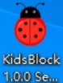。

\2. 先选中“为使用这台电脑的任何人安装”，再点击“下一步”。

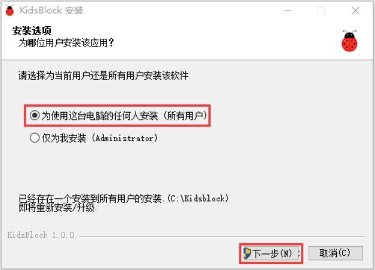 

\3. 先点击“浏览（B）...”,选择安装的位置（我这里选择安装在C盘，你也可以选择安装在电脑的其他盘），再点击“安装”。这样，软件就在安装过程中。

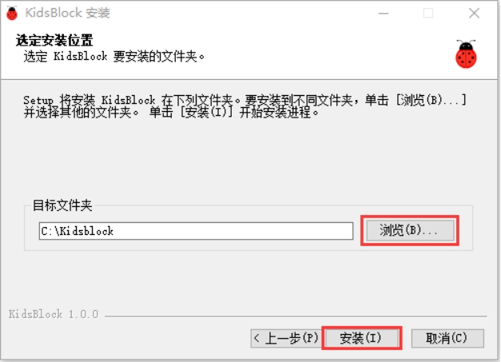 

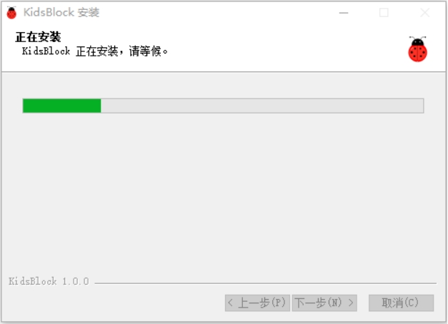 

\4. 几秒种后，安装完成。点击“完成”就可以打开安装好的软件。

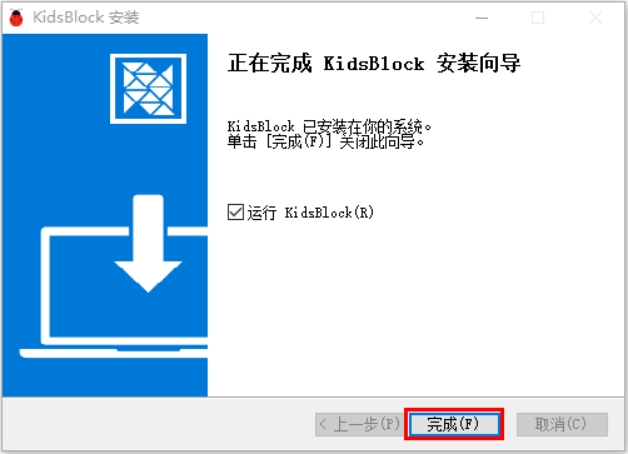 

\5. 如果出现电脑安全警报窗口，点击“允许访问”。这样就可以打开了软件页面。

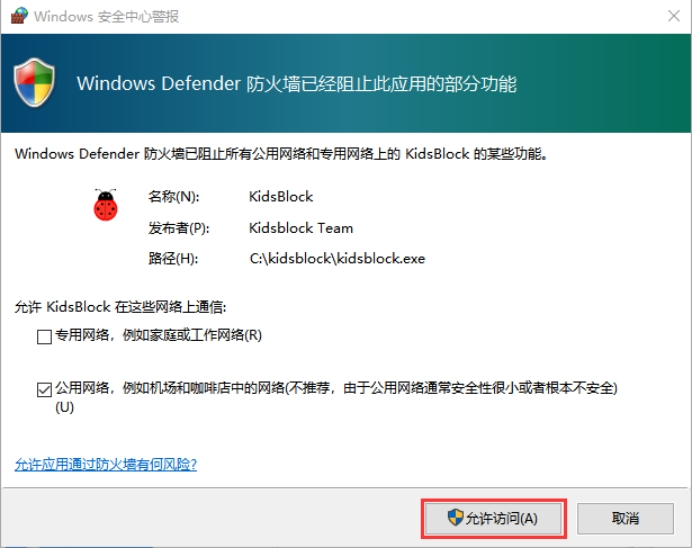 

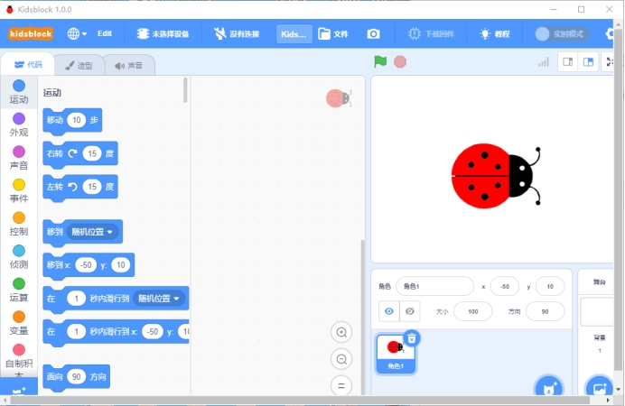 

有更新软件时一般打开会自动提醒，为了软件能正常使用我们选择升级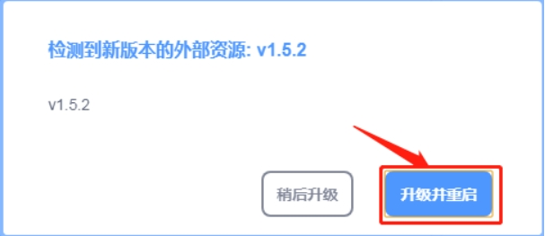

我们也可在设置中手动更新软件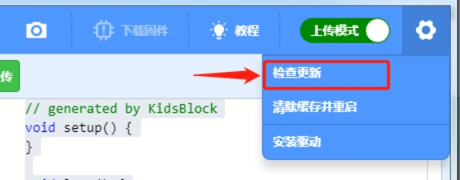

如果已经是最新版本则显示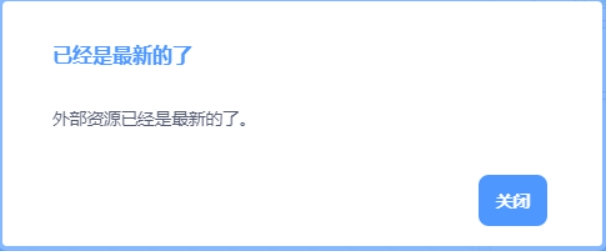

 

## **KidsBlock软件的使用方法**

（以下是以Windows系统为例，MacOS系统可以参考）

1.软件中各按钮的功能：

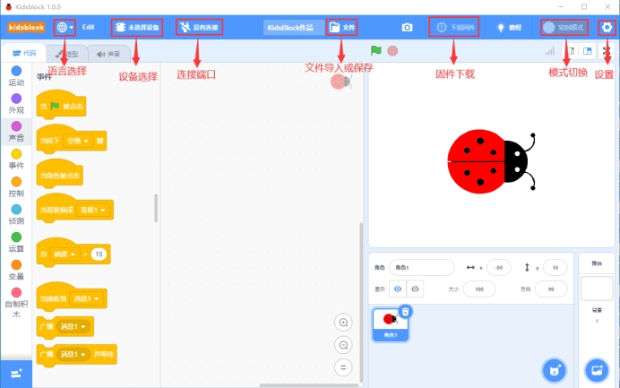 

\2. 点击可以选择语言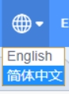“English”和“简体中文”。

\3. 点击，选择点击“安装驱动”。（注意：如果电脑已经安装了驱动程序，则不需要再安装驱动；如果没有，则需要进行以下操作）

A.在“设备驱动程序安装向导”页面选择点击“下一页”。

  

B. 过一会儿，选择点击“完成”。

 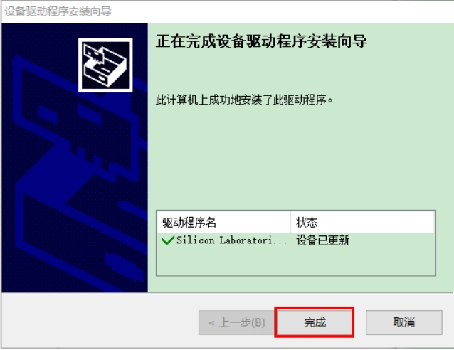

C. 选择点击“下一页”。

 

D. 选择点击“完成”。

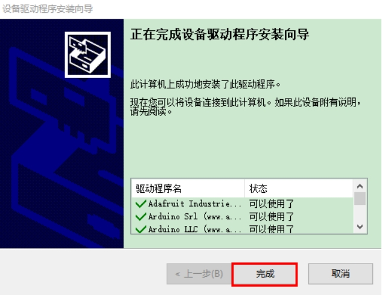 

E. 如果出现安全页面，选择点击“允许”即可，然后选择点击“Install”。

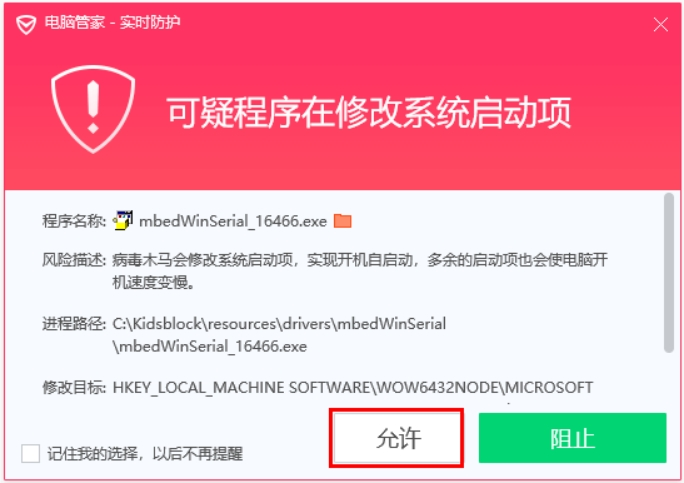 

 

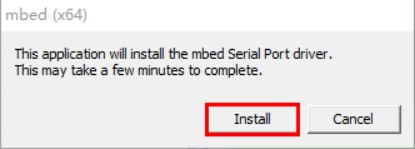 

E.选择点击“安装”。

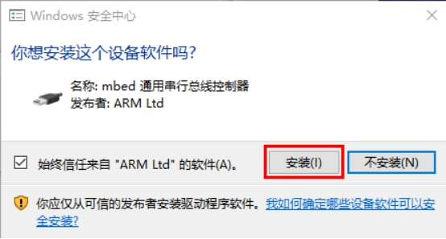 

F. 过一会儿，点击“Finish”。

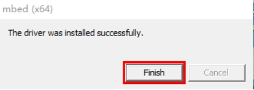 

G. 选择点击“Extract”。

 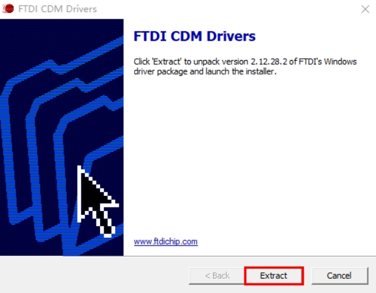

H. 选择点击“下一页”。

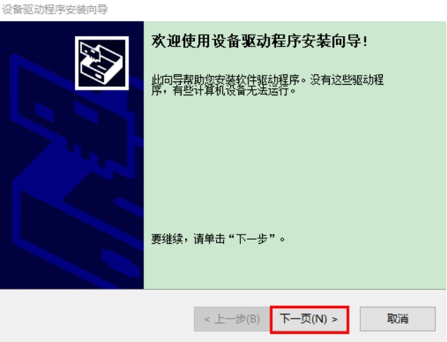 

I. 选择点击“我接受这个协议”后，点击“下一页”。

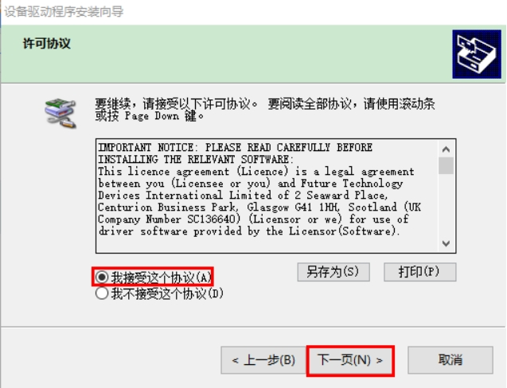 

J. 选择点击“完成”。

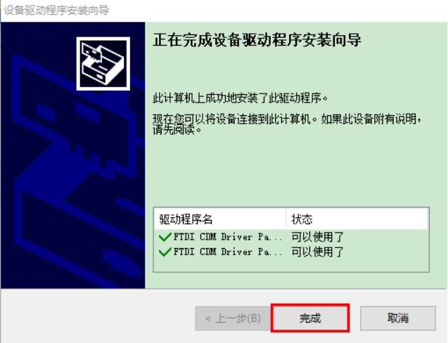 

K. 选择“安装”。

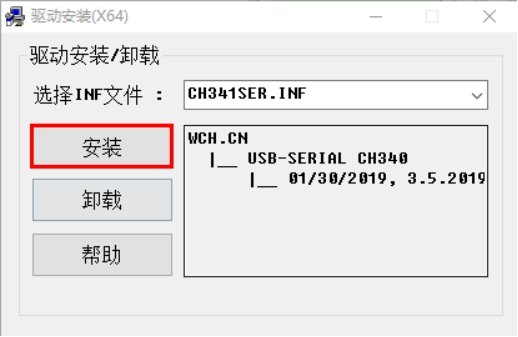 

O. 过几秒钟后，驱动安装完成，点击“确定”即可。

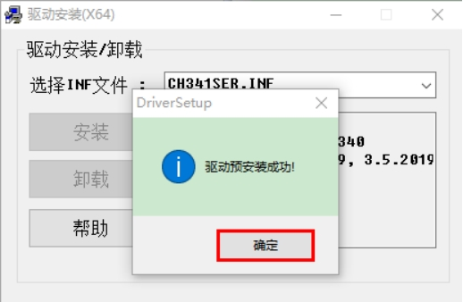 

\4. 驱动安装完后，点击进入主控板页面，可以选择需要添加的设备（控制板），本项目需要选择Uno Plus主控板。先点击Uno Plus主控板所处区域，后点击“连接”。这样Uno Plus主控板已连接上，点击“返回编辑器”回到编码编辑器。这样，我们会发现变成，同时变成，说明Uno Plus主控板和端口（COM） 都已经连接上了。              

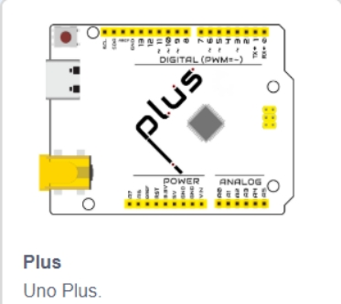 

 

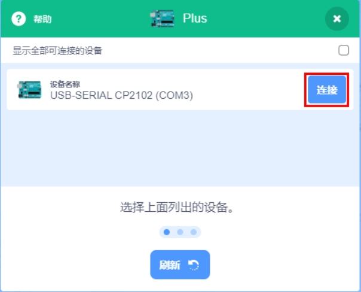 

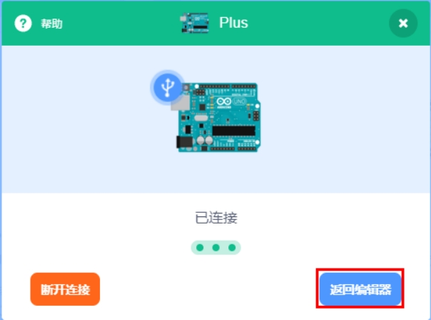 

 

 

\5. 假如Uno Plus主控板已经连接上后，但是没有变成，则需要手动点击来连接端口（COM）。先点击，在出现的对话页面中点击，连接成功后，会出现“已连接”页面，说明端口已连接上了。

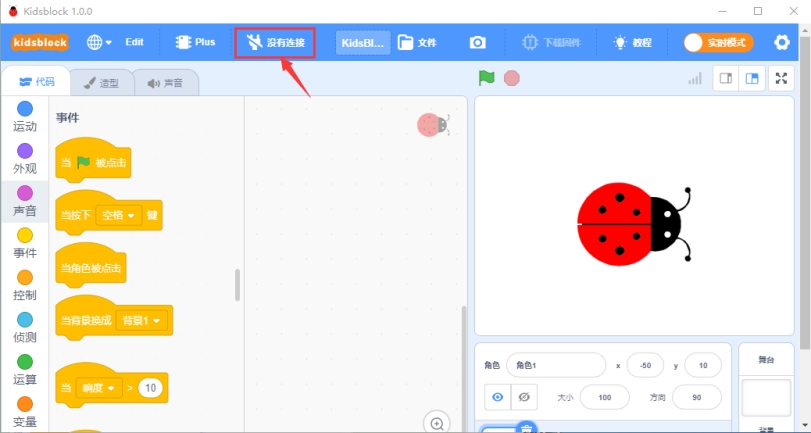 

​      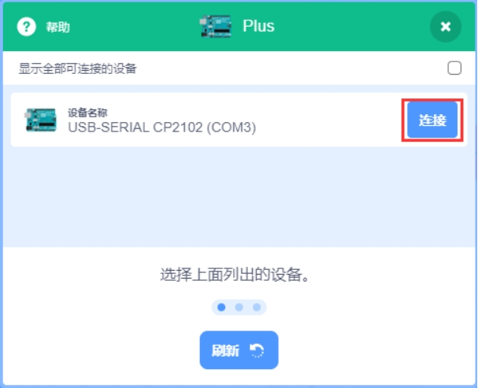

 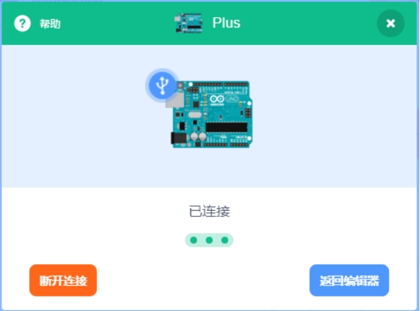 

 

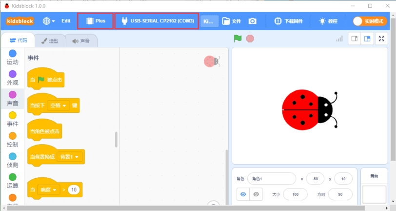 

如果需要断开端口，先点击，在出现的对话页面中点击“断开连接”。这样，端口就断开了。

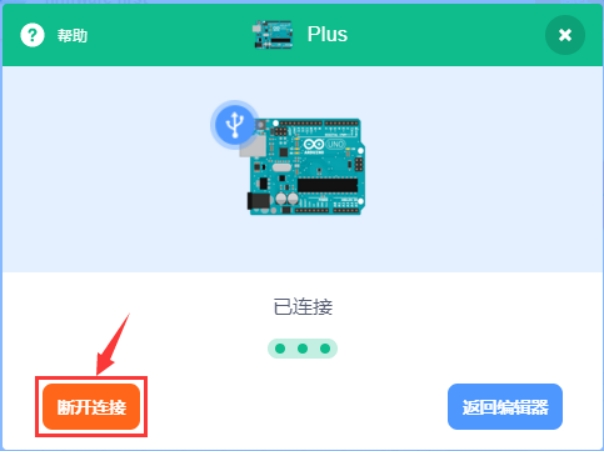 

\6. Uno Plus主控板和端口（COM）都已经连接上，接着点击切换模式，这样就可以将切换成。

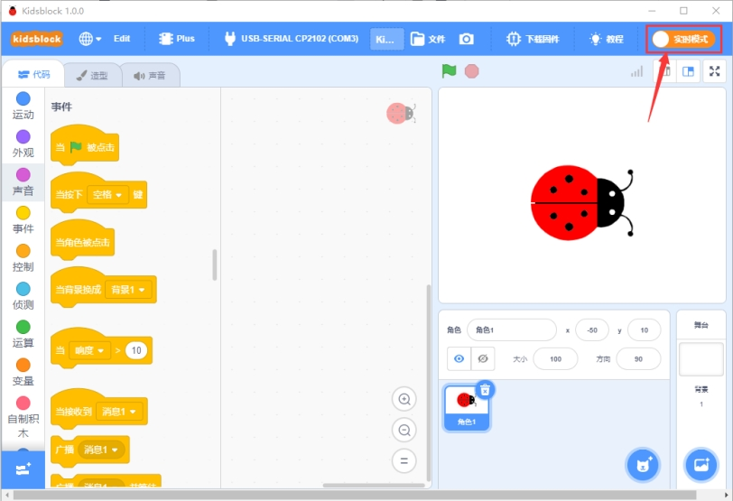 

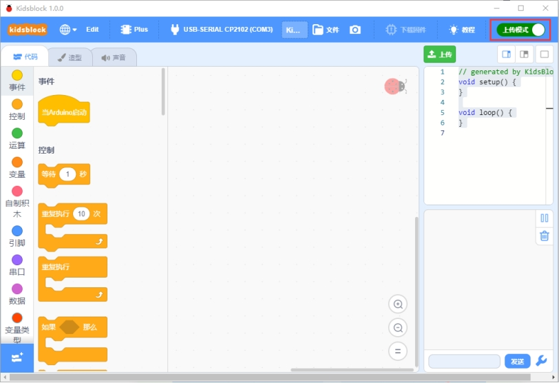 

 

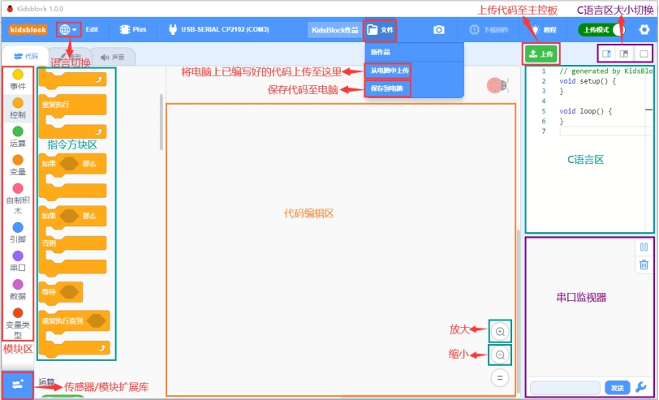 

\7. 是添加传感器/模块和元件的扩展包，点击可以进入传感器/模块扩展库界面，点击传感器/模块所处区域，就可以添加对应的传感器/模块。例如需要添加超声波传感器模块，点击“超声波传感器”所处区域，“未加载”变成“已加载”，说明“超声波传感器”模块添加成功。

   

点击，可以回到代码编辑器界面，在模块区可以看到添加的“超声波传感器”模块。

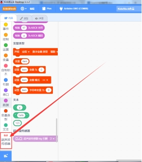 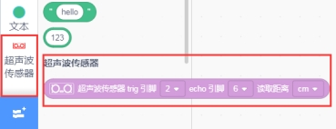

如果需要删除“超声波传感器”模块，只需要点击再次进入传感器/模块扩展库界面，点击“超声波传感器”所处区域，“已加载”变成“未加载”，则说明“超声波传感器”模块删除成功。

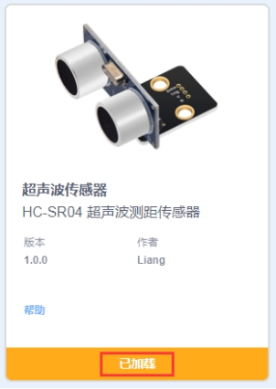   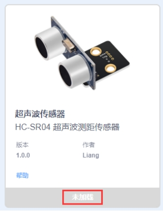 

其他的传感器/模块和元器件的添加和删除，方法是一样的。

\8. 打开已有的SB3类型文件的方法：***\*推荐使用方法2，方法1打开时有时可能会丢失代码数据！\****

[点击下载测试代码](./Scartch_code.zip)

方法1：鼠标左键双击SB3类型文件，这样就可以打开SB3类型文件。例如：需要打开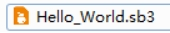文件，则只需要左键双击文件就可以直接打开。

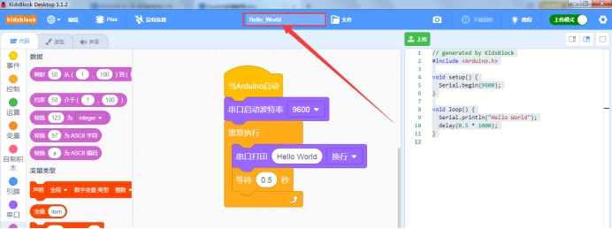 

方法2：打开Kidsblock软件，点击“文件”，选择点击“从电脑中上传”，在电脑上选中需要打开的SB3类型文件（例如：文件）

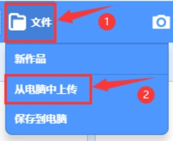 

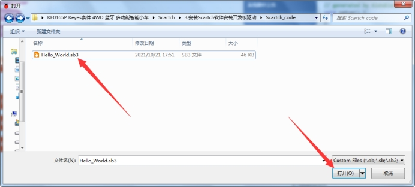 

 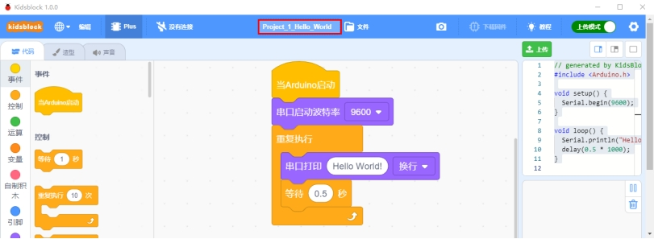 
