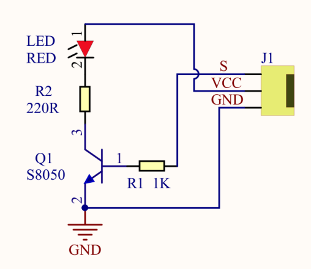
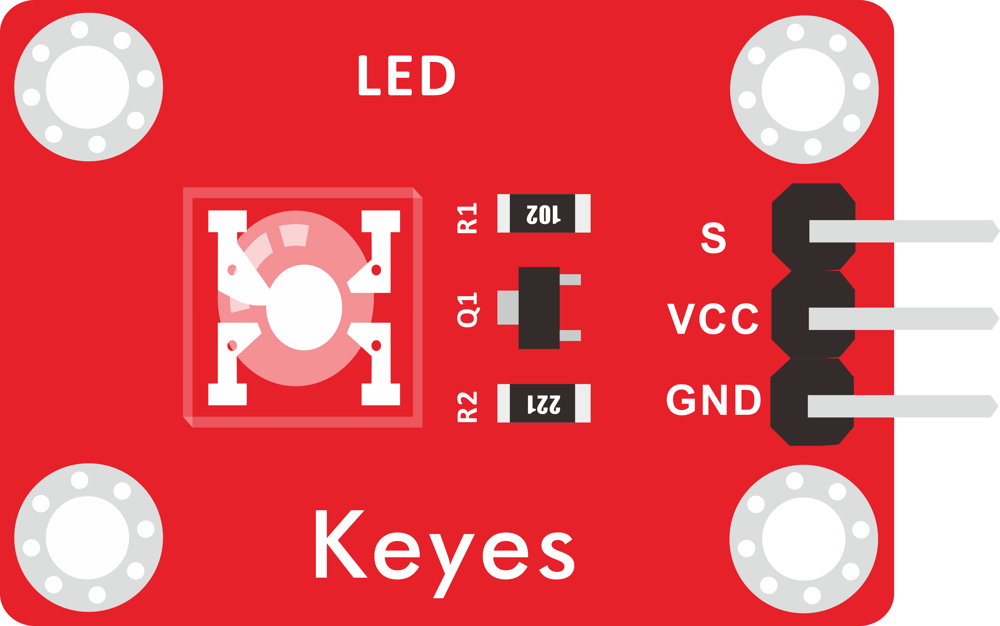
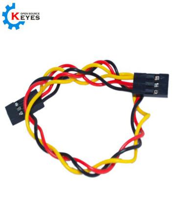
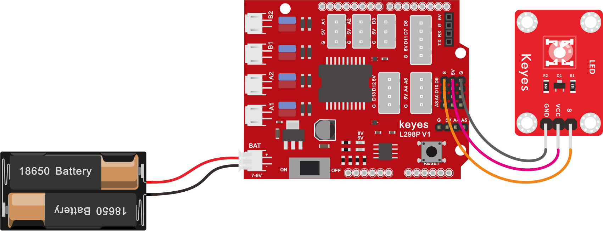

## 第01课 LED灯

### （1）项目介绍：

前面我们安装了keyes plus开发板的驱动。接下来的项目我们就要由简单到复杂，一步一步探索Arduino的世界了。首先我们要来完成经典的“Arduino点亮LED”，也就是Blink项目。Blink对于学习Arduino的爱好者而言，是最基础的项目是新手必须经历的一个练习。


LED ，发光二极管的简称。由含镓（Ga）、砷（As）、磷（P）、氮（N）等的化合物制成。当电子与空穴复合时能辐射出可见光，因而可以用来制成发光二极管。在电路及仪器中作为指示灯，或者组成文字或数字显示。

为了实验的方便，我们将LED发光二极管做成了一个模块，在第一个项目中，我们用一个最基本的测试代码来控制LED，亮一秒钟，灭一秒钟，来实现闪烁的效果。你可以改变代码中LED灯亮灭的时间，实现不同的闪烁效果。LED模块信号端S为高电平时LED亮起，S为低电平时LED熄灭。





### （2）LED模块参数：

控制接口: 数字口 

工作电压: DC 3.3-5V

排针间距: 2.54mm                       

LED显示颜色：红色

### （3）项目组件：

| keyes PLUS 开发板*1 | Keyes brick L298P 电机驱动扩展板 V1*1 | keyes 草帽LED白发红模块*1 |
| --- | --- | --- |
|  |  |  |
| USB线*1 | 3Pin 双母头杜邦线*1 | 18650双节电池盒*1<br />（电池 *2自配） |
|  |  |  |

### （4）接线图：



由上图我们可以看到，扩展板是堆叠在开发板上的，LED模块的-接到了扩展板的G,LED模块的+接到了扩展板的5V，LED模块的S已经接到了扩展板上的D9接口，接好线之后我们开始编写代码：

### （5）项目代码：

**示例代码 1（KE0165_1.1.ino）：**

```cpp
/*
  keyes 4WD 多功能智能车
  课程 1.1
  闪烁 LED
  http://www.keyes-robot.com
*/

#define LED_PIN 9  // LED 灯引脚

/* 功能：初始化设置 */
void setup() {
  pinMode(LED_PIN, OUTPUT);  // 初始化数字引脚 9 为输出模式
}

/* 功能：主循环，控制 LED 闪烁 */
void loop() {
  digitalWrite(LED_PIN, HIGH);  // 点亮 LED
  delay(1000);                  // 延时 1 秒
  digitalWrite(LED_PIN, LOW);   // 熄灭 LED
  delay(1000);                  // 延时 1 秒
}
```


### （6）项目结果：

点击上传程序，你应该看到D9脚接着的LED打开和关闭，而且间隔的时间是一秒钟。

### （7）代码说明:

**pinMode(9，OUTPUT)**- 在使用Arduino的引脚之前，你需要告诉开发板它是INPUT还是OUTPUT。我们使用一个内置的“函数”pinMode()来做到这一点。

**digitalWrite(9，HIGH)** - 当使用引脚作为OUTPUT时，可以将其命令为HIGH（输出5伏）或LOW（输出0伏）。

### （8）项目拓展：

前面我们控制了LED模块亮1秒钟,灭一秒钟 ，现在我们来拓展一下思路，通过改变delay的时间来改变LED 灯闪烁的频率。

**示例代码 2（KE0165_1.2.ino）：**

```cpp
/*
  keyes 4WD 多功能智能车
  课程 1.2
  闪烁灯
  http://www.keyes-robot.com
*/

#define LED_PIN 9  // LED 灯引脚

/* 功能：初始化设置 */
void setup() {
  pinMode(LED_PIN, OUTPUT);  // 设置 LED 引脚为输出模式
}

/* 功能：主循环，控制 LED 灯闪烁 */
void loop() {
  digitalWrite(LED_PIN, HIGH);  // 点亮 LED 灯
  delay(100);                   // 延时 0.1 秒
  digitalWrite(LED_PIN, LOW);   // 熄灭 LED 灯
  delay(100);                   // 延时 0.1 秒
}
```

怎么样是不是很好理解，就是通过改变delay 这个代码的时间，来改变3脚LED亮和灭的频率，不多说，我们上传代码。看看这个LED灯闪烁的频率是不是比之前快了？
