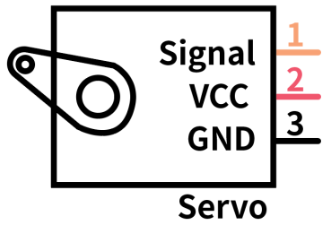
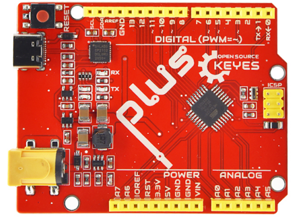
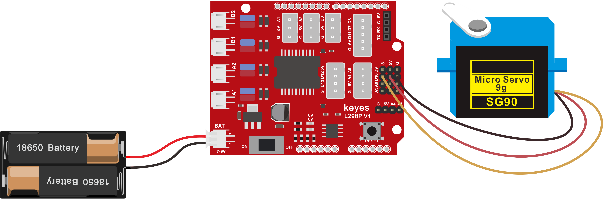

## 第04课 舵机控制

### （1）项目介绍：


舵机是一种位置伺服的驱动器，主要是由外壳、电路板、无核心马达、齿轮与位置检测器所构成。其工作原理是由接收机或者单片机发出信号给舵机，其内部有一个基准电路，产生周期为20ms，宽度为1.5ms 的基准信号，将获得的直流偏置电压与电位器的电压比较，获得电压差输出。

舵机有很多规格，但所有的舵机都有外接三根线，分别用棕、红、橙三种颜色进行区分，由于舵机品牌不同，颜色也会有所差异，棕色为接地线，红色为电源正极线，橙色为信号线。



舵机的转动的角度是通过调节PWM（脉冲宽度调制）信号的占空比来实现的，标准PWM（脉冲宽度调制）信号的周期固定为20ms（50Hz），理论上脉宽分布应在1ms到2ms 之间，但是，事实上脉宽可由0.5ms 到2.5ms 之间，脉宽和舵机的转角0°～180°相对应。


对应的舵机角度值如下:


### （2）舵机参数：

工作电压：DC 4.8V〜6V

可操作角度范围：大约 About 180°(在 500→2500 μsec)

脉波宽度范围：500→2500 μsec

空载转速：0.12±0.01 sec/60（DC 4.8V）  0.1±0.01 sec/60（DC 6V）

空载电流：200±20mA（DC 4.8V）  220±20mA（DC 6V）

停止扭力：1.3±0.01kg·cm（DC 4.8V）  1.5±0.1kg·cm（DC 6V）

停止电流：≦850mA（DC 4.8V）  ≦1000mA（DC 6V）

待机电流：3±1mA（DC 4.8V）  4±1mA（DC 6V）

### （3）项目组件

| Keyes Uno Plus 开发板 红色环保*1 | Keyes brick L298P 电机驱动扩展板 V1*1 | Keyes SG90 9G 舵机*1 | Keyes SG90 9G 舵机*1 |
| --- | --- | --- | --- |
|  |  |  |  |
| USB线*1 | USB线*1 | 18650双节电池盒*1 | 18650电池*2 （电池自配） |
|  |  |  |  |

### （4）接线图：


接线注意：舵机连接到G（GND）、V（VCC）、10，舵机的棕色线是与Gnd(G)相连，红色线与5v(V)相连，橙色线是与数字10相连的。接舵机的时候必须要外接供电，因为驱动舵机的电流要求比较大，一般峰值的情况下接近1A，开发板的电流远远不够。如果不接外接电源，很有可能烧坏开发板。

### （5）项目代码1：

```cpp
/*

4WD 蓝牙多功能车  

lesson 4.1

Servo

http://www.keyes-robot.com

*/

#define servoPin 10  //servo Pin

int pos; //舵机的角度变量

int pulsewidth; //舵机的脉宽变量

void setup() {

  pinMode(servoPin, OUTPUT);  //舵机引脚设置为输出

  procedure(0); //设置舵机的角度为0度

}

void loop() {

  for (pos = 0; pos <= 180; pos += 1) { // goes from 0 degrees to 180 degrees

    // in steps of 1 degree

    procedure(pos);              // tell servo to go to position in variable 'pos'

    delay(15);                   //控制舵机转动的速度

  }

  for (pos = 180; pos >= 0; pos -= 1) { // goes from 180 degrees to 0 degrees

    procedure(pos);              // tell servo to go to position in variable 'pos'

    delay(15);

  }

}

//控制舵机的函数

void procedure(int myangle) {

  pulsewidth = myangle * 11 + 500;  //计算出脉宽值

  digitalWrite(servoPin, HIGH);

  delayMicroseconds(pulsewidth);   //高电平持续的时间，就是脉宽

  digitalWrite(servoPin, LOW);

  delay((20 - pulsewidth / 1000));  //周期是20ms，所以低电平持续剩下的时间

}

//**********************************************************************************
```


在上传代码成功，我们可以看到舵机在0°到180°角度范围来回摆动。

其实我们还可以有一种更简单的方法控制舵机，就是使用Arduino的舵机库文件，可以参考Arduino 官方的使用说明：，

以下是使用了舵机库文件的程序,接线图不变



### （6）项目代码2:

```cpp
/*

4WD 蓝牙多功能车 

lesson 4.2

Servo

http://www.keyes-robot.com

*/

#include <Servo.h>

Servo myservo;  // create servo object to control a servo

// twelve servo objects can be created on most boards

int pos = 0;    // variable to store the servo position

void setup() {

  myservo.attach(10);  // attaches the servo on pin 9 to the servo object

}

void loop() {

  for (pos = 0; pos <= 180; pos += 1) { // goes from 0 degrees to 180 degrees

    // in steps of 1 degree

    myservo.write(pos);              // tell servo to go to position in variable 'pos'

    delay(15);                       // waits 15ms for the servo to reach the position

  }

  for (pos = 180; pos >= 0; pos -= 1) { // goes from 180 degrees to 0 degrees

    myservo.write(pos);              // tell servo to go to position in variable 'pos'

    delay(15);                       // waits 15ms for the servo to reach the position

  }

}

//**************************************************************************
```


### （7）项目结果：

上传代码成功，上电后，舵机也是在0°到180°角度范围来回摆动。这两个项目的效果是一样的 ，通常我们使用库文件来控制的比较多。

### （8）代码说明:

**#include <Servo.h>**是Arduino自带的Servo函数及其语句，下面是舵机函数的几个常用语句：

**1、attach（接口）**——设定舵机的接口，只有9或10接口可用。

**2、write（角度）**——用于设定舵机旋转角度的语句，可设定的角度范围是0°到180°。

**3、read（）**——用于读取舵机角度的语句，可理解为读取最后一条write()命令中的值。

**4、attached（）**——判断舵机参数是否已发送到舵机所在接口。

注：以上语句的书写格式均为“舵机变量名.具体语句（）”例如：myservo.attach(9)。

**示例代码 1（KE0165_4.1.ino）：**

```cpp
/*
  keyes 4WD 多功能智能车
  课程 4.1
  舵机控制
  http://www.keyes-robot.com
*/
#define SERVO_PIN 10  // 舵机引脚

int pos;           // 舵机角度变量
int pulseWidth;    // 舵机脉宽变量

/* 功能：初始化设置 */
void setup() {
  pinMode(SERVO_PIN, OUTPUT);  // 设置舵机引脚为输出
  setServoAngle(0);            // 设置舵机角度为0度
}

/* 功能：主循环，舵机从0度转到180度再转回0度 */
void loop() {
  for (pos = 0; pos <= 180; pos += 1) {  // 从0度转到180度，步进1度
    setServoAngle(pos);                   // 设置舵机角度
    delay(15);                           // 控制舵机转动速度
  }
  for (pos = 180; pos >= 0; pos -= 1) {  // 从180度转回0度，步进1度
    setServoAngle(pos);                   // 设置舵机角度
    delay(15);                           // 控制舵机转动速度
  }
}

/* 功能：根据角度设置舵机脉宽信号 */
void setServoAngle(int angle) {
  pulseWidth = angle * 11 + 500;          // 计算脉宽值，单位微秒
  digitalWrite(SERVO_PIN, HIGH);          // 发送高电平
  delayMicroseconds(pulseWidth);          // 高电平持续时间即脉宽
  digitalWrite(SERVO_PIN, LOW);           // 发送低电平
  delay(20 - pulseWidth / 1000);          // 低电平持续时间，周期20ms
}
```


**示例代码 2（KE0165_4.2.ino）：**

```cpp
/*
  keyes 4WD 多功能智能车
  课程 4.2
  舵机控制
  http://www.keyes-robot.com
*/
#include <Servo.h>

#define SERVO_PIN 10  // 舵机信号引脚

Servo myServo;  // 创建舵机对象控制舵机
int pos = 0;    // 舵机位置变量

/* 功能：初始化舵机 */
void setup() {
  myServo.attach(SERVO_PIN);  // 绑定舵机信号引脚
}

/* 功能：循环控制舵机从 0 度转到 180 度再回到 0 度 */
void loop() {
  for (pos = 0; pos <= 180; pos += 1) {  // 从 0 度转到 180 度，步进 1 度
    myServo.write(pos);                   // 设置舵机位置
    delay(15);                           // 等待舵机到达位置
  }
  for (pos = 180; pos >= 0; pos -= 1) {  // 从 180 度转回 0 度，步进 1 度
    myServo.write(pos);                   // 设置舵机位置
    delay(15);                           // 等待舵机到达位置
  }
}
```
