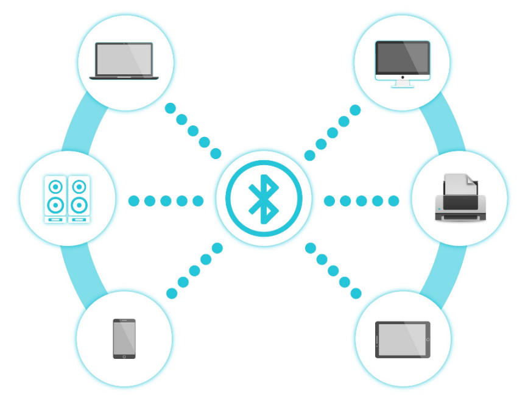
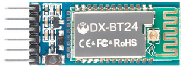
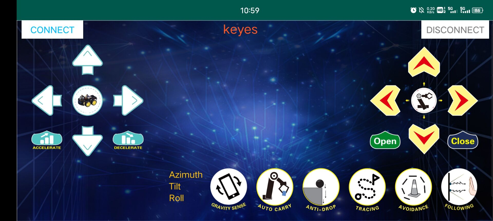
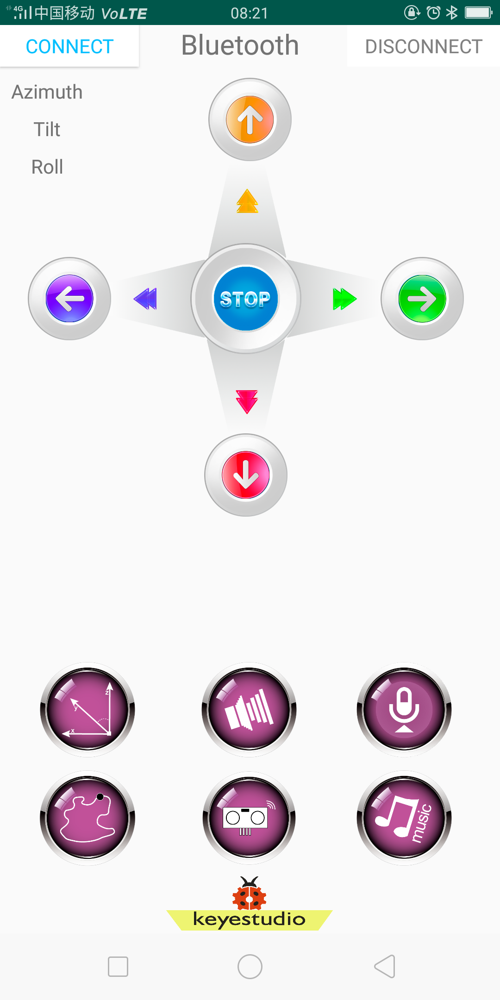
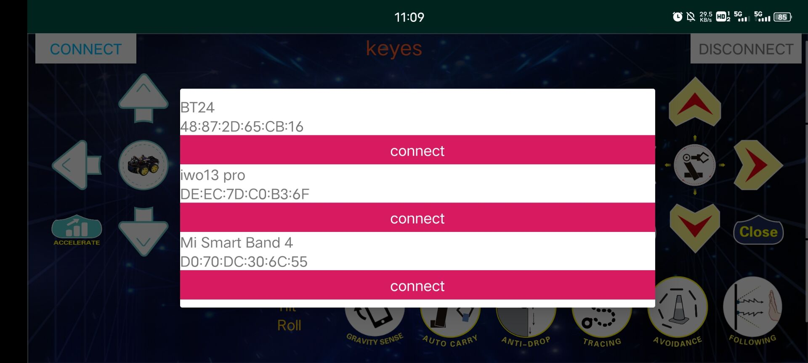
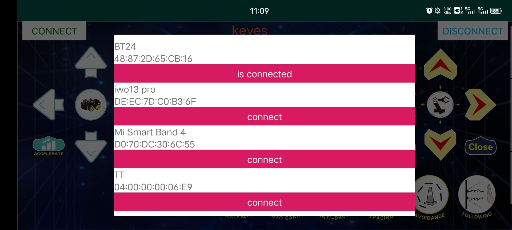
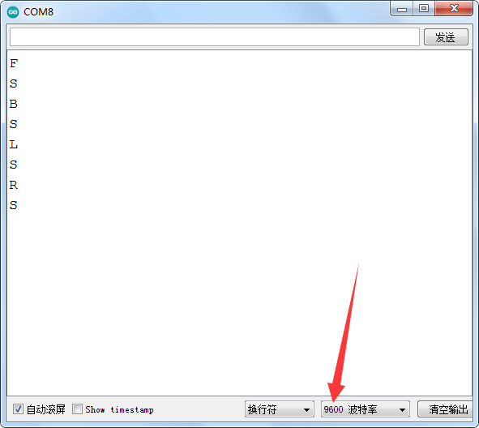
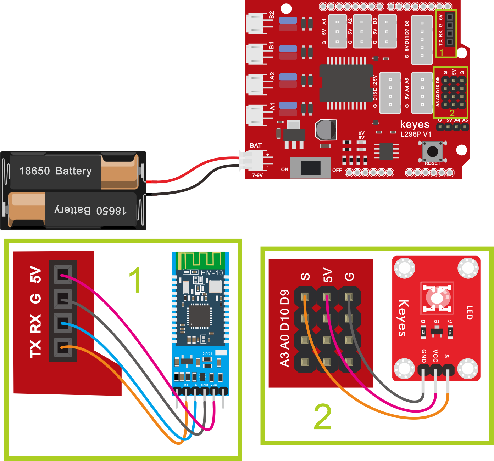

## 第07课  蓝牙遥控的原理及应用


### （1）项目介绍：



蓝牙是近几十年来最流行的一种简单的无线通信模块，易于使用，已在大多数电池供电的设备中使用。蓝牙标准进行了许多升级，以不断满足客户和技术的需求。几年来，发生了许多变化，包括数据传输速率，可穿戴设备和IoT设备以及安全系统的功耗。

在这里，我们将学习DX-BT24。 DX-BT24是一种随时可用的蓝牙模块。 该模块用于建立无线数据通信。

### （2）蓝牙参数：

蓝牙协议：Bluetooth Specification V5.1 BLE

工作距离：在开放环境中，实现50-100m超远距离通讯

工作频率：2.4GHz ISM频段

通信接口：UART

蓝牙认证：符合FCC CE ROHS REACH认证标准

FLASH：1M

串口参数：9600、8数据位、1停止位、无效位、无流控

电源：5V DC

工作温度：–5至+65摄氏度

### （3）项目组件：

| keyes PLUS 开发板*1 | Keyes brick L298P 电机驱动扩展板 V1*1 | keyes 草帽LED白发红模块*1 | DX-BT24蓝牙模块 |
| --- | --- | --- | --- |
|  |  |  |  |
| 3Pin 双母头杜邦线*1 | USB线*1 | 18650双节电池盒*1 | 18650电池*2 （电池自配） |
|  |  |  |  |

### （4）接线图：


**蓝牙是直接插在电机驱动扩展板上的，注意一下方向，而且在上传代码之前不要插上蓝牙。**

### （5）安装蓝牙APP测试：

进入公司资料官网的下载中心：https://www.keyesrobot.cn/zh-cn/latest/docs/Download_Center/Download_Center.html

找到keyes 4wd小车的APP显示图标如下。


2.点击上图图标，进入APP，显示如下图。



3.上传代码成功后，连接蓝牙，上电后，蓝牙模块上LED闪烁。点击APP左上角的图标，搜索到蓝牙，显示如下图。





4.点击BT24连接，蓝牙连接成功，显示如下图，蓝牙模块上LED变为常亮。



### （6）项目代码：


```cpp
/*
  keyes 4WD 多功能智能车
  课程 7.1
  蓝牙通信
  http://www.keyes-robot.com
*/

char BLE_VAL; // 蓝牙接收到的字符变量

/* 功能：初始化串口通信 */
void setup() {
  Serial.begin(9600); // 初始化串口，波特率 9600
}

/* 功能：读取串口数据并打印 */
void loop() {
  if (Serial.available() > 0) { // 判断串口缓存区是否有数据
    BLE_VAL = Serial.read(); // 读取串口缓存区的数据
    Serial.println(BLE_VAL); // 打印接收到的字符
  }
}
```


（**上传代码之前不要连接蓝牙模块，因为代码的上传也是用的串口通信，跟蓝牙的串口通信会有冲突，导致代码上传不成功**）

上传代码到开发板，然后再插上蓝牙模块，等待手机发出的指令。



### （7）代码说明：

**Serial.available()** 的意思是：返回串口缓冲区中当前剩余的字符个数。一般用这个函数来判断串口的缓冲区有无数据，当Serial.available()>0时，说明串口接收到了数据，可以读取；

**Serial.read()**指从串口的缓冲区取出并读取一个Byte的数据，比如有设备通过串口向Arduino发送数据了，我们就可以用Serial.read()来读取发送的数据。

### （8）项目拓展：

上面的项目，我们讲解了蓝牙接收到手机发送的信号并且在开发板的串口显示出来，比如我们按下  ，然后我们就会接收到‘B’，当我们松开的时候又接收到‘S’。那接下来我们就要想一下了，我们可以利用接收到的信号去做一些事情吗，答案是肯定的，我们这里就利用手机发送的命令去打开或者关闭一个LED灯。看接线图，在D9脚接了一个LED。



**示例代码 2（KE0165_7.2.ino）：**

```cpp
/*
  keyes 4WD 多功能智能车
  课程 7.2
  蓝牙控制
  http://www.keyes-robot.com
*/

#define LED_PIN 9  // LED 灯引脚

/* 功能：初始化串口和 LED 引脚 */
void setup() {
  Serial.begin(9600);
  pinMode(LED_PIN, OUTPUT);
}

/* 功能：读取串口数据，根据指令控制 LED 灯 */
void loop() {
  int receivedData;
  if (Serial.available()) {
    receivedData = Serial.read();
    Serial.println("数据已接收：");  // 输出接收提示
    if (receivedData == 'B') {
      digitalWrite(LED_PIN, HIGH);  // 点亮 LED
      Serial.println("LED 已开启");
    }
    if (receivedData == 'S') {
      digitalWrite(LED_PIN, LOW);  // 熄灭 LED
      Serial.println("LED 已关闭");
    }
  }
}
```
