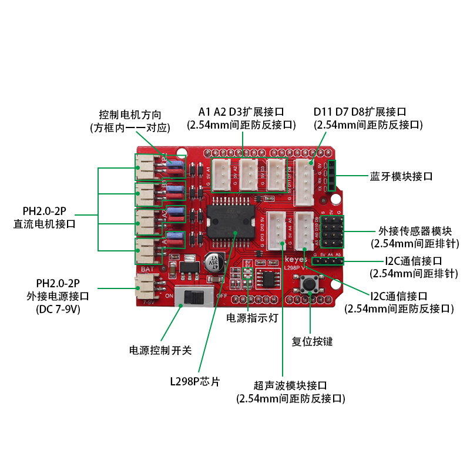
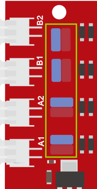
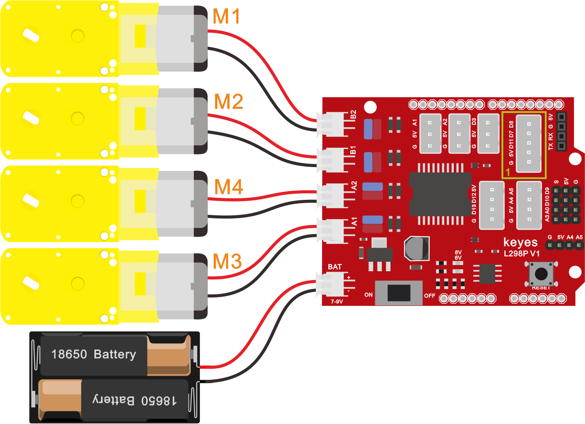

## 第08课 电机的驱动和调速

### （1）项目介绍：

驱动电机的方法有很多，我们这个智能车用到的是最常用的L298P这个方案， L298P是ST意法半导体公司出品的优秀大功率电机专用驱动芯片，可直接驱动直流电机、二相、四相步进电机，驱动电流达2A，电机输出端采用8只高速肖特基二极管作为保护。

我们根据L298P的电路设计了一款扩展板，叠层的设计可直接插接到开发板上使用，降低了用户使用和驱动电机的技术难度。我们来看一下这个板子的电路图和示意图：


  为了调节小车上的4个电机，使得电机电机的驱动方向与后续的课程代码描述一致。驱动板上自带8个跳线帽，也可用于控制电机转向，例如当MA电机接口前方2个跳线帽由横向连接改为纵向连接时，MA电机的转动方向就和原来的转动方向相反。





### （2）规格参数：

逻辑部分输入电压：DC 5V

驱动部分输入电压：DC 7-12V

逻辑部分工作电流：<36mA

驱动部分工作电流：<2A

最大耗散功率：25W（T=75℃）

控制信号输入电平：高电平2.3V<Vin<5V  ，低电平-0.3V<Vin<1.5V

工作温度：-25＋130℃

### （3）驱动小车运行原理：

**根据上面电机驱动板的电路图和示意图，我们知道了A电机的方向引脚在D2,调速引脚在D6,B电机的方向引脚在D4，调速引脚在D5，按照以下表格的运动逻辑，我们就可以知道如何通过控制数字口，PWM口控制2个电机转动，从而实现智能小车的行走。其中PWM值范围为0-255，设置数字越大，电机转动越快。（电机接口处有丝印标示A，B）**

|  | D2 | D6（PWM） | 电机（A） | D4 | D5（PWM） | 电机（B） |
| --- | --- | --- | --- | --- | --- | --- |
| 前进 | HIGH | 200 | 正转 | HIGH | 200 | 正转 |
| 后退 | LOW | 200 | 反转 | LOW | 200 | 反转 |
| 右旋转 | LOW | 200 | 反转 | HIGH | 200 | 正转 |
| 左旋转 | HIGH | 200 | 正转 | LOW | 200 | 反转 |
| 停止 | / | 0 | 停止 | / | 0 | 停止 |

### （4）项目组件：

| keyes PLUS 开发板*1 | Keyes brick L298P 电机驱动扩展板 V1*1 | 4.5V 200转/分 单轴减速箱+双头轴马达+250MM PH2.0mm-2P线材*4 |
| --- | --- | --- |
|  |  |  |
|  | USB线 | 18650双节电池盒*1<br />（电池 *2自配） |
|  |  |  |

### （5）接线图：



### （6）项目代码：

```cpp
/*
  keyes 4WD 多功能智能车
  课程 8.1
  电机驱动扩展板
  http://www.keyes-robot.com
*/

#define MA 2       // 电机M3,M4方向控制引脚 D2
#define PWMA 6     // 电机M3,M4速度控制引脚 D6
#define MB 4       // 电机M1,M2方向控制引脚 D4
#define PWMB 5     // 电机M1,M2速度控制引脚 D5

/* 功能：初始化电机控制引脚 */
void setup() {
  pinMode(MA, OUTPUT);    // 配置电机M3,M4方向引脚为输出
  pinMode(PWMA, OUTPUT);  // 配置电机M3,M4速度引脚为输出
  pinMode(MB, OUTPUT);    // 配置电机M1,M2方向引脚为输出
  pinMode(PWMB, OUTPUT);  // 配置电机M1,M2速度引脚为输出
}

/* 功能：主循环，控制小车前进、后退、左转、右转和停止 */
void loop() {
  // 前进1秒
  digitalWrite(MA, HIGH);     // 电机A正转
  analogWrite(PWMA, 200);     // 电机A速度为200
  digitalWrite(MB, HIGH);     // 电机B正转
  analogWrite(PWMB, 200);     // 电机B速度为200
  delay(1000);

  // 后退1秒
  digitalWrite(MA, LOW);      // 电机A反转
  analogWrite(PWMA, 200);     // 电机A速度为200
  digitalWrite(MB, LOW);      // 电机B反转
  analogWrite(PWMB, 200);     // 电机B速度为200
  delay(1000);

  // 左转1秒
  digitalWrite(MA, HIGH);     // 电机A正转
  analogWrite(PWMA, 200);     // 电机A速度为200
  digitalWrite(MB, LOW);      // 电机B反转
  analogWrite(PWMB, 200);     // 电机B速度为200
  delay(1000);

  // 右转1秒
  digitalWrite(MA, LOW);      // 电机A反转
  analogWrite(PWMA, 200);     // 电机A速度为200
  digitalWrite(MB, HIGH);     // 电机B正转
  analogWrite(PWMB, 200);     // 电机B速度为200
  delay(1000);

  // 停止1秒
  analogWrite(PWMA, 0);       // 电机A停止
  analogWrite(PWMB, 0);       // 电机B停止
  delay(1000);
}
```

### （7）项目结果：

上传代码成功，上电后，智能车前进1秒，后退1秒，左转1秒，右转1秒，停止1秒，循环。

### （8）代码说明：

**digitalWrite(MB,LOW);** 电机的正反转是靠高低电平的转换来实现的，控制电机正反转的脚位用一般的数字脚位就可以了。

**analogWrite(PWMB,200);**电机的速度调节是靠PWM来实现的，控制电机调速的脚位必须是Arduino 的PWM 脚位。

### （9）项目拓展：

我们来通过调整PWM控制电机的速度，为后面我们控制车速做一个铺垫，接线不变

**示例代码 2（KE0165_8.2.ino）：**

```cpp
/*
  keyes 4WD 多功能智能车
  课程 8.2
  电机驱动扩展板
  http://www.keyes-robot.com
*/

#define MA 2       // 电机M3,M4方向控制引脚 D2
#define PWMA 6     // 电机M3,M4速度控制引脚 D6
#define MB 4       // 电机M1,M2方向控制引脚 D4
#define PWMB 5     // 电机M1,M2速度控制引脚 D5

/* 功能：初始化电机控制引脚 */
void setup() {
  pinMode(MA, OUTPUT);     // 配置电机M3,M4方向引脚为输出
  pinMode(PWMA, OUTPUT);   // 配置电机M3,M4速度引脚为输出
  pinMode(MB, OUTPUT);     // 配置电机M1,M2方向引脚为输出
  pinMode(PWMB, OUTPUT);   // 配置电机M1,M2速度引脚为输出
}

/* 功能：主循环，控制电机前进、后退、左转、右转和停止 */
void loop() {
  // 前进1秒
  digitalWrite(MA, HIGH);    // 电机M3,M4正转
  analogWrite(PWMA, 100);    // 电机M3,M4速度设为100
  digitalWrite(MB, HIGH);    // 电机M1,M2正转
  analogWrite(PWMB, 100);    // 电机M1,M2速度设为100
  delay(1000);               // 延时1秒

  // 后退1秒
  digitalWrite(MA, LOW);     // 电机M3,M4反转
  analogWrite(PWMA, 100);    // 电机M3,M4速度设为100
  digitalWrite(MB, LOW);     // 电机M1,M2反转
  analogWrite(PWMB, 100);    // 电机M1,M2速度设为100
  delay(1000);               // 延时1秒

  // 左转1秒
  digitalWrite(MA, HIGH);    // 电机M3,M4正转
  analogWrite(PWMA, 150);    // 电机M3,M4速度设为150
  digitalWrite(MB, LOW);     // 电机M1,M2反转
  analogWrite(PWMB, 150);    // 电机M1,M2速度设为150
  delay(1000);               // 延时1秒

  // 右转1秒
  digitalWrite(MA, LOW);     // 电机M3,M4反转
  analogWrite(PWMA, 150);    // 电机M3,M4速度设为150
  digitalWrite(MB, HIGH);    // 电机M1,M2正转
  analogWrite(PWMB, 150);    // 电机M1,M2速度设为150
  delay(1000);               // 延时1秒

  // 停止1秒
  analogWrite(PWMA, 0);      // 电机M3,M4停止
  analogWrite(PWMB, 0);      // 电机M1,M2停止
  delay(1000);               // 延时1秒
}
```
