## 第09课 LED表情灯板


### （1）项目介绍

如果在我们的机器人上加一块表情面板，这将是多么好玩的一件事情，keyes的8X16点阵就可以满足你的要求。你可以自己创建面部表情，动画，图案或者是其他有趣的显示。8X16 LED灯板自带128个LED。微处理器（arduino）的数据通过两线总线接口与AiP1640通讯，从而控制模块上128个LED的亮灭，从而让模块上点阵显示你需要的图案。为方便接线，我们还配送一根HX-2.54 4Pin接线。

### （2）规格参数

工作电压: DC 3.3-5V

功率损耗：400mW

震荡频率：450KHz

驱动电流：200mA

工作温度：-40~80℃

通信方式：I2C通信

### （3）8X16点阵模块详细介绍

**8X16点阵的电路图**


**控制8X16点阵的原理**

是怎么控制8X16点阵的每个led灯的呢？要知道一个字节有8位，每一位是0或1，0时关闭led，1时打开led灯，那么一个字节就可以控制点阵一列的led灯开关了，自然16个字节就可以控制16列led灯，即控制了8X16点阵。

**接口说明及通讯协议**

微处理器（arduino）的数据通过两线总线接口与AiP1640通讯。

通讯协议图如下(SCLK)就是SCL，(DIN)就是SDA。

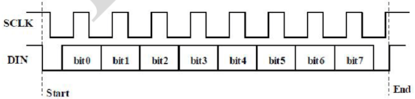

①数据输入的开始条件是，SCL为高电平，SDA由高变低。

②数据命令设置，有下图所示方法可选。我们的示例程序中选择 **地址自动加1**的方式，其二进制是0100 0000对应的十六进制为0x40

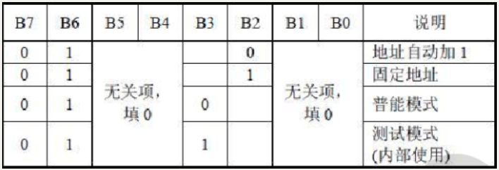

③地址命令设置，有如下图地址可以选。我们示例程序中选了第一个00H，其二进制1100 0000对应的十六进制是0xc0

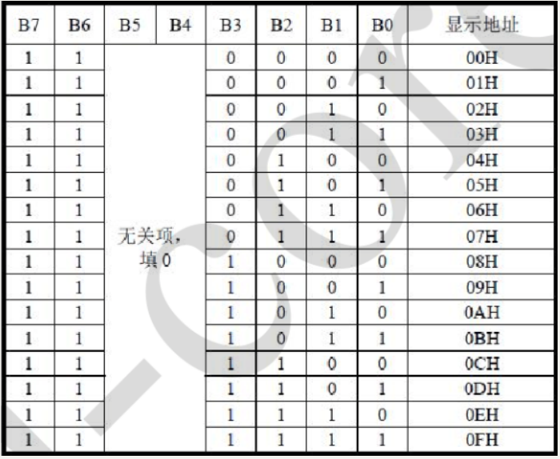

④数据输入的要求是，在输入数据时当SCL是高电平时，SDA上的信号必须保持不变，只有SCL上的时钟信号为低电平时，SDA上的信号才可以改变。数据的输入是 低位在前，高位在后 传输。

⑤数据传输结束的条件是，SCL为低时，SDA为低，SCL为高时，SDA电平也变为高电平。

⑥显示控制，设置不同脉宽，脉宽有如下图可选。我们示例中选了脉宽为4/16，1000 1010对应的十六进制是0x8A

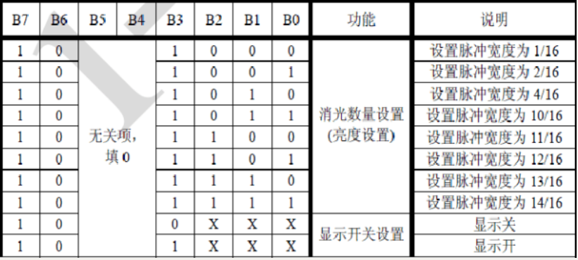

对应我们的示例程序来学习会理解的更好。

### （4）取模工具的使用说明

设置时，我们需要把一个图案转换成1组16个的16位数据。

下载取模工具： 


点击新建图案，根据显示屏规格，设置宽度为16，高度为8，如下图。

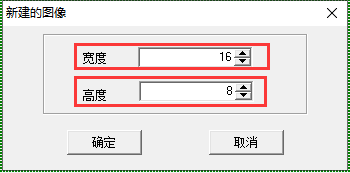

初始时发现格点不大，不方便设置，我们可以通过设置模拟动画，设置格点大小，点击如下图。


一直鼠标左键点击，就可以一直放大格点了。

放大后，我们就可以通过用鼠标点击白色区域，设置显示图案了。

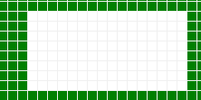

设置时，鼠标点击（左右键都可以）白色格点，变为黑色；再点击黑色格点，变为白色。黑色代表该格点显示亮起，白色代表格点不显示。显示屏最多能设置16*8个点显示。设置笑脸显示如下图。


设置参数设置，选择其他选项，设置如下图。设置完成点击。

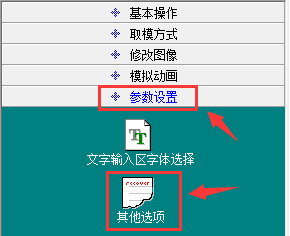


设置取模方式，选择C51格式选择如下图。


设置成功后，在以下区域就可以看到对应的16个数据了，只需要将数据复制粘贴在数组中，就可以用直接调用了。

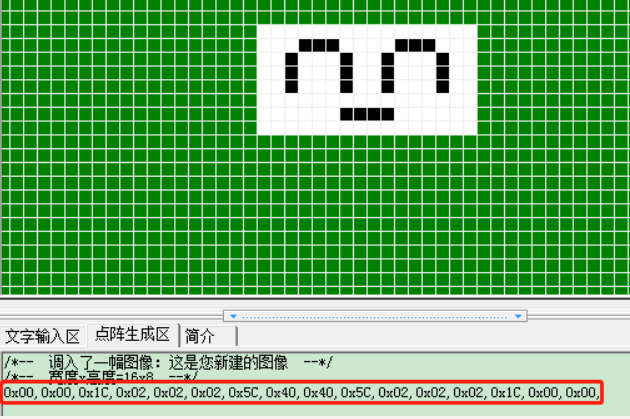

### （5）接线图


接线注意：  8x16 LED灯板的GND、VCC、SDA、SCL分别对应的接到keyestudio传感器扩展板-（GND）、+（VCC）、A4、A5进行两线串行通信。（注意：这里是接了arduino IIC的引脚，但是这个模块并不是IIC通讯的，是可以接任意两个引脚的。） 

### （6）项目代码

**示例代码 1（KE0165_9.1.ino）：**

```cpp
/*
  keyes 4WD 多功能智能车
  课程 9.1
  点阵显示
  http://www.keyes-robot.com
*/
// 从取摸工具中得到的微笑图案的数据
unsigned char SMILE[] = {0x00, 0x00, 0x1c, 0x02, 0x02, 0x02, 0x5c, 0x40, 0x40, 0x5c, 0x02, 0x02, 0x02, 0x1c, 0x00, 0x00};
#define SCL_PIN  A5  // 时钟引脚 A5
#define SDA_PIN  A4  // 数据引脚 A4

/* 功能：初始化设置 */
void setup() {
  pinMode(SCL_PIN, OUTPUT);  // 设置时钟引脚为输出
  pinMode(SDA_PIN, OUTPUT);  // 设置数据引脚为输出
  // 清屏
  // matrixDisplay(clear);
}

/* 功能：主循环 */
void loop() {
  matrixDisplay(SMILE);  // 显示微笑表情图案
}

/* 功能：点阵屏显示函数 */
void matrixDisplay(unsigned char matrixValue[]) {
  IicStart();  // 启动数据传输
  IicSend(0xc0);  // 选择地址

  for (int i = 0; i < 16; i++) {  // 图案数据共16字节
    IicSend(matrixValue[i]);  // 传输图案数据
  }
  IicEnd();  // 结束数据传输

  IicStart();
  IicSend(0x8A);  // 显示控制，选择脉宽为4/16
  IicEnd();
}

/* 功能：IIC 起始信号 */
void IicStart() {
  digitalWrite(SCL_PIN, HIGH);
  delayMicroseconds(3);
  digitalWrite(SDA_PIN, HIGH);
  delayMicroseconds(3);
  digitalWrite(SDA_PIN, LOW);
  delayMicroseconds(3);
}

/* 功能：IIC 发送一个字节数据 */
void IicSend(unsigned char sendData) {
  for (char i = 0; i < 8; i++) {  // 每字节8位
    digitalWrite(SCL_PIN, LOW);  // 时钟拉低，准备改变数据线状态
    delayMicroseconds(3);
    if (sendData & 0x01) {  // 判断最低位是1还是0
      digitalWrite(SDA_PIN, HIGH);
    } else {
      digitalWrite(SDA_PIN, LOW);
    }
    delayMicroseconds(3);
    digitalWrite(SCL_PIN, HIGH);  // 时钟拉高，数据传输完成
    delayMicroseconds(3);
    sendData = sendData >> 1;  // 右移一位，准备传输下一位
  }
}

/* 功能：IIC 结束信号 */
void IicEnd() {
  digitalWrite(SCL_PIN, LOW);
  delayMicroseconds(3);
  digitalWrite(SDA_PIN, LOW);
  delayMicroseconds(3);
  digitalWrite(SCL_PIN, HIGH);
  delayMicroseconds(3);
  digitalWrite(SDA_PIN, HIGH);
  delayMicroseconds(3);
}
```

### （7）项目结果

在keyestudio V4.0开发板上传代码成功，按照接线图接线，拨码开关拨打到右端上电后，看一下，我们的显示屏上是不是显示了一个笑脸。

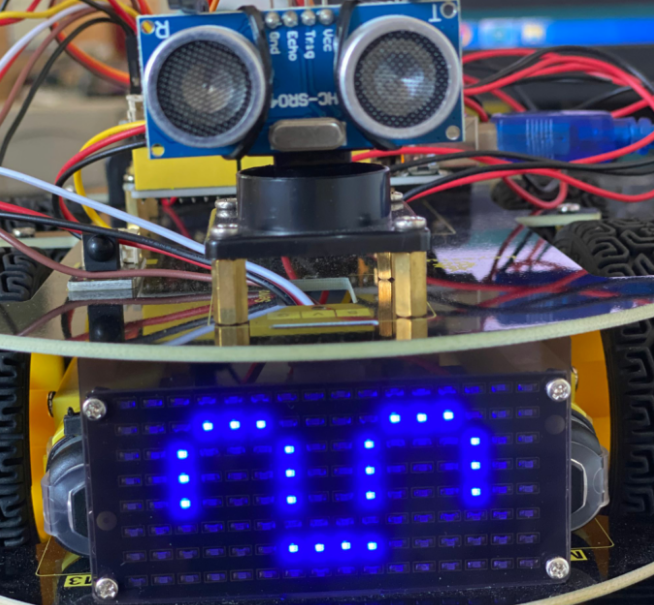

### （8）项目拓展

我们利用刚刚学到的取模工具，,让点阵循环显示开始图案，前进图案，停止图案，然后清除图案，时间间隔为2000毫秒。 

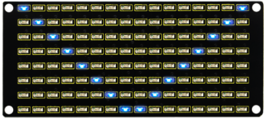

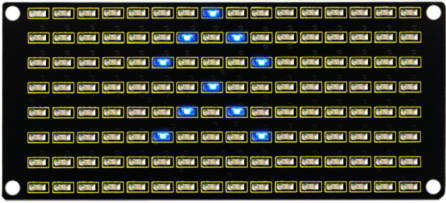

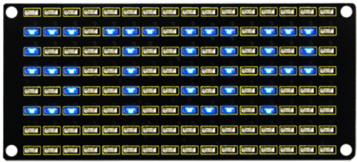

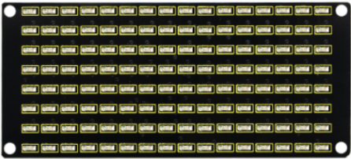

利用取模工具得到的我们要显示的图形代码，接线图不变，下面就是多个图案切换显示的代码。

**示例代码 2（KE0165_9.2.ino）：**

```cpp
/*
  keyes 4WD 多功能智能车
  课程 9.2
  点阵屏显示
  http://www.keyes-robot.com
*/

// 数组，用于存储图案的数据，可以自己计算也可以从取模工具中获得
unsigned char START_01[] = {0x01, 0x02, 0x04, 0x08, 0x10, 0x20, 0x40, 0x80, 0x80, 0x40, 0x20, 0x10, 0x08, 0x04, 0x02, 0x01};
unsigned char FRONT[] = {0x00, 0x00, 0x00, 0x00, 0x00, 0x24, 0x12, 0x09, 0x12, 0x24, 0x00, 0x00, 0x00, 0x00, 0x00, 0x00};
unsigned char BACK[] = {0x00, 0x00, 0x00, 0x00, 0x00, 0x24, 0x48, 0x90, 0x48, 0x24, 0x00, 0x00, 0x00, 0x00, 0x00, 0x00};
unsigned char LEFT[] = {0x00, 0x00, 0x00, 0x00, 0x00, 0x00, 0x44, 0x28, 0x10, 0x44, 0x28, 0x10, 0x44, 0x28, 0x10, 0x00};
unsigned char RIGHT[] = {0x00, 0x10, 0x28, 0x44, 0x10, 0x28, 0x44, 0x10, 0x28, 0x44, 0x00, 0x00, 0x00, 0x00, 0x00, 0x00};
unsigned char STOP_01[] = {0x2E, 0x2A, 0x3A, 0x00, 0x02, 0x3E, 0x02, 0x00, 0x3E, 0x22, 0x3E, 0x00, 0x3E, 0x0A, 0x0E, 0x00};
unsigned char CLEAR[] = {0x00, 0x00, 0x00, 0x00, 0x00, 0x00, 0x00, 0x00, 0x00, 0x00, 0x00, 0x00, 0x00, 0x00, 0x00, 0x00};

#define SCL_PIN  A5  // 时钟引脚 A5
#define SDA_PIN  A4  // 数据引脚 A4

void setup() {
  pinMode(SCL_PIN, OUTPUT);  // 设置时钟引脚为输出模式
  pinMode(SDA_PIN, OUTPUT);  // 设置数据引脚为输出模式
  matrixDisplay(CLEAR);      // 清屏显示
}

void loop() {
  matrixDisplay(START_01);  // 显示开始图案
  delay(2000);
  matrixDisplay(FRONT);     // 显示前进图案
  delay(2000);
  matrixDisplay(STOP_01);   // 显示停止图案
  delay(2000);
  matrixDisplay(CLEAR);     // 清屏
  delay(2000);
}

/* 功能：点阵屏显示函数，传入图案数组 */
void matrixDisplay(unsigned char matrixValue[]) {
  IICStart();               // 发送开始信号
  IICSend(0xc0);            // 选择点阵屏地址
  for (int i = 0; i < 16; i++) {  // 发送16字节图案数据
    IICSend(matrixValue[i]);       // 发送图案数据
  }
  IICEnd();                 // 发送结束信号
  IICStart();
  IICSend(0x8A);            // 显示控制，设置脉宽为4/16
  IICEnd();
}

/* 功能：IIC总线开始信号 */
void iicStart() {
  digitalWrite(SCL_PIN, HIGH);
  delayMicroseconds(3);
  digitalWrite(SDA_PIN, HIGH);
  delayMicroseconds(3);
  digitalWrite(SDA_PIN, LOW);
  delayMicroseconds(3);
}

/* 功能：IIC总线发送一个字节数据 */
void iicSend(unsigned char sendData) {
  for (char i = 0; i < 8; i++) {  // 逐位发送8位数据
    digitalWrite(SCL_PIN, LOW);    // 时钟拉低，准备改变数据线状态
    delayMicroseconds(3);
    if (sendData & 0x01) {         // 判断最低位是1还是0
      digitalWrite(SDA_PIN, HIGH);
    } else {
      digitalWrite(SDA_PIN, LOW);
    }
    delayMicroseconds(3);
    digitalWrite(SCL_PIN, HIGH);   // 时钟拉高，数据被读取
    delayMicroseconds(3);
    sendData = sendData >> 1;      // 右移一位，准备发送下一位
  }
}

/* 功能：IIC总线结束信号 */
void iicEnd() {
  digitalWrite(SCL_PIN, LOW);
  delayMicroseconds(3);
  digitalWrite(SDA_PIN, LOW);
  delayMicroseconds(3);
  digitalWrite(SCL_PIN, HIGH);
  delayMicroseconds(3);
  digitalWrite(SDA_PIN, HIGH);
  delayMicroseconds(3);
}
```

上传代码到开发板，我们看到表情面板（8X16点阵显示开始前进停止然后清屏的图案，循环反复）。


