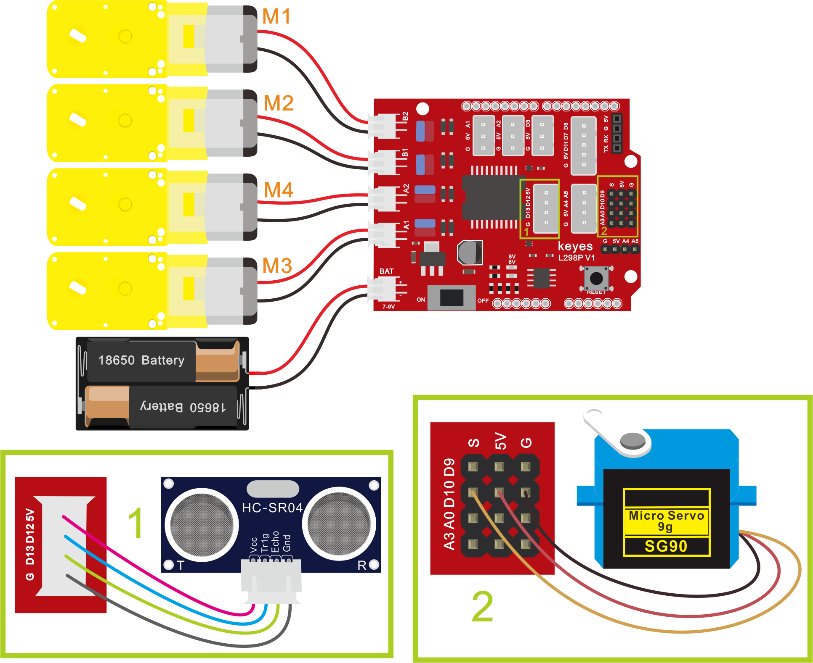

## 第12课 超声波跟随智能车

### （1）项目介绍：

我们结合硬件知识-各种传感器，模块，电机驱动器，来制造超声波跟随机器人车！

实验中，我们通过避障传感器检测智能车左右两方是否存在障碍物，检测智能车和前方障碍物的距离，然后根据这三个数据控制两个电机的转动，从而控制智能车的运动状态。

### （2）流程图：

跟随智能车具体逻辑如下表格。

| 检测 | 超声波测试前方物体距离 | distance（单位：cm） |
| --- | --- | --- |
| 条件 | distance<8 | distance<8 |
| 状态 | 后退（PWM设为100） | 后退（PWM设为100） |
| 条件 | 8＜distance≤13 | 8＜distance≤13 |
| 状态 | 停止 | 停止 |
| 条件 | 13≤distance≤35并且l_val=1并且r_val=1 | 13≤distance≤35并且l_val=1并且r_val=1 |
| 状态 | 前进（PWM设为100） | 前进（PWM设为100） |
| 条件 | distance＞35 | distance＞35 |
| 状态 | 停止 | 停止 |

### 

按照前面思路设计好智能车后，我们就需要按照设计思路开始制作智能车。我们需要设计对应的接线，测试代码，然后接线上传代码，运行，确保智能车能够实现理想中的功能。

### （3）接线图：超声波模块+电机+红外避障传感器

接线注意：A、B两电机分别对应的连接电机驱动扩展板上的接口A和接口B；超声波传感器模块的V引脚至V，T（Trig）引脚至数字12(S)，E（Echo）引脚至数字13(S)，G引脚至G；电源接到BAT接口。



### （4）测试代码：

```cpp
/*

  keyes 4WD Multifunctional Smart Car

  lesson 12

  Ultrasonic Follow Robot

  http://www.keyes-robot.com

*/

#include <Servo.h>

Servo myservo;  // create servo object to control a servo

int trigPin = 12; //定义TRIG引脚接D12

int echoPin = 13; //定义ECHO引脚接D13

int distance;

int MA = 2; //定义电机M3,M4方向控制引脚为D2

int PWMA = 6; //定义电机M3,M4速度控制引脚为D6

int MB = 4; //定义电机M1,M2方向控制引脚为D4

int PWMB = 5; //定义电机M1,M2速度控制引脚为D5

int get_distance() { //超声波测距函数

  digitalWrite(trigPin, LOW);

  delayMicroseconds(2);

  digitalWrite(trigPin, HIGH); //给TRIG引脚至少10us的时间触发

  delayMicroseconds(10);

  digitalWrite(trigPin, LOW);

  distance = pulseIn(echoPin, HIGH) / 58; //检测脉冲宽度，并计算出距离

  delay(20);  //延时20ms

  Serial.print("distance:");  //串口打印出距离

  Serial.print(distance);

  Serial.println("cm");

}

void setup() {

  Serial.begin(9600);  //设置波特率为9600

  myservo.attach(10);  // attaches the servo on pin 10 to the servo object

  pinMode(trigPin, OUTPUT); //定义TRIG为输出模式

  pinMode(echoPin, INPUT); //定义ECHO为输入模式

  pinMode(MA, OUTPUT); //配置电机引脚为输出模式

  pinMode(PWMA, OUTPUT);

  pinMode(MB, OUTPUT);

  pinMode(PWMB, OUTPUT);

}

void loop() {

  get_distance();  //调用测距函数

  if (distance < 8 ) {//如果距离小于8

    back();//后退

  }

  else if (distance >= 8 && distance < 13) { //如果距离大于等于8，小于13

    stopp();//停止

  }

  else if (distance >= 13 && distance <= 35 ) { //如果距离大于等于13，小于35

    advance();//跟随

  }

  else {//如果以上都不是

    stopp();//停止

  }

}

void advance() { //小车前进

  digitalWrite(MA, HIGH); //电机A正转

  analogWrite(PWMA, 100); //电机A速度为100

  digitalWrite(MB, HIGH); //电机B正转

  analogWrite(PWMB, 100); //电机B速度为100

}

void back() { //小车后退

  digitalWrite(MA, LOW); //电机A反转

  analogWrite(PWMA, 100); //电机A速度为100

  digitalWrite(MB, LOW); //电机B反转

  analogWrite(PWMB, 100); //电机B速度为100

}

void turnL() { //小车左转

  digitalWrite(MA, HIGH); //电机A正转

  analogWrite(PWMA, 100); //电机A速度为100

  digitalWrite(MB, LOW); //电机B反转

  analogWrite(PWMB, 100); //电机B速度为100

}

void turnR() { //小车右转

  digitalWrite(MA, LOW); //电机A反转

  analogWrite(PWMA, 100); //电机A速度为100

  digitalWrite(MB, HIGH); //电机B正转

  analogWrite(PWMB, 100); //电机B速度为100

}

void stopp() { //小车停止

  analogWrite(PWMA, 0); //电机A速度为0

  analogWrite(PWMB, 0); //电机B速度为0

}

好了， 桌面迷你蓝牙智能车跟随功能效果的代码全部编写好了，上传程序，看看精彩的效果！**（在上传程序代码前，需要把蓝牙模块取下，否则代码会上传失败。需要上传代码成功后，再连接蓝牙模块。）**
```

### （5）测试结果：

将驱动扩展板堆叠在UNO Plus板上，上传好代码，按照接线图接线，将拨码开关拨至ON端后，智能车能够随着前方障碍物的移动而移动。

**示例代码 1（KE0165_12.ino）：**

```cpp
/*
  keyes 4WD 多功能智能车
  课程 12
  超声波跟随机器人
  http://www.keyes-robot.com
*/
#include <Servo.h>

Servo myServo;  // 舵机对象

#define TRIG_PIN 12    // 超声波 TRIG 引脚
#define ECHO_PIN 13    // 超声波 ECHO 引脚
#define MA 2           // 电机 M3,M4 方向控制引脚
#define PWMA 6         // 电机 M3,M4 速度控制引脚
#define MB 4           // 电机 M1,M2 方向控制引脚
#define PWMB 5         // 电机 M1,M2 速度控制引脚

int distance;       // 距离变量

/* 功能：超声波测距函数，获取距离并打印 */
int getDistance() {
  digitalWrite(TRIG_PIN, LOW);
  delayMicroseconds(2);
  digitalWrite(TRIG_PIN, HIGH);  // 触发超声波发射，至少10us
  delayMicroseconds(10);
  digitalWrite(TRIG_PIN, LOW);
  distance = pulseIn(ECHO_PIN, HIGH) / 58;  // 计算距离，单位cm
  delay(20);  // 延时20ms，等待稳定
  Serial.print("distance:");  // 串口打印距离
  Serial.print(distance);
  Serial.println("cm");
  return distance;
}

/* 功能：初始化设置 */
void setup() {
  Serial.begin(9600);  // 设置串口波特率为9600
  myServo.attach(10);  // 绑定舵机引脚10
  pinMode(TRIG_PIN, OUTPUT);  // 设置 TRIG 引脚为输出
  pinMode(ECHO_PIN, INPUT);   // 设置 ECHO 引脚为输入
  pinMode(MA, OUTPUT);        // 设置电机方向控制引脚为输出
  pinMode(PWMA, OUTPUT);      // 设置电机速度控制引脚为输出
  pinMode(MB, OUTPUT);        // 设置电机方向控制引脚为输出
  pinMode(PWMB, OUTPUT);      // 设置电机速度控制引脚为输出
}

/* 功能：主循环，根据距离控制小车动作 */
void loop() {
  getDistance();  // 获取距离

  if (distance < 8) {  // 距离小于8cm，后退
    back();
  } else if (distance >= 8 && distance < 13) {  // 距离8~13cm，停止
    stopCar();
  } else if (distance >= 13 && distance <= 35) {  // 距离13~35cm，前进跟随
    advance();
  } else {  // 其他情况，停止
    stopCar();
  }
}

/* 功能：小车前进 */
void advance() {
  digitalWrite(MA, HIGH);      // 电机A正转
  analogWrite(PWMA, 100);      // 电机A速度100
  digitalWrite(MB, HIGH);      // 电机B正转
  analogWrite(PWMB, 100);      // 电机B速度100
}

/* 功能：小车后退 */
void back() {
  digitalWrite(MA, LOW);       // 电机A反转
  analogWrite(PWMA, 100);      // 电机A速度100
  digitalWrite(MB, LOW);       // 电机B反转
  analogWrite(PWMB, 100);      // 电机B速度100
}

/* 功能：小车左转 */
void turnLeft() {
  digitalWrite(MA, HIGH);      // 电机A正转
  analogWrite(PWMA, 100);      // 电机A速度100
  digitalWrite(MB, LOW);       // 电机B反转
  analogWrite(PWMB, 100);      // 电机B速度100
}

/* 功能：小车右转 */
void turnRight() {
  digitalWrite(MA, LOW);       // 电机A反转
  analogWrite(PWMA, 100);      // 电机A速度100
  digitalWrite(MB, HIGH);      // 电机B正转
  analogWrite(PWMB, 100);      // 电机B速度100
}

/* 功能：小车停止 */
void stopCar() {
  analogWrite(PWMA, 0);        // 电机A速度0，停止
  analogWrite(PWMB, 0);        // 电机B速度0，停止
}
```
