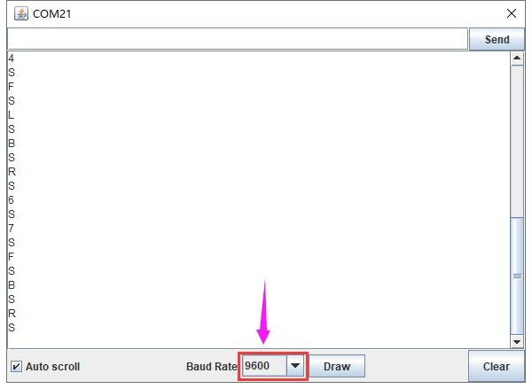
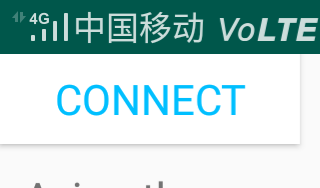

## 第15课 蓝牙遥控智能车

### （1）项目介绍：

前面课程中，我们利用红外控制智能车运动，在这课程中我们可以做一个蓝牙控制智能车。既然是控制智能车，那就有一个控制端和被控制端。课程中我们把手机当做控制端（主机），蓝牙模块（从机）连接的智能车当做被控制端。使用时，我们需要在手机上安装一个APP，然后连接蓝牙模块，然后我们利用蓝牙APP上各个按钮，控制智能车实现各种运动状态。

### （2）流程图：

先取下蓝牙模块，程序代码上传后，再连接蓝牙模块和打开串口监视器，设置波特率为9600。对准蓝牙模块按下手机APP按钮，我们可以看到APP按钮对应的控制字符，如下图。



经过测试，我们得出了手机APP上各个按钮对应的控制字符和各个按钮对应的功能，这里我们整理了一个表格如下：

| 按钮:  | 功能：配对连接蓝牙模块 | 功能：配对连接蓝牙模块 |
| --- | --- | --- |
| 按钮:  | 功能：进入蓝牙控制界面 | 功能：进入蓝牙控制界面 |
| 按钮:  | 功能：断开蓝牙连接 | 功能：断开蓝牙连接 |
| 按钮:  | 控制字符：按下：F；松开：S | 功能：按下，小车前进；松开就停止 |
| 按钮:  | 控制字符：按下：B；松开：S | 功能：按下，小车后退；松开就停止 |
| 按钮:  | 控制字符：按下：L；松开：S | 功能：按下，小车左旋转；松开就停止 |
| 按钮:  | 控制字符：按下：R；松开：S | 功能：按下，小车右旋转；松开就停止 |
| 按钮:  | 控制字符：按下：a；松开：S | 功能：点击，加速，最大加到255 |
| 按钮:  | 控制字符：按下：d；松开：S | 功能：点击，减速，最小减到0 |
| 按钮:  | 控制字符： | 功能：点击一下开启手机方向感应控制，再点击一下退出方向感应控制 |
| 按钮:  | 控制字符：点击发送：Y,再次电机发送S | 功能：开启避障功能，再次点击退出 |
| 按钮:  | 控制字符：点击发送：X,再次电机发送S | 功能：开启循线功能，再次点击退出 |
| 按钮:  | 控制字符：点击发送：U,再次电机发送S | 功能：开启超声波跟随功能，再次点击退出 |
| 按钮:  | 控制字符：点击发送：G,再次电机发送S | 功能：开启画地为牢功能，再次点击退出 |

### （4）接线图：蓝牙+电机


**接线注意：** 蓝牙模块的RXD、TXD、GND、VCC分别对应的接到电机驱动扩展板上的TX、RX、-（GND）、+（VCC），而蓝牙模块的STATE和BRK两引脚不需要接，电源接到BAT接口。

B两电机分别对应的连接到电机驱动扩展板上的接口A和接口B；蓝牙模块的RXD、TXD、GND、VCC分别对应的接到电机驱动扩展板上的TX、RX、-（GND）、+（VCC），而蓝牙模块的STATE和BRK两引脚不需要接，电源接到BAT接口。

### （5）测试代码：

**示例代码 1（KE0165_15.ino）：**

```cpp
/*
  keyes 4WD 多功能智能车
  课程 15
  蓝牙控制机器人
  http://www.keyes-robot.com
*/

// 数组，用于存储图案数据，可以自己计算也可以从取模工具中获得
unsigned char START_01[] = {0x01, 0x02, 0x04, 0x08, 0x10, 0x20, 0x40, 0x80, 0x80, 0x40, 0x20, 0x10, 0x08, 0x04, 0x02, 0x01};
unsigned char FRONT[] = {0x00, 0x00, 0x00, 0x00, 0x00, 0x24, 0x12, 0x09, 0x12, 0x24, 0x00, 0x00, 0x00, 0x00, 0x00, 0x00};
unsigned char BACK_01[] = {0x00, 0x00, 0x00, 0x00, 0x00, 0x24, 0x48, 0x90, 0x48, 0x24, 0x00, 0x00, 0x00, 0x00, 0x00, 0x00};
unsigned char LEFT[] = {0x00, 0x00, 0x00, 0x00, 0x00, 0x00, 0x44, 0x28, 0x10, 0x44, 0x28, 0x10, 0x44, 0x28, 0x10, 0x00};
unsigned char RIGHT[] = {0x00, 0x10, 0x28, 0x44, 0x10, 0x28, 0x44, 0x10, 0x28, 0x44, 0x00, 0x00, 0x00, 0x00, 0x00, 0x00};
unsigned char STOP_01[] = {0x2E, 0x2A, 0x3A, 0x00, 0x02, 0x3E, 0x02, 0x00, 0x3E, 0x22, 0x3E, 0x00, 0x3E, 0x0A, 0x0E, 0x00};
unsigned char CLEAR[] = {0x00, 0x00, 0x00, 0x00, 0x00, 0x00, 0x00, 0x00, 0x00, 0x00, 0x00, 0x00, 0x00, 0x00, 0x00, 0x00};

#define SCL_PIN  A5  // 时钟引脚 A5
#define SDA_PIN  A4  // 数据引脚 A4

#define MA_PIN  2    // 电机M3,M4方向控制引脚 D2
#define PWMA_PIN  6  // 电机M3,M4速度控制引脚 D6
#define MB_PIN  4    // 电机M1,M2方向控制引脚 D4
#define PWMB_PIN  5  // 电机M1,M2速度控制引脚 D5

char blueVal;

void setup() {
  Serial.begin(9600);  // 设置波特率为9600
  pinMode(MA_PIN, OUTPUT);  // 配置电机引脚为输出模式
  pinMode(PWMA_PIN, OUTPUT);
  pinMode(MB_PIN, OUTPUT);
  pinMode(PWMB_PIN, OUTPUT);

  pinMode(SCL_PIN, OUTPUT);  // 设置点阵屏IIC引脚为输出
  pinMode(SDA_PIN, OUTPUT);

  matrixDisplay(CLEAR);  // 清屏
  matrixDisplay(START_01);
}

void loop() {
  if (Serial.available() > 0) {  // 接收到蓝牙信号
    blueVal = Serial.read();  // 读取蓝牙信号
    Serial.println(blueVal);  // 串口监视器显示蓝牙信号
    switch (blueVal) {
      case 'F':  advance();  matrixDisplay(FRONT);  break;  // 前进
      case 'B':  back();     matrixDisplay(BACK_01); break;  // 后退
      case 'L':  turnLeft(); matrixDisplay(LEFT);   break;  // 左旋转
      case 'R':  turnRight();matrixDisplay(RIGHT);  break;  // 右旋转
      case 'S':  stopCar();  matrixDisplay(STOP_01); break;  // 停止
    }
  }
}

/* 功能：小车前进 */
void advance() {
  digitalWrite(MA_PIN, HIGH);    // 电机A正转
  analogWrite(PWMA_PIN, 200);    // 电机A速度为200
  digitalWrite(MB_PIN, HIGH);    // 电机B正转
  analogWrite(PWMB_PIN, 200);    // 电机B速度为200
}

/* 功能：小车后退 */
void back() {
  digitalWrite(MA_PIN, LOW);     // 电机A反转
  analogWrite(PWMA_PIN, 200);    // 电机A速度为200
  digitalWrite(MB_PIN, LOW);     // 电机B反转
  analogWrite(PWMB_PIN, 200);    // 电机B速度为200
}

/* 功能：小车左旋转 */
void turnLeft() {
  digitalWrite(MA_PIN, HIGH);    // 电机A正转
  analogWrite(PWMA_PIN, 200);    // 电机A速度为200
  digitalWrite(MB_PIN, LOW);     // 电机B反转
  analogWrite(PWMB_PIN, 200);    // 电机B速度为200
}

/* 功能：小车右旋转 */
void turnRight() {
  digitalWrite(MA_PIN, LOW);     // 电机A反转
  analogWrite(PWMA_PIN, 200);    // 电机A速度为200
  digitalWrite(MB_PIN, HIGH);    // 电机B正转
  analogWrite(PWMB_PIN, 200);    // 电机B速度为200
}

/* 功能：小车停止 */
void stopCar() {
  analogWrite(PWMA_PIN, 0);      // 电机A速度为0
  analogWrite(PWMB_PIN, 0);      // 电机B速度为0
}

/* 功能：点阵屏显示 */
void matrixDisplay(unsigned char matrixValue[]) {
  IICStart();               // 开始数据传输
  IICSend(0xc0);            // 选择地址
  for (int i = 0; i < 16; i++) {  // 发送16字节图案数据
    IICSend(matrixValue[i]);       // 传输图案数据
  }
  IICEnd();                 // 结束数据传输

  IICStart();
  IICSend(0x8A);            // 显示控制，选择脉宽为4/16
  IICEnd();
}

/* 功能：IIC数据传输开始条件 */
void IICStart() {
  digitalWrite(SCL_PIN, HIGH);
  delayMicroseconds(3);
  digitalWrite(SDA_PIN, HIGH);
  delayMicroseconds(3);
  digitalWrite(SDA_PIN, LOW);
  delayMicroseconds(3);
}

/* 功能：IIC传输一个字节数据 */
void IICSend(unsigned char sendData) {
  for (char i = 0; i < 8; i++) {  // 每个字节8位
    digitalWrite(SCL_PIN, LOW);    // 时钟拉低，准备改变数据线状态
    delayMicroseconds(3);
    if (sendData & 0x01) {         // 判断最低位是1还是0
      digitalWrite(SDA_PIN, HIGH);
    } else {
      digitalWrite(SDA_PIN, LOW);
    }
    delayMicroseconds(3);
    digitalWrite(SCL_PIN, HIGH);   // 时钟拉高，数据传输
    delayMicroseconds(3);
    sendData = sendData >> 1;      // 右移一位，准备传输下一位
  }
}

/* 功能：IIC数据传输结束条件 */
void IICEnd() {
  digitalWrite(SCL_PIN, LOW);
  delayMicroseconds(3);
  digitalWrite(SDA_PIN, LOW);
  delayMicroseconds(3);
  digitalWrite(SCL_PIN, HIGH);
  delayMicroseconds(3);
  digitalWrite(SDA_PIN, HIGH);
  delayMicroseconds(3);
}
```


### （6）测试结果：

将驱动扩展板堆叠在UNO Plus板上，上传好代码，按照接线图接线，将拨码开关拨至ON端后，手机APP连接蓝牙成功后，我们就能用手机APP控制智能车运动并在LED灯板上显示对应的图案了。

按下按钮  ，小车前进；

按下按钮  ，小车后退；

按下按钮  ，小车左旋转；

按下按钮  ，小车右旋转；

点击一下按钮  ，开启手机方向感应控制，

再点击一下按钮  ，退出方向感应控制。
