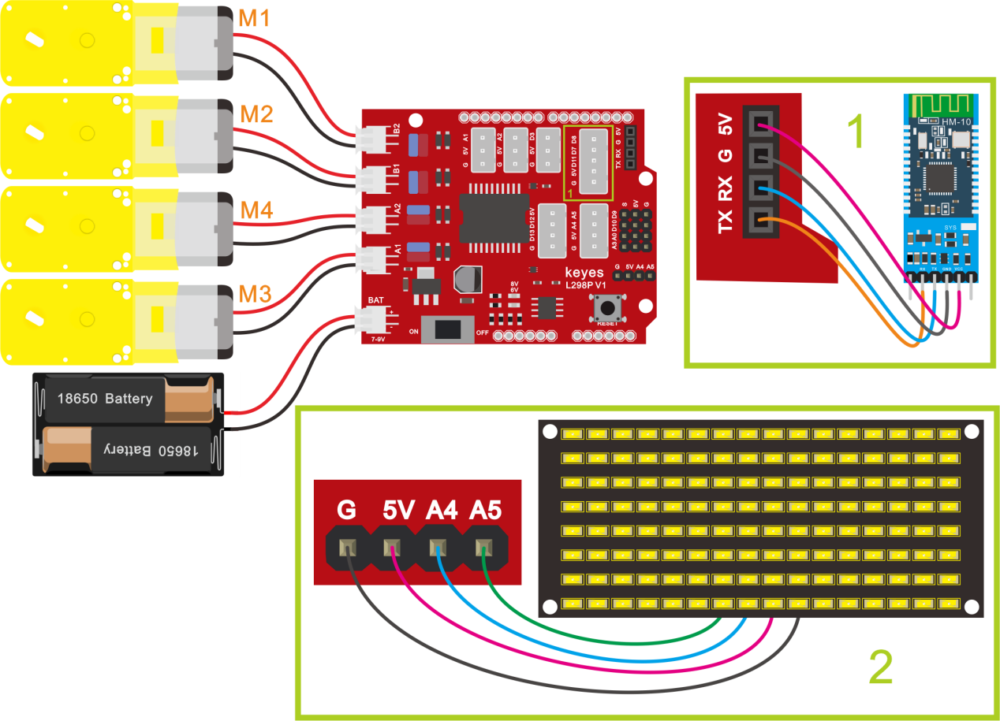

## 第16课 蓝牙调速智能车

### 项目介绍：

前面课程中，我们利用蓝牙控制智能车，在这课程中我们做一个蓝牙可以控制速度的智能车。既然要控制智能车速度，我们可以将速度定义一个变量speeds来表示。项目中我们只要改变这是变量speeds就可以改变智能车的速度啦。下面让我们通过代码来实现。

### 流程图：

按照前面思路设计好智能车后，我们就需要按照设计思路开始制作智能车。我们需要设计对应的接线，测试代码，然后接线上传代码，运行，确保智能车能够实现理想中的功能。

### 接线图：蓝牙+电机



接线跟上一课一样

### 测试代码：

**示例代码 1（KE0165_16.ino）：**

```cpp
/*
  keyes 4WD 多功能智能车
  课程16
  蓝牙控制速度
  http://www.keyes-robot.com
*/
// 数组，用于存储图案的数据，可以自己计算也可以从取模工具中获得
unsigned char START_01[] = {0x01, 0x02, 0x04, 0x08, 0x10, 0x20, 0x40, 0x80, 0x80, 0x40, 0x20, 0x10, 0x08, 0x04, 0x02, 0x01};
unsigned char FRONT[] = {0x00, 0x00, 0x00, 0x00, 0x00, 0x24, 0x12, 0x09, 0x12, 0x24, 0x00, 0x00, 0x00, 0x00, 0x00, 0x00};
unsigned char BACK_01[] = {0x00, 0x00, 0x00, 0x00, 0x00, 0x24, 0x48, 0x90, 0x48, 0x24, 0x00, 0x00, 0x00, 0x00, 0x00, 0x00};
unsigned char LEFT[] = {0x00, 0x00, 0x00, 0x00, 0x00, 0x00, 0x44, 0x28, 0x10, 0x44, 0x28, 0x10, 0x44, 0x28, 0x10, 0x00};
unsigned char RIGHT[] = {0x00, 0x10, 0x28, 0x44, 0x10, 0x28, 0x44, 0x10, 0x28, 0x44, 0x00, 0x00, 0x00, 0x00, 0x00, 0x00};
unsigned char STOP_01[] = {0x2E, 0x2A, 0x3A, 0x00, 0x02, 0x3E, 0x02, 0x00, 0x3E, 0x22, 0x3E, 0x00, 0x3E, 0x0A, 0x0E, 0x00};
unsigned char SPEED_A[] = {0x00, 0x40, 0x20, 0x10, 0x08, 0x04, 0x02, 0xff, 0x02, 0x04, 0x08, 0x10, 0x20, 0x40, 0x00, 0x00};
unsigned char SPEED_D[] = {0x00, 0x02, 0x04, 0x08, 0x10, 0x20, 0x40, 0xff, 0x40, 0x20, 0x10, 0x08, 0x04, 0x02, 0x00, 0x00};
unsigned char CLEAR[] = {0x00, 0x00, 0x00, 0x00, 0x00, 0x00, 0x00, 0x00, 0x00, 0x00, 0x00, 0x00, 0x00, 0x00, 0x00, 0x00};

#define SCL_PIN  A5  // 设置时钟引脚为 A5
#define SDA_PIN  A4  // 设置数据引脚为 A4

#define MA_PIN  2    // 电机M3,M4方向控制引脚为D2
#define PWMA_PIN  6  // 电机M3,M4速度控制引脚为D6
#define MB_PIN  4    // 电机M1,M2方向控制引脚为D4
#define PWMB_PIN  5  // 电机M1,M2速度控制引脚为D5

int speeds = 150;   // 初始化速度为150
char blueVal;

/* 功能：初始化设置 */
void setup() {
  Serial.begin(9600);               // 设置波特率为9600
  pinMode(MA_PIN, OUTPUT);          // 配置电机引脚为输出模式
  pinMode(PWMA_PIN, OUTPUT);
  pinMode(MB_PIN, OUTPUT);
  pinMode(PWMB_PIN, OUTPUT);
  pinMode(SCL_PIN, OUTPUT);         // 设置IIC时钟引脚为输出
  pinMode(SDA_PIN, OUTPUT);         // 设置IIC数据引脚为输出
  matrixDisplay(CLEAR);             // 清屏
  matrixDisplay(START_01);          // 显示启动图案
}

/* 功能：主循环，接收蓝牙指令并执行 */
void loop() {
  if (Serial.available() > 0) {    // 接收到蓝牙信号
    blueVal = Serial.read();       // 读取蓝牙信号
    Serial.println(blueVal);       // 串口监视器显示蓝牙信号
    switch (blueVal) {
      case 'F': 
        advance(); 
        matrixDisplay(FRONT); 
        break;                     // 前进
      case 'B': 
        back(); 
        matrixDisplay(BACK_01); 
        break;                     // 后退
      case 'L': 
        turnLeft(); 
        matrixDisplay(LEFT); 
        break;                     // 左旋转
      case 'R': 
        turnRight(); 
        matrixDisplay(RIGHT); 
        break;                     // 右旋转
      case 'S': 
        stopCar(); 
        matrixDisplay(STOP_01); 
        break;                     // 停止
      case 'a': 
        speedUp(); 
        matrixDisplay(SPEED_A); 
        break;                     // 加速
      case 'd': 
        speedDown(); 
        matrixDisplay(SPEED_D); 
        break;                     // 减速
    }
  }
}

/* 功能：小车前进 */
void advance() {
  digitalWrite(MA_PIN, HIGH);       // 电机A正转
  analogWrite(PWMA_PIN, speeds);    // 电机A速度为speeds
  digitalWrite(MB_PIN, HIGH);       // 电机B正转
  analogWrite(PWMB_PIN, speeds);    // 电机B速度为speeds
}

/* 功能：小车后退 */
void back() {
  digitalWrite(MA_PIN, LOW);        // 电机A反转
  analogWrite(PWMA_PIN, speeds);    // 电机A速度为speeds
  digitalWrite(MB_PIN, LOW);        // 电机B反转
  analogWrite(PWMB_PIN, speeds);    // 电机B速度为speeds
}

/* 功能：小车左旋转 */
void turnLeft() {
  digitalWrite(MA_PIN, HIGH);       // 电机A正转
  analogWrite(PWMA_PIN, speeds);    // 电机A速度为speeds
  digitalWrite(MB_PIN, LOW);        // 电机B反转
  analogWrite(PWMB_PIN, speeds);    // 电机B速度为speeds
}

/* 功能：小车右旋转 */
void turnRight() {
  digitalWrite(MA_PIN, LOW);        // 电机A反转
  analogWrite(PWMA_PIN, speeds);    // 电机A速度为speeds
  digitalWrite(MB_PIN, HIGH);       // 电机B正转
  analogWrite(PWMB_PIN, speeds);    // 电机B速度为speeds
}

/* 功能：小车停止 */
void stopCar() {
  analogWrite(PWMA_PIN, 0);         // 电机A速度为0
  analogWrite(PWMB_PIN, 0);         // 电机B速度为0
}

/* 功能：加速函数 */
void speedUp() {
  while (1) {
    Serial.println(speeds);         // 显示当前速度
    if (speeds < 255) {             // 最大速度255
      speeds++;
      delay(10);                    // 调节加速速度
    }
    if (Serial.available() > 0) {
      blueVal = Serial.read();
      if (blueVal == 'S') break;    // 接收到‘S’停止加速
    }
  }
}

/* 功能：减速函数 */
void speedDown() {
  while (1) {
    Serial.println(speeds);         // 显示当前速度
    if (speeds > 0) {               // 最小速度0
      speeds--;
      delay(10);                    // 调节减速速度
    }
    if (Serial.available() > 0) {
      blueVal = Serial.read();
      if (blueVal == 'S') break;    // 接收到‘S’停止减速
    }
  }
}

/* 功能：点阵屏显示 */
void matrixDisplay(unsigned char matrixValue[]) {
  IICStart();                      // 调用数据传输开始条件函数
  IICSend(0xc0);                  // 选择地址
  for (int i = 0; i < 16; i++) {  // 图案数据16个字节
    IICSend(matrixValue[i]);      // 传输图案数据
  }
  IICEnd();                       // 结束数据传输
  IICStart();
  IICSend(0x8A);                  // 显示控制，选择脉宽为4/16
  IICEnd();
}

/* 功能：IIC传输开始条件 */
void IICStart() {
  digitalWrite(SCL_PIN, HIGH);
  delayMicroseconds(3);
  digitalWrite(SDA_PIN, HIGH);
  delayMicroseconds(3);
  digitalWrite(SDA_PIN, LOW);
  delayMicroseconds(3);
}

/* 功能：IIC传输数据 */
void IICSend(unsigned char sendData) {
  for (char i = 0; i < 8; i++) {  // 每个字节8位
    digitalWrite(SCL_PIN, LOW);   // 时钟拉低，准备改变数据线信号
    delayMicroseconds(3);
    if (sendData & 0x01) {        // 判断最低位是1还是0
      digitalWrite(SDA_PIN, HIGH);
    } else {
      digitalWrite(SDA_PIN, LOW);
    }
    delayMicroseconds(3);
    digitalWrite(SCL_PIN, HIGH);  // 时钟拉高，完成数据传输
    delayMicroseconds(3);
    sendData = sendData >> 1;     // 右移一位，准备传输下一位
  }
}

/* 功能：IIC传输结束条件 */
void IICEnd() {
  digitalWrite(SCL_PIN, LOW);
  delayMicroseconds(3);
  digitalWrite(SDA_PIN, LOW);
  delayMicroseconds(3);
  digitalWrite(SCL_PIN, HIGH);
  delayMicroseconds(3);
  digitalWrite(SDA_PIN, HIGH);
  delayMicroseconds(3);
}
```

### 测试结果：

按下  按钮，小车加速；按下  按钮，小车减速.


