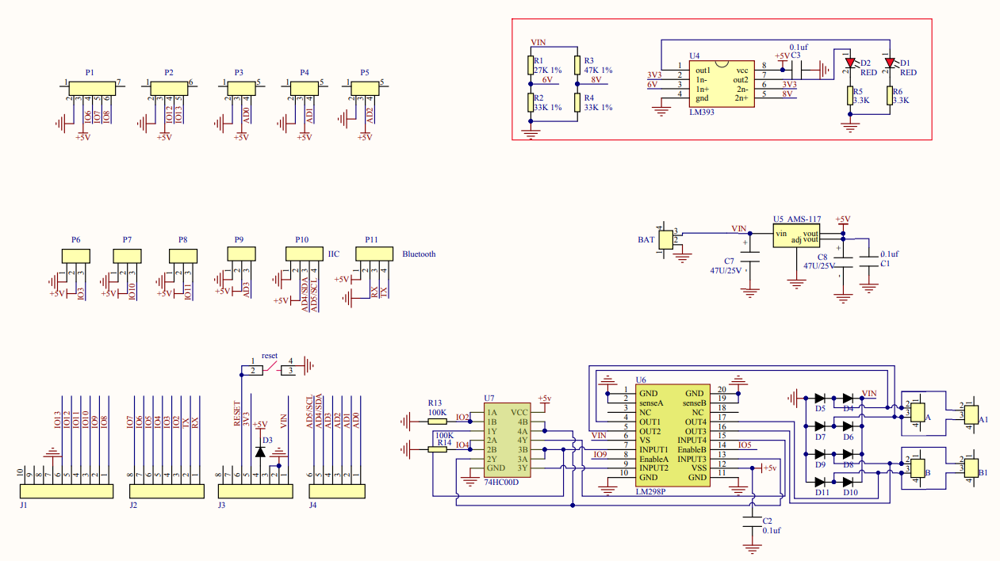
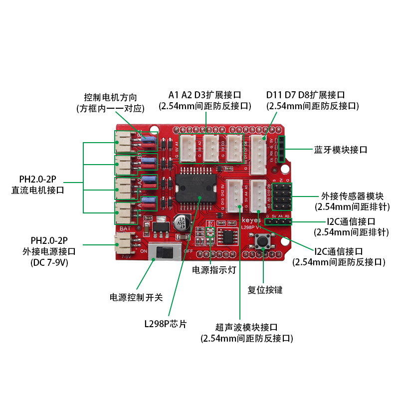
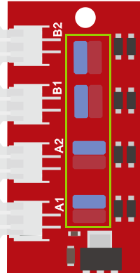
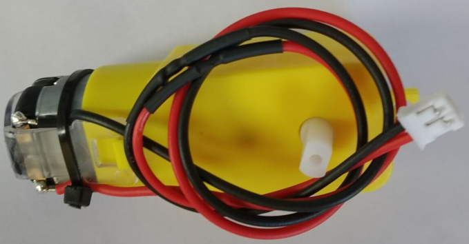
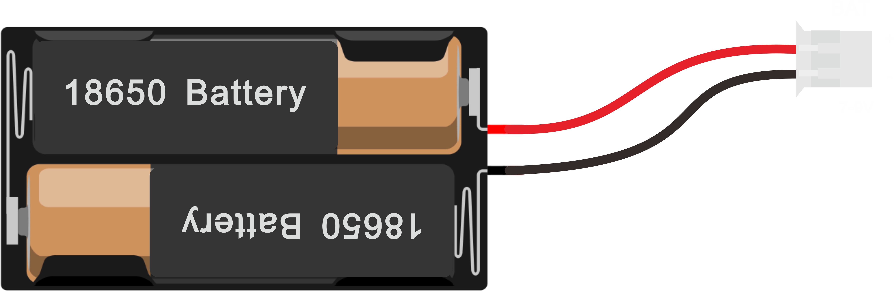
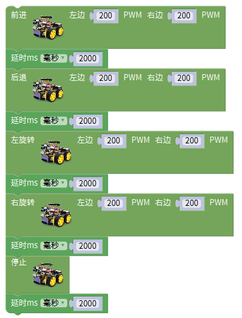
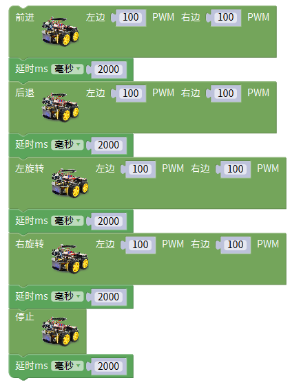

## 第08课 电机控制

### （1）项目介绍：

驱动电机的方法有很多，我们这个智能车用到的是最常用的L298P这个方案， L298P是ST意法半导体公司出品的优秀大功率电机专用驱动芯片，可直接驱动直流电机、二相、四相步进电机，驱动电流达2A，电机输出端采用8只高速肖特基二极管作为保护。

我们根据L298P的电路设计了一款扩展板，叠层的设计可直接插接到开发板上使用，降低了用户使用和驱动电机的技术难度。我们来看一下这个板子的电路图和示意图：

  为了调节小车上的4个电机，使得电机电机的驱动方向与后续的课程代码描述一致。驱动板上自带8个跳线帽，也可用于控制电机转向，例如当MA电机接口前方2个跳线帽由横向连接改为纵向连接时，MA电机的转动方向就和原来的转动方向相反。

### （2）规格参数：

逻辑部分输入电压：DC 5V

驱动部分输入电压：DC 7-12V

逻辑部分工作电流：<36mA

驱动部分工作电流：<2A

最大耗散功率：25W（T=75℃）

控制信号输入电平：高电平2.3V<Vin<5V  ，低电平-0.3V<Vin<1.5V

工作温度：-25＋130℃

### （3）驱动小车运行原理：

根据上面电机驱动板的电路图和示意图，我们让MA电机的方向引脚在D2，调速引脚在D6，MB电机的方向引脚在D4，调速引脚在D5，按照以下表格的运动逻辑，我们就可以知道如何通过控制数字口，PWM口控制2个电机转动，从而实现智能小车的行走。其中PWM值范围为0-255，设置数值越大，电机转动越快。（A1、A2接左边电机、B1、B2接右边电机）

|  | D2 | D6（PWM） | 电机MA | D4 | D5（PWM） | 电机MB |
| --- | --- | --- | --- | --- | --- | --- |
| 前进 | LOW | 200 | 正转 | HIGH | 200 | 正转 |
| 后退 | HIGH | 200 | 反转 | LOW | 200 | 反转 |
| 右旋转 | LOW | 200 | 正转 | LOW | 200 | 反转 |
| 左旋转 | HIGH | 200 | 反转 | HIGH | 200 | 正转 |
| 停止 | / | 0 | 停止 | / | 0 | 停止 |

### （4）项目组件：

| keyes PLUS 开发板*1 | Keyes brick L298P 电机驱动扩展板 V1*1 | 4.5V 200转/分 单轴减速箱+双头轴马达+250MM PH2.0mm-2P线材*4 | 4.5V 200转/分 单轴减速箱+双头轴马达+250MM PH2.0mm-2P线材*4 |
| --- | --- | --- | --- |
|  |  |  |  |
| USB线 | USB线 | 18650双节电池盒*1 | 18650电池*2 （电池自配） |
|  |  |  |  |

### （5）接线图：

### （6）项目代码：

| ①从4WD智能小车栏目里拖出前进模块，左边速度设置为200，右边速度设置为200。 |  |
| --- | --- |
| ②延时2秒。 |  |
| ③从4WD智能小车栏目里拖出后退模块，左边速度设置为200，右边速度设置为200。 |  |
| ④延时2秒。 |  |
| ⑤从4WD智能小车栏目里拖出左旋转模块，左边速度设置为200，右边速度设置为200。 |  |
| ⑥延时2秒。 |  |
| ⑦从4WD智能小车栏目里拖出右旋转模块，左边速度设置为200，右边速度设置为200。 |  |
| ⑧延时2秒。 |  |
| ⑨从4WD智能小车栏目里拖出停止模块。 |  |
| ⑩延时2秒。 |  |

### （7）项目结果：

上传代码成功，上电后，智能车前进2秒，后退2秒，左转2秒，右转2秒，停止2秒，循环。

### （8）项目拓展：

我们来通过调整PWM控制电机的速度，为后面我们控制车速做一个铺垫，接线不变

将PWM的值都调为100。

上传代码成功，怎么样，电机转动的速度是不是慢了很多？