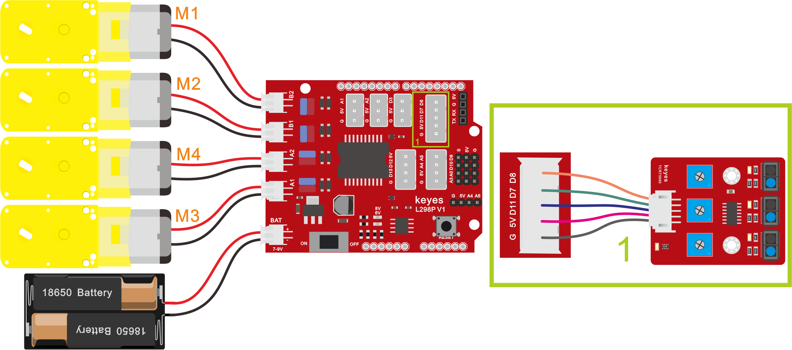
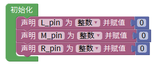
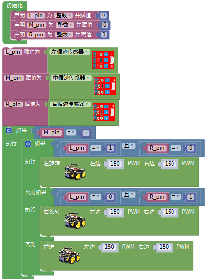
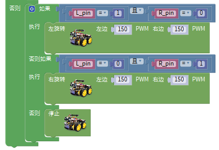

## 第11课 循线智能车

### （1）项目介绍：

前面我们详细的介绍了画地为牢智能车的实现方法。在这里我们可以结合前面课程中知识制作一个循迹智能车。实验中，我们还是通过循迹传感器检测智能车底部是否存在黑线，然后根据检测结果控制两个电机的转动，从而控制智能车沿着黑线行走。

### （2）流程图：

循迹智能车具体逻辑如下表格。

| 检测 | 中循迹传感器 | 中循迹传感器 | 检测到黑线：高电平 | 检测到黑线：高电平 |
| --- | --- | --- | --- | --- |
| 检测 | 中循迹传感器 | 中循迹传感器 | 检测到白线：低电平 | 检测到白线：低电平 |
| 检测 | 左循迹传感器 | 左循迹传感器 | 检测到黑线：高电平 | 检测到黑线：高电平 |
| 检测 | 左循迹传感器 | 左循迹传感器 | 检测到白线：低电平 | 检测到白线：低电平 |
| 检测 | 右循迹传感器 | 右循迹传感器 | 检测到黑线：高电平 | 检测到黑线：高电平 |
| 检测 | 右循迹传感器 | 右循迹传感器 | 检测到白线：低电平 | 检测到白线：低电平 |
| 条件 | 条件 | 条件 | 条件 | 状态 |
| 中循迹传感器检测到黑线 | 中循迹传感器检测到黑线 | 左循迹传感器检测到黑线并且 右循迹传感器检测到白线 | 左循迹传感器检测到黑线并且 右循迹传感器检测到白线 | 左旋转（PWM设为200） |
| 中循迹传感器检测到黑线 | 中循迹传感器检测到黑线 | 左循迹传感器检测到白线并且 右循迹传感器检测到黑线 | 左循迹传感器检测到白线并且 右循迹传感器检测到黑线 | 右旋转（PWM设为200） |
| 中循迹传感器检测到黑线 | 中循迹传感器检测到黑线 | 左循迹传感器检测到白线并且 右循迹传感器检测到白线 | 左循迹传感器检测到白线并且 右循迹传感器检测到白线 | 前进 |
| 中循迹传感器检测到黑线 | 中循迹传感器检测到黑线 | 左循迹传感器检测到黑线并且右循迹传感器检测到黑线 | 左循迹传感器检测到黑线并且右循迹传感器检测到黑线 | 前进 |
| 中循迹传感器检测到白线 | 中循迹传感器检测到白线 | 左循迹传感器检测到黑线并且 右循迹传感器检测到白线 | 左循迹传感器检测到黑线并且 右循迹传感器检测到白线 | 左旋转（PWM设为200） |
| 中循迹传感器检测到白线 | 中循迹传感器检测到白线 | 左循迹传感器检测到白线并且 右循迹传感器检测到黑线 | 左循迹传感器检测到白线并且 右循迹传感器检测到黑线 | 右旋转（PWM设为200） |
| 中循迹传感器检测到白线 | 中循迹传感器检测到白线 | 左循迹传感器检测到白线并且 右循迹传感器检测到白线 | 左循迹传感器检测到白线并且 右循迹传感器检测到白线 | 停止 |
| 中循迹传感器检测到白线 | 中循迹传感器检测到白线 | 左循迹传感器检测到黑线并且右循迹传感器检测到黑线 | 左循迹传感器检测到黑线并且右循迹传感器检测到黑线 | 停止 |

按照前面思路设计好智能车后，我们就需要按照设计思路开始制作智能车。我们需要设计对应的接线，测试代码，然后接线上传代码，运行，确保智能车能够实现理想中的功能。

### （3）接线图：

**巡线模块+电机**

接线注意：用导线把循迹模块连接到电机驱动扩展板上P1接口的G、V、D11、D7、D8；(M1、M2)和(M3、M4)两对时电机分别对应的连接到电机驱动扩展板上的接口B和接口A，电源接到BAT接口。

### （4）测试代码：

| ①初始化 |  |
| --- | --- |
| ②设置变量L_pin、M_pin、R_pin为整数并赋值为0 |  |
| ③将三个循迹传感器的值赋值给对应的变量L_pin、M_pin、R_pin中 |  |
| ④判断中间的循迹传感器是否感应到黑线 |  |
| ⑤判断左边循迹传感器感应到黑线，右边没有感应到黑线 |  |
| ⑥4WD小车以PWM150的速度左转 |  |
| ⑦判断右边循迹传感器感应到黑线，左边没有感应到黑线 |  |
| ⑧4WD小车以PWM150的速度右转 |  |
| ⑨4WD小车以PWM150的速度前进 |  |
| ⑩当中间的循迹传感器没有感应到黑线时，判断左边循迹传感器感应到黑线，右边没有感应到黑线 |  |
| ⑪4WD小车以PWM150的速度左转 |  |
| ⑫判断右边循迹传感器感应到黑线，左边没有感应到黑线 |  |
| ⑬4WD小车以PWM150的速度右转 |  |
| ⑭上面条件都不满足时4WD小车停止 |  |

**完整代码：**

### （5）测试结果：

将驱动扩展板堆叠在UNO Plus板上，上传好代码，按照接线图接线，将拨码开关拨至ON端后，智能车能够沿着黑线行走。