## 第05课 超声波测距

### （1）项目介绍：

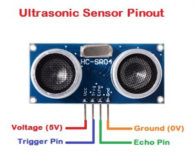

HC-SR04超声波测距模块可提供2cm-400cm的非接触式距离感测功能，测距精度可达高到3mm；模块包括超声波发射器、接收器与控制电路。像智能小车的测距以及转向，或是一些项目中，常常会用到。智能小车测距可以及时发现前方的障碍物，使智能小车可以及时转向，避开障碍物，所以，我们今天就来学习一下这个传感器。

### 

### （2）超声波参数：

电源：+ 5V DC

静态电流：<2mA

工作电流：15mA

有效角度：<15°

测距范围：2cm – 400 cm

分辨率：0.3厘米

测量角度：30度

触发输入脉冲宽度：10uS

### （3）项目组件：

| keyes PLUS 开发板*1 | Keyes brick L298P 电机驱动扩展板 V1*1 | keyes 草帽LED白发红模块*1 | HC-SR04超声波传感器*1 | HC-SR04超声波传感器*1 |
| --- | --- | --- | --- | --- |
| 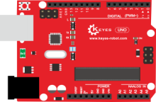 |  |  |  | 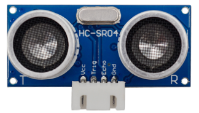 |
| HX-2.54 4P 双头 连接线*1 | 3Pin 双母头杜邦线*1 | USB线*1 | 18650双节电池盒*1 | 18650电池*2 （电池自配） |
| 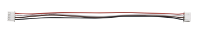 | 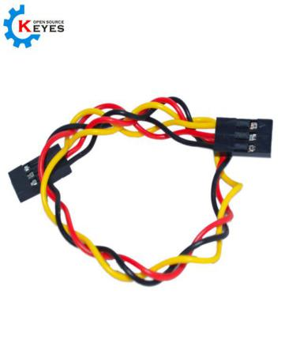 |  |  |  |

### （4）超声波模块知识：

**原理：**看超声波的图可知，像是有两个眼睛，其一边是发射超声的，一边是接收超声波的，然后检测从发射遇到障碍物返回被接收到所需的时间**t**，再根据声音在空气中的传播速度大概是**343m/s, 距离 = 速度 * 时间**， 由于超声波发射返回是两段路程了，所以需要除以2，故超声波测到的** 距离 =（速度 * 时间）/2**

**超声波模块的使用方法及时序图：**

1、使用GPIO引脚给SR04的Trig引脚至少10μs的高电平信号，触发SR04模块测距功能；

2、触发后，模块会自动发送8个40KHz的超声波脉冲，并自动检测是否有信号返回。这步会由模块内部自动完成。

3、如有信号返回，Echo引脚会输出高电平，高电平持续的时间就是超声波从发射到返回的时间。

超声波模块的电路图

### （5）接线图：

  接线注意：超声波传感器模块的VCC引脚连接至keyestudio V5 传感器扩展板的5v(V)，Trig引脚至数字12(S)，Echo引脚至数字13(S)，Gnd引脚至Gnd(G)。

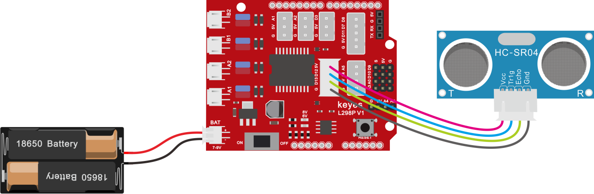

### （6）项目代码：

添加超声波传感器代码块

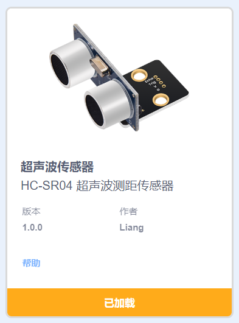

在时间栏拖出Arduino启动模块

在串口栏拖出设置串口波特率模块，波特率为9600

在控制栏拖出重复执行模块

在串口栏拖出串口打印模块，设置不换行；在超声波栏拖出设置超声波模块，设置tirg为12脚，echo为13脚，单位为CM

在串口栏拖出串口打印模块，设置打印内容为“CM”换行

在控制栏拖出延时模块，设置延时为0.25秒

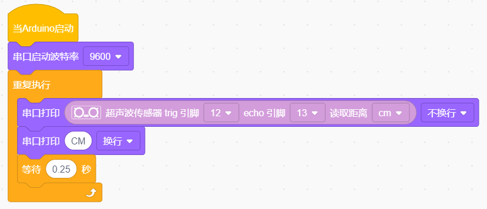

**注意：超声波需使用扩展板上的外接电源供电**

### （7）项目结果：

上传好测试代码到开发板，我们可以看到超声波模块显示的距离，单位是厘米。用手阻挡超声波模块，我们看到显示距离的数值变小了。

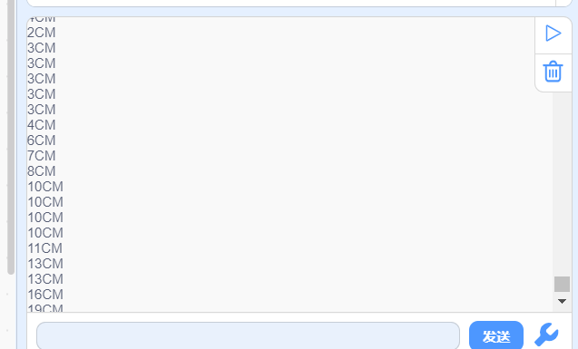

### （8）项目拓展：

我们刚刚测出了超声波显示的距离，那我们动动脑筋，能不能用测出的距离来做一些控制呢，如果控制一个LED灯的亮和灭。我们来试一下，在D9脚接上一个LED灯模块。

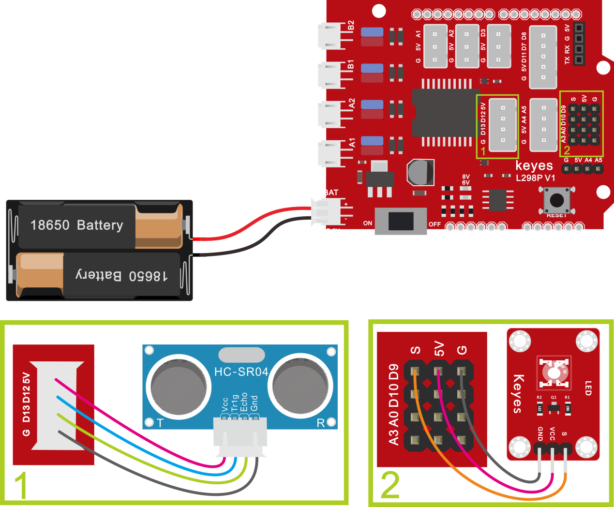

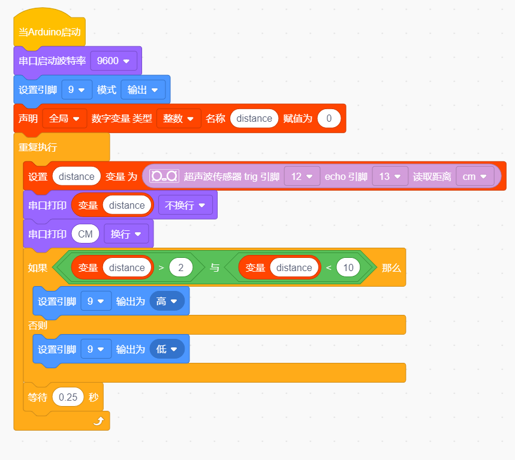

上传好测试代码到开发板，我们用手去靠近超声波传感器，看LED 灯亮起来了没有。