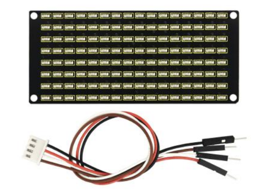
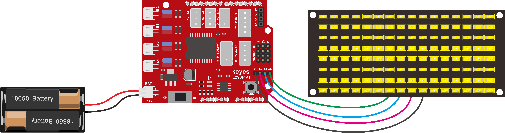
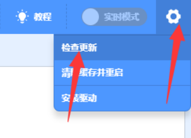
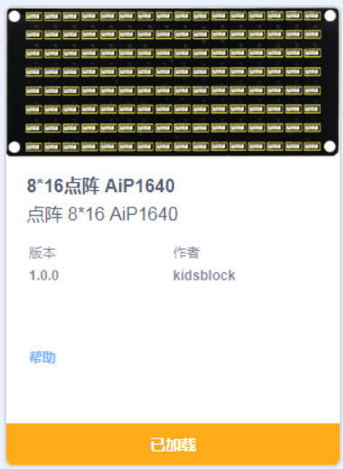
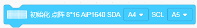
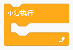
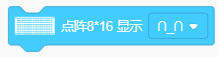
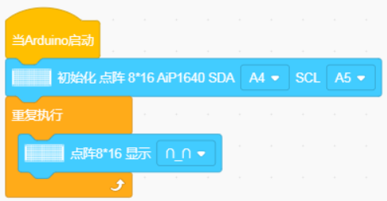
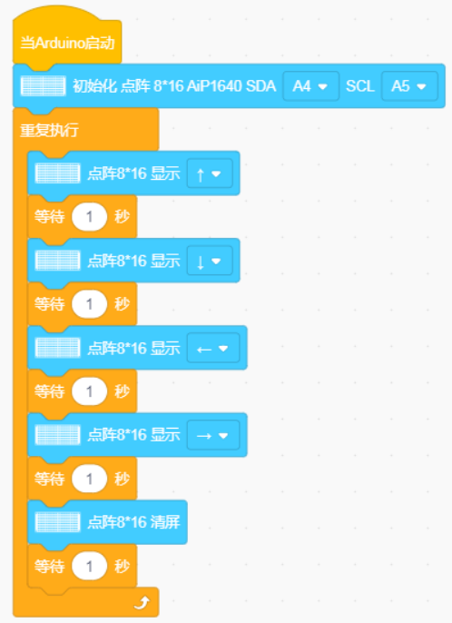

## 第09课 LED表情灯板

### （1）项目介绍

如果在我们的机器人上加一块表情面板，这将是多么好玩的一件事情，keyes的8X16点阵就可以满足你的要求。你可以自己创建面部表情，动画，图案或者是其他有趣的显示。8X16 LED灯板自带128个LED。微处理器（arduino）的数据通过两线总线接口与AiP1640通讯，从而控制模块上128个LED的亮灭，从而让模块上点阵显示你需要的图案。为方便接线，我们还配送一根HX-2.54 4Pin接线。

### （2）规格参数

工作电压: DC 3.3-5V

功率损耗：400mW

震荡频率：450KHz

驱动电流：200mA

工作温度：-40~80℃

通信方式：I2C通信

### （3）8X16点阵模块详细介绍

**8X16点阵的电路图**

**控制8X16点阵的原理**

是怎么控制8X16点阵的每个led灯的呢？要知道一个字节有8位，每一位是0或1，0时关闭led，1时打开led灯，那么一个字节就可以控制点阵一列的led灯开关了，自然16个字节就可以控制16列led灯，即控制了8X16点阵。

**接口说明及通讯协议**

微处理器（arduino）的数据通过两线总线接口与AiP1640通讯。

通讯协议图如下(SCLK)就是SCL，(DIN)就是SDA。

①数据输入的开始条件是，SCL为高电平，SDA由高变低。

②数据命令设置，有下图所示方法可选。我们的示例程序中选择 **地址自动加1**的方式，其二进制是0100 0000对应的十六进制为0x40

③地址命令设置，有如下图地址可以选。我们示例程序中选了第一个00H，其二进制1100 0000对应的十六进制是0xc0

④数据输入的要求是，在输入数据时当SCL是高电平时，SDA上的信号必须保持不变，只有SCL上的时钟信号为低电平时，SDA上的信号才可以改变。数据的输入是 低位在前，高位在后 传输。

⑤数据传输结束的条件是，SCL为低时，SDA为低，SCL为高时，SDA电平也变为高电平。

⑥显示控制，设置不同脉宽，脉宽有如下图可选。我们示例中选了脉宽为4/16，1000 1010对应的十六进制是0x8A

对应我们的示例程序来学习会理解的更好。

### （4）接线图

接线注意：  8x16 LED灯板的GND、VCC、SDA、SCL分别对应的接到keyestudio传感器扩展板-（GND）、+（VCC）、A4、A5进行两线串行通信。（注意：这里是接了arduino IIC的引脚，但是这个模块并不是IIC通讯的，是可以接任意两个引脚的。） 

### （5）项目代码

点阵显示上面画的微笑表情的代码：添加点阵代码块（如果没有找到这个模块，请点击右上角的设置-检查更新）

在事件栏拖出Arduino启动模块：

在点阵栏拖出初始化点阵模块设置点阵SDA脚为A4，SCL脚为A5：

在控制栏拖出重复执行模块：

在点阵栏拖出点阵显示模块，并设置显示图案为微笑：

完整代码：

### （6）项目结果

在开发板上传代码成功之后，看一下，我们的显示屏上是不是显示了一个笑脸。

### （7）项目拓展

我们利用刚刚学到的知识,让点阵循环显示前进图案，后退图案，左转图案，右转图案然后清除图案，时间间隔为1秒。接线图不变。

上传代码到开发板，我们看到表情面板循环显示设置的图案。

