## 第15课 蓝牙遥控智能车

### （1）项目介绍：

前面课程中，我们利用红外控制智能车运动，在这课程中我们可以做一个蓝牙控制智能车。既然是控制智能车，那就有一个控制端和被控制端。课程中我们把手机当做控制端（主机），蓝牙模块（从机）连接的智能车当做被控制端。使用时，我们需要在手机上安装一个APP，然后连接蓝牙模块，然后我们利用蓝牙APP上各个按钮，控制智能车实现各种运动状态。

### （2）流程图：

先取下蓝牙模块，程序代码上传后，再连接蓝牙模块和打开串口监视器，设置波特率为9600。对准蓝牙模块按下手机APP按钮，我们可以看到APP按钮对应的控制字符，如下图。

这是读取到abcABC的ASCII码值

**ASCII码对照表：**

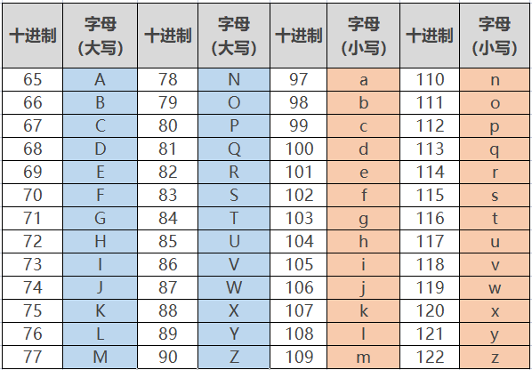

经过测试，我们得出了手机APP上各个按钮对应的控制字符和各个按钮对应的功能，这里我们整理了一个表格如下：

| 按钮:  | 功能：配对连接蓝牙模块 | 功能：配对连接蓝牙模块 |
| --- | --- | --- |
| 按钮: 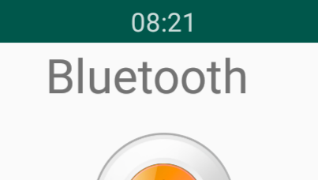 | 功能：进入蓝牙控制界面 | 功能：进入蓝牙控制界面 |
| 按钮:  | 功能：断开蓝牙连接 | 功能：断开蓝牙连接 |
| 按钮:  | 控制字符：按下：F；松开：S | 功能：按下，小车前进；松开就停止 |
| 按钮:  | 控制字符：按下：B；松开：S | 功能：按下，小车后退；松开就停止 |
| 按钮:  | 控制字符：按下：L；松开：S | 功能：按下，小车左旋转；松开就停止 |
| 按钮:  | 控制字符：按下：R；松开：S | 功能：按下，小车右旋转；松开就停止 |
| 按钮:  | 控制字符：按下：a；松开：S | 功能：点击，加速，最大加到255 |
| 按钮:  | 控制字符：按下：d；松开：S | 功能：点击，减速，最小减到0 |
| 按钮:  | 控制字符： | 功能：点击一下开启手机方向感应控制，再点击一下退出方向感应控制 |
| 按钮:  | 控制字符：点击发送：Y,再次电机发送S | 功能：开启避障功能，再次点击退出 |
| 按钮:  | 控制字符：点击发送：X,再次电机发送S | 功能：开启循线功能，再次点击退出 |
| 按钮: 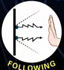 | 控制字符：点击发送：U,再次电机发送S | 功能：开启超声波跟随功能，再次点击退出 |
| 按钮:  | 控制字符：点击发送：G,再次电机发送S | 功能：开启画地为牢功能，再次点击退出 |

### （3）接线图：蓝牙+电机

**接线注意：** 蓝牙模块的RXD、TXD、GND、VCC分别对应的接到电机驱动扩展板上的TX、RX、-（GND）、+（VCC），而蓝牙模块的STATE和BRK两引脚不需要接，电源接到BAT接口。

B两电机分别对应的连接到电机驱动扩展板上的接口A和接口B；蓝牙模块的RXD、TXD、GND、VCC分别对应的接到电机驱动扩展板上的TX、RX、-（GND）、+（VCC），而蓝牙模块的STATE和BRK两引脚不需要接，电源接到BAT接口。

### （4）测试代码：

在事件栏拖出Arduino启动模块

在串口栏拖出设置串口波特率为9600

在变量类型栏拖出声明全局变量，整形，变量名为bluetooth_val，赋值0

初始化点阵

在控制栏拖出重复执行模块

在控制栏拖出判断模块，判断可读取字节数大于0

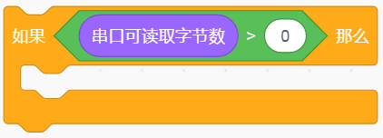

将串口读取数字赋给bluetooth_val

在控制栏拖出判断语句，判断“Bluetooth_val”是否等于“70”如果是则执行前进代码

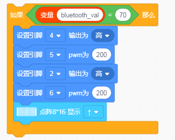

在控制栏拖出判断语句，判断“Bluetooth_val”是否等于“66”如果是则执行后退代码

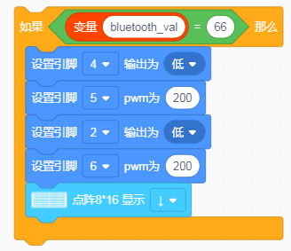

在控制栏拖出判断语句，判断“Bluetooth_val”是否等于“76”如果是则执行左转代码

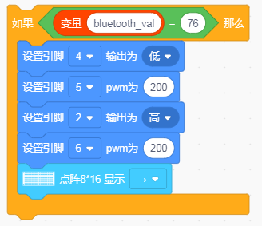

在控制栏拖出判断语句，判断“Bluetooth_val”是否等于“82”如果是则执行右转代码

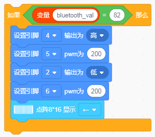

在控制栏拖出判断语句，判断“Bluetooth_val”是否等于“83”如果是则执行停止代码

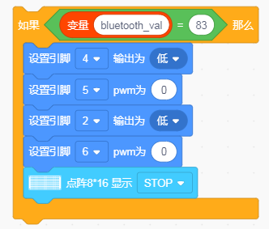

**完整代码：**

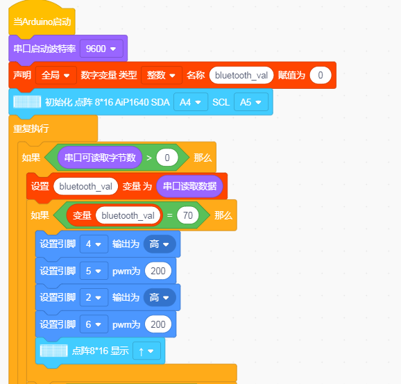

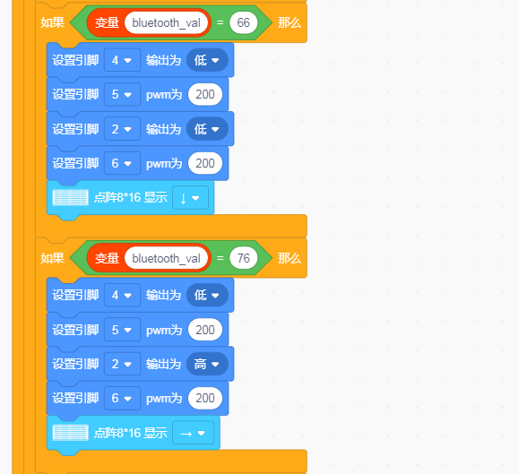

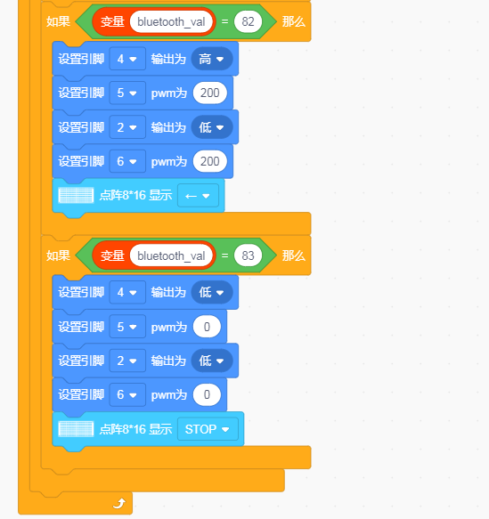

好了，按住蓝牙APP的前进、后退、左转弯、右转弯、停止、左旋转、右旋转的按钮控制桌面迷你蓝牙智能车分别前进、后退、左转弯、右转弯、停止、左旋转、右旋转的程序代码全编写完了。上传程序，看看效果。**（在上传测试代码前，需要把蓝牙模块取下，否则代码会上传失败。需要上传代码成功后，再连接蓝牙模块。）** 

### （5）测试结果：

将驱动扩展板堆叠在UNO Plus板上，上传好代码，按照接线图接线，将拨码开关拨至ON端后，手机APP连接蓝牙成功后，我们就能用手机APP控制智能车运动并在LED灯板上显示对应的图案了。

按下  按钮，小车前进；

按下  按钮，小车后退；

按下  按钮，小车左旋转；

按下  按钮，小车右旋转；

点击一下  按钮，开启手机方向感应控制，

再点击一下  按钮，退出方向感应控制。
